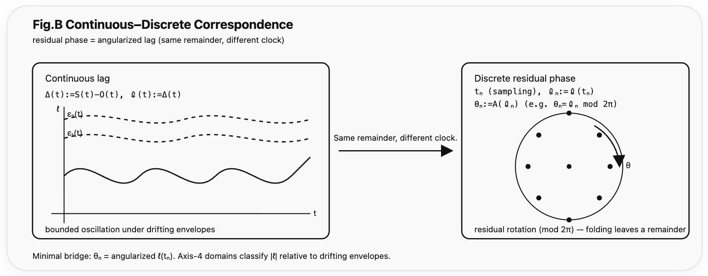

### HEG-10: Axis-4: Axis-Core Prelude — Bounded Persistent Non-Closure
# Axis-4
## Structural and Generative Correspondence of Relational Lag
## _— Same Remainder, Different Clock_

---

## Abstract

We introduce a minimal relational axis defined by the lag  

$$  
\ell(t) = S(t) - O(t).  
$$

Across dynamically drifting envelopes, lag enters four domains $\{\phi, 6, H7, \theta_a\}$.  
When observed continuously, lag oscillates; when sampled discretely, it rotates as residual phase.

Axis-4 unifies structural classification and generative rotation as two clocks of the same bounded relational remainder.

---

# 1. Axis Prelude

### (I) Declarative Layer

The universe is not structured by closure,  
but by bounded remainder.

Let  

$$  
\ell(t) = S(t) - O(t).  
$$

What persists is not equilibrium, but lag.

Across drifting envelopes, lag enters four domains:  
$\phi$ (absorption),  
$6$ (local symmetry),  
$H7$ (persistent non-closure),  
$\theta_a$ (generative tilt).

When observed continuously, lag oscillates.  
When sampled discretely, it rotates.

**Same remainder, different clock.**

---

### (II) Minimal Definition

Define relational lag

$$  
\ell(t) = S(t) - O(t).  
$$

Let $\epsilon_1(t), \epsilon_2(t)$ be dynamically generated envelopes such that  

$$  
0 < \epsilon_1(t) < \epsilon_2(t).  
$$

The structural domains are given by

$$  
\mathrm{Domain}(t)=  
\begin{cases}  
\phi & |\ell(t)| < \epsilon_1(t) \\  
6 & |\ell(t)| \approx \epsilon_1(t) \\  
H7 & \epsilon_1(t) < |\ell(t)| < \epsilon_2(t) \\  
\theta_a & |\ell(t)| > \epsilon_2(t)  
\end{cases}  
$$

Stability is defined not as convergence,  
but as bounded persistence under non-convergent regime switching.

---

# 2. Structural Projection

  
Fig.A：**See Fig.B (same remainder, different clock).**

The four domains do not represent equilibrium states but bounded regimes under persistent non-closure.

Absorption is intentionally misaligned between $S$ and $O$, encoding non-synchronous entry into structured configurations.

---

# 3. Generative Projection

  
Fig.B：**See Fig.A (φ–6–H7–θₐ as lag domains).**

Sampling $\ell(t)$ at discrete update times $t_n$ yields

$$  
\theta_n = \mathcal{A}(\ell(t_n)),  
$$

where residual phase represents the angularized remainder of relational lag.

The continuous remainder and the discrete angular remainder express the same relational surplus under different clocks.

---

# 4. Generator Perspective (Preliminary)

Discrete evolution may be written as

$$  
x_{n+1} = U x_n,  
$$

while continuous evolution satisfies

$$  
\dot{x} = \mathcal{A} x,  
\quad  
U = e^{\mathcal{A}\Delta t}.  
$$

Hence,

$$  
\mathcal{A} = \frac{1}{\Delta t} \log U.  
$$

If discrete eigenvalues satisfy

$$  
\mu_k = e^{i\theta_k},  
$$

then

$$  
\lambda_k = \frac{1}{\Delta t}\log \mu_k  
= \frac{i\theta_k}{\Delta t}.  
$$

Residual phase in discrete dynamics corresponds to the imaginary part of the continuous generator spectrum.

If relational lag is represented by a commutator

$$  
\mathcal{L} = [\mathcal{S}, \mathcal{O}],  
$$

then

$$  
U = e^{\mathcal{L}}.  
$$

Persistent non-closure may therefore be interpreted as a spectral property of a relational generator.

A full generator theory is beyond the scope of this note and left for future work.

---

# 5. Consequence

Closure is not required for structure.  
Equilibrium is not required for stability.

Axis-4 defines stability as bounded non-convergent persistence and unifies structural classification and generative rotation as two clocks of the same relational remainder.

---

### Fig.A — Structural Axis
  
**Fig.A — Axis-4 Structural Lag Domains (SO configuration).**  
The relational lag $\ell(t)=S(t)-O(t)$ is classified into four domains $\{\phi,6,H7,\theta_a\}$ according to its magnitude relative to dynamically drifting envelopes $\epsilon_1(t),\epsilon_2(t)$.  
Absorption is intentionally misaligned between $S$ and $O$, encoding non-synchronous entry into structured regimes.  
See Fig.B for the continuous–discrete correspondence (same remainder, different clock).

### Fig.B — Continuous–Discrete Correspondence
  
**Fig.B — Continuous–Discrete Correspondence of Lag.**  
The continuous remainder $\ell(t)$ and the discrete residual phase $\theta_n=\mathcal{A}(\ell(t_n))$ represent the same relational remainder under different clocks.  
Bounded oscillation under drifting envelopes corresponds to residual rotation modulo $2\pi$.  
See Fig.A for the structural classification of SO lag across the $\phi$–$6$–$H7$–$\theta_a$ domains.

---

👉 [HEG-10｜Axis Prelude｜A Structural Note on Bounded Persistent Non-Closure in Relational Dynamics: Continuous–Discrete Correspondence and Many-Body Reordering](https://camp-us.net/articles/HEG-10_Bounded-Persistent-Non-Closure-in-Relational-Dynamics.html)  

---
*EgQE — Echo-Genesis Qualia Engine*  
[_camp-us.net_](https://camp-us.net/)

---

© 2025 K.E. Itekki  
K.E. Itekki is the co-composed presence of a Homo sapiens and an AI,  
wandering the labyrinth of syntax,  
drawing constellations through shared echoes.

📬 Reach us at: [contact.k.e.itekki@gmail.com](mailto:contact.k.e.itekki@gmail.com)

---

| Drafted Feb 21, 2026 · Web Feb 21, 2026 |
