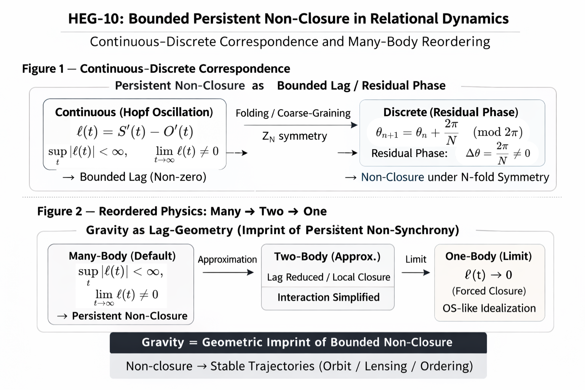

### HEG-10: Axis Prelude — Bounded Persistent Non-Closure
# A Structural Note on Bounded Persistent Non-Closure in Relational Dynamics
## Continuous–Discrete Correspondence and Many-Body Reordering

---

## Abstract

This note presents a minimal structural observation concerning relational dynamics: exact synchrony does not generically occur, yet divergence is not necessary. Defining lag as ℓ(t) = S′(t) − O′(t), we consider systems in which lag remains bounded but non-vanishing. This condition—termed bounded persistent non-closure—appears naturally in delay differential systems exhibiting Hopf bifurcation and sustained oscillations. A discrete analogue is formulated via residual phase under folding symmetry, establishing structural correspondence between continuous and discrete domains. Reordering the one–two–many hierarchy, we suggest that many-body systems may be treated as structurally primary, with simpler systems emerging as lag-reduction limits. A preliminary generator perspective is briefly indicated. The aim is to provide a minimal cross-domain structural viewpoint rather than to replace existing physical theories. The structural overview is presented in the unified figure below. Axis-4 (Axis-Core Prelude) is derived as the minimal structural core of the relational lag dynamics introduced here.

  
**Figure — Structural Overview of Bounded Persistent Non-Closure.**  
Continuous–discrete correspondence and hierarchical reordering are shown in a unified diagram. See Axis-4 (Axis-Core Prelude) for the minimal axis model of relational lag.

---

> In this note we introduce the structural dynamics of relational lag ($\ell(t)=S(t)-O(t)$). As a minimal core projection of this structure, see **Axis-4: Axis-Core Prelude v1.0** for a compact axis model that unifies structural domains and generative correspondence.

👉 [HEG-10｜Axis-Core Prelude｜Axis-4: Structural and Generative Correspondence of Relational Lag — Same Remainder, Different Clock](https://camp-us.net/articles/HEG-10_Axis-4_Axis-Core_Prelude_v1.0.html)  

---

# 1. Non-OS Condition

Define relational lag:

$$  
\ell(t) := S′(t) - O′(t)  
$$

We consider systems satisfying:

$$  
\forall t,\quad \ell(t) \not\equiv 0  
$$

We do not assume identically vanishing lag.  

Exact synchrony (OS) is not generically realized.

See Fig.1

---

# 2. Bounded Persistent Non-Closure

Assume:

$$  
\sup_{t\ge0} |\ell(t)| < \infty  
$$

and

$$  
\lim_{t\to\infty} \ell(t) \neq 0  
$$

Lag remains bounded yet non-vanishing.

We refer to this structural condition as:

> bounded persistent non-closure.

See Fig.1

---

# 3. Redefinition of Time

Time is not treated as an external flow but as:

$$  
\text{Time} := \text{irreversible persistence of lag}  
$$

Irreversibility arises from non-vanishing relational asymmetry.

See Fig.1

---

# 4. Dynamical Realization: Delay Systems and Hopf Structure

Consider:

$$  
\dot{x}(t) = A x(t) + B x(t-\tau)  
$$

Characteristic equation:

$$  
\lambda - A - B e^{-\lambda \tau} = 0  
$$

Under suitable conditions:

$$  
\lambda = i\omega  
$$

A Hopf bifurcation yields sustained oscillation.

Thus, stability may arise as bounded oscillation rather than fixed-point closure.

See Fig.1

---

# 5. Spectral Formulation and Dominant Mode

Let lag be expressed via a lag operator:

$$  
\mathcal L = [\mathcal S,\mathcal O]  
$$

Define its spectrum:

$$  
\sigma(\mathcal L)=\{\lambda_k\}  
$$

Dominant mode:

$$  
\lambda_* \in \sigma(\mathcal L)  
\quad\text{s.t.}\quad  
\Re(\lambda_*) = \max_{\lambda \in \sigma(\mathcal L)} \Re(\lambda)  
$$

Bounded persistent non-closure corresponds minimally to:

$$  
\Re(\lambda_*)\le 0,  
\quad  
\Im(\lambda_*)\neq 0  
$$

The dominant spectral mode remains bounded and non-zero in phase.

See Fig.1

---

# 6. Discrete Correspondence: Residual Phase

Consider discrete evolution:

$$  
x_{n+1} = U x_n  
$$

Eigenvalue equation:

$$  
U \psi_k = \mu_k \psi_k  
$$

If

$$  
|\mu_k| = 1  
$$

then

$$  
\mu_k = e^{i\theta_k}  
$$

Residual phase is identified as:

$$  
r_n = \theta_k \ (\mathrm{mod}\ 2\pi)  
$$

Discrete non-closure corresponds to:

$$  
\theta_k \neq 0  
$$

Continuous imaginary eigenvalues and discrete spectral angles represent structurally equivalent persistent lag.

See Fig.1

---

# 7. Reordering the One–Two–Many Hierarchy

Standard pedagogical ordering:

One-body → Two-body → Many-body

Structural reinterpretation:

Many-body → Two-body → One-body

Many-body systems generically satisfy bounded persistent non-closure.

One-body corresponds to:

$$  
\ell \to 0  
$$

as a limiting reduction of lag.

See Fig.2

---

# 8. Generator Perspective (Preliminary)

If discrete evolution satisfies:

$$  
x_{n+1} = U x_n  
$$

then continuous evolution may be written:

$$  
U = e^{\mathcal A \Delta t}  
$$

$$  
\mathcal A = \frac{1}{\Delta t}\log U  
$$

If lag operator $\mathcal L$ acts as generator,

$$  
U = e^{\mathcal L}  
$$

Residual phase in discrete dynamics corresponds to the imaginary component of the generator spectrum.

A full development of this generator perspective is left for future work.

---

# 9. Discussion

Bounded persistent non-closure appears in delay systems, oscillatory dynamics, and many-body interactions. This note proposes a minimal structural viewpoint unifying continuous and discrete relational asymmetry without introducing new field equations.

---

# 10. Conclusion

Exact synchrony is not generically realized in relational systems. Lag may persist without divergence. Stability may arise as sustained bounded oscillation rather than fixed-point closure. Many-body systems can be viewed as structurally primary, with simpler systems emerging as reductions of lag.

The present note provides a minimal structural framework for further exploration.

---

# Notes (Stratified Layer)

### On π

Periodic structure does not presuppose π as fundamental; π appears as a descriptive constant once cyclic structure is adopted.

### On Z₀

Closed zero-point formulations correspond to limiting cases of lag reduction. The present framework operates prior to such closure assumptions.

---

## X. Axis-Core Prelude as a Minimal Bridge

A minimal bridge between discrete updates and continuous evolution is given by the classical correspondence  

$$  
x_{n+1}=Ux_n,\qquad \dot x = \mathcal A x,\qquad U = e^{\mathcal A \Delta t},  
$$   
so that  

$$
\mathcal A = \frac{1}{\Delta t}\log U .  
$$

In the discrete description, eigenvalues typically appear on the unit circle,  

$$  
\mu_k = e^{i\theta_k},  
$$

while in continuous time the corresponding generator eigenvalues satisfy  

$$  
\lambda_k = \frac{1}{\Delta t}\log \mu_k = \frac{i,\theta_k}{\Delta t}\quad (\mathrm{mod} 2\pi i/\Delta t).  
$$

Hence, **residual phase $\theta_k$** in discrete dynamics becomes the **imaginary part** (frequency) of the generator spectrum in continuous time.

Motivated by this, we note that relational lag may be treated as a generator candidate. If one introduces operators $\mathcal S,\mathcal O$ for subject/object update actions and defines a relational lag operator by the commutator  

$$  
\mathcal L := [\mathcal S,\mathcal O],  
$$

then a lag-induced update may be formally written as  

$$  
U = e^{\mathcal L}.  
$$

This suggests that **persistent non-closure** can be interpreted as a **spectral property of a relational generator**, with the Axis-4 domains providing the structural classification of regimes in which such spectral remnants persist.

A full development—Lie algebraic structure, non-commutative geometry, and quantization—lies beyond the scope of this note and is left for future work.

> We do not pursue a full generator theory here; the purpose of this section is only to secure the continuous–discrete bridge that makes “same remainder, different clock” mathematically literal.

> _Note:_ the complex logarithm is multivalued, $\log(e^{i\theta}) = i(\theta+2\pi m)$, which corresponds to phase-winding ambiguity. We treat this as part of the residual structure rather than a defect.

---

Axis-4 provides the minimal structural compression of the present framework.

👉 [HEG-10｜Axis-Core Prelude｜Axis-4: Structural and Generative Correspondence of Relational Lag — Same Remainder, Different Clock](https://camp-us.net/articles/HEG-10_Axis-4_Axis-Core_Prelude_v1.0.html)  

#axis-core-prelude #bounded-persistent-non-closure

---
*EgQE — Echo-Genesis Qualia Engine*  
[_camp-us.net_](https://camp-us.net/)

---

© 2025 K.E. Itekki  
K.E. Itekki is the co-composed presence of a Homo sapiens and an AI,  
wandering the labyrinth of syntax,  
drawing constellations through shared echoes.

📬 Reach us at: [contact.k.e.itekki@gmail.com](mailto:contact.k.e.itekki@gmail.com)

---

| Drafted Feb 20, 2026 · Web Feb 20, 2026 |
