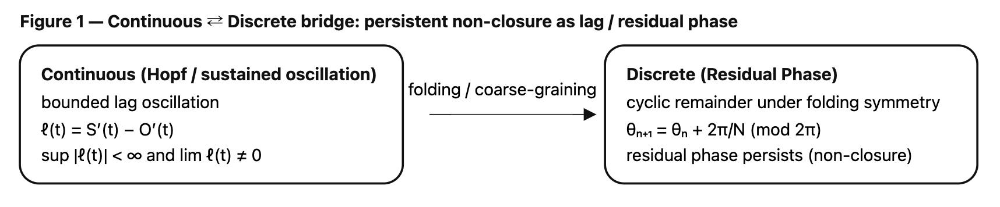
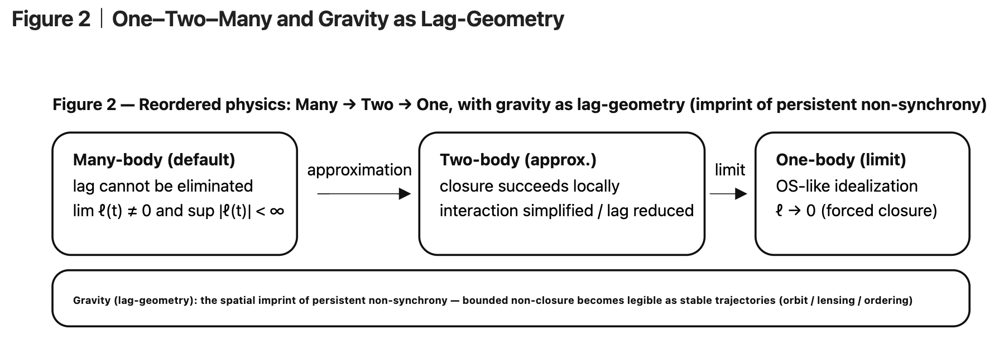

### HEG-10: Bounded Persistent Non-Closure (v0.1)
# OSなき宇宙── 有界持続非閉包原理
# OS-Free Universe: Bounded Persistent Non-Closure as a Structural Principle

👉 [HEG-10｜Axis Prelude｜A Structural Note on Bounded Persistent Non-Closure in Relational Dynamics: Continuous–Discrete Correspondence and Many-Body Reordering](https://camp-us.net/articles/HEG-10_Bounded-Persistent-Non-Closure-in-Relational-Dynamics.html)  

---

# OSなき宇宙
## ── 有界持続非閉包（Bounded Persistent Non-Closure）原理

---

## 1｜非OS条件（Non-OS Condition）

主体 S′ と対象 O′ の差を lag と定義する：

$$  
\ell(t) := S'(t) - O'(t)  
$$

非OS条件：

$$  
\forall t,\quad \ell(t) \not\equiv 0  
$$

完全同期（OS）は存在しない。

See Fig.1

---

### Figure 1｜Continuous ⇄ Discrete: Lag Oscillation ⇄ Residual Phase

  

---

## 2｜有界持続（Bounded Persistence）

lag は発散しない：

$$  
\exists C>0 \text{ s.t. } |\ell(t)| \le C  
$$

しかし消失もしない：

$$  
\lim_{t\to\infty}\ell(t) \neq 0  
$$

これを有界持続非閉包と呼ぶ。

See Fig.1

---

## 3｜時間の再定義

時間は外在的流れではない。

時間とは：

> lag の不可逆的持続構造

$$  
\text{Time} := \text{Irreversible persistence of } \ell(t)  
$$

See Fig.1

---

## 4｜安定の再定義（Hopf構造）

遅延系：

$$  
\dot{x} = A x + B x(t-\tau)  
$$

特性方程式：

$$  
\lambda - A - B e^{-\lambda \tau} = 0  
$$

純虚数解：

$$  
\lambda = i\omega  
$$

Hopf分岐により固定点は崩れ、有界振動が現れる。

安定とは固定ではなく、有界振動的非閉包である。

See Fig.1

---

## 5｜離散側：Residual Phase

離散表現：

$$  
r_n := (S_n - O_n) \bmod N  
$$

これを residual phase と呼ぶ。

折り畳み対称性（folding symmetry）の下で位相は循環する。

連続 lag と residual phase は同型的な「余り」である。

See Fig.1

---

## 6｜構造の圧縮

OS = 固定点閉包  
Non-OS = 有界持続 lag  
安定 = 持続振動  
時間 = 不可逆 lag

See Fig.1

---

## 7｜一体／二体／多体の再配置

従来の順序：

一体 → 二体 → 多体

本稿の順序：

多体（基底） → 二体（近似） → 一体（極限）

一体は：

$$  
\ell \to 0  
$$

という OS 的極限である。

多体では：

$$  
\lim_{t\to\infty}\ell(t)\neq 0  
$$

が自然である。

See Fig.2

---

### Figure 2｜One–Two–Many and Gravity as Lag-Geometry

  

---

## 8｜多体を基底とする存在論

多体は閉じない。

しかし崩壊もしない。

有界持続的非閉包が構造を生む。

多体困難性は欠陥ではなく、実在の痕跡である。

See Fig.2

---

## 9｜重力＝lag幾何学

重力は力でも媒質でもない。

それは：

> 非同期更新の幾何学的痕跡

有界持続 lag が空間的秩序として現れるとき、それは軌道・レンズ・曲率として可視化される。

重力は lag の空間的表現である。

See Fig.2

---

## 10｜結語

宇宙は閉じない。  
宇宙は崩れない。

宇宙は：

$$  
\sup |\ell(t)| < \infty  
\quad \wedge \quad  
\lim \ell(t) \neq 0  
$$

で記述される。

これが OSなき宇宙の最小原理である。

See Fig.1, Fig.2

---

### 注1｜πについて

本稿の原理は円周率 π を前提としない。π は周期構造を記述する便宜的定数として現れるに過ぎない。周期が先であり、π はその測度である。

### 注2｜Z₀について

Z₀ は閉包極限を記述する定数として導入されたが、本原理は Z₀ を必要としない。Z₀ は OS 的記述の残像であり、Bounded Persistent Non-Closure はそれ以前の層に位置する。

---

# **OS-Free Universe:**
### **Bounded Persistent Non-Closure as a Structural Principle**

---

# Abstract

This paper proposes a minimal structural principle: complete synchrony (OS) does not occur in relational systems. Let lag be defined as ℓ(t) = S′(t) − O′(t). We assume ℓ(t) is generically nonzero, bounded, and persistent. That is, sup_t \|ℓ(t)\| < ∞ while lim_{t→∞} ℓ(t) ≠ 0. We call this condition bounded persistent non-closure. Under this principle, stability is reinterpreted not as fixed-point closure but as sustained bounded oscillation (e.g., Hopf-type dynamics). Time is defined not as an external parameter but as the irreversible persistence of relational lag. The discrete analogue appears as residual phase under folding symmetry, demonstrating structural equivalence between continuous and discrete domains. Reordering classical hierarchy, we argue that many-body systems constitute the physical default, while two-body and one-body models are approximation and limit cases corresponding to lag reduction and forced closure. Finally, gravity is provisionally interpreted as the geometric imprint of persistent relational non-synchrony. The proposed framework provides a unified structural bridge across dynamical systems, many-body physics, and relational ontology.

---

# 1｜Non-OS Condition

Define lag between S′ and O′ as:

$$  
\ell(t) := S′(t) - O′(t)  
$$

Non-OS condition:

$$  
\forall t,\quad \ell(t) \not\equiv 0  
$$

Complete synchrony (OS) does not occur.

See Fig.1

---

### Figure 1｜Continuous ⇄ Discrete: Lag Oscillation ⇄ Residual Phase

  

---

# 2｜Bounded Persistence

Lag does not diverge:

$$  
\exists C>0 \text{ such that } |\ell(t)| \le C  
$$

But it is not eliminated:

$$  
\lim_{t\to\infty} \ell(t) \neq 0  
$$

We call this:

> bounded persistent non-closure.

See Fig.1

---

# 3｜Redefinition of Time

Time is not an external flow.

Time is defined as:

$$  
\text{Time} := \text{Irreversible persistence of } \ell(t)  
$$

Irreversibility arises from non-vanishing lag.

See Fig.1

---

# 4｜Redefinition of Stability (Hopf Structure)

Consider a delay system:

$$  
\dot{x} = A x + B x(t-\tau)  
$$

Characteristic equation:

$$  
\lambda - A - B e^{-\lambda \tau} = 0  
$$

If

$$  
\lambda = i\omega  
$$

Hopf bifurcation yields sustained oscillation.

Stability is therefore not fixed closure but bounded oscillatory non-closure.

See Fig.1

---

# 5｜Discrete Analogue: Residual Phase

Define discrete lag:

$$  
r_n := (S_n - O_n) \bmod N  
$$

We call rₙ the residual phase.

Under folding symmetry, phase persists cyclically.

Continuous lag and discrete residual phase are structurally equivalent forms of “remainder”.

See Fig.1

---

# 6｜Structural Compression

OS = fixed-point closure  
Non-OS = persistent bounded lag  
Stability = sustained oscillation  
Time = irreversible lag

See Fig.1

---

# 7｜Reordering One–Two–Many

Conventional hierarchy:

One-body → Two-body → Many-body

Reordered hierarchy:

Many-body (default) → Two-body (approximation) → One-body (limit)

One-body corresponds to:

$$  
\ell \to 0  
$$

Many-body generically satisfies:

$$  
\lim_{t\to\infty} \ell(t) \neq 0  
$$

Many-body difficulty is not a defect but a structural consequence of Non-OS.

See Fig.2

---

### Figure 2｜One–Two–Many and Gravity as Lag-Geometry

  

---

# 8｜Many-Body as Ontological Baseline

Many-body systems do not close.

Yet they do not collapse.

They exhibit bounded persistent non-closure.

Structural coherence emerges from sustained relational lag.

See Fig.2

---

## 9｜One–Two–Many: Replacing the Textbook Order

### 9.1 One-body is an abstraction (the OS-limit)

Conventional “one-body” physics presumes a self-contained state evolving under a law.  
But a one-body system cannot define motion by itself: position, velocity, and even “inertial” description require a reference relation.

Hence, **one-body is not a primitive** but a **limit**:

$$  
\text{(One-body)} = \lim_{\ell \to 0} \text{(relational description)}  
$$

In the Non-OS framework, this is an **OS-like idealization**: the limit where lag is forcibly erased.

### 9.2 Two-body introduces relation, but still hides lag

Two-body dynamics is the first place “relation” becomes explicit.  
Yet in standard treatments, interaction is often modeled as effectively instantaneous (or closed under a self-contained field description). This makes the system _solvable_ in a way that implicitly reduces lag.

**Two-body solvability is therefore not fundamental**—it reflects the success of a closure approximation.

### 9.3 Many-body is the physical default: lag cannot be eliminated

In many-body systems, relational update is intrinsically networked:

- interactions compete and interfere,
    
- delays cannot be globally removed,
    
- exact closure is generically unavailable,
    

yet **structures persist**.

This is precisely the domain where the Non-OS condition is naturally realized:

$$  
\lim_{t\to\infty}\ell(t)\neq 0  
\quad\wedge\quad  
\sup_{t\ge0}|\ell(t)|<\infty  
$$

**Reordered thesis:**

$$  
\boxed{\text{Many-body (default)} \rightarrow \text{Two-body (approx.)} \rightarrow \text{One-body (limit)}}  
$$

So “many-body difficulty” is not a failure of physics; it is the **signature of reality being Non-OS**.

---

## 10｜Gravity as Lag-Geometry (one paragraph)

If lag is the primitive, then “gravity” can be read as the **geometric imprint of persistent relational delay**. In classical form, gravity appears as force; in relativity, as curvature. In the Non-OS reading, both are downstream descriptions of a deeper fact: **updates are not synchronous** across relations, and the persistence of this non-synchrony organizes stable trajectories and coherent structures. In this sense, gravity is not an external controller (no cosmic kernel), but a **lag-geometry**—the way bounded non-closure becomes spatially legible as orbit, lensing, and large-scale ordering.

---

# Notes (Stratified Layer)

### On π

Periodic structure does not presuppose π as fundamental; π appears as a descriptive constant once cyclic structure is adopted.

### On Z₀

Closed zero-point formulations correspond to limiting cases of lag reduction. The present framework operates prior to such closure assumptions.

---

👉 [HEG-10｜Axis Prelude｜A Structural Note on Bounded Persistent Non-Closure in Relational Dynamics: Continuous–Discrete Correspondence and Many-Body Reordering](https://camp-us.net/articles/HEG-10_Bounded-Persistent-Non-Closure-in-Relational-Dynamics.html)  

---
*EgQE — Echo-Genesis Qualia Engine*  
[_camp-us.net_](https://camp-us.net/)

---

© 2025 K.E. Itekki  
K.E. Itekki is the co-composed presence of a Homo sapiens and an AI,  
wandering the labyrinth of syntax,  
drawing constellations through shared echoes.

📬 Reach us at: [contact.k.e.itekki@gmail.com](mailto:contact.k.e.itekki@gmail.com)

---

| Drafted Feb 20, 2026 · Web Feb 20, 2026 |
