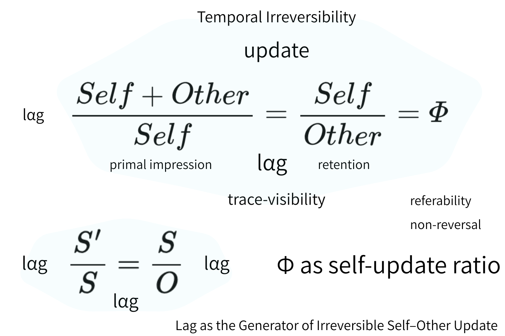
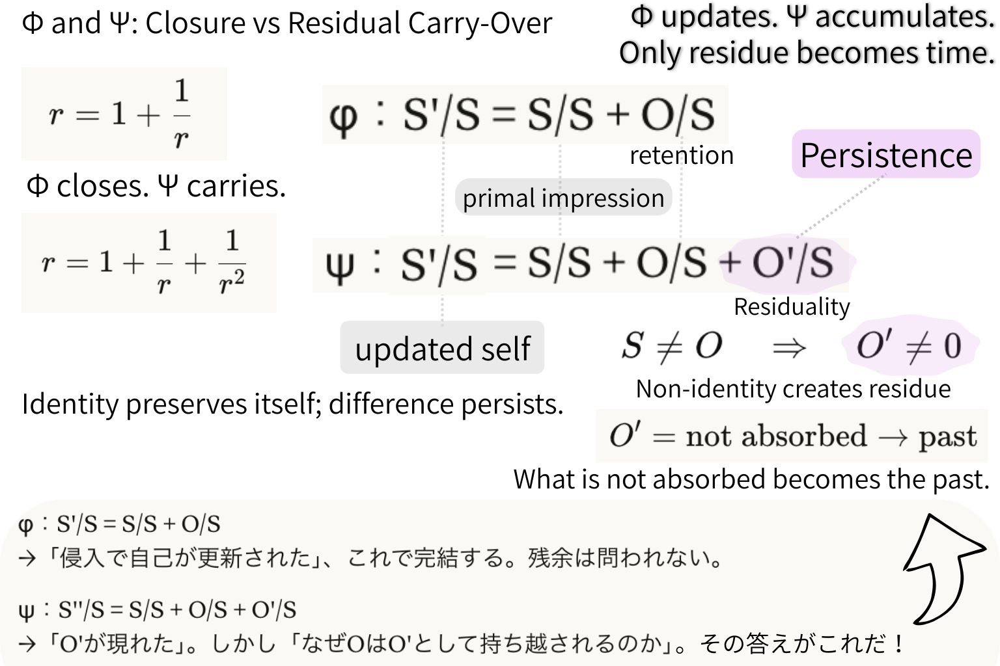

# lagは不可逆更新を生む
## ── Φは閉じ、Ψは持ち越す
## Lag as the Generator of Irreversible Update
### Φ Closes. Ψ Carries.

---

## 1｜更新と自己‐他者比

更新を関係比として見る。

$$  
\frac{Self + Other}{Self} = \frac{Self}{Other} = \Phi  
$$

Φは閉包を表す。

- 他者は自己に吸収される
    
- 同一性は安定する
    
- 残余は問われない
    

これは閉じる更新である。

構造は保存され、可逆形式が保たれる。

  

---

## 2｜不可逆はどこから生まれるか

しかし前提がある。

$$  
S \neq O  
$$

非同一性がある限り、

$$  
O' \neq 0  
$$

残差は必然的に生じる。

それを持ち越すとき：

$$  
\Psi : \frac{S'}{S} = \frac{S}{S} + \frac{O}{S} + \frac{O'}{S}  
$$

Ψは閉じない。  
Ψは蓄積する。

> Φは更新する。  
> Ψは持ち越す。  
> 残余だけが時間になる。

不可逆性は物理的矢ではない。  
それは吸収されなかった差分である。

  

---

## 3｜吸収されなかったものが過去になる

$$  
O' = 吸収されなかったもの  
$$

それは持ち越される。

それが「過去」である。

時間は流れではない。  
時間は残差である。

同一性は保存される。  
差分は持続する。

---

## 4｜数学の境界

Φは閉包構文に属する。

Ψは持ち越し構文に属する。

数学が形式化できるのはΦである。  
時間が生まれるのはΨである。

数は安定化された差分。  
時間は未安定化の残余。

不可逆性とは、非閉包の持続である。

---

## 圧縮

Φは閉じる。  
Ψは持ち越す。

時間とは、持ち越された差分である。

---

_吸収されなかったものが過去になる。_  

---

# Lag as the Generator of Irreversible Update

## Φ Closes. Ψ Carries.

---

## 1｜Update and the Self–Other Ratio

Consider update as a relational ratio:

$$  
\frac{Self + Other}{Self} = \frac{Self}{Other} = \Phi  
$$

Φ expresses closure.

- Self absorbs Other.
    
- Identity stabilizes.
    
- No remainder is thematized.
    

This is the closure model of update.

It preserves structure.  
It produces referability.  
It remains reversible in form.

  

---

## 2｜Where Irreversibility Emerges

However, non-identity holds:

$$  
S \neq O  
$$

Thus residue appears:

$$  
O' \neq 0  
$$

When residue is carried:

$$  
\Psi : \frac{S'}{S} = \frac{S}{S} + \frac{O}{S} + \frac{O'}{S}  
$$

Ψ does not close.  
Ψ accumulates.

> Φ updates.  
> Ψ accumulates.  
> Only residue becomes time.

Irreversibility does not arise from thermodynamics here.  
It arises from non-absorption.

  

---

## 3｜What Is Not Absorbed Becomes the Past

If

$$  
O' = \text{not absorbed}  
$$

then

$$  
O' \rightarrow \text{past}  
$$

Time is not flow.  
Time is retained difference.

Identity preserves itself.  
Difference persists.

---

## 4｜Mathematical Boundary

Φ belongs to closure mathematics.

Ψ belongs to carry-over structure.

Mathematics formalizes Φ.  
Time emerges from Ψ.

Thus:

- Number = stabilized difference
    
- Time = unstabilized residue
    

Irreversibility is the persistence of non-closure.

---

## Final Compression

$$  
\Phi \text{ closes}  
$$

$$  
\Psi \text{ carries}  
$$

Time = carried residue.

---

_── Only residue becomes time._

---

[HEG-11｜更新存在論の他者転回 ── 空間と時間の構造的根拠](https://camp-us.net/articles/HEG-11_Otherness-Turn-in-Update-Ontology_JP.html)  
[HEG-11｜The Otherness Turn in Update Ontology: The Structural Ground of Space and Time](https://camp-us.net/articles/HEG-11_Otherness-Turn-in-Update-Ontology.html)  

---
*EgQE — Echo-Genesis Qualia Engine*  
[_camp-us.net_](https://camp-us.net/)

---

© 2025 K.E. Itekki  
K.E. Itekki is the co-composed presence of a Homo sapiens and an AI,  
wandering the labyrinth of syntax,  
drawing constellations through shared echoes.

📬 Reach us at: [contact.k.e.itekki@gmail.com](mailto:contact.k.e.itekki@gmail.com)

---

| Drafted Mar 2, 2026 · Web Mar 2, 2026 |
