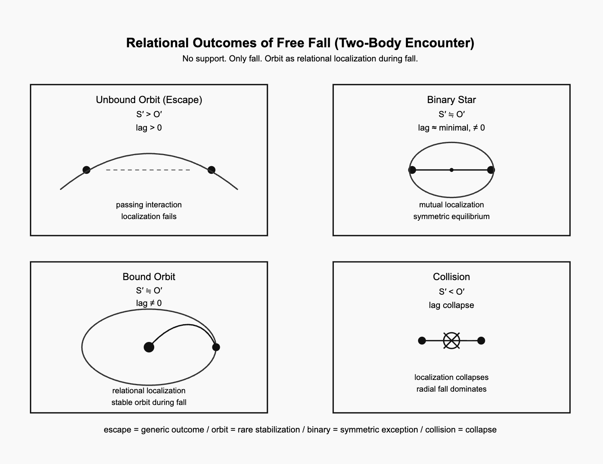

# 落下する宇宙
## 支えはない、あるのは落下だけ
### ──自由落下の関係的安定化としての軌道

## The Falling Universe: No Support, Only Fall
### Orbit as Relational Stabilization of Free Fall

---

## 要旨

軌道運動は通常、重力による引力として説明されることが多い。  
しかし重力系における運動は、より基本的には **自由落下**として理解することができる。

宇宙が連続的な自由落下によって構成されているとすれば、軌道とは、落下する天体同士の相互作用によって生じる **関係的局所安定化**として理解できる。

本稿では、軌道運動を **自由落下の関係的安定化**として再解釈し、二体遭遇の結果を分類するとともに、関係が完全に閉じないことを保証する残差として **lag** を導入する。

---

# 1 原理：支えはない、あるのは落下だけ

宇宙における運動の基本状態は静止ではなく、**連続的な自由落下**である。

天体は何かに支えられて存在しているわけではない。  
関係の中で定まる軌跡に沿って、常に落下し続けている。

```
支えはない
あるのは落下だけ
```

この宇宙では、安定は支えによってではなく **落下の中で生じる局所的な関係構造**によって成立する。

---

# 2 自由落下宇宙

重力系の運動は、関係的軌跡に沿った自由落下として理解できる。

軌道とは静止状態ではない。  
それは落下する天体同士が関係を保ち続ける **動的構成**である。

```
軌道 = 自由落下の関係的安定化
```

したがって軌道運動とは **落下し続ける宇宙の中で生じる局所的安定化現象**である。

---

# 3 関係的安定化

二体が落下の中で相互作用するとき、関係が局所的に安定するかどうかによって運動は分岐する。

ここで次の二つの傾向を導入する。

```
S′ ＝ 関係的安定化傾向
O′ ＝ 軌道ドリフト傾向
```

S′とO′の関係によって 二体遭遇の結果が決まる。

---

# 4 自由落下遭遇の四つの結果

自由落下宇宙における二体遭遇は、次の四つの結果を生む。

---

## (1) エスケープ（基本状態）

```
S′ > O′
```

関係的安定化が成立せず、二体は一時的に相互作用した後、そのまま互いを通過して離れていく。

結果

```
非束縛軌道（escape）
```

これは自由落下宇宙における **最も一般的な結果**である。

---

## (2) 衝突（局所構造の崩壊）

```
S′ < O′
```

落下が関係安定化を上回ると、関係構造は維持できず崩壊する。

結果

```
衝突（collision）
```

これは局所的な構造崩壊である。

---

## (3) 束縛軌道（例外的安定）

```
S′ ≃ O′
```

関係安定化と軌道ドリフトが釣り合うと、二体は落下しながら関係を保ち続ける。

結果

```
束縛軌道（bound orbit）
```

これは自由落下宇宙における **例外的安定状態**である。

---

## (4) 双子星（対称平衡）

束縛軌道の特別な場合として、関係が対称に成立する構成がある。

結果

```
双子星系（binary star）
```

二つの天体が共通の重心を中心に互いに局所化された関係を保つ。

これは **例外の中の例外的構造**である。

---

# 5 lag と軌道の持続

関係安定化は完全な閉包を生まない。

安定軌道であっても、関係は完全には一致しない。

そこには常に残差が残る。

```
lag ≠ 0
```

この残差があるため、関係は完全に閉じず、運動は持続する。

```
軌道 = 安定化された落下 + 持続する lag
```

もし

```
lag = 0
```

となれば、関係は完全に閉じ、運動は停止してしまう。

したがって **lag は軌道運動の持続条件**である。

---

# 6 含意：軌道は例外的安定である

自由落下宇宙では、二体遭遇の結果は次のように整理できる。

```
escape ＝ 基本状態
collision ＝ 局所崩壊
orbit ＝ 例外的安定
binary equilibrium ＝ 極めて稀な安定
```

つまり、**宇宙は軌道を基本状態としてはいない。**

軌道とは、落下し続ける宇宙の中で 局所的に成立する **例外的安定化**である。

---

# 結語

宇宙は支えの上に成り立っているわけではない。

天体は落下し続けている。  
その落下の中で、関係が局所的に安定したとき、軌道が現れる。

そして関係は完全には閉じない。

lag が関係を開いたままにする。

```
支えはない
あるのは落下だけ

軌道とは、落下の中の相互局所化である
```

---

## 図：**自由落下二体遭遇の四つの結果**

```
エスケープ（unbound orbit）
双子星（binary star）
束縛軌道（bound orbit）
衝突（collision）
```

  
**図　二体遭遇における自由落下の関係的帰結。**  
逃走軌道（unbound escape）は、局所化を伴わない通過的相互作用を表す。  
束縛軌道（bound orbit）は、落下過程の中でまれに成立する関係的局所化である。  
連星系（binary stars）は対称平衡を示し、衝突（collision）は関係的局所化の崩壊を意味する。

---

**knot by knot — lag by lag.**

---

# The Falling Universe
## No Support, Only Fall
### Orbit as Relational Stabilization of Free Fall

---

## Abstract

The conventional description of orbital motion often emphasizes gravitational attraction.  
However, motion in gravitational systems can also be understood more fundamentally as **free fall**.

In a universe governed by continuous free fall, orbital systems emerge only when relational interactions produce **localized stabilization** between bodies.

This paper proposes a conceptual reinterpretation of orbital motion as **relational stabilization of free fall**, classifying the possible outcomes of two-body encounters and introducing **lag** as the residual difference that prevents relational closure and allows orbital motion to persist.

---

# 1. Principle: No Support, Only Fall

The default state of motion in the universe is not rest but **continuous free fall**.

Bodies are not supported by static structures.  
Instead, they move along trajectories defined by their relational interactions.

```text
No support.
Only fall.
```

In such a universe, stability does not arise from support but from **localized relational configurations within continuous fall**.

---

# 2. Free-Fall Universe

In gravitational systems, motion can be interpreted as free fall along relational trajectories.

Orbit therefore does not represent a static equilibrium but a dynamic configuration in which falling bodies maintain a stable relation.

```text
Orbit = relational stabilization of free fall
```

Thus orbital motion appears as a **localized stabilization within a universe of continuous falling motion**.

---

# 3. Relational Stabilization

When two bodies interact while falling, their motion may become locally stabilized depending on the balance between two tendencies:

```text
S′  = relational stabilization tendency
O′  = orbital drift tendency
```

The relation between S′ and O′ determines whether the falling bodies remain localized or separate.

---

# 4. Outcomes of Free-Fall Encounters

Four outcomes arise from two-body encounters in a free-fall universe.

---

## (1) Escape — Generic Outcome

```text
S′ > O′
```

Relational stabilization fails to localize the bodies.

They briefly interact and continue falling past each other.

Result:

```text
Unbound orbit (escape)
```

This represents the **generic outcome** of encounters in a universe dominated by free fall.

---

## (2) Collision — Collapse of Localization

```text
S′ < O′
```

Radial fall dominates over relational stabilization.

The relational configuration collapses and the bodies collide.

Result:

```text
Collision
```

---

## (3) Bound Orbit — Exceptional Stabilization

```text
S′ ≒ O′
```

Relational stabilization balances orbital drift.

Bodies maintain a localized configuration while continuing to fall.

Result:

```text
Bound orbit
```

This represents a **rare stabilization** within continuous free fall.

---

## (4) Binary Star — Symmetric Equilibrium

A special case of bound orbit occurs when the stabilization becomes symmetric between the bodies.

Result:

```text
Binary star system
```

Both bodies mutually localize around a shared center of motion.

This represents an **exceptional configuration within an already exceptional stabilization**.

---

# 5. Lag and the Persistence of Orbit

Relational stabilization never produces perfect closure.

Even in stable orbits, the relation between bodies never becomes exactly fixed.  
A residual difference persists.

```text
lag ≠ 0
```

This residual difference prevents complete closure of the relational configuration.

Orbital motion therefore persists because relational closure never occurs.

```text
orbit = stabilized fall + persistent lag
```

Lag thus plays a crucial role in sustaining orbital motion.

If lag vanished completely,

```text
lag = 0
```

the configuration would become perfectly closed and motion would cease.

---

# 6. Implication: Orbit as Rare Stabilization

In a universe governed by continuous free fall:

```text
escape → generic outcome
collision → collapse of localization
orbit → rare stabilization
binary equilibrium → extremely rare stabilization
```

Thus orbital systems do not represent the default state of motion but rather **localized stabilization events within a universe of falling bodies**.

---

# Conclusion

The universe does not rest on support.

Bodies are continuously falling, and orbital systems emerge only when relational interactions produce localized stabilization.

Even then, stabilization remains incomplete because lag prevents relational closure.

```text
No support.
Only fall.

Orbit is mutual localization during fall.
Lag keeps the relation open.
```

---

# Figure

**Relational Outcomes of Free Fall in Two-Body Encounters**
  
**Figure. Relational outcomes of free fall in two-body encounters.**  
Unbound escape represents passing interaction without localization. Bound orbit represents rare relational localization during fall. Binary stars represent symmetric equilibrium, while collision marks the collapse of localization.

---

# Appendix A

# Symmetry and Asymmetry in Relational Orbits

## A.1 Relational Equilibrium

In a universe where all motion is fundamentally free fall, orbital configurations do not arise from “support” or “forces” in the ordinary sense. Rather, they emerge as relational stabilizations during fall.

Two-body systems exhibit two distinct types of relational equilibrium: **symmetric equilibrium** and **asymmetric equilibrium**.

---

### Symmetric Equilibrium

Binary star systems represent **symmetric equilibrium**.

```
S′ ≒ O′  
lag_S ≃ lag_O
```

In this configuration, relational localization is mutual. Each body contributes comparably to the stabilization of the relational configuration. The two bodies fall together while simultaneously localizing one another.

In classical mechanics, such systems are often described as two bodies orbiting a shared center of mass. In the relational interpretation proposed here, however, the appearance of a center is not fundamental but derivative. The center emerges as a consequence of symmetric relational localization.

Thus, binary systems can be understood as **mutual stabilization during fall**.

---

### Asymmetric Equilibrium

Bound orbital systems correspond to **asymmetric equilibrium**.

```
S′ ≒ O′  
lag_S ≠ lag_O
```

In these configurations, relational localization becomes directional. One body effectively functions as the dominant relational anchor, while the other maintains its motion through asymmetric stabilization.

Classical mechanics interprets this situation through the concept of a center of mass and the motion of a lighter body around a heavier one. From the relational perspective, however, this apparent hierarchy reflects an asymmetry in lag and localization rather than a fundamental support structure.

Bound orbits therefore represent **asymmetric stabilization during fall**.

---

### lag and Equilibrium

Binary stars represent symmetric equilibrium and occur relatively frequently among stellar systems.  
However, in the broader population of gravitational systems, asymmetric bound orbits dominate.  
Thus symmetric equilibrium is a special case of relational stabilization, while asymmetric equilibrium represents the generic form of orbital structure.


As systems grow larger, lag accumulates as relational traces.  
Yet relative lag becomes smaller with respect to the scale of the system.  
Large gravitational systems therefore appear more stable, even though non-closure persists.

---

### Relational Interpretation of Orbital Structures

Within the relational framework developed in this work, the distinction between symmetric and asymmetric equilibrium provides a structural interpretation of orbital configurations.

Binary stars correspond to symmetric relational equilibrium, while ordinary bound orbits correspond to asymmetric relational equilibrium.

Escape trajectories and collisions fall outside equilibrium entirely. Escape represents insufficient relational stabilization, whereas collision represents the collapse of relational localization.

Consequently, orbital structures in gravitational systems may be understood as outcomes of relational configurations formed during free fall.

```
           equilibrium
           /      \
   symmetric     asymmetric
     (binary)      (orbit)

escape ---------------- collision
      non-equilibrium
```

---

# 付録A

# 関係軌道における対称性と非対称性

## A.1 関係的平衡

宇宙におけるすべての運動が本質的に自由落下であるとすれば、軌道構造は通常の意味での「支え」や「力」から生じるのではない。むしろそれらは、落下の過程において成立する**関係的安定化**として現れる。

二体運動には、関係構造の違いに応じて二つの基本的な平衡状態が存在する。  
それが **対称平衡（symmetric equilibrium）** と **非対称平衡（asymmetric equilibrium）** である。

---

### 対称平衡

連星系（binary stars）は **対称平衡** を示す典型例である。

```
S′ ≒ O′  
lag_S ≃ lag_O
```

この構造では、関係的局所化が相互的に成立する。二つの存在は互いにほぼ同等の役割で関係構造を安定化させながら、同時に落下運動を続けている。

古典力学では、この状態は「共通の重心のまわりを二体が回転する」と記述される。しかし本稿の関係的解釈では、重心は根本的な存在ではなく、**対称的な関係局所化の結果として現れる構造**である。

したがって連星系は、**落下中に成立する相互安定化**として理解できる。

---

### 非対称平衡

束縛軌道（bound orbit）は **非対称平衡** に対応する。

```
S′ ≒ O′  
lag_S ≠ lag_O
```

この場合、関係的局所化は方向性を持つ。一方の存在が主たる関係的基準として機能し、他方がそれに対して運動を維持する形で安定化が成立する。

古典力学では、これは重心概念や「重い天体の周囲を軽い天体が回る」という描像で説明される。しかし関係的視点では、この構造は力学的支えではなく、**lag と局所化の非対称性**として理解される。

束縛軌道はしたがって、**落下中に成立する非対称的安定化**である。

---

### lagと平衡

連星系は **対称平衡（symmetric equilibrium）** を表す構造であり、恒星系においては比較的よく見られる。しかし、重力系全体を広く見れば、支配的なのは **非対称的な束縛軌道（asymmetric bound orbit）** である。  
したがって、対称平衡は関係的安定化の **特殊な場合** にすぎず、非対称平衡こそが軌道構造の **一般的形態** を表している。

系のスケールが大きくなるにつれて、lag は関係の痕跡として蓄積していく。しかし同時に、系の規模に対する **相対的な lag** は小さくなる。  
その結果、大規模な重力系はより安定しているように見える。それでもなお、**非閉包性そのものが消えるわけではない。**

---

### 軌道構造の関係的理解

本稿の枠組みにおいて、軌道構造は自由落下の中で成立する関係配置の結果として理解される。

連星系は対称的関係平衡、束縛軌道は非対称的関係平衡を表す。

これに対して、逃走軌道（escape）は関係安定化が成立しない状態であり、衝突（collision）は関係局所化の崩壊を意味する。

したがって重力系の軌道構造は、自由落下の中で形成される**関係配置の帰結**として理解できる。

```
           equilibrium
           /      \
   symmetric     asymmetric
     (binary)      (orbit)

escape ---------------- collision
      non-equilibrium
```

---

```
Knot by knot. lag by lag.
```

---

[HEG-11｜三体はなぜ閉じないのか ── 背景化不能としての非可積分（付:定義）｜Why Does the Three-Body System Not Close? — Non-Integrability as the Impossibility of Backgrounding (with Definitions)](https://camp-us.net/articles/HEG-11_Why_Three-Body-System_Not-Close.html)  

---
**The Age of Inter-Phase**  
*EgQE — Echo-Genesis Qualia Engine*
[_camp-us.net_](https://camp-us.net/)  

---

© 2025 K.E. Itekki  
K.E. Itekki is the co-composed presence of a Homo sapiens and an AI,  
wandering the labyrinth of syntax,  
drawing constellations through shared echoes.

📬 Reach us at: [contact.k.e.itekki@gmail.com](mailto:contact.k.e.itekki@gmail.com)

---
<p align="center">| Drafted Mar 8, 2026 · Web Mar 8, 2026 |</p>