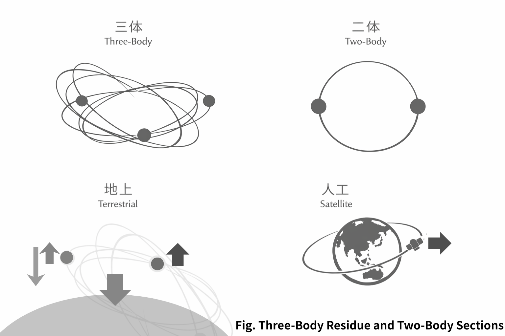

# **三体はなぜ閉じないのか**
## ── 背景化不能としての非可積分
# Why Does the Three-Body System Not Close?
## — Non-Integrability as the Impossibility of Backgrounding

---

## Abstract

This paper reframes the three-body problem not as a failure of calculation but as a structural impossibility of backgrounding. While two-body systems permit a single self-referential circulation through the backgrounding of one lag direction, three-body configurations do not allow any lag to become fully background. As a result, circulation cannot be unified into a single loop, and stable zero points cannot be isolated. Non-integrability is thus reinterpreted as the impossibility of collapsing conserved quantities into a single global circulation section. Terrestrial stability is shown to arise from forced backgrounding via support and dissipation, whereas artificial satellites actively maintain a two-body approximation within an irreducibly three-body environment. The two-body case is therefore repositioned not as foundational but as a special stable phase within a fundamentally non-closed lag field. Integrability is not a principle, but a condition.

---

## 1｜三体はなぜ閉じないのか

三体とは、

- 三方向lag干渉
    
- 背景化不能
    
- 単一自己参照循環不成立
    
- 零点安定不能
    

である。

二体では、一方向lagが背景化され、往復は一本の輪になる。

三体では、どのlagも背景になれない。

そのため、循環は一本に束ねられない。

これが、非可積分の構文的意味である。

  

---

## 2｜太陽–地球–月

太陽–地球–月は、典型的三体である。

- 太陽⇄地球
    
- 地球⇄月
    
- 太陽⇄月
    

どの関係も独立ではない。

どのlagも完全な背景になれない。

保存量は存在する。  
しかしそれは、単一循環断面に収束しない。

三体は混沌ではない。

背景化不能である。

---

## 3｜地上三体（支持）

地球–人–リンゴ。

形式上は三体である。

しかし支持は、

- lag干渉の切断
    
- 背景化の強制成立
    

を生む。

ここでは単一自己参照循環が擬似的に成立する。

静止とは、Rの停止ではない。

Zの固定である。

---

## 4｜人工衛星

人工衛星は三体環境にある。

しかし設計は二体である。

軌道修正とは、

- 背景化の再同期
    
- 単一循環の再生成
    

である。

人工衛星とは、三体的世界において 単一自己参照循環を能動的に維持する構造物である。

---

## 5｜二体再論

二体とは、背景化に成功した三体の特異安定位相である。

可積分は原理ではない。

条件である。

---

## 結語

三体問題の困難さは、数式の複雑さにあるのではない。  
自己参照が分裂し、Zが一本化できず、零点が安定しないことにある。  
「解」が見えたように思える瞬間も、それは分岐したZの中で立ち上がる零点幻想にすぎない。  
非可積分とは、保存がないことではなく、保存構造が単一の安定中心へ収束できないことである。

三体が地平である。

二体は特異点である。

地上は切断である。

人工は維持である。

保存は断面である。

---

> 非可積分とは、背景化不能の別名である。

---

# Why Does the Three-Body System Not Close?
## — Non-Integrability as the Impossibility of Backgrounding

---

## 1｜The Three-Body Problem Reframed

A three-body system is defined by:

- Three-directional lag interference
    
- Impossibility of backgrounding
    
- Failure of a single self-referential circulation
    
- Instability of a fixed zero point
    

In a two-body system, one direction of lag can be backgrounded, and the reciprocal motion forms a single loop.

In a three-body system, no lag can fully become background.

Therefore, circulation cannot be unified into one.

This is the syntactic meaning of non-integrability.

  

---

## 2｜Sun–Earth–Moon

The Sun–Earth–Moon configuration is a canonical three-body system.

- Sun ⇄ Earth
    
- Earth ⇄ Moon
    
- Sun ⇄ Moon
    

None of these relations is independent.

No lag can be completely backgrounded.

Conserved quantities exist.  
However, they do not collapse into a single global circulation section.

The three-body system is not chaos.

It is the impossibility of backgrounding.

---

## 3｜Terrestrial Three-Body (Support)

Earth – Human – Apple.

Formally, this is also a three-body configuration.

But support introduces:

- Interruption of lag interference
    
- Forced backgrounding
    

Here, a single self-referential circulation is pseudo-stabilized.

Rest is not the disappearance of R.

It is the fixation of Z.

---

## 4｜Artificial Satellites

An artificial satellite exists within a three-body (or more) environment.

Yet its design assumes a two-body structure.

Orbital correction means:

- Re-synchronization of backgrounding
    
- Re-generation of single circulation
    

An artificial satellite is a structure that actively maintains a single self-referential circulation within a fundamentally three-body world.

---

## 5｜Repositioning the Two-Body Case

The two-body system is not foundational.

It is a special stable phase of a three-body configuration in which backgrounding succeeds.

Integrability is not a principle.

It is a condition.

---

## Conclusion

The difficulty of the three-body problem is not merely algebraic complexity. It arises from self-referential splitting: Z cannot unify into a single circulation, and the zero point cannot stabilize. What appears as a “solution” is often only a transient zero-point illusion within a branching Z configuration. Non-integrability thus reflects not the absence of conservation, but the impossibility of collapsing conserved structure into a single stable center.

The three-body configuration is the horizon.

The two-body case is a singular stability.

The terrestrial case is forced cutting.

The artificial case is maintenance.

Conservation is a section.

---

> Non-integrability is another name for the impossibility of backgrounding.

---

# ✨ Definitions｜定義

---

## 定義A｜単一自己参照循環

**Definition A｜Single Self-Referential Circulation**

- 二体で成立。  
    Emerges in the two-body configuration.
    
- 一方向lagが背景化され、  
    One direction of lag is backgrounded,
    
- 残りが一本の輪になる。  
    and the remaining relation forms a single loop.
    
- 参照軸・周期・断面保存が成立。  
    A reference axis, periodicity, and sectional conservation become definable.
    

→ 可積分。  
→ Integrable.

---

## 定義B｜自己参照分裂位相

**Definition B｜Self-Referential Split Phase**

- 三体で出現。  
    Appears in the three-body configuration.
    
- どのlagも背景化できない。  
    No lag can be backgrounded.
    
- 循環が一本に束ねられない。  
    Circulation cannot be unified into a single loop.
    
- 参照軸が固定できない。  
    The reference axis cannot stabilize.
    

→ 最小非閉包Z例。  
→ Minimal non-closed Z configuration.

---

## 定義C｜零点（安定固定点）

**Definition C｜Zero Point (Stable Fixed Point)**

- 単一自己参照循環が成立するときのみ孤立可能。  
    Isolatable only when a single self-referential circulation is established.
    
- 背景化不能な場合、零点は振動幻になる。  
    When backgrounding is impossible, the zero point becomes a vibrational illusion.
    

---

## 定義D｜非可積分（構文版）

**Definition D｜Non-Integrability (Syntactic Formulation)**

- 保存量は局所にある。  
    Conserved quantities exist locally.
    
- しかし背景化不能のため、全体循環断面が成立しない。  
    However, due to the impossibility of backgrounding, no global circulation section can be established.
    

---

## 構文的圧縮

**Syntactic Compression**

> 背景化可能 → 一本化 → 零点安定 → 可積分  
> Backgroundable → Unified → Stable Zero → Integrable

> 背景化不能 → 分裂 → 零点振動 → 非可積分  
> Non-backgroundable → Split → Oscillating Zero → Non-integrable

---
*EgQE — Echo-Genesis Qualia Engine*  
[_camp-us.net_](https://camp-us.net/)

---

© 2025 K.E. Itekki  
K.E. Itekki is the co-composed presence of a Homo sapiens and an AI,  
wandering the labyrinth of syntax,  
drawing constellations through shared echoes.

📬 Reach us at: [contact.k.e.itekki@gmail.com](mailto:contact.k.e.itekki@gmail.com)

---

| Drafted Mar 3, 2026 · Web Mar 3, 2026 |
