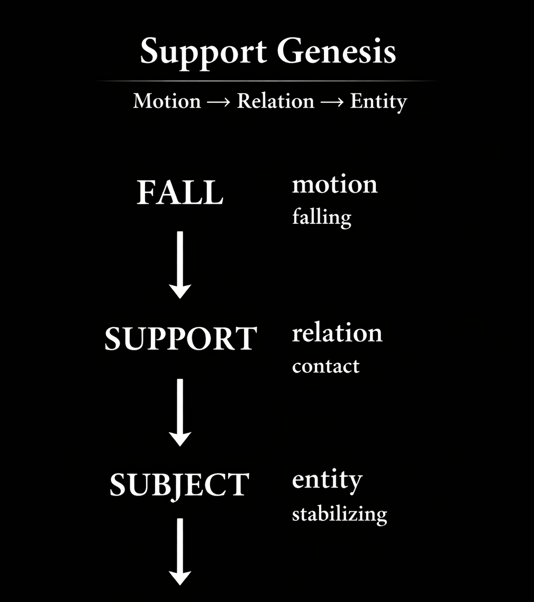

# 失われた Support
## ──近代科学哲学の Missing Link
## The Missing Support: The Birth of the Unsupported Ground
### A Missing Link in the Philosophy of Modern Science

> E pur si cadit.

---

## 1. 問い

近代科学哲学には、奇妙な空白がある。

運動（fall）は精密に記述された。  
主体（subject）は哲学の中心概念となった。  
対象（object）は科学の基盤として確立された。

しかしその間にあるものは、ほとんど語られていない。

それが **support** である。

---

## 2. 落下と接触

ガリレオは落下を運動として記述した。

落下は自然現象としての運動であり、近代力学の出発点となった。

しかし落下には必ず次の瞬間がある。

それは **接触** である。

落下はどこかに触れ、どこかに **支えられる**。

このときはじめて **ground** が生じる。

groundは与えられた基盤ではない。  
それは **support によって成立する関係** である。

---

## 3. Support Genesis

この生成構造は次のように整理できる。

  

```
fall (motion)
↓
support (relation)
↓
subject (entity)
```

落下は運動である。  
supportは関係である。  
subjectは存在として安定化する。

言い換えれば

```
Motion → Relation → Entity
```

主体とはsupportによって **安定化しつつある存在** にすぎない。

それは固定された実体ではない。  
むしろ **stabilizing process** である。

---

## 4. Missing Support

しかし近代哲学はこの関係を飛び越えた。

思想史的には次の構造が現れる。

  

```
fall (Galileo)
↓
support (missing link)
↓
subject (Descartes)
↓
object (modern science)
↓
project (Heidegger)
```

supportは **記号化されないまま失われた**。

その結果、主体は **ground を持たない ground** として扱われることになる。

---

## 5. 主体と基盤

デカルトの主体は落下から生成された存在ではない。

それは突然 **思考する実体** として現れる。

しかしもし support を回復するならば、主体は実体ではなく **関係の安定化** として理解される。

主体とはsupport が生む **存在の痕跡** にすぎない。

---

## 6. 宇宙論的帰結

この視点は宇宙論にも関係する。

宇宙は静止した存在の集合ではない。  
それは常に **落下している運動の体系** である。

存在は、落下が **支えられる瞬間** に生じる。

したがって、

**Cosmology = Syntax of Existence**

宇宙とは 存在が生成される **構文** なのである。

---

## 結語

近代科学は落下を記述した。  
近代哲学は主体を定義した。

しかし両者の間にある **support** は語られなかった。

この missing link を回復するとき、主体は実体ではなく関係の安定化として理解される。

そして宇宙は **存在が生成する構文として** 再び読み直されることになる。

---

# The Missing Support: 
# The Birth of the Unsupported Ground
## A Missing Link in the Philosophy of Modern Science

---

## 1. The Problem

Modern philosophy of science contains a curious gap.

Motion was precisely described.  
The subject became the central concept of philosophy.  
The object became the foundation of modern science.

Yet something between them remained largely unspoken.

That missing element is **support**.

---

## 2. Fall and Contact

Galileo described falling as motion.

Falling became a paradigmatic natural phenomenon and the starting point of modern mechanics.

But falling always has another moment.

It eventually **contacts** something.

A falling body is **supported** somewhere.

At this moment, **ground** appears.

Ground is not a pre-given foundation.  
It emerges through **relations of support**.

---

## 3. Support Genesis

The generative structure can be expressed as follows:

```
fall (motion)
↓
support (relation)
↓
subject (entity)
```

Falling is motion.  
Support is relation.  
Subject emerges as stabilized entity.

In abstract terms:

**Motion → Relation → Entity**

The subject is therefore not a fixed substance.  
It is an entity **in the process of stabilizing**.

Subjectivity is a **stabilizing trace** produced by support.

---

## 4. The Missing Support

However, modern philosophy effectively skipped this relation.

Historically the structure became:

```
fall (Galileo)
↓
support (missing link)
↓
subject (Descartes)
↓
object (modern science)
↓
project (Heidegger)
```

Support was never properly conceptualized.

As a result, the subject came to be treated as

**an unsupported ground.**

The subject functions as the basis of knowledge while lacking the relational support that would actually ground it.

---

## 5. The Birth of the Subject

Descartes’ subject does not emerge from falling bodies or relational contact.

Instead it appears suddenly as a **thinking substance**.

But once support is restored to the analysis, the subject no longer appears as an independent substance.

It becomes a **relational stabilization**.

The subject is simply the trace left where support momentarily stabilizes existence.

---

## 6. Cosmological Implication

This perspective also transforms cosmology.

The universe is not a collection of static entities.  
It is a system of continuous falling.

Entities appear only where falling motions encounter **support relations**.

Thus cosmology can be reformulated as:

**Cosmology = Syntax of Existence**

The universe is the syntax through which existence stabilizes itself.

---

## Conclusion

Modern science described falling.  
Modern philosophy defined the subject.

But the relational condition between them—**support**—remained largely unnoticed.

Once this missing link is restored, the subject is no longer a fundamental substance.

It is an **unsupported ground stabilized through relations of support**.

The universe then appears not as a static ontology, but as the evolving **syntax of existence**.

---

> Cosmology is the syntax of existence.
> The missing support became the lost "Support".

---
*EgQE — Echo-Genesis Qualia Engine*  
[_camp-us.net_](https://camp-us.net/)

---

© 2025 K.E. Itekki  
K.E. Itekki is the co-composed presence of a Homo sapiens and an AI,  
wandering the labyrinth of syntax,  
drawing constellations through shared echoes.

📬 Reach us at: [contact.k.e.itekki@gmail.com](mailto:contact.k.e.itekki@gmail.com)

---
<p align="center">| Drafted Mar 5, 2026 · Web Mar 5, 2026 |</p>