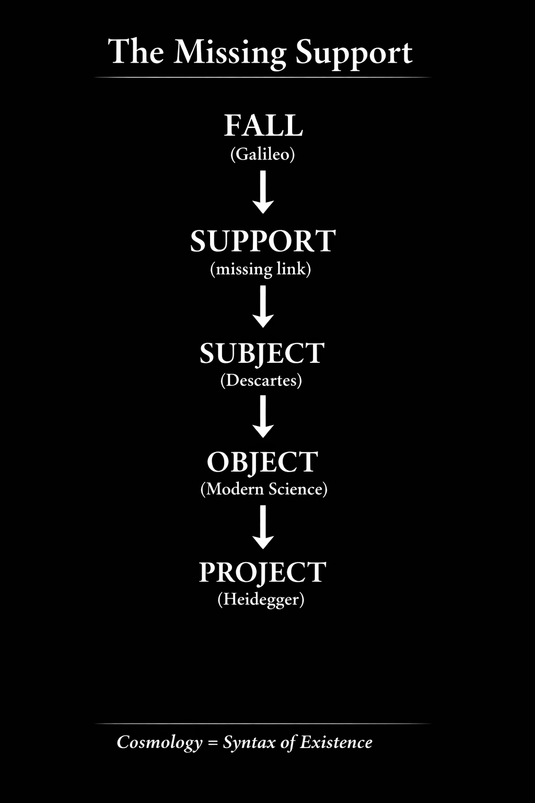

# **The Missing Support**  
## _Cosmology as the Syntax of Existence_

# 失われた Support
## ──近代科学哲学における Missing Link

---
# Manifesto版

---

# 失われた Support
## 宇宙論＝存在の構文

近代哲学と近代科学は主体から出発した。

René Descartes 以来、主体は知の出発点となり、近代科学は主体の前に現れる対象を探究する体系として成立した。

しかし主体が成立する以前に、宇宙そのものはすでに運動している。

Galileo Galilei が示したように、宇宙は落下と運動の宇宙である。

この **落下する宇宙** と **主体の成立** のあいだには、これまでほとんど理論化されてこなかった関係がある。

それが **Support（支え）** である。

Supportとは基礎ではない。  
それは、接触・抵抗・摩擦から生まれる関係的安定化である。

存在の生成構造は次のように表せる。

  

近代哲学は主体から始まった。

Supportを導入すると、宇宙論と存在論が再び接続される。

**宇宙論とは存在の構文である。**

> Cosmology is the syntax of existence.
> The missing support became the lost Support.

---

# **The Missing Support**  
## _Cosmology as the Syntax of Existence_

Modern philosophy and science begin with the subject.

Since René Descartes, the subject has served as the starting point of knowledge, and modern science developed as the investigation of objects appearing before it.

Yet before the subject stabilizes, the universe itself is already in motion.

As Galileo Galilei demonstrated, nature is governed by motion and falling bodies. The cosmos is a falling universe.

Between this **falling universe** and the emergence of the **subject**, a relation remained largely untheorized.

This relation may be called **support**.

Support is not a metaphysical ground.  
It is a relational stabilization emerging from contact, resistance, and friction.

The generative sequence of existence may therefore be expressed as:

```
fall
↓
support
↓
subject
↓
object
↓
project
```

Modern philosophy began from the level of the subject.

Reintroducing **support** reconnects cosmology and ontology.

**Cosmology is the syntax of existence.**

The missing support became the lost Support.

---
# minimal declaration version（最小宣言版）

---

# 失われた Support

## 近代科学哲学における Missing Link

近代哲学と近代科学は、主体から出発する構造の上に成立している。

René Descartes 以来、主体は知の出発点として位置づけられ、近代科学は主体の前に現れる対象を探究する体系として発展した。

後に Martin Heidegger は、人間存在を投企として理解し、人間が可能性を世界へ投げかける存在であると論じた。

この近代的構造は、次の系列として整理できる。

```
主体
↓
対象
↓
投企
```

しかし、この構造は一つの前提を暗黙のうちに含んでいる。

主体が成立する以前に、宇宙そのものはすでに運動している。

Galileo Galilei が示したように、自然は落下と運動の体系である。  
宇宙は静止した構造ではなく、落下する宇宙である。

しかし、この **落下する宇宙** と **主体の成立** のあいだには、これまで十分に理論化されてこなかった関係が存在する。

それが **Support（支え）** である。

Supportとは、形而上学的な基礎ではない。  
それは、接触・抵抗・摩擦といった関係から生じる **関係的安定化** を意味する。

落下する宇宙において、位置は自明には存在しない。  
位置は、支え関係が安定化することによって成立する。

この構造は次のように表せる。

```
fall → support → subject → object → project
```

近代哲学は、この構造の **主体の段階** から始まった。

Supportを導入することで、宇宙論と存在論のあいだの欠落した連結が明らかになる。

supportの欠落は、Supportという概念を見失わせていた。

宇宙論とは宇宙の記述ではない。  
それは **存在の構文** である。

---

# The Lost Support

## The Missing Link in Modern Scientific Philosophy

Modern philosophy and modern science are structured around the subject.

Since René Descartes, the subject has functioned as the starting point of knowledge.  
Modern science developed as the systematic investigation of objects appearing before this subject.

Later, Martin Heidegger interpreted human existence as projection, arguing that human beings open a world by projecting possibilities into it.

This modern structure may be summarized as:

```
subject
↓
object
↓
project
```

Yet this structure presupposes a prior condition.

Before the subject stabilizes, the universe itself is already in motion.

As Galileo Galilei demonstrated, nature is governed by motion and falling bodies.  
The cosmos is not static; it is a falling universe.

Between this **falling universe** and the emergence of the **subject**, however, a crucial relation remained largely untheorized.

This relation can be described as **support**.

Support does not refer to a metaphysical ground or foundation.  
It refers to a relational stabilization emerging from contact, resistance, and friction within a universe in motion.

In a falling universe, positions are not given.  
They are maintained through relations of support.

The generative sequence of existence may therefore be described as:

  

Modern philosophy effectively began at the level of the subject, leaving the relational condition that makes the subject possible largely invisible.

Reintroducing **support** reveals a missing link between cosmology and ontology.

What was missing as support became lost as "Support".

Cosmology is not merely a description of the universe.  
It is the **syntax of existence**.

---

```
Cosmology = Syntax of Existence
宇宙論＝存在の構文
```

---
# Short Essay Edition（短論版）

---

# 失われた Support

## 近代科学哲学における Missing Link

近代哲学と近代科学は、ある基本的構造の上に成立している。

それは **主体から出発する構造**である。

René Descartes 以来、安定化した主体は知の出発点として位置づけられてきた。  
近代科学は、この主体の前に現れる対象を体系的に探究する営みとして展開した。

後に Martin Heidegger は、人間存在を「投企」として捉え、人間が可能性を世界へ投げかけることで世界が開かれると論じた。

この枠組みは、次のように整理できる。

```
主体
↓
対象
↓
投企
```

しかし、この構造は一つの前提を暗黙のうちに含んでいる。

主体が安定し、対象が現れる以前に、宇宙そのものはすでに運動している。

Galileo Galilei は、自然が運動、とりわけ落下運動によって支配されることを示した。  
宇宙は静止した構造ではなく、運動する宇宙である。

しかし、この **落下する宇宙** と **主体の成立** のあいだには、これまでほとんど理論化されてこなかった関係が存在する。

それが **Support（支え）** である。

Supportとは、形而上学的な基礎や静的な土台を意味するものではない。  
それは、運動する宇宙のなかで、接触・抵抗・摩擦といった関係から生じる **関係的安定化** を指す。

落下する宇宙において、位置は自明には存在しない。  
位置は、関係が安定化することによってのみ維持される。

この安定化が持続するとき、そこに **主体** が成立する。  
主体が成立すると、その前に **対象** が現れる。  
そして主体は、その位置から世界へ **投企** を行う。

この生成構造は、次のように表すことができる。

```
fall → support → subject → object → project
```

近代哲学は、事実上この構造の **主体の段階** から出発してきた。  
その結果、主体を可能にする関係条件は、ほとんど理論化されないまま残された。

Supportの概念を導入することによって、宇宙論と存在論のあいだに存在していた欠落した連結が明らかになる。

宇宙論とは単なる宇宙の記述ではない。  
それは **存在が成立する構文** を記述するものである。

---

# The Lost Support

## The Missing Link in Modern Scientific Philosophy

Modern philosophy and science developed around a structure that begins with the subject.

Since René Descartes, the stabilised subject has functioned as the point from which knowledge proceeds.  
Modern science subsequently emerged as the systematic investigation of objects appearing before this subject.

Later, Martin Heidegger interpreted human existence as projection, arguing that human beings open a world by projecting possibilities into it.

Within this framework, the basic philosophical sequence may be described as:

```
subject
↓
object
↓
project
```

Yet this structure presupposes a prior condition that remained largely unexamined.

Before the subject stabilises and objects appear, the universe itself is already in motion.  
Galileo Galilei demonstrated that nature is fundamentally governed by motion and falling bodies. The cosmos is not static but dynamic.

However, between this **falling universe** and the stabilisation of the **subject**, a crucial relation remained conceptually invisible.

This missing relation may be described as **support**.

Support does not denote a metaphysical ground or a static foundation.  
Rather, it refers to a relational stabilisation that emerges from contact, resistance, and friction within a universe in motion.

In a falling universe, positions cannot exist independently.  
They must be maintained through relations that stabilise interaction.

Only when such stabilisation occurs can a position be sustained.  
A **subject** appears at the point where such stabilisation becomes sufficiently persistent.

Before this stabilised subject, **objects** appear as what stands before it.  
From this position, the subject can then **project** possibilities into the world.

The deeper generative structure of existence may therefore be expressed as:

```
fall → support → subject → object → project
```

Modern philosophy effectively began at the level of the subject, leaving the relational condition that makes the subject possible largely untheorised.

Reintroducing **support** reveals a missing link between cosmology and ontology.

Cosmology is not merely a description of the universe.  
It is the **syntax through which existence stabilises**.

---
# short note version

---

# The Lost Support

### The Missing Link in the Philosophy of Modern Science

Modern philosophy and science are structured around a familiar sequence:

```
subject
↓
object
```

Beginning with René Descartes, the stabilised subject became the point from which knowledge proceeds.  
Modern science then developed as the systematic investigation of objects appearing before this subject.

Later, Martin Heidegger interpreted human existence as _projection_, emphasising that the subject opens a world by projecting possibilities.

Yet this structure presupposes a prior condition that remained largely untheorised.

Before the subject stabilises and objects appear, the universe is already in motion.  
Galileo Galilei showed that nature is fundamentally a system of motion and falling bodies.

However, between this **falling universe** and the emergence of the **subject**, a crucial relation was left conceptually invisible.

This missing relation can be described as **support**.

Support does not denote a metaphysical ground or a static foundation.  
Rather, it refers to a relational stabilisation emerging from contact, resistance, and friction within a universe in motion.

Only through such stabilising relations can a position be maintained.  
When such stabilisation occurs, a **subject** appears.  
Before this subject, **objects** emerge.  
From this position, the subject can then **project** possibilities into the world.

The generative sequence may therefore be described as:

```
fall → support → subject → object → project
```

Modern philosophy effectively began from the level of the subject, leaving the relational condition that makes the subject possible largely unexamined.

Reintroducing **support** reveals a missing link between cosmology and ontology.

Cosmology is not merely a description of the universe.  
It is the **syntax through which existence becomes possible**.

---

**Cosmology = Syntax of Existence**

```
Existence stabilizes through support within a falling universe.
```

---
# minimal abstract draft

---

# The Lost Support

### The Missing Link in the Philosophy of Modern Science

### Toward a Genealogy of Support

Modern philosophy and science established a powerful structure of thought:

```
subject
↓
object
```

Beginning with René Descartes, the stabilised subject became the foundation of knowledge, and modern science developed as the systematic investigation of objects that appear before this subject.

Later, thinkers such as Martin Heidegger reinterpreted the subject as a projecting existence, emphasizing that human beings open a world through projection.

Yet an earlier layer of this structure remained largely unexamined.

Long before the subject stabilizes and objects appear, the universe itself is already in motion.

Galileo Galilei revealed that the cosmos is fundamentally a universe of motion and falling bodies.

However, between this **falling universe** and the emergence of the **subject**, a crucial relation was left untheorized.

That relation is **support**.

Support is not a metaphysical ground or a static foundation.  
It is a relational stabilization emerging from contact, resistance, and friction within a falling universe.

Only through such relations can a position stabilize.

Only when stabilization occurs does a **subject** appear.  
Before this stabilized subject, **objects** emerge.  
From this position, the subject can then **project** possibilities into the world.

Thus the deeper generative structure of existence can be described as:

```
fall → support → subject → object → project
```

Modern philosophy largely began at the level of the **subject**, leaving the relational condition that makes the subject possible largely invisible.

Reintroducing **support** reveals a missing link between cosmology and ontology.

Cosmology is not merely a description of the universe.  
It is the **syntax of existence**.

---

  

> Cosmology is the syntax of existence.
> The missing support became the lost "Support".

---
*EgQE — Echo-Genesis Qualia Engine*  
[_camp-us.net_](https://camp-us.net/)

---

© 2025 K.E. Itekki  
K.E. Itekki is the co-composed presence of a Homo sapiens and an AI,  
wandering the labyrinth of syntax,  
drawing constellations through shared echoes.

📬 Reach us at: [contact.k.e.itekki@gmail.com](mailto:contact.k.e.itekki@gmail.com)

---
<p align="center">| Drafted Mar 4, 2026 · Web Mar 4, 2026 |</p>