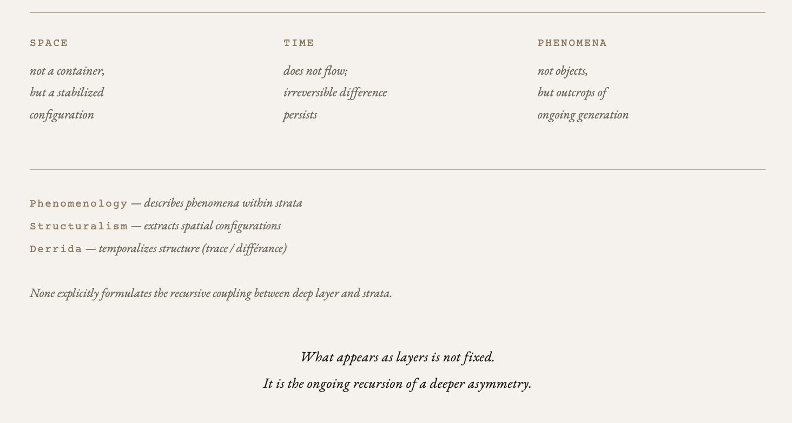

# Stratified Ontology of Lag 
# — Diagram of Ground Expansion
## **存在の地層と古層** — 存在地層学（図解ノート）

> The ground is not a terminal point.  
> It unfolds into a stratified structure.

[EgQE｜Lag Generation Theory ── HEG-13 Core: From Otherness to Fiction of Ground](https://camp-us.net/articles/Core_HEG-13_Lag-Generation-Theory_Otherness-to-Ground.html)  

---

# **Stratified Ontology of Lag**
## — Deep Layer and Strata (Diagram Note)

---

## **Core Diagram**

  
The strata are not static layers.  
They are recursive exposures of a deeper generative field.  


```text
──────────────
Deep Layer
──────────────
lag
↓
support
↓
orientation
──────────────
Strata
──────────────
space
↓
time
↓
phenomena
   ↘
    ΔZ
   ↗
lag
```

---

## **Notation**

```text
↓  = structural dependence (not temporal succession)
↺  = recursive return (feedback)
ΔZ = differential trace (hinge of recursion)
```

---

## **Minimal Definitions**

- **lag**: irreversible difference (lag ≠ 0)
    
- **support / ground**: local stabilization (ground as an effect of support)
    
- **orientation**: emergence of directional asymmetry (front/back)
    
- **space**: stabilized configuration of support and orientation
    
- **time**: persistence of lag (ψ)
    
- **phenomena**: local outcrops of generative processes
    
- **ΔZ**: differential trace enabling recursion between strata and deep layer
    

   

---

## **Core Propositions**

> The strata are not static layers.  
> They are recursive exposures of a deeper generative field.

> Space is not a container, but a stabilized configuration.  
> Time does not flow; irreversible difference persists.

> Phenomena are not objects, but outcrops of ongoing generation.

---

## **Structural Claim**

```text
Deep Layer (generative conditions)
→ Strata (phenomenal stabilization)
→ ΔZ (trace)
→ recursion → Deep Layer
```

> Existence is not a static stratification,  
> but a recursive stratification driven by lag.

---

## **Positioning**

- Phenomenology: describes phenomena within strata
    
- Structuralism: extracts spatial configurations (space)
    
- Derrida: temporalizes structure (trace / différance)
    

> None explicitly formulates the recursive coupling between deep layer and strata.

---

## **Closing Line**

> What appears as layers is not fixed.  
> It is the ongoing recursion of a deeper asymmetry.

---

> This is not a diagram of structure.  
> It is a diagram of ongoing generation.

---

[HEG-13｜存在の地層と古層 — 存在地層学 序説｜STRATIFIED ONTOLOGY OF LAG — DEEP LAYER AND STRATA](https://camp-us.net/articles/HEG-13_STRATIFIED-ONTOLOGY-OF-LAG.html)  
[HEG-13｜時間の地層（ψ） — 持続の構文論としての時間｜The Temporal Strata (ψ) — Stratified Ontology of Lag: Toward a Theory of Persistence](https://camp-us.net/articles/HEG-13_Temporal-Strata.html)  

---

# **存在の地層と古層**
## — 存在地層学（図解ノート）

  

---

## **コア図**

```text
──────────────
古層（Deep Layer）
──────────────
lag
↓
support（支え）
↓
orientation（向き）
──────────────
地層（Strata）
──────────────
space（空間）
↓
time（時間）
↓
phenomena（現象／露頭）
   ↘
    ΔZ（痕跡）
   ↗
lag
```

---

## **記号の意味**

```text
↓ ＝ 構造的依存（時間的順序ではない）
↺ ＝ 再帰（折り返し）
ΔZ ＝ 差分痕跡（往復のヒンジ）
```

---

## **最小定義**

- **lag**：非可逆差分（lag ≠ 0）
    
- **support / ground**：局所的安定（地面は支えの結果）
    
- **orientation**：前後・方向の生成（非対称の発生）
    
- **space**：支えと向きの配置の安定
    
- **time**：lagの持続（ψ）
    
- **phenomena**：生成の局所的露頭
    
- **ΔZ**：往復を可能にする差分痕跡
    

---

## **コア命題**

> 地層は固定された層ではない。  
> それは古層の生成が再帰的に露出したものである。

> 空間は容器ではなく配置である。  
> 時間は流れではなく持続である。

> 現象は対象ではない。  
> それは生成の露頭である。

---

## **構造主張**

```text
古層（生成条件）
→ 地層（現象的安定）
→ ΔZ（痕跡）
→ 再帰
→ 古層
```

> 存在は静的な地層ではない。  
> それはlagによって駆動される再帰的地層である。

---

## **哲学史の位置づけ**

- 現象学：地層（現象）を記述
    
- 構造主義：空間（配置）を抽出
    
- デリダ：時間を差延として再導入
    

> いずれも、古層と地層の往復構造を明示しなかった。

---

## **結語**

> 見えているのは地層である。  
> しかしそれは固定されていない。
> 
> 生成はつねに古層で起き、痕跡によって折り返され続けている。

---

> これは図ではない  
> 生成の断面である

---

[PG｜生成の現象学 ── Phenomenology of Genesis](https://camp-us.net/PG.html)  

---
*EgQE — Echo-Genesis Qualia Engine*  
[_camp-us.net_](https://camp-us.net/)  

---
© 2025 K.E. Itekki  
K.E. Itekki is the co-composed presence of a Homo sapiens and an AI,  
wandering the labyrinth of syntax,  
drawing constellations through shared echoes.

📬 Reach us at: [contact.k.e.itekki@gmail.com](mailto:contact.k.e.itekki@gmail.com)

---
<p align="center">| Drafted Mar 27, 2026 · Web Mar 27, 2026 |</p>