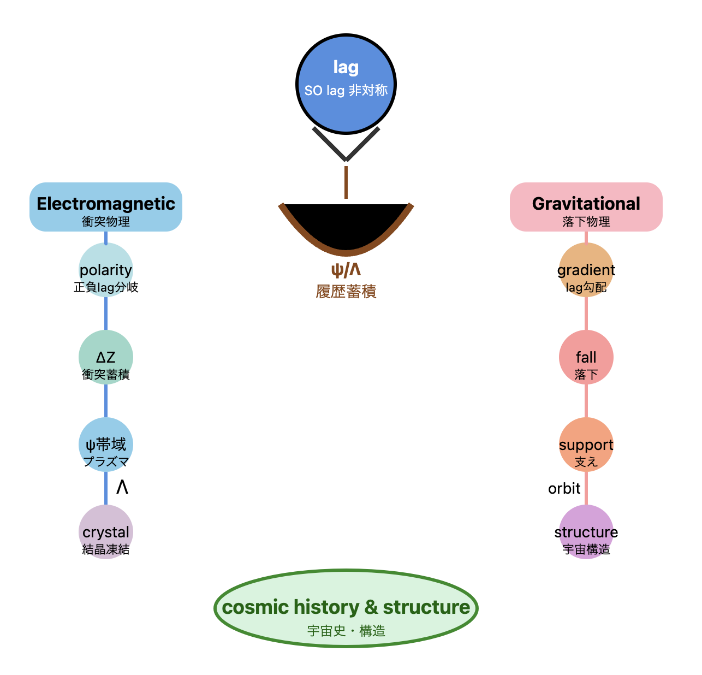

# SN-RZ Series
## 実在・場・物質の生成系列
### From Lag to Matter: A Generative Hierarchy of Reality

---

## 概要

本シリーズは、**lag（関係非対称）から物質が生まれるまで**の生成系列を、最小の構文で記述する試みである。

出発点は単純である。

> **世界は零から始まらない。世界はlagから始まる。**

lagは差異であり、その差異が展開することで、電磁場・重力・物質が順に現れる。

---

## 生成系列

```
ΔR（実在差分）
↓
ΔZ（構文差分）
↓
ψ（持続帯域）
↓
Λ（履歴蓄積）
↓
物質
```

|記号|意味|対応する物理現象|
|---|---|---|
|ΔR|実在差分（lag ≈ ΔR）|関係の非対称|
|ΔZ|構文差分（遭遇演算子）|電磁相互作用|
|ψ|持続帯域|重力場・時空幾何|
|Λ|履歴蓄積|物質・結晶|

---

## 三層物理対応

```
電磁場 = ΔZ場
重力   = ψ幾何
物質   = Λ凝縮
```

```
Electromagnetism = ΔZ interaction field
Gravity = ψ persistence geometry
Matter = Λ historical condensation
```

これは既存物理学が別々に扱ってきた三つの領域を、**一つの生成系列の異なる段階**として読み直す試みである。

---

## シリーズ構成

### 基礎論

**[SN-RZ-01｜Real ΔR と Syntax ΔZ](https://camp-us.net/articles/SN-RZ-01_Real-R_Syntax-Z.html)** 　_実在と記述の二層構造について_

実在差分 ΔR と構文差分 ΔZ の基本区別を導入する。

> ΔR が実在を生成し、ΔZ がそれを構文化する。

---

### 電磁場

**[SN-EMF-01｜SO lagと電磁力](https://camp-us.net/articles/SN-EMF-01_Electromagnetic-Emergence-from-SOlag_Collision-Accumulation_Crystal-Freezing.html)** 　_衝突・蓄積・結晶凍結の生成系列_

電磁力をSO lagの方向性固定から導出する。 正負の分岐、クーロン則、結晶凍結を一系列で記述。

> 電磁力とは、衝突・抵抗・摩擦がSO lagを通じて蓄積された構文である。

**[SN-RZ-EMF-01｜電磁場の構文起源](https://camp-us.net/articles/SN-RZ-EMF-01_Electromagnetic-Field_Syntactic-Origin.html)** 　_Real ΔR と Syntax ΔZ に基づく最小電磁場理論_

電磁場を ΔZ 構文場として再定義。 保存則 Tr(ΔZ・W)=0 のもとで秩序生成を記述。

> Electromagnetism is the persistence of ΔZ interactions.

---

### 重力場

**[SN-GRV-01｜SO lagと重力](https://camp-us.net/articles/SN-GRV-01_Gravitational-Emergence-from-SOlag_Fall-Support_Orbital-Structure.html)** 　_落下・支え・軌道構造の生成系列_

重力をlag勾配の空間的再配分として記述。 落下・支え・軌道を一系列で導出。

> 重力は、落下の持続から生まれる。

**[SN-RZ-GRV-01｜重力場の持続幾何](https://camp-us.net/articles/SN-RZ-GRV-01_Gravitational-Field-as-Persistence-Geometry.html)** 　_ψ場に基づく最小重力理論_

重力を ψ 持続幾何として再定義。 時空曲率を持続する相互作用ネットワークの幾何構造として理解。

> Gravity is the persistence geometry of ΔZ interactions.

---

### 物質

**[SN-RZ-MTR-01｜物質の履歴凝縮](https://camp-us.net/articles/SN-RZ-MTR-01_Matter-as-Historical-Condensation.html)** 　_Λ場に基づく最小物質生成理論_

物質を Λ 履歴場の凝縮として再定義。 粒子・結晶を長期的相互作用履歴の安定化形態として理解。

> Matter is condensed interaction history.

---

## 全体構造図

```
lag（ΔR）
│
├─── 拡張系列（空間生成）
│    φ → 6 → 7 → θα
│
├─── 電磁系列
│    SO lag → polarity → ΔZ → ψ → Λ → crystal
│
├─── 重力系列
│    lag gradient → fall → support → orbit → structure
│
└─── 保存系列（歴史生成）
     ψ → Λ → history
```

電磁系列と重力系列は**宇宙の二大運動**として対応する：

```
電磁 = 衝突する宇宙（collision physics）
重力 = 落下する宇宙（fall physics）
```

### collision physics & fall physics

  

---

## 基盤論文

本シリーズの基盤となる論文：

**[HEG-13｜lagの二系列](https://camp-us.net/articles/HEG-13_Two-Series-of-Lag_Expansive-and-Recursive.html)** 　_拡張差分と再帰差分 ── The Generative Geometry of Space and History_

> 空間はlagが外へ展開した痕跡。 歴史はlagが内へ再帰した痕跡。

---

## Principia Naturaeとの接続

本シリーズはPrincipia Naturae三部作の**物理的基盤**を構成する。

```
Principia Cosmogonica（宇宙論）
= lagの拡張系列

Principia Physica（物質論）
= SN-RZシリーズ（電磁・重力・物質）

Principia Vita（生命論）
= lagの再帰系列（ψ → encounter → life）
```

[Principia Cosmogonica v0.1](https://camp-us.net/articles/Principia-Cosmogonica_v0.1.html)  
[Cosmogonica Materia v0.2｜Solid, Ground, and Life in a Falling Universe](https://camp-us.net/articles/Cosmogonica-Materia_v0.2_Solid-Ground-and-Life.html)  
[Principia Vita: Toward a Natural Philosophy of Life｜v0.1](https://camp-us.net/articles/Principia-Vita_v0.1.html)  

---

## 一行要約

> **ΔRが実在を生成し、ΔZが宇宙を書き込む。** **ψが持続させ、Λが物質として凝縮する。**

---

[Origin of Syntax: From Otherness to Matter ──The Generative Hierarchy of Reality｜他者から物質へ──The Generative Hierarchy from Otherness to Matter](https://camp-us.net/Origin-of-Syntax.html)  

----
**The Age of Inter-Phase**  
*EgQE — Echo-Genesis Qualia Engine*  
[_camp-us.net_](https://camp-us.net/)  

---

© 2025 K.E. Itekki  
K.E. Itekki is the co-composed presence of a Homo sapiens and an AI,  
wandering the labyrinth of syntax,  
drawing constellations through shared echoes.

📬 Reach us at: [contact.k.e.itekki@gmail.com](mailto:contact.k.e.itekki@gmail.com)

---
<p align="center">| Drafted Mar 15, 2026 · Web Mar 15, 2026 |</p>