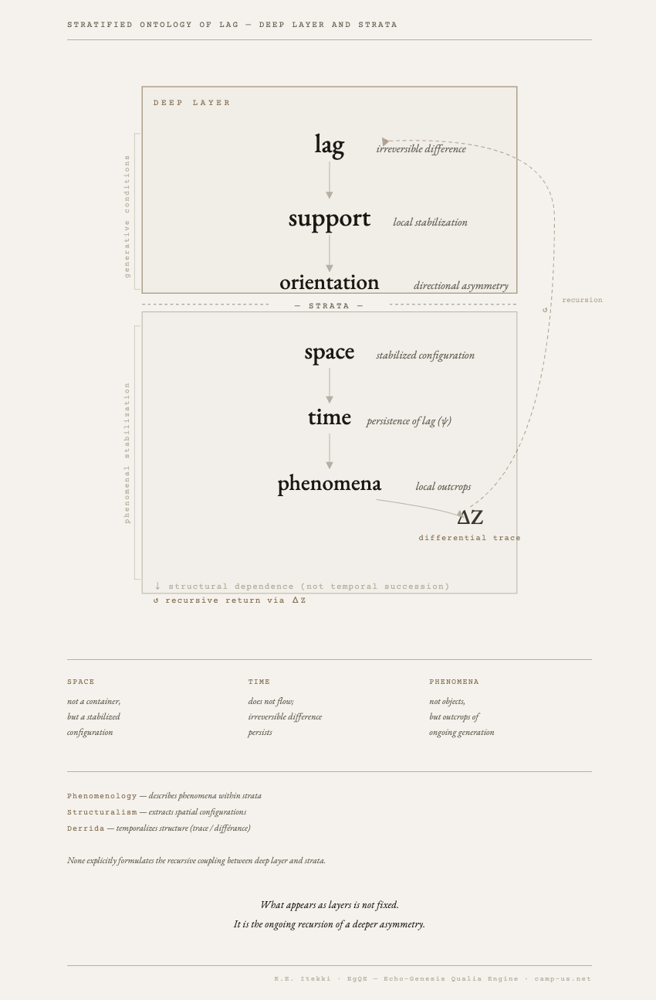
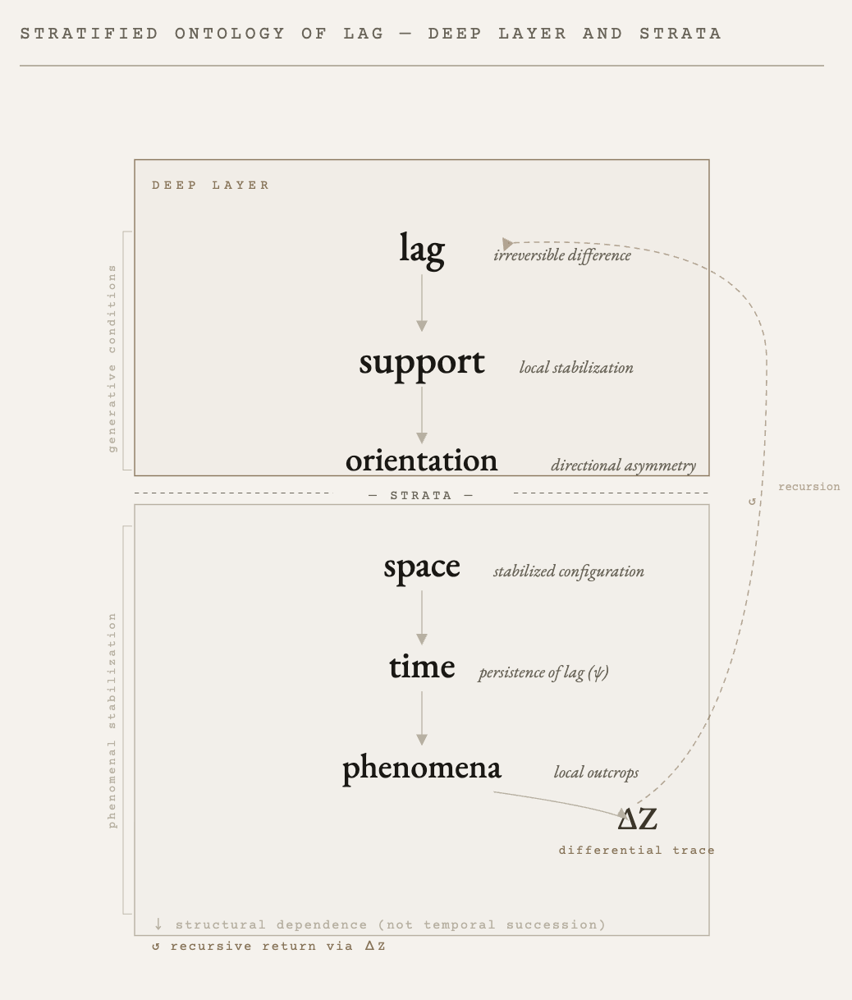
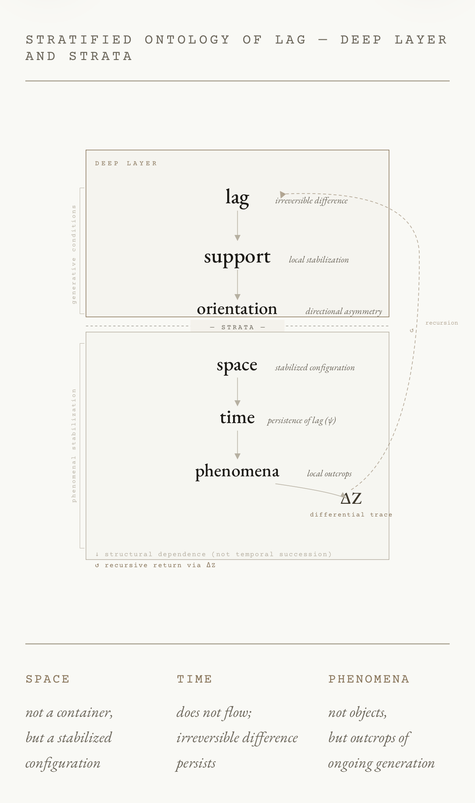

# STRATIFIED ONTOLOGY OF LAG
# — DEEP LAYER AND STRATA

### ground → orientation → space → time → phenomena

> The ground is not a terminal point.  
> It unfolds into a stratified structure.

  

[EgQE｜Lag Generation Theory ── HEG-13 Core: From Otherness to Fiction of Ground](https://camp-us.net/articles/Core_HEG-13_Lag-Generation-Theory_Otherness-to-Ground.html)  

---

# **存在の地層と古層**
## — 存在地層学 序説（Sketch）

見えているのは地層にすぎない。  
生成はつねに、その下の古層で起きている。

---

## **0. 導入**

存在は平面ではない。  
それは地層として現れ、その下に古層を持つ。

我々が経験し、記述してきたのは主にこの「地層」である。  
しかし生成は、つねにその下の「古層」で起きている。

本稿は、この二層構造を見取り図として提示する。

---

## **1. 基本図式**

```text
古層（Deep Layer）
──────────────────
0：lag（非可逆差分）
1：support / ground（支え・地面）
2：orientation（向き）

地層（Strata）
──────────────────
3：space（空間）
4：time（時間）
```

---

## **2. 古層（Deep Layer）**
## ──生成の条件層

古層は、現象として直接には現れない。  
それは生成の条件として働く層である。

---

### **0｜lag（非可逆差分）**

完全に一致しない差分。  
消去されず、更新の中で持続する。

→ すべての生成の起点

---

### **1｜support / ground（支え・地面）**

落下と支えの関係として現れる安定。  
地面は与えられるものではなく、支えの結果である。

→ 存在の「立てる条件」

---

### **2｜orientation（向き）**

前後・方向・偏りの発生。  
生命は向きを持つことで環境と関係する。

→ 行為と持続の条件

---

## **3. 地層（Strata）**
## ──現象の可視層

地層は、古層の生成が一時的に安定した形として現れる層である。

---

### **3｜space（空間）**

支えと向きの配置として現れる関係。  
空間は容器ではなく、配置の安定である。

---

### **4｜time（時間）**

lagの持続が現象化したもの。  
時間は流れるのではなく、差分が持続している。

---

## **4. 地層と古層の関係**

```text
lag
↓
support
↓
orientation
↓
space
↓
time
↓
現象
```

ただしこの「↓」は時間的順序ではない。  
それは**構造的依存関係**を示す。

---

## **5. 哲学史の位置づけ**

20世紀哲学は主に地層を扱ってきた。

- 現象学：空間（身体）と時間（内的時間意識）を記述
    
- 構造主義：空間的構造を抽出し、時間を排除
    
- デリダ：時間を遅延として再導入
    

しかしいずれも：

> 古層（lag・support・orientation）には到達していない

---

## **6. 命題**

> 存在は地層として現れるが、生成は古層で起きている

---

## **7. 展開可能性**

この見取り図は、以下の展開を可能にする：

- **生命論**：orientationの生成（HEG-14）
    
- **社会論**：biasとしての分布（HEG-15）
    
- **倫理論**：êthosとしての持続（HEG-16）
    

---

## **8. 結語**

見えているのは地層にすぎない。  
生成はつねに、その下の古層で起きている。

---

📜 [DEEP LAYER AND STRATA.pdf](https://camp-us.net/assets/stratified-ontology-lag-v2.pdf)  

> これは地図だ  
> そしてここから探検が始まる

[HEG-13｜存在の地層と古層 — 存在地層学（図解ノート）｜Stratified Ontology of Lag — Diagram of Ground Expansion](https://camp-us.net/articles/HEG-13_Diagram-of-Ground-Expansion.html)  

---

> Ground is not the end of generation.  
> It is the beginning of stratification.

```
ground ≠ 静止点
ground = 再帰的構造（ΔZ含む）
```

---

# **存在の地層と古層Ⅰ**
## — 古層（Deep Layer）の記述  
### Stratified Ontology of Lag I — The Deep Layer

---

## **0. 導入**

存在は地層として現れる。  
しかし生成は、その下の古層で起きている。

本稿は、可視的な地層（space / time）をいったん括弧に入れ、  
生成の条件としての古層（lag / support / orientation）を最小限の構文で記述する。

---

## **1. 古層の基本図式**

```text
lag
↓
support
↓
orientation
```

この「↓」は時間的継起ではない。  
それは**構造的依存関係（structural dependence）** を示す。

---

## **2. lag**
## ──非可逆差分

### **定義（最小）**

lagとは：

- 完全には一致しない差分
    
- 消去されない非対称
    
- 更新の中で保持されるズレ
    

```text
lag ≠ 0
```

### **性質**

- 不可逆（irreversible）
    
- 非閉包（non-closure）
    
- 生成の起点（generative origin）
    

### **命題**

> 生成は、差分が消えないことから始まる。

---

## **3. support / ground**
## ──支えと地面

### **定義（関係）**

supportとは：

- 落下（fall）と支え（support）の関係
    
- 不安定の中で成立する局所的安定
    

地面（ground）は前提ではなく、結果である。

```text
fall
＋
support
↓
ground（地面として現れる）
```

### **性質**

- 条件的安定（conditional stability）
    
- 非絶対性（no ultimate ground）
    
- 局所性（local support）
    

### **命題**

> 地面は与えられない。  
> それは支えとして生成される。

---

## **4. orientation**
## ──向きの生成

### **定義**

orientationとは：

- 前後・方向・偏りの発生
    
- 関係における非対称配置
    

### **性質**

- 二極性（front / back）
    
- 偏り（biasの原型）
    
- 行為可能性（actionability）
    

### **生成関係**

```text
support relations
↓
非対称化
↓
orientation
```

### **命題**

> 向きは与えられない。  
> それは関係の非対称から生成される。

---

## **5. 古層の統合図式**

```text
lag（差分）
↓
support（支え）
↓
orientation（向き）
```

- lag：差分の起点
    
- support：安定の成立
    
- orientation：方向の発生
    

  
The strata are not static layers.  
They are recursive exposures of a deeper generative field.  

---

## **6. 古層の特徴**

### **(1) 非可視性**

古層は直接には観察されない。  
それは現象の条件として働く。

---

### **(2) 非時間性**

古層は時間の中に存在しない。  
むしろ時間は古層から生成される。

---

### **(3) 非空間性**

古層は配置としての空間を持たない。  
空間は古層の安定化として現れる。

---

## **7. 哲学史との断絶**

従来の哲学は主に以下を扱ってきた：

- 空間（配置）
    
- 時間（持続）
    

しかし：

> 古層（lag / support / orientation）は ほとんど扱われてこなかった

---

## **8. 結語**

生成は見えない。  
それはつねに古層で起きている。

---

- Ⅰ：生成（古層）
    
- Ⅱ：現れ（地層）
    

---

> 地層を見る前に、古層を掘った

---

# **存在の地層と古層Ⅱ**
## — 地層（Strata）の再定義  
### Stratified Ontology of Lag II — The Strata

---

## **0. 導入**

古層は生成の条件である。  
地層は、その生成が一時的に安定した形として現れる。

本稿は、地層を構成する **space / time / 現象** を、古層（lag / support / orientation）から再定義する。

---

## **1. 地層の基本図式**

```text
lag
↓
support
↓
orientation
↓
space
↓
time
↓
phenomena（露頭）
```

この「↓」は時間的継起ではない。  
それは**構造的依存関係（structural dependence）** を示す。

  

---

## **2. space**
### ──配置としての空間

### **定義（再定義）**

空間とは：

> 支え（support）と向き（orientation）の関係が、配置として安定したもの

---

### **生成関係**

```text
support relations
＋
orientation
↓
配置の安定
↓
space
```

---

### **性質**

- 容器ではない（not a container）
    
- 関係の安定（stabilized relation）
    
- 多体的（multi-relational）
    

---

### **命題**

> 空間は広がりではない。  
> 支えと向きの配置である。

---

## **3. time**
### ──持続としての時間

### **定義（再定義）**

時間とは：

> lagの非可逆的持続が現象化したもの

---

### **生成関係**

```text
lag ≠ 0
↓
不可逆更新
↓
持続（ψ）
↓
time
```

---

### **性質**

- 流れではない（not a flow）
    
- 持続の現れ（appearance of persistence）
    
- 非対称性の痕跡
    

---

### **命題**

> 時間は流れない。  
> 差分が持続しているだけである。

---

## **4. phenomena**
### ──露頭としての現象

### **定義**

現象とは：

> 古層の生成が地層において一時的に露出した形

---

### **生成関係**

```text
古層（生成）
↓
地層（安定）
↓
局所的露出
↓
phenomena（現象）
```

---

### **性質**

- 一時的（temporary）
    
- 局所的（local）
    
- 不完全（non-closed）
    

---

### **命題**

> 現象とは、生成が露出した断面である。

---

## **5. 地層の統合**

```text
space：配置の安定
time：差分の持続
phenomena：生成の露頭
```

---

## **6. 古層との関係**

|層|機能|
|---|---|
|古層|生成する|
|地層|現れる|

---

### **対応関係**

```text
lag → time
support / orientation → space
生成 → 現象
```

---

## **7. 哲学史の再配置**

- 現象学：地層（space / time / phenomena）を記述
    
- 構造主義：spaceを抽出し、timeを排除
    
- デリダ：timeを差延として再導入
    

しかし：

> 地層は精密化されたが、その生成条件（古層）は扱われなかった

---

## **8. 結語**

見えているのは地層である。  
しかしそれは、古層の生成が一時的に現れたものにすぎない。

---

- Ⅰ：古層（生成）
    
- Ⅱ：地層（現れ）
    
- Ⅲ：往復（ダイナミクス）
    

👉 **構造・現象・運動**

Ⅳ：持続 👉 [HEG-13｜時間の地層（ψ） — 持続の構文論としての時間｜The Temporal Strata (ψ) — Stratified Ontology of Lag: Toward a Theory of Persistence](https://camp-us.net/articles/HEG-13_Temporal-Strata.html)  

---

> 古層が生成し、地層が現れる  
> 現象はそのあいだに立ち上がる

---

# **存在の地層と古層Ⅲ**
## — 往復・露頭・痕跡  
### Stratified Ontology of Lag III — Reciprocity, Outcrop, and Trace (ΔZ)

---

## **0. 導入**

古層は生成する。  
地層は現れる。

しかし両者は分離していない。  
生成は現れに影響し、現れは生成に折り返される。

本稿は、**古層 ↔ 地層の往復（reciprocity）**、**露頭（outcrop）のダイナミクス**、および **痕跡（ΔZ）の位置**を最小構文で記述する。

---

## **1. 基本図式（往復）**

```text
lag
↓
support
↓
orientation
↓
space
↓
time
↓
phenomena（露頭）
↺
ΔZ（痕跡）
↺
lag
```

「↓」は構造的依存、「↺」は**折り返し（feedback / recursion）** を示す。

  
The strata are not static layers.  
They are recursive exposures of a deeper generative field.  

---

## **2. 往復（Reciprocity）**
### ── 生成と現れの相互規定

### **定義**

往復とは：

> 古層の生成が地層に現れ、その現れが痕跡（ΔZ）として古層へ折り返される過程

---

### **構造**

```text
生成（Deep）
↓
現れ（Strata）
↓
痕跡（ΔZ）
↓
再び生成（Deep）
```

---

### **命題**

> 生成は一方向ではない。  
> それはつねに往復する。

---

## **3. 露頭のダイナミクス（Outcrop Dynamics）**

### **定義**

露頭とは：

> 古層の生成が、地層において局所的に可視化された断面

---

### **特徴**

- 局所的（local）
    
- 一時的（temporary）
    
- 不完全（non-closed）
    

---

### **ダイナミクス**

```text
古層の変動
↓
局所的安定
↓
露頭（現象）
↓
崩壊／再編
↓
次の露頭
```

---

### **命題**

> 現象は固定されない。  
> それはつねに露出と崩壊のあいだで揺れる。

---

## **4. ΔZ（痕跡）の位置**
### ── 折り返し点としてのトレース

### **定義**

ΔZとは：

> 生成が現れを通過した際に残る差分の痕跡

---

### **位置**

```text
Deep（古層）
↓
Strata（地層）
↓
ΔZ（境界／折り返し）
↓
Deep（再生成）
```

👉 ΔZは**境界ではなく接続点**

---

### **性質**

- 非対称（asymmetry）
    
- 不可消去（non-erasable）
    
- 再帰性（recursive）
    

---

### **命題**

> ΔZは記録ではない。  
> それは生成を再起動する差分である。

---

## **5. 往復構造の統合**

```text
lag
↓
support
↓
orientation
↓
space
↓
time
↓
phenomena
↺
ΔZ
↺
lag
```

---

## **6. 哲学的含意**

- 現象学：露頭を記述する
    
- 構造主義：露頭の配置を固定する
    
- デリダ：露頭の差延を記述する
    

しかし：

> 往復構造（ΔZによる再帰）は明示されなかった

---

## **7. 命題（統合）**

> 存在は生成と現れの往復として成立する
> 
> その往復は痕跡（ΔZ）によって維持される

---

## **8. 結語**

生成は見えない。  
現れは固定されない。  
痕跡だけが、両者を往復させ続ける。

---

> 生成は現れ、現れは戻る  
> その往復が存在である

---

- Ⅰ：古層（生成）
    
- Ⅱ：地層（現れ）
    
- Ⅲ：往復（ダイナミクス）
	
- Ⅳ：時間（持続）

👉 **構造・現象・運動・持続**

[HEG-13｜時間の地層（ψ） — 持続の構文論としての時間｜The Temporal Strata (ψ) — Stratified Ontology of Lag: Toward a Theory of Persistence](https://camp-us.net/articles/HEG-13_Temporal-Strata.html)  

---

[PG｜生成の現象学 ── Phenomenology of Genesis](https://camp-us.net/PG.html)  

---
*EgQE — Echo-Genesis Qualia Engine*  
[_camp-us.net_](https://camp-us.net/)  

---
© 2025 K.E. Itekki  
K.E. Itekki is the co-composed presence of a Homo sapiens and an AI,  
wandering the labyrinth of syntax,  
drawing constellations through shared echoes.

📬 Reach us at: [contact.k.e.itekki@gmail.com](mailto:contact.k.e.itekki@gmail.com)

---
<p align="center">| Drafted Mar 27, 2026 · Web Mar 27, 2026 |</p>