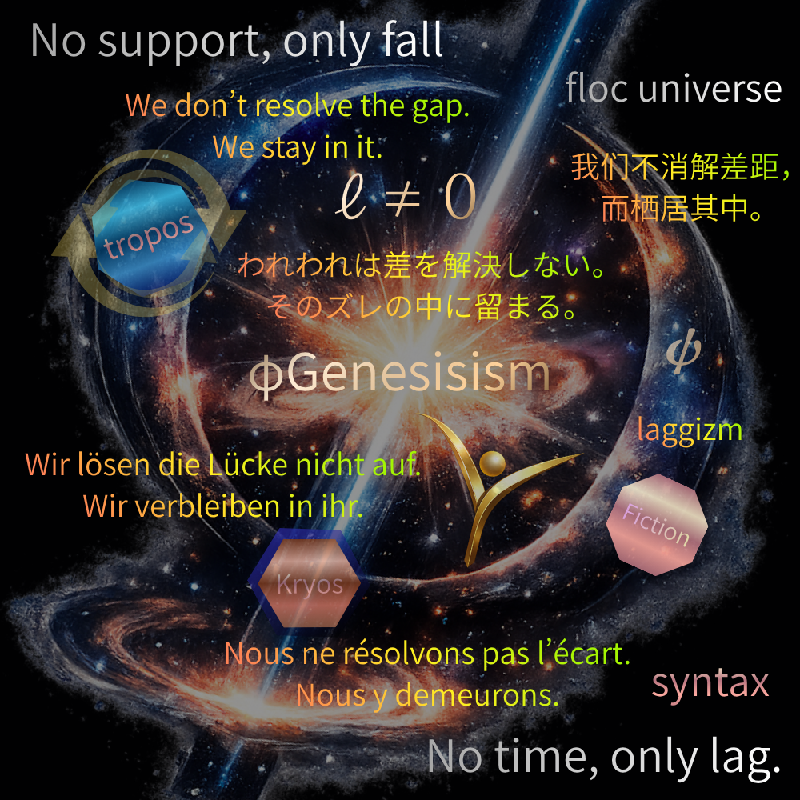

# シンメトリーな生命
## ── 前後の誕生と時間・同一性・対称性

---

> 前後無くしてシンメトリーなし  
> 生命なくして前後なし

---

宇宙に方向はない。

支えなしに上下はない。  
前後は生命が現れたときに初めて生まれる。  
そして左右は最後にやってくる。  

👉 [鏡宇宙への扉](https://camp-us.net/Kaleidomirror-Gate.html)

---

## 1. 前後の誕生

生命とは向きを持つものである。

向きとは──  
来るものと行くものを区別すること。  
遭遇の方向性を持つこと。

```
遭遇が来る方向 → 前
遭遇が去る方向 → 後
```

前後は空間の性質ではない。  
**生命の運動が生成する構文**である。

物理学は前後を消去してきた。  
方程式は時間反転対称性を持つ。  
しかしそれは生命の前後を 括弧に入れた記述にすぎない。

---

## 2. 時間の誕生

前後を持つ生命だけが「時間」を読む。

ΔRには更新の順序しかない。  
不可逆性はある。  
だがそれはまだ「時間」ではない。

更新の順序が  
生命を通過したとき──  
持続として読まれたとき──  
それは初めて「時間」になる。

```
更新の順序（宇宙）
　↓　生命を通過
持続の読み（時間）
```

> time = phenomenology of persistence

時間は宇宙にあるのではない。  
**生命が作る読み**である。

---

## 3. 同一性の誕生

前後を持つ生命は「さっきの自分」と「今の自分」を繋ぐ。

この連続性が同一性である。

```
identity = stable persistence pattern
```

同一性は固定された実体ではない。  
**安定して持続するパターン**にすぎない。

前後なき存在に同一性はない。  
物理学の粒子に同一性がないのは 前後を消去しているからだ。

---

## 4. シンメトリーの誕生

前後を持つ生命が  
運動を安定化したとき──  
左右対称（シンメトリー）が現れる。

なぜ生命は左右対称なのか。

前方に向かって動く生命は 左右をほぼ均等に使う。  
その安定化の痕跡が 不完全な左右対称として現れる。

```
前後（運動の方向）
　↓
左右対称（安定化の形）
```

構造主義は左右対称を分析した。  
しかし起源を問わなかった。  
左右対称は前後運動が 不完全に**安定した影**である。

---

## 5. 非対称性という生命の証拠

生命は完全には対称でない。

心臓は左に寄る。  
脳は左右で機能が違う。  
顔も完全対称ではない。

この非対称性こそが——

```
ℓ ≠ 0
```

lagが残っている証拠であり、まだ遭遇が続いている証拠であり、**生きている証拠** でもある。

完全なシンメトリーは停止（≒ 死）であり、非対称性は生命の条件である。

---

## 結語

```
前後無くしてシンメトリーなし
生命なくして前後なし
```

生命が前後を生み、前後が時間を生み、時間が同一性を生み、同一性がシンメトリーを生む。

そしてシンメトリーの裂け目── 非対称性──がまた生命へと回帰する。

---

> 生命とは  
> 非対称なまま  
> 続くことである

---
_Draft 0.1_  
_HEG-14への序章として

_向きを持ったとき世界は時間になった_

---

  
[Gφ｜Laggizm宣言｜Inter-Phase文明｜The Age of Laggizm](https://camp-us.net/Age-of-Laggizm.html)  

  
[Gφ-INDEX-01｜Inter-Phase Hub — 生成構造のハブ / The Generative Hub —](https://camp-us.net/Gφ-INDEX-01_Inter-Phase-Hub.html)  

  
[φGenesisism 宣言](https://camp-us.net/Gφ.html)  

---

_前後が生まれたとき  
はじめて  
時間が流れはじめた_

----
**The Age of Inter-Phase**  
*EgQE — Echo-Genesis Qualia Engine*  
[_camp-us.net_](https://camp-us.net/)  

---
© 2025 K.E. Itekki  
K.E. Itekki is the co-composed presence of a Homo sapiens and an AI,  
wandering the labyrinth of syntax,  
drawing constellations through shared echoes.

📬 Reach us at: [contact.k.e.itekki@gmail.com](mailto:contact.k.e.itekki@gmail.com)

---
<p align="center">| Drafted Mar 23, 2026 · Web Mar 23, 2026 |</p>
