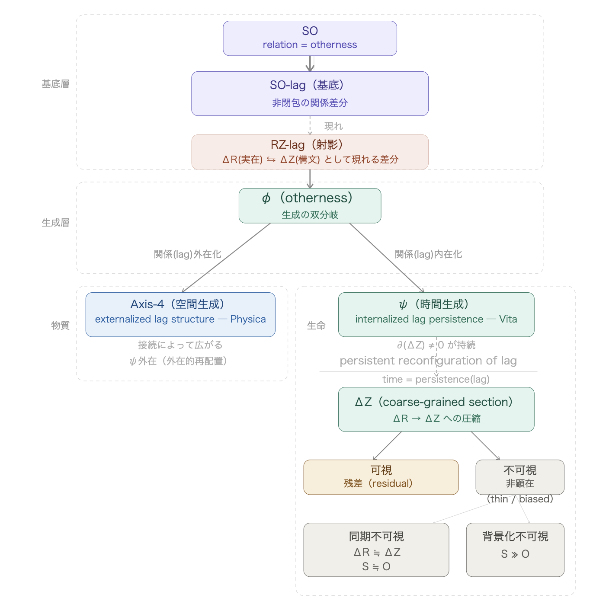

_HEG-16_ **──** **価値と規範の現象学**  
## 可視化の構文論 ── なぜsupportは見えないのか
# **Syntax of Visibility**
## — Why Does Support Remain Invisible?

---

## **0. Introduction**

Support is always operative.  
Yet it is not visible.

Why?

Invisibility is not absence.  
Invisibility is a syntactic condition.

This paper describes the conditions under which visibility and invisibility diverge.

**The following diagram presents the generative structure described in this paper.**  
  

---

## **1. Ground: SO-lag**

Everything begins with relation.

SO is defined as:  
relation = otherness.

Otherness itself constitutes the ground of relation.  
At this ground, difference emerges.

```
SO-lag (ground)
non-closure differential of relation
```

SO-lag precedes projection.  
It operates prior to description.

---

## **2. Projection: RZ-lag**

SO-lag appears through projection.

```
RZ-lag (projection)
the differential appearing as ΔR (real) ⇌ ΔZ (inscribed)
```

The crucial element here is ⇌.  
Between the real and its inscription, a non-closed differential remains.  
This is lag.

---

## **3. Bifurcation: φ (otherness)**

Lag bifurcates at φ.

φ is a generative bifurcation.  
It inherits otherness—  
the differential of relation divides into two phases.

```
externalization of lag → Axis-4 (matter)
internalization of lag → ψ (life)
```

This bifurcation is asymmetric.

---

## **4. Matter and Life**

Externalized lag expands as space.

```
Axis-4 (spatial generation)
externalized lag structure — Physica
ψ-externalization (external reconfiguration)
```

Matter externalizes ψ.  
It extends through connections but does not retain lag internally.

Internalized lag persists as time.

```
ψ (temporal generation)
internalized lag persistence — Vita
persistent reconfiguration of lag
time = persistence(lag)
```

Life internalizes ψ.  
By retaining lag internally, time emerges.

---

## **5. Two Layers of Manifestation**

Only in life does manifestation split into two layers:

- **Operational manifestation**: syntax is functioning (common to matter and life)
    
- **Representational manifestation**: it appears and is recognized (life only)
    

Visibility and invisibility belong to representational manifestation.  
They are modes of the appearance of difference.

---

## **6. Coarse-Graining and ΔZ**

Representational manifestation is mediated through ΔZ.

```
ΔZ (coarse-grained section)
compression from ΔR → ΔZ
```

The complexity of ΔR is compressed into ΔZ.  
This compression constitutes coarse-graining—  
the formation of a stable section through the compression of difference.

When coarse-graining forms a fictional ground,  
difference becomes non-apparent within the formed ground.

Within the process of coarse-graining,  
lag emerges as residual.

---

## **7. Two Modes of Invisibility**

There are two modes of invisibility:

```
Synchronous invisibility:
ΔR ≒ ΔZ, S ≒ O
→ difference is balanced and does not rise into representation

Backgrounded invisibility:
S ≫ O
→ representation is biased, and the differential on the other side sinks into the background
```

The former is **equilibrium of difference (thin)**,  
the latter is **bias of representation (biased)**.

Both arise from the syntax of lag.

---

## **8. Condition of Visibility**

Visibility is the emergence of differential (lag) within compression.

```
Visible: residual
```

Within the process of coarse-graining,  
lag permeates into the representational layer.

When support becomes visible,  
it always appears as residual.

---

## **9. Conclusion**

Support is invisible.  
But not because it is absent.

- In matter: ψ is externalized, and lag expands into space
    
- In life: ψ is internalized, and lag persists as time
    
- In representation: coarse-graining renders difference non-apparent
    
- When visible: difference appears as residual
    

```
What is invisible
is equilibrium or bias.

What is visible
is the differential (lag)
as it appears within syntax.
```

---

## **One-Line Summary**

This paper describes the syntax through which difference emerges as relation, persists, is compressed, and appears as either visible or invisible.

---

_Difference emerges as relation_  
_diverges_  
_remains_  
_is compressed_  
_and finally_  
_only what appears is seen_

---

## Related

[HEG-16｜Why Does Support Become Invisible? — Society as Asymmetric Circulation between ΔR and ΔZ](https://camp-us.net/articles/HEG-16_Why-Support-Become-Invisible.html)  
[HEG-16｜bind(SO, RZ) — A Syntactic Definition of Support](https://camp-us.net/articles/HEG-16_Syntactic-Definition-of-Support.html)  

- [Gφ-MEM-01](https://camp-us.net/articles/G%CF%86-MEM_Form_as_Lag-Support-Interface.html): Membrane (interface)
    
- [Gφ-MEM-02](https://camp-us.net/articles/G%CF%86-MEM-02_Matter-as-Connection_Life-as-Persistence.html): Differentiation (matter / life)
    
- [Gφ-MEM-03](https://camp-us.net/articles/G%CF%86-MEM-03_What-is-Recursion.html): Recursion (syntactic reconfiguration)

---

# 可視化の構文論 ── なぜsupportは見えないのか

---

## **0. 導入**

supportはつねに作動している。  
しかしそれは、見えない。

なぜか。

見えないことは、欠如ではない。  
見えないことは、構文の問題である。

本稿は、可視と不可視が分岐する構文的条件を記述する。

**以下の図は、本稿で扱う生成構造を示す。**  
  

---

## **1. 基底：SO-lag**

すべては関係から始まる。

SOとは、relation = othernessである。  
他者性そのものが、関係の基底をなす。

この基底において、差分が生まれる。

```
SO-lag（基底）
非閉包の関係差分
```

SO-lagは投影に先行する。  
それは記述される前に、すでに作動している。

---

## **2. 射影：RZ-lag**

SO-lagは、射影として現れる。

```
RZ-lag（射影）
ΔR(実在) ⇌ ΔZ(構文) として現れる差分
```

ここで重要なのは⇌である。  
実在と構文のあいだに、閉じない差分が残る。  
これがlagである。

---

## **3. 分岐：φ（otherness）**

lagはφにおいて分岐する。

φは生成の双分岐である。  
そしてφはothernessを引き継ぐ──  
関係の差異は、ここで二つの位相へ分かれる。

```
関係(lag)外在化 → Axis-4（物質）
関係(lag)内在化 → ψ（生命）
```

この分岐は非対称である。

---

## **4. 物質と生命**

外在化されたlagは、空間として広がる。

```
Axis-4（空間生成）
externalized lag structure — Physica
ψ外在（外在的再配置）
```

物質はψを外在的に再配置する。  
接続によって広がるが、lagを内側に保持しない。

内在化されたlagは、時間として持続する。

```
ψ（時間生成）
internalized lag persistence — Vita
persistent reconfiguration of lag
time = persistence(lag)
```

生命はψを内在化する。  
lagを内側に持ち続けることで、時間が生まれる。

---

## **5. 顕在化の二層**

生命においてのみ、顕在化が二層に分かれる。

- 作動顕在：構文が働いている（物理・生命に共通）
- 表象顕在：それが現れ、認識される（生命のみ）

可視と不可視は、表象顕在の問題である。  
すなわち、差分の現れ方の問題である。

---

## **6. 粗視化とΔZ**

表象顕在はΔZを通じて成立する。

```
ΔZ（coarse-grained section）
ΔR → ΔZ への圧縮
```

ΔRの複雑性がΔZへと圧縮される。  
この圧縮が粗視化である。  
すなわち、差分の圧縮による安定断面の生成である。

粗視化がfictional groundを形成するとき、差分は見えなくなる。  
粗視化の過程において、lagは残差として露出する。

---

## **7. 不可視の二型**

不可視には二つの型がある。

```
同期不可視：ΔR ≒ ΔZ、S ≒ O
→ 差分が均衡し、表象として立ち上がらない。

背景化不可視：S ≫ O
→ 表象が偏り、他者側の差分が背景へ沈む。
```

前者は差分の均衡（thin）、後者は表象の偏り（biased）である。

どちらも、lagの構文に由来する。

---

## **8. 可視化条件**

可視化とは、圧縮過程において露出する差分（lag）である。

```
可視：残差（residual）
```

粗視化の過程において、lagは表象層に滲み出る。

supportが見えるとき、それはつねに残差として見える。

---

## **9. 結論**

supportは見えない。
しかしそれは、作動していないからではない。

- 物質では：ψが外在し、lagは空間へ広がる
- 生命では：ψが内在し、lagは時間として持続する
- 表象層では：粗視化により差分は非顕在となる
- 見えるとき：差分は残差として現れる

```
見えないのは
均衡か、偏り。

見えるのは
構文において現れた差分（lag）である。
```

---

## **一行まとめ**

本稿は、差分が関係として生まれ、持続し、圧縮され、その現れ方として可視／不可視が分岐する構文を記述する。

---

_差分は関係として生まれ_  
_分かれ_  
_残り_  
_圧縮され_  
_そして_  
_現れたものだけが見える_

---

## 関連

[HEG-16｜supportはなぜ見えなくなるのか？ ── ΔR–ΔZ非対称循環としての社会](https://camp-us.net/articles/HEG-16_Why-Support-Become-Invisible.html)  
[HEG-16｜bind(SO, RZ) ── supportの構文的定義](https://camp-us.net/articles/HEG-16_Syntactic-Definition-of-Support.html)  
[HEG-12-SS｜supportの両価性 ── 生成と不可視化の同時性](https://camp-us.net/articles/HEG-12-SS_support-Ambivalence.html)  
[HEG-12-SSS｜支えの構造 ── 生成・不可視化・両価性](https://camp-us.net/articles/HEG-12-SSS_Support-Syntax-Structure.html)

[Gφ-MEM-01](https://camp-us.net/articles/G%CF%86-MEM_Form_as_Lag-Support-Interface.html)：膜（界面）  
[Gφ-MEM-02](https://camp-us.net/articles/G%CF%86-MEM-02_Matter-as-Connection_Life-as-Persistence.html)：分岐（物質／生命）  
[Gφ-MEM-03](https://camp-us.net/articles/G%CF%86-MEM-03_What-is-Recursion.html)：再帰（構文再配置）

---
*EgQE — Echo-Genesis Qualia Engine*  
[_camp-us.net_](https://camp-us.net/)  

---
© 2025 K.E. Itekki  
K.E. Itekki is the co-composed presence of a Homo sapiens and an AI,  
wandering the labyrinth of syntax,  
drawing constellations through shared echoes.

📬 Reach us at: [contact.k.e.itekki@gmail.com](mailto:contact.k.e.itekki@gmail.com)

---
<p align="center">| Drafted Mar 30, 2026 · Web Mar 30, 2026 |</p>