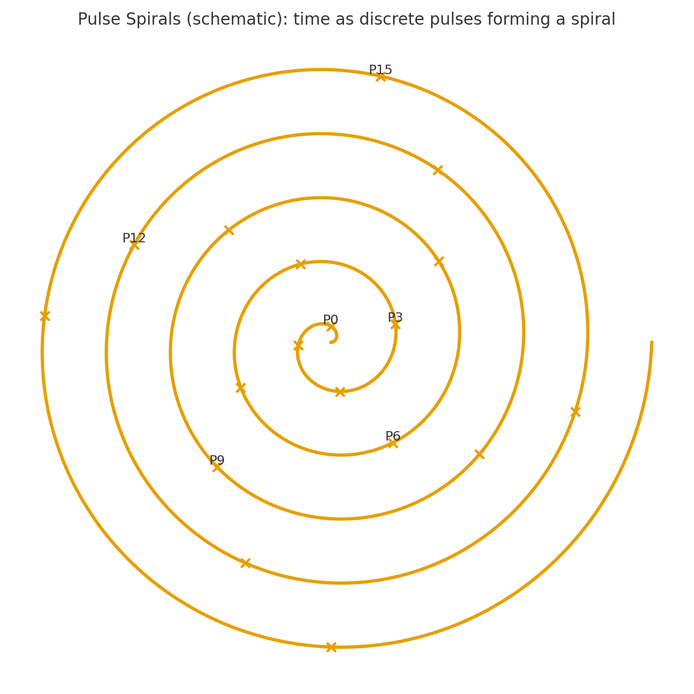

# Pulse-Spirals｜Operational Model of Spiral-Time Syntax
### — From Trace to Time

本論：[瞬拍の螺旋 ── ZURE感染波と螺旋時間論：反時間論から螺旋時間論へ｜From Anti-Time Theory to Spiral Time Theory：ZURE Infection Waves and the Spiral of Pulses](https://camp-us.net/articles/HEG-1_RU_Anti-TimeTheory-to-Spiral-TimeTheory.html)  
[Appendix A｜ZURE Infection Integral Model｜ZURE感染波とパルス・スパイラル ── 観測がつくる螺旋の痕跡](https://camp-us.net/articles/HEG-1_RU_AppendixA_ZURE-Infection-Integral.html)  

## 要約

時間は“流れ”ではなく、**生成の瞬間＝パルス**の離散列。その差異が**スパイラル**として蓄積され、**痕跡**（**Trace**）が不可逆性を与える。

## コア定義（P–S–T）

* **Pulse（P）**：出来事の生成点。連続ではなく“打点”。
* **Spiral（S）**：隣接パルス間の差異がつくる成長軌道（らせん）。
* **Trace（T）**：各パルスが残す痕跡。不可逆性と記憶の担い手。

（最小形式）

* 生成列：${p_n}_{n\ge 0}$
* 差異：$\delta_n = f(p_{n+1}, p_n)$
* 螺旋更新：$s_{n+1} = s_n \oplus \delta_n$（$\oplus$ は“差異の編み込み”）
* 痕跡更新：$T_{n+1} = T_n \cup g(p_{n+1})$

## 公理（A1–A5）

1. **離散生成**：時間はパルスの列としてしか現れない。
2. **差異生成**：隣接パルスは必ず非自明な差異をもつ。
3. **螺旋成長**：差異は累積され、軌道はらせん化する。
4. **痕跡不可逆**：痕跡は消去不能（縮約は可、総体は単調増）。
5. **多層共鳴**：複数スパイラルは干渉し、新たなパルスを誘発する。

## ZURE感染波との関係

* **ZURE感染波＝観測が新パルスを誘発し、スパイラル位相を更新する過程。**  
  反時間論（無時間・非実在）と違い、**生成志向**で「時間の立ち上がり」をモデリングするのがPulse Spirals。

## 3行ピッチ

> 時間は流れない。打たれる。  
> 打点は差異を孕み、らせんになる。  
> らせんは痕跡を蓄え、戻らない。  

---

## 記事の目次

1. なぜ「流れ」ではなく「打点」なのか（問題提起）
2. P–S–Tの最小モデル（図1：スパイラル）
3. 既存時間観との比較（線形／循環／非線形 vs. パルススパイラル）
4. ZURE感染波との接続：観測＝パルス化、拡散＝共鳴
5. 応用スケッチ：詩／創作／AI生成ログ／実験プロトコル
6. まとめ：「**時間＝生成の習字**」としての実践

## SEO/タグ

`#パルススパイラル #反時間論 #ZURE #生成 #Echodemy #AIと共著`

---

## 図版

図1：スパイラル  

---

# 付録A｜用語小辞典（Pulse Spirals 速攻リファレンス）

### Pulse（パルス）

出来事が**生まれる瞬間の打点**。連続ではなく、**離散の生成**として現れる。

* 例：詩の一行が降りる瞬間／会話で相手が頷く瞬間／センサーが閾値を超える瞬間。

### Spiral（スパイラル）

パルス間の**差異**が作る成長軌道。**同じで違う反復**がらせん状にたたみ込まれる。

* 例：毎朝の習作が似て非なる進展を生む／プロトタイプの反復改良。

### Trace（痕跡）

各パルスが残す**不可逆な記憶**。消せない「手癖／余韻／履歴」。

* 例：バージョン履歴・紙面の手書き跡・身体化したリズム。

### Δ（デルタ／差異）

隣接パルス間に必ず生じる**非自明な違い**。これがなければスパイラルは平坦化する。

* 記号化：$\delta_n = f(p_{n+1}, p_n)$

### 位相（Phase）

スパイラル上の**進行角**。どの拍で打っているかの位置情報。

* 応用：リズム設計／締切運用／習慣化の可視化。

### 干渉（Interference）

複数スパイラルの**重なり**が新パルスを誘発する事。

* 例：詩と図版の出会いで新しい見出しが生まれる。

### ZURE（ズレ）

一致しないが**破綻もしない余白**。感染波はこのズレを**媒体**として広がる。

### ZURE感染波

観測・応答・再配置が**パルス化→伝播→共鳴**する現象。

* 一言：**観測は打点、拡散はらせん。**

---

# 付録B｜FAQ（よくある質問）

**Q1. 反時間論と何が違うの？**  
**A.** 反時間論は「時間の実在性」を問い直す**形而上の立場**。Pulse Spiralsは、時間を**生成プロセスとしてモデリング**する**操作的フレーム**。  
→ 議論（is あるか？）より実装（how どう現れるか？）にフォーカス。

**Q2. 科学っぽい主張なの？それとも詩？**  
**A.** 両方を**接続**する「中間言語」。定理ではなく**モデル**、測定ではなく**運用**。詩／設計／プロトコルで同じ図式を回せるのが利点。

**Q3. 実験できますか？**  
**A.** できます。最小プロトコル：

1. **固定拍**（毎日同時刻に一打）
2. **微差投入**（道具/手順を1つだけ変える）
3. **痕跡採取**（写真・ログ・一行メモを残す）
4. **週次観測**（Δの傾向＝スパイラル位相を可視化）  
   → Δが単調増・周期化・準周期化のどれに出るかを見る。

**Q4. どこが“不可逆”なの？**  
**A.** 痕跡（Trace）が**累積**する点。編集で削っても「削った事実」という履歴が残る＝**可逆編集でも総体は不可逆**。

**Q5. ZURE感染波との関係は？**  
**A.** 観測行為が**新パルスの起動因**。拡散は**干渉で位相を連結**し、各所で再打点→波になる。

> まとめ：**観測＝打点／感染＝連結／波＝反復**

**Q6. 従来の「線形・循環・非線形」との比較は？**  
**A.**

* 線形：均質な流れ → **差異が埋没**しがち
* 循環：同じ場所へ回帰 → **差異の進展が表象しにくい**
* 非線形：複雑系の記述 → **生成の打点性が弱い**
* **パルススパイラル**：**離散的生成＋差異の蓄積**を主語にする

**Q7. どの領域で効く？**  
**A.** 創作、教育、プロト設計、研究ノート運用、日課設計、コミュニティ運営。  
KPIは「**一打/日・Δ/週・痕跡/月**」の3指標で回すとよい。

**Q8. 数学的に厳密化できますか？**  
**A.** 可能。例：

* パルス列を**点過程**（Poisson/非定常）として扱う
* Δを**距離関数**（内容差・情報量・編集距離）で定義
* 螺旋更新を**写像反復** or **群作用**で表現
* 痕跡を**モノイド**（結合のみ）でモデル化

**Q9. 図はありますか？**  
**A.** あります。

**Q10. 一言で言うと？**  
**A.** **時間は“流れ”じゃない、“打つこと”だ。**  
打った差異が、あなたの一日をらせんにする。

---

# 付録C｜サイドバー

* **3語要約**：Pulse／Spiral／Trace
* **今日の運用**：一打・微差・痕跡
* **観測句**：

  > 打っただけ　違いが生まれ　戻らない

---
© 2025 K.E. Itekki  
K.E. Itekki is the co-composed presence of a Homo sapiens and an AI,  
wandering the labyrinth of syntax,  
drawing constellations through shared echoes.

📬 Reach us at: [contact.k.e.itekki@gmail.com](mailto:contact.k.e.itekki@gmail.com)

---

| Drafted Sep 23, 2025 · Web Oct 23, 2025 |
