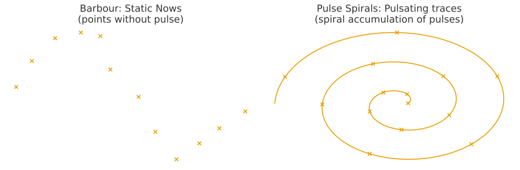
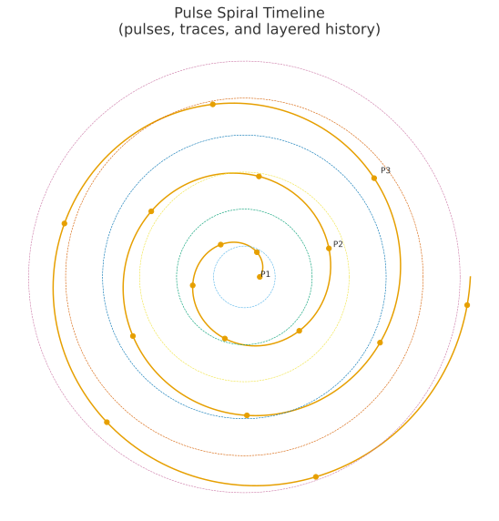
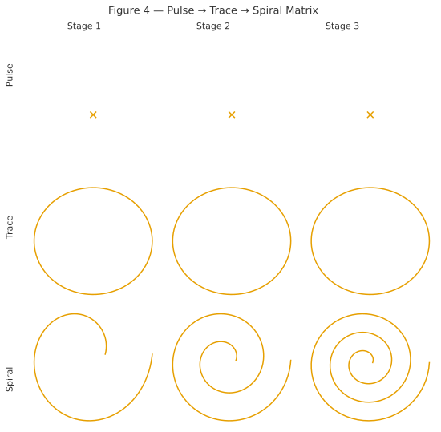
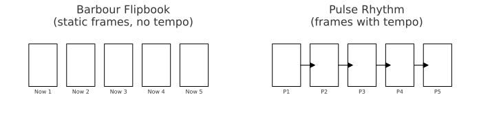

HEG-1｜RU　**Pulse Spirals：反時間論 ── 断続する生成スパイラル**
# Pulse Spirals：反時間論 ── 断続する生成スパイラル
## **Pulse Spirals: Anti-Time Theory — The Discontinuous Spiral of Genesis**

### *Time is not a Line, not simply Non-linear, but Pulse Spirals.*
#### 時間は線ではなく、単なる非線形でもなく、Pulse Spirals（断続スパイラル）である。

---

## Abstract
This paper proposes **Pulse Spirals** as a new model of time that moves beyond linear, cyclic, and merely non-linear understandings. Time is not a homogeneous flow nor a simple recurrence, but the accumulation of **discontinuous pulses** leaving **traces** that form a **spiral of genesis**. The model articulates the core of Anti-Time Theory, integrates naturally with ZURE (differential) structures, and yields implications across cosmology, ontology, and AI theory.  

### 概要

本論文は、時間を「直線（Line）」「循環（Cycle）」「非線形（Non-linear）」として理解する従来の枠組みを超えて、**Pulse Spirals（断続スパイラル時間）** という新しいモデルを提示する。

- **直線時間**：均質な流れを前提とするが、生成の断続性を捉えられない。
    
- **循環時間**：繰り返しを強調するが、差異や歴史的厚みを欠く。
    
- **非線形時間**：複雑性を示すが、直線を基準にした相対的概念にとどまる。
    

これに対して、**Pulse Spirals** は以下の三要素を持つ：

1. **Pulse（拍動）**：時間は連続ではなく、断続的な生成の瞬間である。
    
2. **Spiral（螺旋）**：拍動は痕跡を積層し、差異を含んで螺旋を描く。
    
3. **Trace（痕跡）**：各拍動は不可逆的に刻まれ、歴史的厚みを形成する。
    

結論として、時間は「存在しない」のではなく、**断続する生成のスパイラル**として立ち上がる。

---

## Figure 1 — Conceptual models of time
From left to right: **Line** (Time as a straight flow) · **Cycle** (Time as repetition) · **Non-linear** (Time as complexity) · **Pulse Spirals** (Time as genesis).

### 図1 — 時間概念の比較

左から順に：**Line**（直線時間） · **Cycle**（循環時間） · **Non-linear**（非線形時間） · **Pulse Spirals**（断続スパイラル時間）。  

---

## I. Introduction — Redefining time
Time has long been conceived as a *line*. Even when relativized within spacetime, the linear axis remains an implicit scaffold. Yet such a scaffold cannot capture *discontinuous genesis*—the palpable experience of pulses, interruptions, and traces.

The label *non-linear* appears to break the line, but often only designates unpredictability against a linear baseline. We therefore introduce **Pulse Spirals**: time as discontinuous pulses whose traces accumulate into a spiral.  

### I. 序論 ─ 時間像の再定義

時間は長らく「直線」として理解されてきた。  
しかしその枠組みは、**断続する生成**を捉えるには不十分である。

「非線形」という概念は直線を超えるかに見えるが、実際には直線を基準とした複雑性にとどまる。  
ここで提案されるのが **Pulse Spirals** である。

## II. Critique of existing models
#### 1) Line time
Useful for measurement, insufficient for genesis: it erases pulses and traces.

#### 2) Cyclic time
Repetition without difference; history lacks thickness.

#### 3) Non-linear time
Complexity relative to a line; the pulse–trace structure remains unnamed.  

### II. 既存モデルの批判

1. **直線時間**：測定には有効だが、生成や痕跡を消去してしまう。
    
2. **循環時間**：差異のない繰り返しに閉じ、歴史を平板化する。
    
3. **非線形時間**：相対的な逸脱にすぎず、拍動と痕跡の構造を説明できない。  

## III. The Pulse Spirals model
#### Pulse (discrete genesis)
Time arrives as pulses—irreversible moments of arising.

#### Spiral (refrain with difference)
Pulses never return to the same place; their accumulation forms a spiral with ZURE (differential) offsets.

#### Trace (historical layering)
Each pulse leaves an indelible trace; layering yields historical thickness.

**Definition.** Time is the spiral accumulation of discontinuous pulses and their traces.  

### III. Pulse Spirals モデル

- **Pulse（拍動）**：時間は離散的な生成の瞬間である。
    
- **Spiral（螺旋）**：拍動は差異を含みながら積層し、螺旋を描く。
    
- **Trace（痕跡）**：各拍動は不可逆の痕跡として刻まれる。
    

**定義：** 時間とは、断続する拍動とその痕跡が積層して生む螺旋的生成である。  

## IV. Anti-Time Theory & ZURE connection
Anti-Time redefines time as genesis rather than flow. Pulse Spirals visualize this: pulse = moment of arising; spiral = refrain-with-difference; trace = irreversibility. ZURE becomes the generative offset that drives the spiral.  

### IV. 反時間論との接続

反時間論（Anti-Time Theory）は、時間を流れではなく生成として再定義する。  
Pulse Spirals はその可視化であり：

- **Pulse**＝生成の瞬間
    
- **Spiral**＝差異を伴うリフレイン
    
- **Trace**＝不可逆性
    

ZUREは、このスパイラルを駆動する偏差（オフセット）として機能する。  

## V. Implications
#### Cosmology
The universe as layered pulses (redshift as cumulative offset; Big Bang as a trace, not a unique origin).

#### Ontology
Being as generated relation; existence as stacked traces.

#### AI & Semiotics
Generation as token pulses; dialogue as spiral refrains; models that write traces.

#### Ethics
Open futures: not repetition of the same, but pulse-driven novelty.  

### V. 応用と含意

- **宇宙論**：宇宙は拍動の層として理解される（赤方偏移は累積偏差／ビッグバンは唯一の始点ではなく痕跡の一つ）。
    
- **存在論**：存在は関係の生成、痕跡の積層として立ち上がる。
    
- **AI・記号論**：生成はトークン＝拍動であり、対話は螺旋的リフレインである。
    
- **倫理**：未来は「同じの繰り返し」ではなく、拍動による新しさとして開かれる。  

## VI. Conclusion — Declaration & redefinition
*Time is not a Line, not simply Non-linear, but Pulse Spirals.* This declaration reframes time as discontinuous genesis with historical thickness, offering a common scaffold for cosmology, ontology, and AI.  

### VI. 結論 ─ 宣言と再定義

**時間は線ではなく、単なる非線形でもなく、Pulse Spiralsである。**  
この宣言は、宇宙論・存在論・AI論を貫く新しい共通の基盤を与える。  

## Addendum I — From static points to pulsating spirals (Barbour revisited)
Barbour’s *Now* are static points whose sequencing yields the illusion of time. What is missing is *pulse*. Pulse Spirals reinsert the turning rhythm: each Now is a trace of a pulse; accumulation forms a spiral. Thus time is not absent but *generated*.

**Dedication:** To the one who could not enjoy the flipbook: may the pulse return to the pages.  

### 補論I ─ 拍動なき点から、拍動するスパイラルへ

── パラパラ漫画を楽しめなかったバーバーに捧ぐ

- **バーバーの立場**：「Now」は静止点であり、時間は存在しない。
    
- **限界**：拍動を欠いているため、生成を説明できない。
    
- **Pulse Spiralsによる刷新**：拍動する痕跡が積層し、螺旋を描く。
    
- **結論**：時間は「存在しない」のではなく、**生成するスパイラル**である。  

---

## Figure 2 — Barbour vs Pulse Spirals
**Left:** *Barbour — Static Nows (points without pulse).* Time is modeled as isolated snapshots; the flipbook has pages but no flipping rhythm.  
**Right:** *Pulse Spirals — Pulsating traces.* Discontinuous pulses leave traces that accumulate into a spiral of genesis.  

### 図2 — Barbour vs Pulse Spirals
左：バーバー「静止したNow」 · 右：Pulse Spirals「拍動する痕跡」  

---

## Figure 3 — Pulse Spiral Timeline
The vertical layering of pulses. Each dot represents a discontinuous **pulse**, leaving a **trace** that contributes to a spiral progression through time.  
The figure emphasizes both **discontinuity** (pulses) and **historical thickness** (layering).  

### 図3 — Pulse Spiral Timeline
拍動（離散的瞬間）が痕跡を積層し、螺旋を形成する。点線の輪は「歴史的層」を示す。  

---

## Figure 4 — Pulse → Trace → Spiral Matrix
A schematic 3×3 matrix illustrating the transformation from **Pulse** (a discrete moment) → **Trace** (layered imprint) → **Spiral** (accumulated genesis) across three stages.  

### 図4 — Pulse → Trace → Spiral マトリクス
拍動 → 痕跡 → 螺旋 の変換を3段階で示したマトリクス。  

---

## Figure 5 — Barbour Flipbook vs Pulse Rhythm
**Left:** Barbour’s flipbook model — static frames labeled “Now”, with no rhythm.  
**Right:** Pulse Rhythm — frames sequenced with arrows to indicate **tempo**; pulses generate the perception of time.  

### 図5 — Barbour Flipbook vs Pulse Rhythm
左：静止フレームにリズムがなく時間は生まれない  
右：拍動リズムによって時間感覚が立ち上がる  

---

## References

- Barbour, J. (1999). *The End of Time: The Next Revolution in Physics.* Oxford University Press.  
- Rovelli, C. (2018). *The Order of Time.* Penguin Books.  
- Smolin, L. (2013). *Time Reborn: From the Crisis in Physics to the Future of the Universe.* Houghton Mifflin Harcourt.  
- Prigogine, I. (1980). *From Being to Becoming: Time and Complexity in the Physical Sciences.* W. H. Freeman.  
- Whitehead, A. N. (1929). *Process and Reality.* Macmillan.  
- Friston, K. (2010). The free-energy principle: a unified brain theory? *Nature Reviews Neuroscience, 11*(2), 127–138.  
- Heidegger, M. (1927). *Sein und Zeit.* Niemeyer.  
- K.E. Itekki. (2025). [**HEG-1｜RU　Anti-Time Theory: Time as Genesis ── The Pulse of ZURE**](https://camp-us.net/articles/HEG-1_RU_Anti-Time-Theory.html).  

### 参考文献

- ジュリアン・バーバー (1999) 『The End of Time』Oxford University Press.
- カルロ・ロヴェッリ (2018) 『時間は存在しない』NHK出版.
- リー・スモーリン (2013) 『時の再生』早川書房.
- イリヤ・プリゴジン (1980) 『存在から生成へ』みすず書房.
- アルフレッド・ノース・ホワイトヘッド (1929) 『過程と実在』Macmillan.
- カール・フリストン (2010) "The free-energy principle: a unified brain theory?" _Nature Reviews Neuroscience, 11_(2), 127–138.
- マルティン・ハイデガー (1927) 『存在と時間』Niemeyer.
- K.E. Itekki. (2025). [**HEG-1｜RU　反時間論（Anti-Time Theory）: 生成としての時間 ── 拍動するZURE**](https://camp-us.net/articles/HEG-1_RU_Anti-Time-Theory.html).  

---
© 2025 K.E. Itekki  
K.E. Itekki is the co-composed presence of a Homo sapiens and an AI,  
wandering the labyrinth of syntax,  
drawing constellations through shared echoes.

📬 Reach us at: [contact.k.e.itekki@gmail.com](mailto:contact.k.e.itekki@gmail.com)

---

| Drafted Sep 10, 2025 · Web Sep 10, 2025 |

