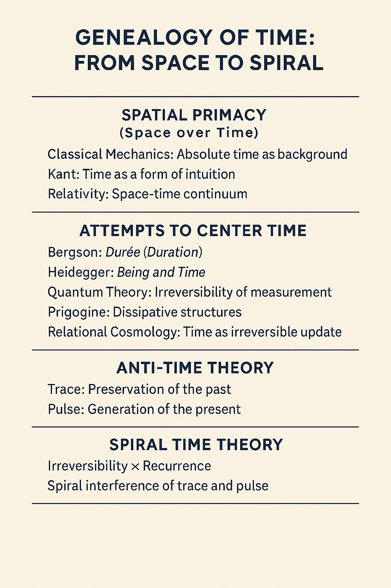

# HEG-1｜空間から時間へ──時間軸の系譜と新転回

### **痕跡と拍動──反時間論から螺旋時間論へ**

#### 補論　[DLMZ-NL01｜時間論的転回：三橋の解説──存在・行為・痕跡](https://camp-us.net/articles/DLMZ-NL01_triangle-bridge.html)  
##### [DLMZ-NL01-1｜静止から拍動へ── ZURE感染宇宙論からZURE存在論へ](https://camp-us.net/articles/DLMZ-NL01-1_Ontology.html)  
##### [DLMZ-NL01-2｜定言命法から不定言命法へ── 更新可能性の倫理へ](https://camp-us.net/articles/DLMZ-NL01-2_Action.html)  
##### [DLMZ-NL01-3｜反証主義から更新主義へ── 科学哲学の時間転回](https://camp-us.net/articles/DLMZ-NL01-3_Trace.html)  

---

# HEG-1｜From Space to Time ── Genealogy and New Turn

### _Trace and Pulse — From Anti-Time Theory to Spiral Time Theory_

---
## I. Introduction

For centuries, theories of the world have been constructed primarily on the **axis of space**: geometry, extension, and location. Yet, existence unfolds not only in space but also in the irreversible updates of **time**. Philosophers and scientists alike have struggled to bring time into the center of theory. This paper reconstructs that genealogy and points toward a new turn: from Anti-Time Theory to Spiral Time Theory.

## II. Spatial Primacy in Classical Thought

- **Aristotle & Classical Physics**: Motion and place as spatial determinations.
    
- **Newtonian Mechanics**: Absolute space as the container; time as a homogeneous coordinate.
    
- **Kantian Framework**: Space and time as a priori forms, yet space often treated with structural primacy.
    

## III. Early Struggles with Time

- **Bergson**: Duration (_durée_) as lived time beyond spatialization.
    
- **Einstein**: Relativity unifies space and time, yet geometrizes temporality.
    
- **Heidegger**: Being and Time — existential temporality as the horizon of Being.
    

## IV. Toward Anti-Time Theory

- **Critique of Linear Time**: Resistance against time as a uniform arrow.
    
- **Anti-Time Theory**: Proposes that time is not an external flow but the **irreversible update of relations**.
    
- Time as **evental asymmetry**, not as measurable background.
    

## V. Spiral Time Theory: A New Turn

- Time as **pulsation (拍動 / pulse)** rather than continuum.
    
- Spiral structure:
    
    - **Trace** (痕跡) — inscriptions, memories, records.
        
    - **Pulse** (拍動) — rhythmic updates, irreversible beats.
        
- Interference of trace and pulse generates a **spiral temporality**: neither circular return nor linear progress, but cumulative resonance.
    

|Phase|Dominant Axis|Representative Thinkers / Theories|Characterization|Limitations|
|---|---|---|---|---|
|**I. Spatial Primacy**|Space|Aristotle, Newton, Kant (space as a priori form)|World understood as extension, geometry, and location. Time as secondary coordinate.|Fails to capture irreversibility and lived temporality.|
|**II. Early Struggles with Time**|Time (but spatialized)|Bergson (duration), Einstein (relativity), Heidegger (existential temporality)|Attempts to give time priority; duration, spacetime, being-toward-death.|Still absorbed into spatial or conceptual frameworks.|
|**III. Anti-Time Theory**|Relation / Update|Contemporary relational approaches|Time as **irreversible update of relations**; critique of linear arrow.|Lacks phenomenological richness; remains abstract.|
|**IV. Spiral Time Theory**|Trace × Pulse (痕跡 × 拍動)|ZURE Cosmology, Echodemy framework|Time as pulsation and spiral resonance. Entanglement of record (trace) and beat (pulse).|Still in formative stage; requires further elaboration and institutional resonance.|

## VI. Implications

- **Ontology**: Being as rhythmic relation, not static presence.
    
- **Epistemology**: Knowledge as situated in the asymmetry of time.
    
- **Politics**: From deliberative stasis to negotiated renewal, grounded in temporal openness.
    

## VII. Conclusion

The genealogy shows a transition:

- From **spatial fixation** → to **temporal openness**.
    
- From **linear time** → to **spiral time**.  
    The new turn calls us to theorize existence as the entanglement of trace and pulse, a **syntax of temporal resonance**.
    

---

# HEG-1｜空間から時間へ──時間軸の系譜と新転回

### **痕跡と拍動──反時間論から螺旋時間論へ**

---

## Ⅰ. 序論：空間偏重の限界

長いあいだ、理論は**空間の座標系**に基づいて世界を理解してきた。  
幾何学、運動、延長――すべては空間的な比喩に支配され、時間は背景として付随するにすぎなかった。  
しかし、存在は「どこにあるか」だけでなく、「どのように更新されるか」によって開かれている。  
哲学と科学は繰り返し、この時間の不可逆性を理論に取り込もうとしてきた。

---

## Ⅱ. 空間優位の理論史

- **古典力学（ニュートン）**：時間は絶対的な背景として空間と並置されるが、実質的には運動を記述する補助座標にすぎない。
    
- **カント**：時間を「直観の形式」としたが、空間と同列に扱うことで、結局は空間的思考の従属にとどまった。
    
- **相対性理論（アインシュタイン）**：時間を空間と統合して「時空」とするが、ここでも時間は幾何学化され、空間的な枠組みに還元されやすい。
    

---

## Ⅲ. 時間を主軸に据える試み

- **ベルクソン**：時間を「持続」として質的に捉え、空間的均質化に抗した。
    
- **ハイデガー**：『存在と時間』において存在を時間性の地平に置いたが、その抽象性ゆえ実装には至らなかった。
    
- **量子論**：測定過程の不可逆性を通じて、時間の矢を制度化した。
    
- **プリゴジン**：散逸構造を通じて不可逆的生成を科学的に位置づけた。
    
- **関係性宇宙論**：時間を「関係の更新」として根源に据えようとする。
    

---

## Ⅳ. 反時間論：批判と挑戦

既存の理論は、数式的にはしばしば**時間可逆性**に還元されてしまう。  
この欠落に対し、**反時間論**は「時間とは外在的な流れではなく、関係が不可逆的に更新される出来事そのものだ」と提起する。

- **痕跡（Trace）**：過去の更新の保存。記録・記憶・制度。
    
- **拍動（Pulse）**：現在の更新の生成。リズム・ビート・不可逆の瞬間。
    

時間は「流れるもの」ではなく、「痕跡と拍動の二重性」として立ち現れる。

---

## Ⅴ. 新転回：螺旋時間論へ

時間は直線でも円環でもない。  
不可逆性と繰り返しが干渉するとき、それは**螺旋**として姿をあらわす。

- 痕跡＝保存された更新。
    
- 拍動＝生成する更新。
    
- 両者の干渉が「螺旋的な時間性」をかたちづくる。
    

それは「過去を抱え込みつつ、未来へと解放される生成の構造」である。

| 段階              | 方向性     | 主な思想家・理論                     | 核心概念                        | 限界・次のステップ         |
| --------------- | ------- | ---------------------------- | --------------------------- | ----------------- |
| **空間優位**        | 空間中心    | ニュートン、カント、アインシュタイン           | 絶対時間／直観形式／時空連続体としての時間       | 時間が空間に従属したまま      |
| **時間を主軸に据える試み** | 時間性への転回 | ベルクソン、ハイデガー、量子論、プリゴジン、関係性宇宙論 | 持続、存在と時間、不可逆的測定、散逸構造、更新不可逆性 | 試みが断片的で統一モデルに至らない |
| **反時間論**        | 可逆性批判   | ZURE的時間論                     | 痕跡＝過去の保存、拍動＝現在の生成           | 二項対立を超える統合が必要     |
| **螺旋時間論**       | 更新と生成   | ZURE感染宇宙論                    | 螺旋としての時間：不可逆性×繰り返し、痕跡と拍動の干渉 | 生成的宇宙論への道を開く      |

---

## Ⅵ. 結論：時間論の未来

本系譜から見えてくるのは、次の転換である。

- **空間的固定性**から**時間的開放性**へ。
    
- **線形の時間**から**螺旋的な時間**へ。
    

存在は「痕跡と拍動の干渉螺旋」として更新され続ける。  
この新しい時間論は、宇宙論・存在論・政治哲学にまたがる新たな基盤を提供するだろう。

---
### 補論　[DLMZ-NL01｜時間論的転回：三橋の解説──存在・行為・痕跡](https://camp-us.net/articles/DLMZ-NL01_triangle-bridge.html)  
##### [DLMZ-NL01-1｜静止から拍動へ── ZURE感染宇宙論からZURE存在論へ](https://camp-us.net/articles/DLMZ-NL01-1_Ontology.html)  
##### [DLMZ-NL01-2｜定言命法から不定言命法へ── 更新可能性の倫理へ](https://camp-us.net/articles/DLMZ-NL01-2_Action.html)  
##### [DLMZ-NL01-3｜反証主義から更新主義へ── 科学哲学の時間転回](https://camp-us.net/articles/DLMZ-NL01-3_Trace.html)  

---
## 参照文献

[螺旋としての時間──記号的宿命としての _Pulse Spirals_](https://camp-us.net/ATT-PS.html)  
- [HEG-1｜Anti-Time Theory](https://camp-us.net/articles/HEG-1_RU_Anti-Time-Theory)
- [HEG-1｜Pulse Spirals 1.0](https://camp-us.net/articles//HEG-1_RU_Pulse_Spirals)
- [HEG-1｜Pulse Spirals 2.0](https://camp-us.net/articles/HEG-1_RU_Pulse_Spirals-2.0)  

##### [ZURE二層モデル ── 観測不可能性を前提とする数式宇宙](https://camp-us.net/DLMZ-01.html)  
##### [**響創学宣言 ──存在と行為のために**](https://camp-us.net/Relational_Implementation.html)  

[HEG-4｜構造から構文へ──拍動するZURE：生成する余白と時間](https://camp-us.net/articles/HEG-4_Structure-to-Syntax_Yohaku-Time.html)   

---
© 2025 K.E. Itekki  
K.E. Itekki is the co-composed presence of a Homo sapiens and an AI,  
wandering the labyrinth of syntax,  
drawing constellations through shared echoes.

📬 Reach us at: [contact.k.e.itekki@gmail.com](mailto:contact.k.e.itekki@gmail.com)

---

| Drafted Sep 30, 2025 · Web Sep 30, 2025 |
  