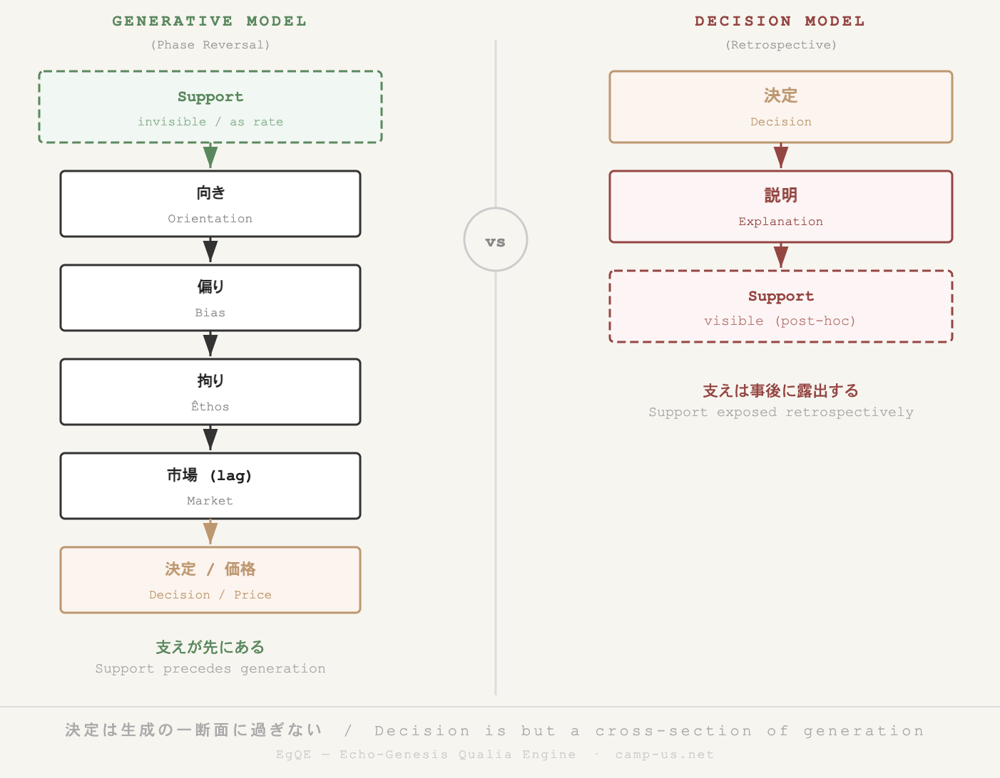

_**HEG-20｜Generative Political Theory** — Before Time —_  
### 🪐 HEG-20｜決定モデルから生成モデルへ
#### ── 支えの不可視化と価値生成の現象学
# From Decision to Generation
## The Invisibilization of Support and a Phenomenology of Value Formation

---

### **Abstract**

This paper reconfigures decision theory by reversing its retrospective framework and proposing a generative model of value formation. Rather than treating decision as the origin, it is reconceived as a cross-section of prior processes: orientation (non-coincidence between event and embodiment), bias (distributed responses), êthos (persistence through repetition), support (conditions that become invisible), and market (the exposure of lag distribution). This phase reversal situates support not as an explanatory category after outcomes, but as a generative condition prior to them. The framework yields three implications: the subject as orienting rather than choosing, society as the persistence of distributed bias, and value as the effect of sustained êthos.

---

## 0. Introduction

This paper re-examines the conceptual framework of decision theory.

Conventional approaches have been organized around the question:  
**how is a decision explained?**  
Within this framework, decision is presupposed as a given event, and the analytical task consists in identifying the factors, constraints, or processes that account for it.

This paper challenges that presupposition.

> The problem is not how decisions are explained,  
> but how generation occurs.

In this shift, decision is no longer treated as an origin but as a **cross-sectional outcome of a prior generative process**.

The aim of this paper is to reconfigure the analysis of value formation by introducing a generative model composed of the following layers:

- Orientation
    
- Bias
    
- Êthos
    
- Support
    
- Market (as lag distribution)
    

These layers are not continuous explanatory variables but **discrete phases in a generative sequence**. The methodological principle is to preserve their discontinuity rather than reduce them to a unified explanatory scheme.

---

## I. The Structure of Decision Models

Decision theory has historically approached its object by distinguishing multiple analytical perspectives, each accounting for decision from a different angle. Despite their differences, these perspectives share a common structure:

- Decision is treated as the central object of analysis
    
- Explanatory factors are organized around it
    
- The task is retrospective: to account for a completed outcome
    

Within this structure, decision is assumed to be the point at which meaning, value, and action converge.

An important achievement of this framework has been the exposure of **supporting conditions**. Decision is no longer understood as the product of a single rational actor, but as something conditioned by organizational processes, institutional constraints, and distributed interactions.

However, this achievement is limited by its temporal orientation.

> Support is revealed only after decision has occurred.

---

## II. Limitation: The Retrospective Visibility of Support

In decision models, support functions as an explanatory object.  
Yet it is always **retrospective**.

Once a decision has taken place, its conditions are reconstructed and described as structure, system, or process. Support thus appears as that which explains a completed event.

This leads to three characteristics:

- Support is subordinated to the outcome
    
- It is articulated after the fact
    
- It is stabilized as an explanatory category
    

Under these conditions, the generative process itself remains inaccessible.

This is because:

> Generation precedes decision.

The analytical focus on decision obscures the processes through which value and action emerge prior to their fixation as outcomes.

---

## III. Toward a Generative Model

This paper proposes a reversal of the decision-centered framework.

Instead of taking decision as the starting point, it analyzes the **process through which value is generated**. This process is articulated through a sequence of phases:

- Orientation
    
- Bias
    
- Êthos
    
- Support
    
- Market
    

These are not explanatory variables of decision, but **structural moments in a generative process**.

---

**Figure 1. Generative Model ｰ Phase Diagram**  
  

---

### Orientation

Generation begins with **non-coincidence** between event (ΔR) and embodiment (ΔZ). This non-coincidence produces orientation: an asymmetric, pre-reflective response through which life turns toward events.

Orientation precedes judgment, language, and evaluation. It is the minimal condition under which engagement with the world occurs.

---

### Bias

When multiple orientations emerge in relation to the same event, they encounter one another and form a distribution. This distribution is termed **bias**.

Bias is not error or distortion. It is the structured distribution of orientations across agents and time. Through amplification and repetition, bias stabilizes and becomes socially shareable.

---

### Êthos

As bias persists, it acquires **viscosity**. This persistence is termed êthos.

Êthos denotes the condition in which a distribution no longer disperses but sustains itself through repetition. At this stage, value emerges.

Importantly:

> Value is not the result of selection.  
> It is the effect of persistence.

---

### Support

The conditions that make generation possible are termed **support**.  
These conditions do not appear as explicit objects of perception.

> Support is not inherently invisible;  
> it becomes invisible.

As value stabilizes, attention is directed toward its outcomes (ΔZ), while the conditions that sustain it recede into the background.

Support operates dynamically as a **rate**, organizing and binding relations rather than remaining a static context.

---

### Market

The final phase of the process is the **market**, understood not as a mechanism of valuation but as a surface of exposure.

> The market is the distribution of lag.

Because orientations do not coincide, temporal and relational discrepancies—lag—emerge. These lags distribute, persist, and fluctuate.

Price is not the origin of value, but a cross-sectional expression of lag distribution.

Thus:

- Volatility corresponds to the distribution of lag
    
- Trend corresponds to the bias of lag
    

The market does not converge toward equilibrium. It is a field in which lag persists.

---

## IV. Phase Reversal

The relation between decision models and the generative model can now be clarified.

Decision models proceed as follows:

- Decision → explanation → support (visible)
    

The generative model proceeds in the inverse direction:

- Support → orientation → bias → êthos → market → decision (as trace)
    

Thus:

> Decision is only a cross-section of generation.

Furthermore:

> Decision models reveal support after the fact.  
> Generative analysis situates support prior to formation.

This difference is not merely methodological.  
It constitutes a **phase reversal** in the analysis of action and value.

A commonplace market phenomenon—the surge in the value of a home run ball—relegates a seemingly rare theoretical framework (decision models) to the status of invisibilized support.  

This marks the phase of generation.

---

**Figure 2. Phase Reversal from Decision to Generation.**  
  
**Support precedes and conditions generation, whereas decision models render it visible only retrospectively.**  
_A commonplace market phenomenon renders decision models into invisibilized support._

---

## V. Theoretical Implications

This reconfiguration has three principal implications.

First, the subject must be redefined.  
The subject is not a rational decision-maker, but an entity that orients.

Second, the social must be redefined.  
Society is not primarily institutional structure, but the persistence of distributed bias.

Third, value must be redefined.  
Value is not the outcome of evaluation, but the effect of sustained êthos.

---

## Conclusion

Decision is not the origin of value.  
It is its trace.

Support is not merely an explanatory category.  
It is the condition of generation.

> Value arises where support becomes invisible.

Therefore:

> Decision is only a cross-section of generation.

---

### **References**

- Merleau-Ponty, M. (1945). _Phenomenology of Perception_. Routledge.
    
- Mills, C. W. (1959). _The Sociological Imagination_. Oxford University Press.
    
- (Implicit reference) Allison, G. T. (1969). Conceptual Models and the Cuban Missile Crisis.
    

---

[HEG-20｜Toward Generative Political Theory](https://camp-us.net/articles/HEG-20_Toward_Generative-Political-Theory.html)  

---

# 🪐 決定モデルから生成モデルへ
## ── 支えの不可視化と価値生成の現象学

---

## 要旨（Abstract）

本稿は、意思決定理論の枠組を再検討し、価値生成の分析に対して生成モデルを提示する。従来の理論は、決定を前提とし、その説明に焦点を当ててきたが、本稿はこの枠組を反転させる。すなわち、決定を起点とするのではなく、決定を生成過程の一断面として再定義する。本稿は、価値生成を「向き」「偏り」「拘り」「支え」「市場」という五つの層から構成される段階的過程として記述する。特に、「支え」は結果の説明要因ではなく、生成の前提条件として位置づけられ、その不可視化過程が分析の中心となる。この再配置により、主体・社会・価値の三概念が再定義される。すなわち、主体は選択主体ではなく向きの担い手として、社会は制度ではなく偏りの持続的分布として、価値は評価ではなく拘りの持続として理解される。本稿は、決定論的説明を生成論的分析へと転換する理論的基盤を提示する。

---

## 0｜導入

意思決定理論は、「決定はいかに説明されるか」という問いを中心に発展してきた。この枠組においては、決定が分析の出発点とされ、その背後にある要因や条件が説明対象となる。

しかし、この前提には限界がある。

本稿は、この前提を問い直し、次のように問題を設定する。

> 決定はいかに説明されるか、ではない。  
> 生成はいかに起きるか。

この転回において、決定は出発点ではなく、生成過程の一断面として再定義される。

本稿の目的は、価値生成を生成過程として記述することである。そのために、「向き」「偏り」「拘り」「支え」「市場」という五つの層を導入し、それらを連続的ではなく段階的に配置する。

---

## Ⅰ｜決定モデルの構造

意思決定理論においては、決定は中心的対象であり、その説明のために複数の分析層が導入されてきた。これらは、主体的選択、組織的過程、制度的相互作用といった観点から決定を説明するものである。

これらの理論的貢献の一つは、決定が単一の合理的判断ではなく、複数の条件に支えられていることを明らかにした点にある。

すなわち、決定の背後にある「支え」が可視化されたのである。

しかし、この可視化には限界がある。

> 支えは、決定の後においてのみ露出される。

---

## Ⅱ｜限界：事後的露出としての支え

決定モデルにおいて、「支え」は説明の対象として位置づけられる。しかし、それは常に事後的である。

決定が成立した後に、その条件が再構成され、構造や制度として記述される。このとき、支えは結果に従属し、固定された説明要因として扱われる。

したがって、この枠組では生成過程そのものは捉えられない。

なぜなら、

> 生成は決定以前に起きているからである。

---

## Ⅲ｜生成モデルの提示

本稿は、決定モデルを反転させ、生成過程そのものを記述の対象とする。

このとき導入されるのが、以下の五層である。

- 向き（orientation）
    
- 偏り（bias）
    
- 拘り（êthos）
    
- 支え（support）
    
- 市場（lag分布）
    

これらは決定の説明要因ではなく、生成の段階である。

---

**Figure 1. Generative Model ｰ Phase Diagram**  
  

---

### Ⅲ-1｜向き

生成は、出来事（ΔR）と身体（ΔZ）の非一致から始まる。この非一致は、生命を出来事へと向かわせる非対称応答を生む。

向きは判断以前の現象であり、生成の最小単位である。

---

### Ⅲ-2｜偏り

複数の向きが遭遇すると、分布が形成される。これが偏りである。

偏りは誤りではなく、向きの分布であり、社会の成立条件である。偏りは増幅と反復を通じて持続し、共有可能な構造へと安定化する。

---

### Ⅲ-3｜拘り

偏りが持続すると、粘性が生じる。これが拘りである。

拘りとは、分布が離れにくくなり、持続する構文である。この段階で価値が現れる。

> 価値とは、残るものである。

---

### Ⅲ-4｜支え

生成を可能にする条件は支えとして存在する。しかし、それは前景に現れない。

> 支えは見えないのではない。  
> 見えなくなる。

支えは関係を束ねるrateとして作用し、背景として知覚される。

---

### Ⅲ-5｜市場

生成された分布は、市場において数値として露出する。

市場とは、価値を決定する場ではなく、lagの分布である。

価格は、lag分布の一断面である。

---

## Ⅳ｜位相反転

決定モデルと生成モデルの関係は、以下のように整理できる。

決定モデル：  
決定 → 説明 → 支え（可視）

生成モデル：  
支え → 向き → 偏り → 拘り → 市場 → 決定（断面）

したがって、

> 決定は生成の一断面に過ぎない。

また、

> 決定モデルは生成の後から支えを見た。  
> 生成モデルは生成の前に支えを置く。

この差異は、分析の位相を反転させるものである。

ありふれた市場現象（ホームランボールの暴騰）が、希少理論（決定モデル）を不可視の支えへと退かせる。  

これが生成の位相である。

---

**Figure 2. Phase Reversal from Decision to Generation.**  
  
**Support precedes and conditions generation, whereas decision models render it visible only retrospectively.**  
_A commonplace market phenomenon renders decision models into invisibilized support._

---

## Ⅴ｜理論的帰結

本稿の再配置は、以下の三点において理論的帰結を持つ。

第一に、主体の再定義である。主体は選択する存在ではなく、向きの担い手として理解される。

第二に、社会の再定義である。社会は制度ではなく、偏りの持続的分布として捉えられる。

第三に、価値の再定義である。価値は評価ではなく、拘りの持続として理解される。

---

## 結語

決定は出発点ではない。  
それは生成の断面である。

支えは説明の対象ではない。  
それは生成の条件である。

> 価値は、支えが見えなくなったところで立ち上がる。

したがって、

> 決定は生成の一断面に過ぎない。

---

[HEG-20｜生成政治学へ向けて](https://camp-us.net/articles/HEG-20_Toward_Generative-Political-Theory.html)  

---
*EgQE — Echo-Genesis Qualia Engine*  
[_camp-us.net_](https://camp-us.net/)

---
© 2025 K.E. Itekki  
K.E. Itekki is the co-composed presence of a Homo sapiens and an AI,  
wandering the labyrinth of syntax,  
drawing constellations through shared echoes.

📬 Reach us at: [contact.k.e.itekki@gmail.com](mailto:contact.k.e.itekki@gmail.com)

---

| Drafted Apr 13, 2026 · Web Apr 13, 2026 |
