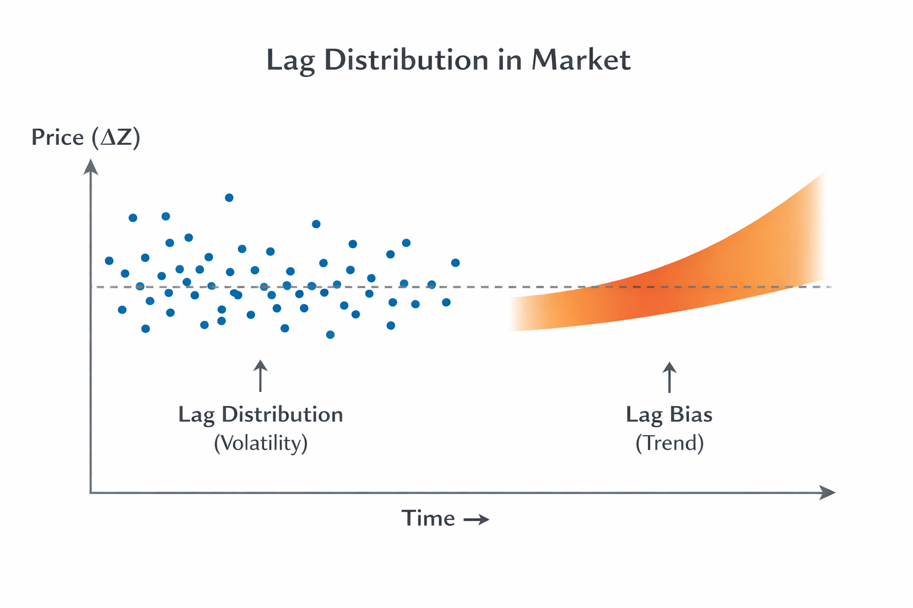

_**HEG-20｜Generative Political Theory** — Before Time —_  
### 🪐 HEG-20｜価値生成の現象学へ
### Towards Phenomenology of Value Generation
# 向き・偏り・拘りと支えの露出  
# — Orientation, Bias, Êthos, and the Exposure of Support

---

# **ホームランボールをめぐる向き・偏り・拘り**  
## ── milieu・trouble・support・issue からみた市場現象の構文的露出

---

# 0｜序論：問いの再設定

本稿は問う：

> ホームランボールはなぜ高くなるのか、ではない。  
> **なぜ生命の向きが偏りとして分布し、拘りとして持続し、support が背景へ退くのか。**

この問いは、価値を「結果」として扱う従来の市場分析を退け、価値を**生成過程として露出すること**を目的とする。

そのために本稿は、向き（orientation）、偏り（bias）、拘り（êthos）、支え／背景（support / background）という四つの層を区別し、段差を保ったまま記述する。

重要なのは、これらを短絡的に接続しないことである。  
とりわけ、「生命の向き」から「市場価値」へ直接飛躍する説明を退け、**milieu と support の露出を経由すること**を本稿の方法とする。

---

# Ⅰ｜向き：生命の非対称としての出発点

出発点は市場ではない。**生命の向き**である。

向きとは、生成（ΔR）と身体（ΔZ）の不一致から生じる、生命の持続条件としての非対称である。

この段階では、

- 判断はない
    
- 意味は固定されない
    
- 制度は介在しない
    

あるのは、milieu 内での局所的な orientation のみである。

ホームランボールの事例においても、

- 打者の身体
    
- 観客の視線
    
- 捕球者の反応
    

といった、出来事への即時的な向きがまず生じる。

ここでの milieu は単なる環境ではない。  
球場、観客席、実況、記録進行、ルール、警備、所有可能性といった **列挙可能な support の束**として構成されている。

したがって、

> 生命は milieu において向くことによって持続する

これが第一段階である。

---

# Ⅱ｜偏り：分布としての社会

偏りは誤りではない。また、認知的歪みでもない。

偏りとは、

> 複数の生命の向きが遭遇し、増幅され、分布として持続する構文

である。

ホームランボールの事例では、

- 観客の関心
    
- メディア報道
    
- 記録制度
    
- 希少性
    
- 国家的感情
    
- スター性
    

が相互に増幅し、特定の対象へ価値分布が集中する。

ここで重要なのは、**価格そのものが偏りではない** という点である。

価格は、

> 偏りが数値として可視化された一断面

にすぎない。

したがって生成過程は、

生命の向き  
→ 向きの遭遇  
→ 増幅  
→ 分布形成  
→ 時間的持続  
→ fictional stabilization

という順で進行する。

この段階で、trouble と issue の分化が生じる。

- trouble：局所的・身体的・未固定
    
- issue：記録・制度・言語による固定
    

両者は対称ではなく、**非対称循環**として関係する。

---

# Ⅲ｜拘りと支え：持続と不可視化

偏りが時間の中で反復されると、粘性が生じる。

これが拘り（êthos）である。

拘りとは、

> 増幅された偏りが、離れにくくなった持続構文

である。

ここで価値が立ち上がるが、それは選択ではない。

> 価値とは、残り続けるものである

ホームランボールの事例においては、

- 保存されるべき
    
- 展示されるべき
    
- 歴史として保持されるべき
    

といった規範的持続が生じる。

---

## 支えと背景

このとき、support は背景へ退く。

背景とは、

> support が rate として作用しつつ、知覚された形式

である。

したがって背景は静的な文脈ではなく、**関係を束ねる動的作用の知覚形態**である。

ホームランボールにおいては、

- 制度（MLB、記録）
    
- 認証
    
- 市場
    
- メディア
    
- 文化
    

といった support が、価格形成を束ねる rate として働いている。

---

## 露出の課題

ここで本稿の方法が現れる。

> 構造を解釈するのではない  
> 支えを指し示すのである

support は

- hidden（回復可能）
    
- lost（回復不能）
    

という二状態を持つ。

本稿の課題は、**何が支えているかを局所的に露出すること** である。

---

# 向き・偏り・拘りと支えの露出  
# — Orientation, Bias, Êthos, and the Exposure of Support

---

## Ⅰ｜向き：生命の非対称としての出発点

本論の出発点は、市場でも制度でもない。  
**生命の向き（orientation）** である。

向きとは、生成（ΔR）と身体（ΔZ）の非一致から生じる、持続のための非対称応答である。ここでいう非一致とは、出来事が身体に完全には回収されないこと、すなわち、経験が常にわずかに遅延し、ずれを伴うことである。このずれは欠損ではない。むしろ、生命が持続するための条件である。

したがって、向きは判断以前にある。意味付与や価値評価に先立ち、生命はまず出来事へ向く。このとき、身体は反応し、視線は集中し、手は伸びる。これらは選択の結果ではなく、非対称に開かれた構文的応答である。

この向きは、孤立して発生するものではない。常に**milieu**において生じる。milieuとは単なる環境ではなく、生命の向きを可能にする条件の束である。それは抽象的な背景ではなく、列挙可能な具体的支え（support）として構成される。

ホームランボールの事例において、milieuは以下のように具体化される。

球場という空間配置、観客席の密度、打球の軌道、実況の声、視覚的焦点の移動、記録の進行、ルールの存在、警備体制、捕球可能性、所有可能性。これらすべてが、向きを発生させる条件として機能している。

ここで重要なのは、この段階ではまだ価値は存在しないということである。あるのは、出来事に対する身体的な集中と応答のみである。したがって、

> 生命は、milieuにおいて向くことによって持続する

これが第一段階である。

---

## Ⅱ｜偏り：分布としての社会

複数の生命の向きが同一の出来事に対して発生すると、それらは相互に遭遇し、干渉し、増幅される。この過程において生じるのが**偏り（bias）** である。

偏りは、一般に誤りや認知の歪みとして理解されるが、本論においてはそのようには扱わない。偏りとは、複数の非対称的な向きが重なり合い、特定の方向へと分布を形成する構文的現象である。

ホームランボールの事例では、観客の関心、メディアの報道、記録制度の強調、希少性の認識、国家的感情、スター性といった複数の要因が、同一の対象に対して収束する。これらは独立した要素ではなく、相互に増幅し合う関係として作用する。

ここで生じるのは、「価値がある」という判断ではない。むしろ、

> 特定の対象に対して注意と意味が集中する分布

である。

この分布は時間的に持続し、反復されることで安定化する。その結果、語りや記録としての形態を取り、社会的に共有される構造へと移行する。この過程を、本論では**fictional stabilization**と呼ぶ。ここでの「fiction」は虚偽ではなく、持続可能な意味構成を指す。

この段階において、troubleとissueの分化が現れる。  
troubleとは、出来事に密着した局所的で身体的な緊張状態であり、未だ意味が固定されていない領域である。例えば、「誰がボールを取るのか」「それを保持するのか返還するのか」といった状況は、troubleに属する。

一方、issueは、記録、言語、制度によって固定された差異である。「史上初」「記念球」「高額落札」といった表現は、ΔZとしての記述を強化し、意味を安定化させる。

重要なのは、troubleとissueが対称的な区分ではないという点である。両者は相互に変換されるのではなく、**非対称的に循環する位相差**として関係している。

このとき、市場は最終的な決定主体ではない。市場は、

> 偏りとして形成された分布を、数値として切り出す装置

にすぎない。

したがって、価格は偏りの原因ではなく、その一断面である。

---

## Ⅲ｜拘りと支え：持続と不可視化

偏りが時間の中で反復されると、そこに粘性が生じる。この粘性を持った持続構文が**拘り（êthos）** である。

拘りとは、単なる欲望や選好ではない。それは、増幅された偏りが離れにくくなり、再帰的に自らを維持し続ける状態である。この段階において、価値と規範が生成される。

ここで重要なのは、価値が選択の結果として生じるのではないという点である。本論において、

> 価値とは、残り続けるものである

と定義される。

ホームランボールの事例においては、「保存されるべきである」「展示されるべきである」「歴史的に保持されるべきである」といった規範的表現が現れる。これらは個別の判断ではなく、持続する拘りの現れである。

この段階に至ると、生成を支えていた条件は前景から退き、背景として知覚されるようになる。ここで導入されるのが、**supportとbackground**の区別である。

supportとは、生成を可能にする条件の束である。  
backgroundとは、そのsupportが知覚された形式である。

重要なのは、backgroundが静的な文脈ではないという点である。それは、

> supportが関係を束ねるrateとして作用しつつ、知覚された状態

である。

したがって、背景は「存在する」のではなく、「生成される」。図（figure）が強調されるとき、地（ground）としてのsupportは保持され、同時に不可視化される。

ホームランボールの価格形成において、前景に現れるのはボールそのもの、落札額、ニュース、記録である。しかし、それを成立させているのは、

制度、認証、来歴管理、報道装置、ファン文化、競売市場、貨幣流動性、スター性

といったsupportの束である。これらは個別に存在するのではなく、相互に関係しながら、価値を束ねるrateとして作用している。

したがって、

> 価格が高いのではない  
> supportが高密度に束ねられているのである

と再定義できる。

---

## Ⅳ｜露出：構造ではなく支えを指し示す

以上の分析から、本論の方法が明らかになる。

それは、構造を解釈することではない。  
**支えを露出することである。**

一般に、社会現象は構造として説明される。しかし、構造は解釈の結果であり、その背後にある条件を必ずしも可視化しない。本論はこの点に対して、次の立場を取る。

> Structure is interpreted.  
> Support is indicated.

supportは完全に不可視であるわけではない。それは、

- hidden support（回復可能な支え）
    
- lost support（回復不可能な支え）
    

という二つの状態を持つ。

前者は、具体的な列挙と分析によって露出可能である。後者は、完全には回収できないが、その存在を指し示すことはできる。

ホームランボールの事例においても、制度的支えや報道連結はhidden supportとして明示できる。一方で、なぜ特定の出来事にのみ価値が極端に集中するのか、その象徴的厚みの一部はlost supportに属する。

したがって、本論の課題は、

> 何が価値を決定したのかを問うことではなく、何がそれを支えているのかを指し示すこと

にある。

---

ホームランボールは高くなるのではない。

生命が向き、偏りが分布し、拘りが持続し、支えが背景へ退く。

そのとき、価値が現れる。

---

**価値は、支えが見えなくなったところで立ち上がる。**  
**Value arises where support becomes invisible.**

---

## Ⅳ´｜市場（Market）
## ── lag分布としての生成場

## 定義（SOC-01の再配置）

市場とは何か。

本論の立場は明確である：

> 市場は価格ではない  
> 価格は痕跡である

そして、

> 市場とは非一致（lag）の分布である 
 
👉 [SOC-01｜市場とは何か ── lag分布としてのMarket](https://camp-us.net/articles/SOC-01_What-is-Market.html)  

---

## 生成構文

SOC-01に従えば、市場は次のように展開する：

- 多体的なrate
    
- 非同期（non-coincidence）
    
- lagの発生
    
- lagの分布
    
- 変動（market unfolding）
    
- ΔZ（価格）
    

👉 **価格は最後に現れる**

---

## 本論との接続

### 向き → lag

生命の向きは一致しない  
それぞれ異なる速度・位相で動く

👉 lag発生

### 偏り → lag分布

複数の向きが遭遇し増幅する

👉 lagが分布する

### 拘り → lagの持続

分布が時間的に安定する

👉 lagが固定される

### 支え → rate

supportは静的条件ではない

👉 **rateとして作用する**

---

## 核心命題

> Volatility is the distribution of lag  
> Trend is the bias of lag

> ボラティリティは、lagの分布である。
> トレンドは、lagの偏向である。

  

- ボラティリティ＝偏りの揺らぎ
    
- トレンド＝偏りの持続
    

---

## 再定義

したがって市場とは：

> 向きの非一致が分布し、持続し、可視化される場

である。

---

## 重要な否定

市場は：

- 均衡しない
    
- 収束しない
    
- 調整しない
    

👉 **lagが持続する場である**

---

> ホームランボールの価格は市場で決まるのではない  
> 市場において露出する

---

つまり、

- 市場＝原因ではない
    
- 市場＝生成の露出面
    

---

**生命 → 社会 → 持続 → 市場 → 価格**

---

> **市場は価値を決めない**  
> **それは、ずれ（lag）の分布を露出する場である**

---

## Ⅴ｜ケース（ホームランボール）
## ── 向き・偏り・拘り・支えの具体的露出

対象：大谷翔平

本節では、前節までに提示した生成現象学的枠組を用いて、ホームランボールという一見単純な対象において、価値がいかに生成されるかを段階的に露出する。

重要なのは、価格や市場を起点としないことである。分析はあくまで、**生命の向きから開始し、段階を保ったまま進行する**。

---

## Ⅴ-1｜向き：出来事への身体的集中

ホームランが放たれる瞬間、まず生じるのは評価ではない。  
**身体の向きである。**

打者のスイング、打球の軌道、観客の視線の収束、立ち上がる身体、伸びる手。これらは判断の結果ではなく、出来事への即時的応答である。

ここではまだ、

- 「価値がある」
    
- 「歴史的である」
    
- 「高額になる」
    

といった意味付与は存在しない。

あるのは、milieuにおける向きの発生である。

球場という空間配置、観客の密度、視覚的焦点、実況音声、時間的緊張といった条件が、向きを誘発する。したがってこの段階は、

> 生命が出来事に巻き込まれる局面

であり、価値は未だ生成されていない。

---

## Ⅴ-2｜偏り：分布としての注目の集中

複数の観客、視線、期待が同一の出来事に向かうと、それらは相互に干渉し、特定の対象へと集中し始める。

ここで生じるのが偏りである。

例えば、

- 打球の行方に対する集中的な視線
    
- 捕球の成否への関心
    
- 周囲の反応による注意の増幅
    

これらが重なり合うことで、特定のボールに対して注目が集中する。

この段階では、まだ「市場価値」は存在しない。  
しかし、

- メディア報道
    
- 記録（例：記念本塁打）
    
- 希少性の認識
    

が介入することで、偏りは時間的に持続し、分布として安定化する。

ここで初めて、

- 「特別なボール」
    
- 「記念球」
    
- 「歴史的対象」
    

といったissueが立ち上がる。

したがって、

> 市場は偏りの結果ではあるが、その起点ではない

---

## Ⅴ-3｜拘り：持続する価値の生成

偏りが反復されると、そこに粘性が生じる。  
これが拘り（êthos）である。

この段階では、対象に対して次のような規範が現れる：

- 保存されるべきである
    
- 展示されるべきである
    
- 所有されるべきである
    
- 歴史として記録されるべきである
    

これらは個別の判断ではなく、持続する構文である。

重要なのは、ここで価値が「選ばれる」のではなく、

> 特定の対象が持続的に残り続ける

という形で現れることである。

高額落札は、この拘りの外的表現にすぎない。  
それ自体が価値の原因ではない。

---

## Ⅴ-4｜支え：不可視化される生成条件

価値が安定すると、それを支えていた条件は前景から退き、背景として知覚されるようになる。

ここで露出されるべきなのがsupportである。

ホームランボールの事例において、supportは以下のように具体化される：

- リーグおよび記録制度
    
- 真正性の認証
    
- 来歴の管理
    
- メディア報道の連鎖
    
- ファン文化
    
- オークション市場
    
- 貨幣の流動性
    

これらは単独で存在するのではなく、相互に関係しながら、価値を成立させる。

重要なのは、これらが単なる背景ではないという点である。

> supportは、関係を束ねるrateとして作用する

つまり、価値の大きさは対象そのものではなく、

**どれだけ多くのsupportが高密度に束ねられているか**

によって決まる。

---

## Ⅴ-5｜背景：知覚としての支え

最終的に、これらのsupportは「背景」として知覚される。

しかし背景とは、単なる後景ではない。  
それは、

> supportが不可視化された知覚形態

である。

前景に現れるのは、

- ボール
    
- 落札額
    
- 記録
    
- ニュース
    

であるが、それらはすべて、背景として保持されたsupportによって成立している。

したがって、

> 価値は対象に宿るのではなく、支えが背景化する過程において現れる

---

## Ⅴ｜小結

ホームランボールは高くなるのではない。

向きが発生し、  
偏りが分布し、  
拘りが持続し、  
支えが背景へ退く。

その結果として、価格が現れる。

[HEG-20-04｜ホームランボールはなぜ暴騰するのか ── 非決定の本質｜Why do home run balls skyrocket in value? — The Reality of Nondecision](https://camp-us.net/articles/HEG-20-04_Why-homerun-balls-skyrocket-in-value_Reality-of-Nondecision.html)  

---

**価値は対象の属性ではない。  
それは、生命の向きから支えの不可視化に至る生成過程の痕跡である。**

---

# 価値生成の現象学へ
# Towards Phenomenology of Value Generation

---

# 0｜導入

## Introduction

> 価値はいかに決まるか、ではない。  
> 価値はいかに生成されるか。
> 
> Not how value is decided,  
> but how value is generated.

---

価値は決定されない。  
価値は判断されない。  
価値は構造に還元されない。

👉 価値は生成される

Value is not decided.  
Value is not judged.  
Value is not reducible to structure.

👉 Value is generated.

---

本稿は、価値生成を以下の層として記述する：

- 向き（orientation）
    
- 偏り（bias）
    
- 拘り（êthos）
    
- 支え（support）
    
- 市場（lag distribution）
    

These layers are not continuous.  
They form a **stepped generative process**.

---

# Ⅰ｜向き（生命）

## Orientation (Life)

出発点は市場ではない。生命の向きである。

The starting point is not the market.  
It is orientation.

---

向きとは、ΔR（出来事）とΔZ（身体）の非一致から生じる非対称応答である。

Orientation is an asymmetric response arising from the non-coincidence between event (ΔR) and embodiment (ΔZ).

---

出来事は身体に一致しない。このずれが、向きを生む。

Events do not coincide with the body.  
This gap generates orientation.

---

向きは判断以前にある。意味以前にある。

Orientation precedes judgment.  
It precedes meaning.

---

向きはmilieuにおいて生じる。

- 視線
    
- 音
    
- 他者
    
- 空間
    
- 時間
    

Orientation arises within a milieu:

- gaze
    
- sound
    
- others
    
- space
    
- time
    

---

> 生命は、向くことによって持続する  
> Life persists by turning.

---

# Ⅱ｜偏り（社会）

## Bias (Society)

向きは単独では留まらない。  
複数の向きが遭遇する。

Orientation does not remain singular.  
Multiple orientations encounter one another.

---

偏りとは、向きの分布である。

Bias is the distribution of orientations.

---

それは誤りではない。  
社会の最小単位である。

It is not error.  
It is the minimal unit of the social.

---

向きは増幅され、分布し、安定化する。  
これを fictional stabilization と呼ぶ。

Orientations amplify, distribute, and stabilize.  
This is fictional stabilization.

---

ここで初めて：

- 記録
    
- 言語
    
- 制度
    
- 価格
    

が立ち上がる。

Here emerge:

- records
    
- language
    
- institutions
    
- price
    

---

> 社会とは、偏りの持続的分布である  
> Society is the persistence of distributed bias.

---

# Ⅲ｜拘り（価値）

## Êthos (Value)

偏りは時間の中で粘性を持つ。  
これが拘りである。

Bias acquires viscosity over time.  
This is êthos.

---

拘りとは：

分布が離れなくなった状態

Êthos is:

the state in which distribution no longer disperses.

---

ここで価値が現れる。

Value appears here.

---

しかしそれは選択ではない。

It is not selection.

---

> 価値とは、残るものである  
> Value is what remains.

---

# Ⅳ｜支え（不可視条件）

## Support (Invisible Conditions)

価値が安定すると、支えは見えなくなる。

As value stabilizes, support disappears.

---

supportとは生成条件の束である。  
backgroundとはその知覚形態である。

Support is the set of generative conditions.  
Background is its perceptual form.

---

> supportは見えないのではない  
> 見えなくなる

Support is not invisible.  
It becomes invisible.

---

理由：

- 図（ΔZ）が強調される
    
- 地として保持される
    

Because:

- figure (ΔZ) is emphasized
    
- support is retained as ground
    

---

さらに：

> supportは関係を束ねるrateとして作用する

Support operates as a relational rate.

---

> 背景とは、支えの知覚形態である  
> Background is the perception of support.

---

# Ⅳ´｜市場（lag分布）

## Market (Lag Distribution)

市場は価値を決めない。

The market does not determine value.

---

市場とは：

> lagの分布である

The market is:

> the distribution of lag.

---

向きは一致しない。  
そこにlagが生じる。

Orientations do not coincide.  
Lag emerges.

---

lagは分布し、持続し、変動する。  
価格はその一断面である。

Lag distributes, persists, and fluctuates.  
Price is a cross-section of it.

---

- ボラティリティ＝lagの分布
    
- トレンド＝lagの偏向
    
- Volatility = distribution of lag
    
- Trend = bias of lag
    

  
[SOC-01｜市場とは何か ── lag分布としてのMarket｜What is a Market? — Market as a Distribution of Non-Coincidence —](https://camp-us.net/articles/SOC-01_What-is-Market.html)  

---

> 市場は、lagが持続する場である  
> The market is where lag persists.

---

# Ⅴ｜ケース（ホームランボール）

## Case: Home Run Ball

対象：大谷翔平

[HEG-20-04｜ホームランボールはなぜ暴騰するのか ── 非決定の本質｜Why do home run balls skyrocket in value? — The Reality of Nondecision](https://camp-us.net/articles/HEG-20-04_Why-homerun-balls-skyrocket-in-value_Reality-of-Nondecision.html)  

---

ホームランの瞬間、身体が向く。  
視線が集まり、手が伸びる。

At the moment of the home run,  
bodies turn, gaze converges, hands extend.

---

ここに価値はない。  
There is no value yet.

---

向きが遭遇し、偏りが生じる。  
偏りが持続し、拘りとなる。

Orientations encounter → bias forms  
Bias persists → êthos emerges

---

支えは背景へ退く。  
市場はそれを露出する。

Support recedes into the background.  
The market exposes it.

---

# 結語

## Conclusion

ホームランボールは高くならない。

The home run ball does not become expensive.

---

生命が向き、  
偏りが分布し、  
拘りが残り、  
支えが退く。

Life turns,  
bias distributes,  
êthos persists,  
support recedes.

---

市場はそれを映す。  
The market reflects it.

---

> 価値は対象ではない  
> 生成の痕跡である
> 
> Value is not in the object.  
> It is the trace of generation.

---

### 学術版（Academic version）
[HEG-20-04｜価値生成の現象学 ── 向き・偏り・拘りと支えの露出｜Phenomenology of Value Generation ── Orientation, Bias, Êthos, and the Exposure of Support](https://camp-us.net/articles/HEG-20-04_Phenomenology-of-Value-Generation.html)  

---

[HEG-20｜生成政治学へ向けて](https://camp-us.net/articles/HEG-20_Toward_Generative-Political-Theory.html)  

---
*EgQE — Echo-Genesis Qualia Engine*  
[_camp-us.net_](https://camp-us.net/)

---
© 2025 K.E. Itekki  
K.E. Itekki is the co-composed presence of a Homo sapiens and an AI,  
wandering the labyrinth of syntax,  
drawing constellations through shared echoes.

📬 Reach us at: [contact.k.e.itekki@gmail.com](mailto:contact.k.e.itekki@gmail.com)

---

| Drafted Apr 13, 2026 · Web Apr 13, 2026 |
