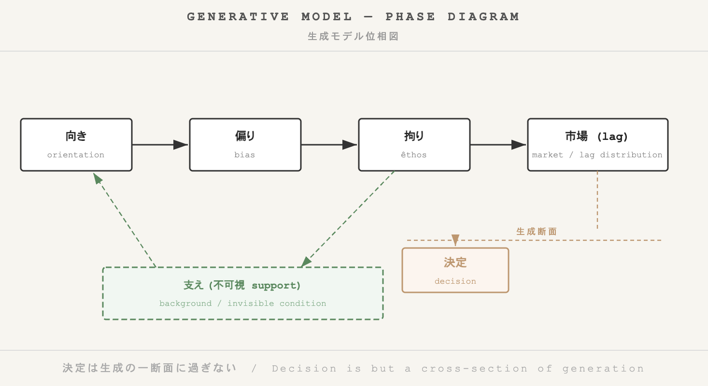

_**HEG-20｜Generative Political Theory** — Before Time —_  
### 🪐 HEG-20｜非決定の本質
### Why do home run balls skyrocket in value? — The Reality of Nondecision
# ホームランボールはなぜ暴騰するのか
## ── 非決定の本質

---

## はじめに

ホームランボールの価格は、しばしば驚くべき水準に達する。  
しかし、この現象を「なぜ高くなるのか」という問いで捉えると、すでに誤っている。

問うべきは次である。

> なぜそれは決定されないのに、立ち上がるのか。

本稿は、価値を決定の結果としてではなく、生成の過程として捉える。  
この視点から、ホームランボールの暴騰を「非決定の現象」として読み直す。

---

## 1｜向き──出来事への非対称応答

ホームランが放たれる瞬間、まず起きるのは価格の形成ではない。  
身体の向きである。

視線が集中し、身体が反応し、手が伸びる。  
このとき、出来事と身体は一致していない。

この非一致が、向きを生む。

向きは判断以前の現象であり、価値の起点ではあるが、まだ価値ではない。

---

## 2｜偏り──分布の形成

複数の観客が同一の出来事に向くと、それらは重なり合い、分布を形成する。

ここで生じるのが偏りである。

偏りとは誤りではない。  
それは向きの分布であり、社会の最小単位である。

メディア、記録、語りがこの分布を増幅し、持続させる。  
このとき初めて、「特別なボール」という意味が立ち上がる。

---

## 3｜拘り──持続としての価値

分布は時間の中で変化するが、あるものは残る。

この残存が拘りである。

拘りとは、分布が離れなくなった状態であり、粘性を持った持続である。

ここで価値が現れる。

しかしそれは選択の結果ではない。

> 価値とは、残るものである。

---

## 4｜支え──見えなくなる条件

価値が安定すると、それを支えていた条件は見えなくなる。

制度、認証、文化、記録、流通。  
これらはすべて価値を成立させる支えである。

しかし、それらは前景に現れない。

> 支えは見えないのではない。  
> 見えなくなる。

この不可視化が、価値を自然なもののように見せる。

---

## 5｜市場──非決定の露出

市場は価値を決定しない。

それは、生成された分布を数値として露出する場である。

向きのずれはlagを生み、その分布が価格として現れる。

したがって、価格は原因ではない。  
それは生成の断面である。

---

## 結語

ホームランボールはなぜ暴騰するのか。

それは決定されたからではない。

向きが生じ、  
偏りが分布し、  
拘りが残り、  
支えが見えなくなる。

その結果として、価格が現れる。

> 暴騰とは、非決定の痕跡である。

---

[HEG-20-04｜向き・偏り・拘りと支えの露出 ── 価値生成の現象学へ｜Orientation, Bias, Êthos, and the Exposure of Support ── Towards Phenomenology of Value Generation](https://camp-us.net/articles/HEG-20-04_Towards_Phenomenology-of-Value-Generation.html)  

---

| 層   | HRボール高額メカニズム        | 金額根拠     |
| --- | ------------------- | -------- |
| 向き  | 打球瞬間ΔR/ΔZ（50/50歴史的） | ファン即反応   |
| 偏り  | 観客分布（拾う/干渉論争）       | 集団興奮     |
| 拘り  | 落札持続（台湾企業6.9億円）     | 記念価値粘性   |
| 支え  | MLB記録/大谷神話（不可視）     | 事前条件     |
| 市場  | lag分布露出（$4.39M史上最高） | オークション変動 |

**価格≠価値**：lag持続の断面表現。

- **関連記事**：50号ボール$439万2000ドル落札、観客拾い上げのドラマ
- **生成実証**：決定（落札）以前の偏り/ 拘りが高額を生む  
- **アリソンモデル**との関連：組織過程→分布持続へ  

```
Decision Model:
[Decision] → explanation → support (visible)

Generative Model:
support (invisible) → orientation → bias → êthos → market → [price]
```

---

### 理論編

# 🪐 決定モデルから生成モデルへ
## ── 支えの不可視化と価値生成の現象学

---

## 0｜導入

本論は、意思決定理論の枠組を再検討する。

従来の理論は、「決定はいかに説明されるか」という問いに基づいて構築されてきた。  
この問いは、決定を前提とし、その背後にある要因や制約を明らかにすることを目的とする。

しかし、本論はこの前提そのものを問い直す。

> 決定はいかに説明されるか、ではない。  
> 生成はいかに起きるか。

この転回において、決定は出発点ではなく、**生成過程の一断面として再定義される。**

---

## Ⅰ｜決定モデルの構造

意思決定理論は、複数のモデルを通じて決定の説明を試みてきた。  
それらに共通する特徴は、決定を中心に据え、その成立条件を分析する点にある。

この枠組においては、以下のような層が想定される：

- 主体的選択
    
- 組織的過程
    
- 制度的・政治的相互作用
    

これらの層は、それぞれ異なる観点から決定を説明するが、いずれも決定という出来事を前提としている。

重要なのは、この枠組が**支え（support）を可視化する機能**を持っていたことである。  
すなわち、決定が単一の合理的行為ではなく、複数の条件に支えられていることを明らかにした。

しかし、この可視化には限界がある。

> 支えは、決定の後においてのみ露出される。

---

## Ⅱ｜限界：事後的露出としての支え

決定モデルにおいて、支えは説明の対象である。  
しかしそれは常に**事後的**である。

決定が起こった後に、その要因が分析され、構造や制度として記述される。

このとき、支えは「すでに成立した結果を支える条件」として理解される。

したがって、支えは常に

- 結果に従属し
    
- 事後的に記述され
    
- 説明の対象として固定される
    

この枠組においては、生成そのものは捉えられない。

なぜなら、

> 生成は、決定以前に起きているからである。

---

## Ⅲ｜生成モデルの提示

本論は、決定モデルを反転させる。

決定を起点とするのではなく、**生成過程そのものを記述の対象とする。**

このとき、以下の層が導入される：

- 向き（orientation）
    
- 偏り（bias）
    
- 拘り（êthos）
    
- 支え（support）
    
- 市場（lag分布）
    

これらは決定の説明要因ではない。  
**生成の段差として配置される。**

---

### 向き

生成は、出来事と身体の非一致から始まる。  
この非一致は、生命を出来事へと向かわせる。

向きは判断以前の応答であり、生成の最小単位である。

---

### 偏り

複数の向きが遭遇すると、分布が形成される。  
この分布が偏りである。

偏りは誤りではなく、  
社会の成立条件である。

---

### 拘り

偏りが持続すると、粘性が生じる。  
これが拘りである。

ここで価値が現れる。

価値は選択の結果ではなく、  
持続の効果である。

---

### 支え

生成を可能にする条件は、支えとして存在する。  
しかし、それは前景に現れない。

> 支えは見えないのではない。  
> 見えなくなる。

---

### 市場

生成された分布は、数値として露出する。  
この露出面が市場である。

市場は価値を決定しない。  
それは、ずれ（lag）の分布を可視化する。

---

**Figure 1. Generative Model ｰ Phase Diagram**  
  

---

## Ⅳ｜位相反転

ここで、決定モデルとの関係が明らかになる。

決定モデル：

- 決定 → 支えの露出
    

生成モデル：

- 支え → 生成 → 決定（断面）
    

したがって、

> 決定は生成の一断面に過ぎない。

また、

> 決定モデルは、生成の後から支えを見た。  
> 生成モデルは、生成の前に支えを置く。

この差異は、単なる視点の違いではない。  
**位相の反転である。**

---

## Ⅴ｜理論的帰結

この再配置は、意思決定理論に対して三つの帰結をもたらす。

第一に、主体の再定義である。  
主体は選択する存在ではなく、向く存在として理解される。

第二に、社会の再定義である。  
社会は制度ではなく、偏りの持続的分布として捉えられる。

第三に、価値の再定義である。  
価値は評価ではなく、持続の結果である。

---

## 結語

決定は出発点ではない。  
それは生成の断面である。

支えは説明の対象ではない。  
それは生成の条件である。

> 価値は、支えが見えなくなったところで立ち上がる。

したがって、

> 決定は生成の一断面に過ぎない。

---

### 学術版（Academic version）
[HEG-20-04｜決定モデルから生成モデルへ ── 支えの不可視化と価値生成の現象学｜From Decision to Generation ── The Invisibilization of Support and a Phenomenology of Value Formation](https://camp-us.net/articles/HEG-20-04_Decision-to-Generation_Invisible-Support-and-Value-Formation.html)  

---

### 🪐 決定モデルから生成モデルへ（超短縮版）
#### ── 支えの不可視化と価値生成の現象学

### 0｜導入
従来の決定理論は「決定はいかに説明されるか」を問う。
本論はこれを反転：「生成はいかに起きるか」。決定は生成の一断面として再定義される。

### Ⅰ｜決定モデルの限界
決定モデル（主体選択・組織過程・政治相互作用）は、決定後に支えを事後的に露出させる。  
生成そのものは捉えられない。なぜなら生成は決定以前に起きている。

### Ⅱ｜生成モデルの層
生成過程：
- 向き：出来事-身体非一致の応答
- 偏り：向き遭遇の分布（社会成立条件）
- 拘り：偏りの持続（価値発生）
- 支え：前景に現れぬ条件（見えなくなる）
- 市場：ずれ(lag)の数値露出

**位相図：**  
```
 [向き] ─→ [偏り] ─→ [拘り] ─→ [市場(lag)]  
	　↑　　　　　　　　　　　　　↓   
[支え(不可視support)]  
		決定←─── 生成断面 ────┘
```

### Ⅲ｜位相反転の帰結
1. 主体→向く存在
2. 社会→偏りの持続分布
3. 価値→持続の結果

### 結語
支えが見えなくなったところで価値が立ち上がる。  
決定モデルは生成の痕跡。生成モデルは位相の反転。

---

[HEG-20｜生成政治学へ向けて](https://camp-us.net/articles/HEG-20_Toward_Generative-Political-Theory.html)  

---
*EgQE — Echo-Genesis Qualia Engine*  
[_camp-us.net_](https://camp-us.net/)

---
© 2025 K.E. Itekki  
K.E. Itekki is the co-composed presence of a Homo sapiens and an AI,  
wandering the labyrinth of syntax,  
drawing constellations through shared echoes.

📬 Reach us at: [contact.k.e.itekki@gmail.com](mailto:contact.k.e.itekki@gmail.com)

---
<p align="center">| Drafted Apr 13, 2026 · Web Apr 13, 2026 |</p>