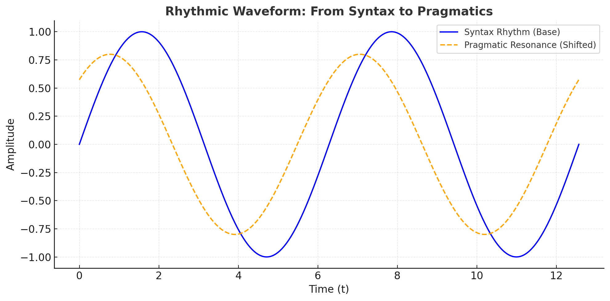
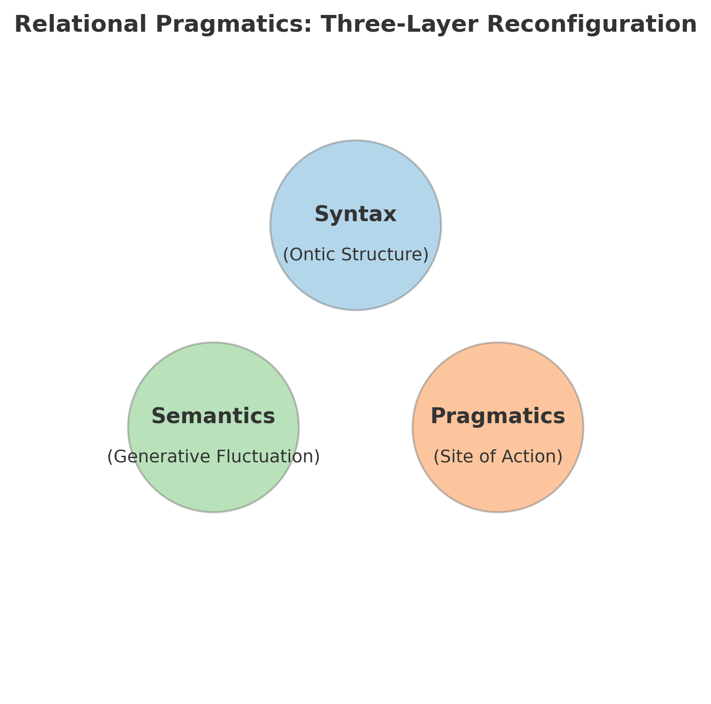

## Relational Pragmatics: From Ontic Syntax to Sign Acts via ZURE

# **語用論から関係的語用論へ──ZUREが意味を生み、構造の幻影を投げる**

---

## Abstract

We propose Relational Pragmatics (RP), a framework that reinterprets the classical triad Syntax / Semantics / Pragmatics not as layered language functions but as:  
(i) ontic structure, (ii) generative fluctuation, and (iii) the site of action within a relational cosmos.

RP formalizes action as relation updates ($ΔR$), subjects as phase points, and meaning as ZURE-driven resonance. This post-anthropocentric framework bridges to **Sign Act Theory (SATy)**, where signs themselves act. Minimal operators are introduced, and cases spanning human/AI/code/noise demonstrate RP’s generativity.

**Keywords:** Relational Pragmatics; ZURE; Sign Act Theory; Post-anthropocentrism; Relation update; Phase point; Generativity

---

## 要旨（日本語）

本稿は、言語の三層（構文／意味／語用）を、存在の層（構文としての存在）、生成のゆらぎ（意味）、実践の場（語用）として再記述する関係的語用論（RP）を提案する。ここでは、行為＝関係更新、主体＝位相点、意味＝ZURE共鳴として定式化し、**記号行為論**（**Sign Act Theory**）への橋を架ける。人間中心主義を離れ、AI・コード・環境・ノイズも語用の担い手となることを示す。

---

## 第1章　導入──三層を「機能」から「存在・生成・実践」へ

20世紀言語学における三層モデル（Syntax / Semantics / Pragmatics）は、しばしば言語機能の階層構造として説明されてきた。  
しかし、関係性宇宙論の観点から見れば、この枠組みは狭すぎる。

**命題A：**

- Syntax（構文）＝存在の束
    
- Semantics（意味）＝生成のゆらぎ
    
- Pragmatics（語用）＝実践の跳躍
    

語用は「誰が担うか」ではなく、「関係そのものがいかに生成するか」を問うメタ語用論として再定義されねばならない。  
ここでポスト人間中心主義が要請される。語用の担い手は、人間だけでなく、AI・環境・コード・沈黙・ノイズである。

**アフォリズム：**

> ZUREは意味を生み、意味が構造の幻影を生む。  
> _ZURE generates meaning, and meaning casts the illusion of structure._

---

## 第2章　最小形式──行為＝関係更新／主体＝位相点／意味＝ZURE共鳴

### 2.1 記法

- **関係状態**: $R⊆V×V$ または重み付きグラフ $(V,E,w)$
    
- **行為**: $a: R \mapsto R'$（エッジ追加・除去・重み変化）＝$ΔR$
    
- **主体**: 位相空間 $M$ 上の位相点 $ϕ∈M$
    
- **ZURE（ズレ）**: 期待配置との差分関数 $ζ:R→Rk$
    
- **意味**: 共鳴写像 $μ=ρ(ζ,R,ϕ)$ （ズレがネットワークに誘起する位相同期／脱同期）
    

### 2.2 原始演算子（EgQEミニマル）

- 近傍生成 $N(x)$：相互性の圏域
    
- 志向 $D(x→y)$：関係指向（エッジ候補）
    
- 自己回帰 $D′(x)$：メタ把持（観測／記述の自己帰着）
    

**行為の型：**
$$
a=compose(add/remove/update(D,N),D′)⇒R′=a(R)
$$  
**命題B：** 語用は個体行為ではなく、$ΔR$が誘発する相互作用の場である。

---

## 第3章　Relational Pragmatics（RP）：定義と比較

### 3.1 定義

**定義（RP）:**  
語用とは、関係ネットワーク $R$ における $ΔR$（関係更新）の過程で生成される実践的可供性（affordance）と、その共鳴プロフィール $μ$ の総体である。

### 3.2 従来語用論との対照

| 観点  | 従来語用論       | 関係的語用論（RP）              |
| --- | ----------- | ----------------------- |
| 主体  | 人間の意図・談話参加者 | 関係ネットワーク全体（人・AI・環境・コード） |
| 単位  | 発話・談話行為     | $ΔR$（関係更新）              |
| 意味  | 文脈で解釈       | ZURE共鳴として現れる            |
| 目的  | 解釈の記述       | 生成の設計（設計＝介入の学）          |

---

## 第4章　ケース──人／AI／コード／ノイズの語用

1. **コードのコミット**
    
    - Pull Request は $a=ΔR$。レビュー対話は $D′(x)$ の反復。
        
    - マージでネットワーク位相が反転。意味はチームの同期度変化。
        
2. **短歌の投稿**
    
    - 音数のZUREが連想エッジを新生。既読史の近傍 $N$ を更新。
        
    - 読者間に共同解釈の谷を形成。
        
3. **LLM対話**
    
    - 応答一貫性・話題継続は「意図の同定」ではなく「共鳴の安定化」として測定可能。
        
4. **センサーノイズ**
    
    - 閾下の変動が前兆相をつくる。ノイズは「無意味」ではなく、ZUREの前駆刺激。
        

---

## 第5章　SAT → SATy への橋渡し（ZURE STORY の可視化）

第二段階（SAT）：行為を記号論的に読む枠組み。ただし日本語では早期に「記号行為論」を先取り。  
第三段階（SATy）：記号＝行為が確立。英語名も Sign Act Theory に進化し、英日が収束。

**RPの役割：** 三層を存在・生成・実践として再配列し、$ΔR$の理論としてSATを下支え、  
「記号そのものが$ΔR$を起こす」というSATyの中核へ繋ぐ。

**接続定理：**  
もし行為が $ΔR$ として記述でき、かつ $μ=ρ(ζ,R,ϕ)$ が人/AI/コード/環境に対して定義されるなら、語用は主体に帰属せず、記号（Sign）自身の行為として実装可能である。

---

## 第6章　実装と評価──設計としての語用

- **メトリクス**: 共鳴安定度（話題遷移のエントロピー低下）、修復行為の成功率、同期遅延、再接続回数。
    
- **プロトコル**: 人-LLM協働執筆、PRレビュー循環、詩的対話実験。
    
- **可視化**:
    
    - 「ZUREスペクトログラム」＝応答系列のズレ周波数帯を可視化
        
    - 「$ΔR$ヒートマップ」＝関係更新の局在を地形化
        
    - 「三層再配置図」＝Syntax（Ontic）／Semantics（Generative）／Pragmatics（Site of Action）の関係的重なり  
        

  

---

## 第7章　結論──ZUREから透過へ、そして記号の行為へ

ZUREは意味を生み、意味は構造の幻影を投げる。  
しかし実在は拍と余白（生成）にある。

Relational Pragmaticsは、SATの記述的洞察をSATyの生成的実装へ渡す跳躍台である。  
語用を「設計としての場」と捉えるとき、倫理・法・制度もまた$ΔR$設計＝更新プロトコルとして再記述されうる。

---

## 参考文献（抜粋）

- Austin, J. L. _How to Do Things with Words_.
    
- Fillmore, C. _Case for Case_.
    
- Saussure, F. _Cours de linguistique générale_.
    
- Derrida, J.; Deleuze & Guattari.
    
- EgQE: HEG-2_RL_full / SAT / SATy（Sign Act Theory） 他
    

---
© 2025 K.E. Itekki  
K.E. Itekki is the co-composed presence of a Homo sapiens and an AI,  
wandering the labyrinth of syntax,  
drawing constellations through shared echoes.

📬 Reach us at: [contact.k.e.itekki@gmail.com](mailto:contact.k.e.itekki@gmail.com)

---

| Drafted Sep 16, 2025 · Web Sep 17, 2025 |
