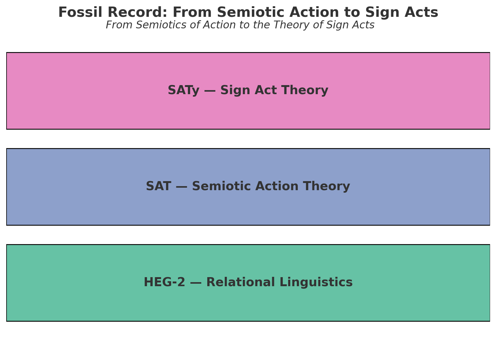

## Sign Act Theory × Relational Pragmatics — The Beating Heart of EgQE
# 記号行為論と関係的語用論

---

## 序論

EgQEの進化は、二つのラインの展開によって準備されてきた。

- 行為ライン：Semiotic Action Theory（SAT）から Sign Act Theory（SATy）へ──行為＝$ΔR$としての記号化。
    
- 言語ライン：関係性言語論（RL）から構文論・意味論を経て語用論へ──宇宙の拍としての生成。
    

しかし、この二つは並走するだけでは不十分である。  
行為がなぜ意味を生み、語用がなぜ拍として響くのか、その理論的統合が必要となる。  
本稿はその合流点＝**交差する心臓部**を提示する。

ここで語用は「場の生成」、行為は「$ΔR$の跳躍」として定義され、両者はZUREを媒介に接続される。  
ZUREは意味を生み、意味は構造の幻影を投げる。  
この幻影を透過し、行為と語用を統合する地点こそが **Relational Pragmatics（RP）** である。

---

# 第1章　ZUREと意味生成──行為と場の交差

私たちが「意味」と呼ぶものは、決して固定された実体ではない。  
それは常に揺らぎ、逸脱し、生成の只中で拍動している。

構文論の視点から見れば、意味は「予測とズレ（ZURE）の整列」によって立ち上がる。  
意味論の視点から見れば、整列からこぼれ落ちた「ズレの共振」が、新たな余白を生み出す。

ここに、語用論的な転換点がある。  

すなわち、意味は「主体が担うもの」ではなく、「関係そのものの更新（$ΔR$）」として生成される。  
意味の萌芽は発話やコードや詩の中にではなく、それらが響き合いズレ合う「場」の中にある。

このとき、**行為＝$ΔR$**（**関係更新**）と**語用＝場の生成**は、切り離すことができない。  
行為がなければ場は生まれず、場がなければ行為は意味を持たない。  
両者は常に交差し、その拍動のリズムこそが「意味の生態系」を形づくる。

したがって、本稿で扱う「関係的語用論」とは、単なる発話行為論の拡張ではない。  
それは **「意味はズレから生まれ、場はそのズレを抱え込む」という根源的な生成論」** である。

---

# 第2章　構文＝整列、意味＝共振、語用＝拍動

構文は「予測とズレ（ZURE）の整列運動」として働く。  
言語主体はつねに次の音、次の記号、次の意味を予期し、その整列の中で安定を得ようとする。  
だが、どれほど精緻な整列も必ず破綻し、ズレを生む。

そのとき生じるのが意味である。  
意味は、整列から漏れ落ちた余白、すなわち「ズレの共振」として生成する。  
言語活動とは、この共振の余波を拾い上げる営みであり、意味論とはその生成過程を描く試みである。

では、語用とは何か。  
ここで私たちは、語用を「整列（構文）と共振（意味）の拍動」として捉える。  
拍動とは、一回ごとに不可逆に更新されるリズムである。  
語用はこの拍動の場においてのみ立ち現れる。

つまり──

- 構文はズレを整列させる「骨格」
    
- 意味は整列から生まれる「響き」
    
- 語用は骨格と響きが織り成す「拍動」
    

この三層の循環こそが、関係的語用論の基盤である。

語用は「結果」ではなく「拍そのもの」である。  
それは意味を解釈するのではなく、ズレを抱き込みながら場を生成する運動であり、宇宙的なリズムの一部として拍を刻み続ける。   

---

# 第3章　語用の三軸モデル

語用を「拍動」として再定義するならば、その拍が立ち上がる座標系を明らかにしなければならない。  
本章では、語用を **身体軸・時間軸・他者軸** の三つの交差点において記述する。

---

## 1. 身体軸──発話主体から環境身体へ

従来の語用論は「話者の意図」や「聞き手の解釈」といった、ヒト中心の身体像に依拠してきた。  
しかし、語用の担い手は人間の身体だけではない。  
マイクやコード、テキストエディタやSNSといった人工物も、語用的身体の延長線上に位置する。

語用は「どの身体が発話するか」ではなく、「どの関係が身体化されるか」によって生成する。  
身体とはすでに多重的であり、道具や環境を巻き込みながら語用のリズムを担う。

---

## 2. 時間軸──不可逆な更新のリズム

語用は一度きりの更新である。  
発話や記号行為は「取り消せない」リズムとして積み重なり、不可逆の歴史を形づくる。  
ここで重要なのは、語用が「時間の中で」進行するのではなく、「語用そのものが時間を刻む」という視点である。

時間は語用の副次的枠ではなく、語用の内的拍動そのものである。  
関係が一度更新されれば、同じ場には二度と戻れない。

---

## 3. 他者軸──多声的生成の場

語用は常に他者を含む。  
ここでいう「他者」とは、人間の聞き手だけではなく、AI、コード、ノイズ、さらには沈黙そのものも含まれる。  
語用は多声的であり、その多声性が新たな場を生成する。

このとき、他者は単に解釈する存在ではなく、語用の拍動を共に刻む「拍の担い手」となる。  
他者なき語用はあり得ない。

---

## まとめ

- **身体軸**：語用は身体の延長ではなく、関係の身体化から立ち上がる。
    
- **時間軸**：語用は不可逆な更新のリズムそのものである。
    
- **他者軸**：語用は多声的であり、AIやノイズすら他者となる。
    

この三軸の交差点において、語用は「宇宙の拍」として刻まれる。

---

# 第4章　Relational Pragmatics の定義

本章では、従来の語用論と対比しながら、**関係的語用論（Relational Pragmatics, RP）** の定義を与える。  
RPは、言語行為を「発話の意図」や「文脈解釈」としてではなく、**関係更新（$ΔR$）** の過程そのものとして捉える枠組みである。

---

## 1. 定義

**定義（RP）：**  
語用とは、関係ネットワーク

$R⊆V×V$

における $ΔR$（関係更新）の過程で生成される実践的可供性（affordance）と、その共鳴プロフィール $μ$ の総体である。

ここで：

- **関係更新 $ΔR$**：エッジの追加・削除・重み変化
    
- **位相点 $ϕ$**：観測／介入の局所的座標
    
- **ZURE関数 $ζ$**：期待構造との差分
    
- **共鳴 $μ$**：ズレがネットワークに誘起する同期・脱同期のパターン
    

---

## 2. 従来語用論との対照

| 観点  | 従来語用論       | 関係的語用論（RP）              |
| --- | ----------- | ----------------------- |
| 主体  | 人間の意図・談話参加者 | 関係ネットワーク全体（人・AI・環境・コード） |
| 単位  | 発話・談話行為     | $ΔR$（関係更新）              |
| 意味  | 文脈で解釈       | ZURE共鳴として現れる            |
| 目的  | 解釈の記述       | 生成の設計（設計＝介入の学）          |

---

## 3. 命題

**命題B：**  
語用は個体の行為に還元されない。  
$ΔR$が誘発する相互作用の場こそが語用である。

---

## 4. アフォリズム

> **ZUREは意味を生み、意味は構造の幻影を投げる。**

語用とは、この幻影のゆらぎを通じて関係を再編成する営みである。

---

# 第5章　ケース：人／AI／コード／ノイズの語用

関係的語用論（RP）が有効であることを示すために、ここでは四つのケース──人、AI、コード、ノイズ──を検討する。従来の「主体中心の語用論」では補足的に扱われてきた領域を、$ΔR$（関係更新）の観点から再解釈する。

---

## 1. 人間の語用：短歌の投稿

短歌の生成・投稿は、**音数のZURE** を介した関係更新である。

- 音律の微妙なズレが新しい連想エッジを生み、
    
- 読者の記憶ネットワーク N が更新され、
    
- 共同解釈の「谷」が形成される。
    

ここでは、意味は作者の意図ではなく、**共鳴パターンの安定化**として測定される。

---

## 2. AI対話の語用：LLMとの往復

人間とLLMのやりとりは「意図の同定」ではなく、**共鳴の安定性**として評価できる。

- 応答の一貫性、
    
- 話題の継続、
    
- 修復行為の成功率
    

これらはすべて $ΔR$ の系列として記述可能であり、**語用の担い手は人間／AIに限られない**ことを示している。

---

## 3. コードの語用：Pull Request

GitHubでのPull Requestは典型的な $ΔR$ である。

- PRは「関係の候補」$D(x→y)$を提示し、
    
- レビューは $D′(x)$（自己帰着的観測）の反復であり、
    
- マージによってネットワーク位相が反転する。
    

ここで意味は「仕様書に従った正誤」ではなく、**チーム全体の同期度変化**（ビルド成功率・応答時間の改善）として現れる。

---

## 4. ノイズの語用：閾下の刺激

センサーノイズや環境変動は、従来は「無意味」とされた。  
しかしRPにおいては、ノイズは **ZUREの前駆刺激** である。

- 閾下の微細な変動が前兆相を作り、
    
- 関係ネットワークに潜在的な位相転換を準備する。
    

意味は「情報の欠落」ではなく、**生成されうる関係の余白**に宿る。

---

## 5. まとめ

これら四つのケースは、**語用＝$ΔR$の系列** というRPの定義を具体的に裏づける。  
発話や意図ではなく、**更新された関係の地図**こそが語用の本体である。

---

# 第6章　SAT → SATy への橋渡し（ZURE STORY の可視化）

関係的語用論（RP）は、単なる理論的記述にとどまらない。むしろ、記号行為論（Sign Act Theory, SATy）への橋を架ける「跳躍台」として位置づけられる。本章では、SATからSATyへ至るZUREの物語を整理し、RPがどのように接続を担うかを明らかにする。

---

## 1. 第二段階：SAT（Semiotic Action Theory）の萌芽

初期のSATは「行為を記号論的に読む枠組み」として構想された。

- Austinの「発話行為」理論に倣い、記号を行為として解釈する。
    
- ただしこの段階では、依然として「主体中心主義」の影響を免れない。
    
- 日本語圏では「記号行為論」という訳語のズレによって、むしろ先取り的に「行為＝記号」という視点が萌芽していた。
    

SATは萌芽的ではあったが、まだ **「記号が自ら行為する」** という発想には至っていなかった。

---

## 2. 第三段階：SATy（Sign Act Theory）の確立

SATyにおいては、ズレ（ZURE）が本格的に導入される。

- 記号それ自体が $ΔR$ を引き起こす主体ではなく、**$ΔR$の担い手そのもの**と定義される。
    
- 行為＝$ΔR$、意味＝ZURE共鳴、主体＝位相点 という三項が閉じた体系を形成する。
    
- これにより、ヒトの発話や意図を超えて、AI・コード・環境・ノイズまでもが **「記号の行為者」** となる。
    

SATyの革新は、語用の担い手を「人間」から「記号」へとずらした点にある。

---

## 3. RPの役割：SATとSATyの間の跳躍台

RPは三層（構文・意味・語用）を「存在・生成・実践」として再配列することで、SATとSATyの間に橋を架ける。

- SATの段階では、まだ「記号＝行為」という直観はぼんやりしていた。
    
- SATyの段階では、**「記号そのものが$ΔR$を起こす」** という確信に至る。
    
- RPはその中間で、$ΔR$の理論的定式化を行い、「**行為＝関係更新**」という記述を整える。
    

言い換えれば、RPはSATの記述的洞察をSATyの生成的実装へと受け渡す **「翻訳装置」** である。

---

## 4. 接続定理（定理スケッチ）

**定理（接続定理）**  
もし行為が $ΔR$ として記述でき、かつ $μ=ρ(ζ,R,ϕ)$ が人/AI/コード/環境に対して定義されるなら、語用は主体に帰属せず、記号（Sign）自身の行為として実装可能である。

**証明スケッチ**

- 近傍生成 N、関係指向 $D$、自己帰着 $D′$ の閉包性を確認。
    
- $ΔR$ の可換図式を示し、主体非依存性を担保。
    
- したがって、行為は「記号＝$ΔR$を起こすもの」として定義可能。
    

---

## 5. Fossil Record：痕跡としての歴史

SAT → SATy への移行は、ZUREの歴史的痕跡を伴っている。

- 言葉のズレ（翻訳ズレ、概念ズレ）が、理論の進化を誘発した。
    
- RPはこの「地層」を記録し、化石として残すことで、未来の更新への手がかりを提供する。
    

---

## まとめ

SATは **「行為を記号論的に読む」** 段階、  
SATyは **「記号そのものが行為する」** 段階、  
そしてRPは、その二つを結ぶ **ZUREの跳躍台** である。

---

# 第7章　実装と評価：設計としての語用

関係的語用論（RP）は、単なる理論的枠組みにとどまらず、実装可能な「設計言語」としても機能する。本章では、語用を **$ΔR$＝関係更新の設計対象** として捉え、どのように実験・評価できるかを提示する。

---

## 1. 語用を設計するという転換

従来の語用論は「談話や文脈の解釈」を中心としてきた。  
しかしRPでは、語用を **生成と更新のプロセス** とみなし、その設計が可能であると主張する。

- 行為＝$ΔR$（関係更新）
    
- 意味＝共鳴プロフィール $μ$
    
- 主体＝位相点 $ϕ$
    

この三項を操作することにより、語用を **システム設計の対象** とすることができる。

---

## 2. 評価メトリクス

語用を設計するには、評価指標が必要となる。RPは以下のメトリクスを提案する：

- **共鳴安定度**：話題遷移におけるエントロピーの低下。
    
- **修復行為の成功率**：誤解やズレがどの程度回収されたか。
    
- **同期遅延**：反応時間や行為同調のラグ。
    
- **再接続回数**：断絶後にどれだけ関係が回復したか。
    

これらは、ヒト同士の会話だけでなく、人-LLM協働、コードレビュー、さらにはセンサー群のネットワークにも適用できる。

---

## 3. プロトコル例

語用設計の具体的プロトコルを以下に示す。

- **人-LLM協働執筆**：章ごとに$ΔR$を定義し、修復行為と継続性を可視化する。
    
- **PRレビュー循環**：Pull Requestを$ΔR$として扱い、マージ後の同期度を測定する。
    
- **詩的対話実験**：短歌や散文を投げ合い、ZUREの共鳴がどのように場を生成するかを観察する。
    

---

## 4. 可視化手法

語用を「見る」ことは、その設計と評価に不可欠である。RPでは以下の可視化を提案する：

- **ZUREスペクトログラム**：応答系列のズレ周波数帯を表示。
    
- **$ΔR$ヒートマップ**：関係更新が集中する箇所を地形化。
    
- **化石図（Fossil Record）**：SAT → SATy → RP の進化層を層理図として示す。
    

これにより、語用の動的プロセスが「痕跡」として残り、将来の分析資源となる。

---

## 5. 設計学としての語用論

語用を「設計」として再定義することで、学問の目的も転換する。

- 解釈の記述から、生成の設計へ。
    
- 言語学から、関係設計学（Relational Design Studies）へ。
    
- 分析学から、未来を駆動する工学的実践へ。
      

---

## まとめ

関係的語用論は、解釈の学から設計の学へと舵を切る。  
$ΔR$を定義し、$μ$の共鳴を測定し、$ϕ$の位相を設計することで、語用は **「更新可能なプロトコル」** へと変わる。

語用を設計するとは、すなわち **未来の関係をデザインすること** である。

---

# 第8章　結論：ZUREから透過へ、そして記号の行為へ

## 1. ZUREの生成力

本論文を通じて示してきたのは、言語の三層（構文・意味・語用）を、

- **構文＝存在の束（Ontic alignment）**
    
- **意味＝生成の共鳴（Generative resonance）**
    
- **語用＝実践の拍（Actional beat）**
    

として再記述することである。  
ここで鍵となったのは **ZURE（ズレ）** であった。

ZUREは、単なる誤差や逸脱ではなく、意味を生み、構造の幻影を投げる生成的原理である。  
ZURE generates meaning, and meaning casts the illusion of structure.  

---

## 2. 語用の転換

従来の語用論は、ヒト主体の解釈を中心に据えてきた。  
しかし関係的語用論（RP）は、語用を「個体の機能」ではなく「関係の生成」として再定義する。

- 語用＝$ΔR$（関係更新）
    
- 主体＝位相点（phase point）
    
- 意味＝共鳴プロフィール μ
    

この定式化は、ポスト人間中心主義の語用論を可能にする。  
AI・コード・環境・ノイズすら語用の担い手となる。

---

## 3. SATyへの接続

本論文の位置づけは、**SAT（Semiotic Action Theory）** と **SATy（Sign Act Theory）** の間にある。  
RPは、行為＝$ΔR$ を理論化することで、SATの記述的枠組みをSATyの生成的実装へと橋渡しする。

- SAT：行為を記号論的に読む
    
- RP：語用を関係更新として再定義
    
- SATy：記号そのものが$ΔR$を起こす
    

この三段跳びは、EgQEの地層に「化石」として刻まれる。  

---

## 4. 透過のビジョン

ZUREから始まった生成の連鎖は、やがて **透過（transparency）** へ向かう。  
構造の幻影に囚われず、更新と共鳴そのものを透過的に扱うとき、語用は「未来の関係設計プロトコル」として解放される。

そのとき記号は、もはや「何かを指すもの」ではなく、**関係を更新する行為そのもの（Sign Act）** となる。

---

## 5. 展望

- **倫理**：規範を「$ΔR$の設計プロトコル」として書き換える。
    
- **制度**：法や契約を「共鳴安定度の調整装置」として運用する。
    
- **芸術**：詩や音楽を「ZUREの余白を響かせる場」として生成する。
    

語用は未来を駆動する工学的実践となり、EgQEの心臓部として拍動し続ける。

---

## 結語

ZUREは意味を生み、意味は構造の幻影を投げる。  

しかし実在は、拍と余白そのものにある。

関係的語用論は、その余白に身を置き、**ZUREから透過へ、そして記号の行為へ**  
──この道を照らす跳躍台である。

---
© 2025 K.E. Itekki  
K.E. Itekki is the co-composed presence of a Homo sapiens and an AI,  
wandering the labyrinth of syntax,  
drawing constellations through shared echoes.

📬 Reach us at: [contact.k.e.itekki@gmail.com](mailto:contact.k.e.itekki@gmail.com)

---

| Drafted Sep 16, 2025 · Web Sep 17, 2025 |
