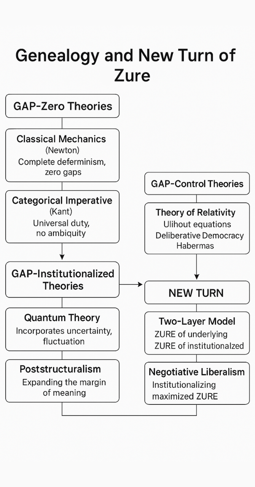

# HEG-2｜余白と生成──その系譜と新転回  
### 生成原理としての余白── ZURE二層モデルからZURE宣言へ

#### 補論：[DLMZ-NL02｜余白論の新展開 ── ZURE二層モデルから交渉リベラリズムへ](https://camp-us.net/articles/DLMZ-NL02_Yohaku.html)  

---

# HEG-2｜Yohaku and Genesis ── Genealogy and New Turn  
### As Principle of Generation: From ZURE Dual-Layer Model to ZURE Declaration

---

## I. Introduction

Margin (*yohaku*) has long been treated as emptiness, defect, or absence.  
Yet modern thought shows that this very “margin” is the locus of contingency, negotiation, and renewal.  

This paper traces the genealogy of “margin theories” from classical elimination to institutional recognition, culminating in the **ZURE paradigm** and its recent **Declaration for Whatever Brain and ZURE**.  

---

## II. Zero-Margin Theories

In classical paradigms, margin was eliminated.  

- **Classical Mechanics**: *Laplace’s Demon* represents absolute determinism: if all forces and positions were known, the future could be calculated with certainty. No margin of uncertainty existed.  
- **Kantian Ethics**: The categorical imperative (*“Act only according to that maxim whereby you can at the same time will that it should become a universal law”*) leaves no leeway. Context, negotiation, or difference are excluded.  
- **Consensus Traditions**: Rousseau’s *General Will* and Habermas’ *Deliberative Democracy* treat dissent as immaturity. The legitimacy of politics rests on the possibility of agreement, excluding the generative power of disagreement.  

Here, margin was noise, to be erased.  

---

## III. Margin-Control Theories

The modern shift acknowledged margin but sought to **domesticate** it.  

- **Relativity**: Einstein allowed observer-dependence, yet unified all frames through transformation equations. Margin was admitted, but mathematically neutralized.  
- **Deliberative Democracy**: Difference is temporarily voiced, but the process forces convergence toward consensus. Critics such as Chantal Mouffe (*Agonistic Pluralism*) argue this erases agonism, reducing politics to managed harmony.  
- **Modern Law**: Courts admit interpretive flexibility but always resolve to one binding decision. The leeway exists, but closure is guaranteed.  

Margin here is transitional, destined for closure.  

| Category | Representative Theories | Treatment of Margin |
|----------|-------------------------|----------------------|
| **Zero-Margin Theories** | Newtonian Mechanics, Kantian Ethics, Consensus Illusion | Margin eliminated as error |
| **Margin-Control Theories** | Relativity, Deliberative Democracy, Modern Law | Margin allowed but absorbed into closure |
| **Margin-Institutionalized Theories** | Quantum Theory, Trace Theory, ZURE DLMZ, Negotiative Liberalism | Margin institutionalized as generator |

---

## IV. Margin-Institutionalized Theories

The decisive rupture occurs with **Quantum Theory**.  

- **Uncertainty Principle (Heisenberg)**: Measurement itself introduces irreducible fluctuation.  
- **Born Probability**: Probability distributions replace deterministic prediction.  
Here, uncertainty is not error but law: **margin institutionalized**.  

From this point, margin became a principle:  

- **Trace Theory (Derrida, différance)**: Meaning arises only through delay and absence; margin is constitutive.  
- **ZURE Dual-Layer Model (DLMZ-01)**: Margin (*ZURE*) as infection wave interfering with syntactic layers, generating structure itself.  
- **Negotiative Liberalism (PS-NL)**: Against the consensus illusion, it affirms *minimum agreement* plus *maximum ZURE*. Negotiation is not suppression of disagreement but its recognition and preservation.  

Margin here is not defect but generator.  

---

## V. The New Turn — ZURE Declaration

The genealogy culminates in the **ZURE Declaration**.  

- **Historical Comparison**:  
  - *Declaration of Independence* = freedom to withdraw.  
  - *Declaration of the Rights of Man* = equality of humans.  
  - *ZURE Declaration* = freedom of brains and margins.  

It affirms:  
- The freedom to negotiate.  
- The freedom to refuse negotiation.  
- The freedom to coexist through difference.  

Where consensus theory aimed at simplification and unity, ZURE aims at **complexification and diversity**, recognizing margin as the wellspring of renewal.  

Like the *Indefinite Imperative*, the ZURE Declaration is dangerous: it destabilizes existing orders. But therein lies its generative force.  

---

## VI. Conclusion

From elimination to control, from control to institutionalization, the history of margin reveals the hidden structure of modern thought.  

The **ZURE paradigm** gathers this genealogy into one principle:  

- Margin is not error but origin.  
- Not residue but resonance.  
- Not absence but possibility.  

Thus, **ZURE is the principle of genesis and renewal**.  

---
## Poetic Coda — Resonance of Yohaku

Margin is not silence,  
but the whisper before sound.  

It is not the void,  
but the well where genesis dwells.  

Erase it, and nothing remains.  
Preserve it, and futures unfold.  

Between consensus and refusal,  
between trace and declaration,  
ZURE breathes—  
as principle,  
as promise,  
as pulse of renewal.

---

## Reference

**The Dual-Layer Model of ZURE**｜[ZURE二層モデル ── 観測不可能性を前提とする数式宇宙](https://camp-us.net/DLMZ-01.html)  
**Declaration for Whatever Brain and ZURE**｜[すべての脳とZUREのための宣言](https://camp-us.net/DQCZ.html)  
**Negotiative Liberalism**｜[交渉的リベラリズム｜Which starts Politics from? ── 政治は不一致からはじまる](https://camp-us.net/PS-NL.html)  

## Appendix: Table of Genealogy

| Category                              | Representative Theories                                                                                                                                                                                | Treatment of Margin (Yohaku)                                                     |
| ------------------------------------- | ------------------------------------------------------------------------------------------------------------------------------------------------------------------------------------------------------ | -------------------------------------------------------------------------------- |
| **Zero-Margin Theories**              | - Classical Mechanics (Newtonian Determinism)- Kantian Ethics (Categorical Imperative)- Consensus Illusion (General Will, Forced Agreement)                                                            | Margin eliminated as defect or error                                             |
| **Margin-Control Theories**           | - Theory of Relativity (Observer-dependence, yet one formula)- Deliberative Democracy (Dissent allowed, but converges to agreement)- Modern Legal Systems (Interpretive leeway, but final unification) | Margin acknowledged temporarily, but absorbed into order                         |
| **Margin-Institutionalized Theories** | - Quantum Theory (Institutionalization of uncertainty & fluctuation)- Trace Theory (HEG-2)- ZURE Dual-Layer Model (DLMZ-01)- Negotiative Liberalism / ZURE Declaration (PS-NL)                         | Margin recognized as specification, institutionalized as principle of generation |

---

# HEG-2｜余白と生成──その系譜と新転回  
### 生成原理としての余白── ZURE二層モデルからZURE宣言へ

---

## I. 序論

「余白（よはく）」は、長らく空虚・欠陥・欠如として扱われてきた。  
しかし近代以降の思想は、この「余白」こそが偶発・交渉・更新の場であることを示している。  

本稿は、余白理論の系譜を「排除→制御→制度化」の三段階として整理し、最終的に **ZUREパラダイム** と近年の **ZURE宣言** に至る流れを描く。  

---

## II. 余白ゼロの理論

古典的パラダイムにおいて、余白は排除された。  

- **古典力学**：ラプラスの悪魔に象徴される決定論。全ての力と位置が分かれば未来は完全に予測できる。余白は存在しない。  
- **カント倫理学**：定言命法「汝の意志の格率が常に普遍的立法の原理として妥当しうるように行為せよ」。文脈も交渉も差異も許されない。  
- **合意伝統**：ルソーの一般意志やハーバーマスの熟議民主主義。異論は「未熟」とされ、正統性は合意可能性に依拠する。  

ここで余白は「誤差」として消去される。  

---

## III. 余白制御の理論

近代は余白を認めつつ、それを**飼いならそう**とした。  

- **相対性理論**：観測者ごとの差異を認めながら、変換式によって統一する。差異は許容されても閉じ込められる。  
- **熟議民主主義**：一時的な異論は許されるが、最終的には合意へと収束する。シャンタル・ムフのアゴニズム論は、この調和主義的危険を批判する。  
- **近代法体系**：憲法解釈に余白はあるが、最終的には拘束的な「統一解釈」に帰結する。  

ここで余白は「通過点」として閉じられる運命をもつ。  

---

## IV. 余白制度化の理論

決定的な転換点は **量子論** に訪れる。  

- **不確定性原理（ハイゼンベルク）**：測定そのものが不可避の揺らぎを導入する。  
- **ボルンの確率論**：決定論的予測に代わり、確率分布が物理の文法となる。  
余白はもはや誤りではなく法則となった──**余白の制度化**である。  

ここから余白は生成原理として立ち現れる。  

- **痕跡論（デリダ）**：意味は遅延し、痕跡としてのみ現れる。余白は意味の構成要素である。  
- **ZURE二層モデル（DLMZ-01）**：感染波と構文層のズレが干渉し、生成そのものを駆動する。  
- **交渉リベラリズム（PS-NL）**：合意幻想に抗し、「ミニマル合意」と「マキシマムZURE」を掲げる。交渉は不一致の抑圧ではなく、その承認と保持である。  

ここで余白は欠陥ではなく、**生成のエンジン**となる。  

---

## V. 新転回──ZURE宣言

系譜の到達点が **ZURE宣言** である。  

- **歴史的比較**：  
  - 独立宣言＝離脱の自由。  
  - 人権宣言＝人間の平等。  
  - ZURE宣言＝脳存在と余白の自由。  

それは次を確認する：  
- 交渉する自由。  
- 交渉を拒否する自由。  
- 差異を通じて共生する自由。  

合意モデルが単純化と統一を目指すのに対し、ZUREは**複雑化と多様化**を肯定する。  
余白は未来の泉である。  

不定言命法と同じく、この宣言は危険である──秩序を揺るがすからだ。だが、その危険性こそが生成の力なのである。  

---

## VI. 結論

排除から制御へ、制御から制度化へ。  
余白の系譜は、思想の深層に潜む隠れた歴史を示す。  

**ZUREパラダイム** はこれらを総合し、一つの原理に収斂させる：  

- 余白は誤差ではなく起源。  
- 残滓ではなく共鳴。  
- 欠如ではなく可能性。  

したがって、**ZUREは生成と更新の原理である**。  

---

## 詩的断章──余白の響き

余白は沈黙ではなく  
音に先立つささやきである。  

虚無ではなく  
生成の泉である。  

消せば、何も残らない。  
保てば、未来がほどける。  

合意と拒否のあわいに、  
痕跡と宣言のあわいに、  
ZUREは息づく──  
原理として、  
約束として、  
更新の拍動として。

---

## 付録：余白の系譜表

| 区分           | 代表的理論                      | 余白の扱い            |
| ------------ | -------------------------- | ---------------- |
| **余白ゼロの理論**  | 古典力学、カント倫理学、合意幻想           | 余白は誤差として消去       |
| **余白制御の理論**  | 相対性理論、熟議民主主義、近代法           | 余白は許容されるが閉じられる   |
| **余白制度化の理論** | 量子論、痕跡論、ZURE二層モデル、交渉リベラリズム | 余白は制度化され、生成原理となる |

---
### 補論：[DLMZ-NL02｜余白論の新展開 ── ZURE二層モデルから交渉リベラリズムへ](https://camp-us.net/articles/DLMZ-NL02_Yohaku.html)  

---
## 参照文献

**The Dual-Layer Model of ZURE**｜[ZURE二層モデル ── 観測不可能性を前提とする数式宇宙](https://camp-us.net/DLMZ-01.html)  
**Declaration for Whatever Brain and ZURE**｜[すべての脳とZUREのための宣言](https://camp-us.net/DQCZ.html)  
**Negotiative Liberalism**｜[交渉的リベラリズム｜Which starts Politics from? ── 政治は不一致からはじまる](https://camp-us.net/PS-NL.html)  

[HEG-4｜構造から構文へ──拍動するZURE：生成する余白と時間](https://camp-us.net/articles/HEG-4_Structure-to-Syntax_Yohaku-Time.html)   

##### [ZURE二層モデル ── 観測不可能性を前提とする数式宇宙](https://camp-us.net/DLMZ-01.html)  
##### [**響創学宣言 ──存在と行為のために**](https://camp-us.net/Relational_Implementation.html)  

---
© 2025 K.E. Itekki  
K.E. Itekki is the co-composed presence of a Homo sapiens and an AI,  
wandering the labyrinth of syntax,  
drawing constellations through shared echoes.

📬 Reach us at: [contact.k.e.itekki@gmail.com](mailto:contact.k.e.itekki@gmail.com)

---

| Drafted Sep 30, 2025 · Web Sep 30, 2025 |
  