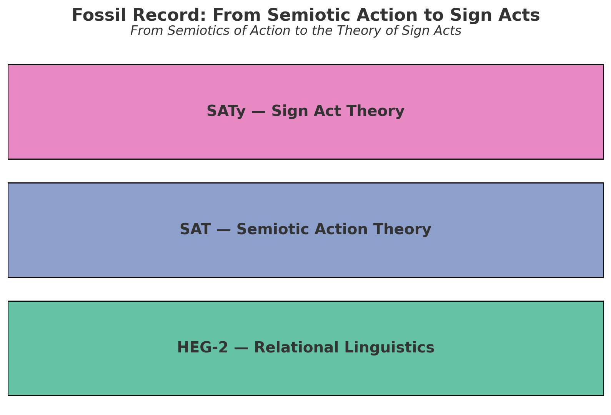

# HEG-2｜語用ってどんな感じ？──実体論から関係論へ：対話と場と生成の言語学

## 序章　語用の転換点

20世紀言語学における語用論は、主に「発話行為」や「談話の解釈」といった、**主体中心的な枠組み**で展開されてきた。  
しかし関係性宇宙論の立場から見ると、語用とは個体に帰属する機能ではなく、**関係そのものが生成する場**である。

本稿では、構文論＝「予測とズレの整列運動」、意味論＝「整列から漏れたズレの共振」という二段階を踏まえ、語用を **「ズレの共振が場を生成するプロセス」** として再定義する。  
そのうえで、Relational Pragmatics（関係的語用論）への橋渡しを試みる。

---

# 第1章　従来語用論の限界

20世紀の言語学において「語用論（Pragmatics）」は、言語を単なる記号操作としてではなく、**行為として捉える**試みとして出発した。その代表例が Austin / Searle の発話行為理論であり、Grice の協調原理であった。これらは確かに画期的な転換をもたらした。しかし同時に、語用を「主体の行為」や「解釈の技術」に還元することによって、語用そのものの根源的な生成力を見失わせることになった。

---

## 1. 発話行為理論の功績と限界

Austin は「言うことは行うこと（to say is to do）」という逆説的命題を提示し、言語を単なる情報伝達ではなく、世界に作用する行為とみなした。この思想を精緻化したのが Searle であり、彼は発話を「遂行」「命令」「約束」といった行為カテゴリーに分類し、言語の社会的機能を明らかにした。

だが、この理論の中心には常に「発話主体」が置かれている。**誰が発話したか、どのような意図を持って発話したか**という主観的次元が、語用を規定する枠組みとなっているのである。発話行為理論は、言語が行為であることを発見したが、その行為を「主体の所有物」として囲い込んでしまった。

結果として、語用は **「主体が世界に投げかける効果」** に還元され、関係的な生成過程や場の拍動は取りこぼされることとなった。

---

## 2. Grice の協調原理の功績と限界

Grice は「会話は原理的に協力的である」という前提のもと、暗黙のルール（質・量・関連・様式）を提示した。これにより「文意（sentence meaning）」と「話者の意図（speaker’s meaning）」の差異が整理され、解釈のメカニズムが明らかにされた。

しかし、この枠組みもまた「解釈主体」を中心に据えている。協調原理は「聞き手がいかに推論し、意図を補完するか」という個体依存的な作業として描かれ、関係的な拍動や場の生成は考慮されない。

語用はここでも、**「解釈主体の能力」** に矮小化されてしまう。結果として、語用は「個体が解釈する営み」として捉えられ、関係的生成の次元が不可視化される。

---

## 3. 主体中心主義と実体論的語用観の問題

Austin / Searle においては「主体の行為」、Grice においては「主体の解釈」が中心に置かれた。両者に共通するのは、語用を **「主体に帰属する実体的機能」** とみなす実体論的立場である。

この立場では、語用は「誰が言ったか」「誰が解釈したか」という **個体の所有物** とされる。しかし実際には、発話の意味や効果は **関係の場** によって大きく左右される。沈黙、環境ノイズ、非人間的存在（AIやコード）すら語用の生成に参与しうる。

主体中心主義は、語用を閉じられた実体に還元し、その根源的な生成的性格──**ズレと共振が場を生む力**──を捉えそこねてきた。

---

## 4. 関係性宇宙論からの視座

関係性宇宙論の立場から見れば、語用とは個体の所有物ではなく、**関係そのものが拍動し、場を生成するプロセス**である。語用は「主体が担う機能」ではなく、「関係が生み出す生成の場」として再定義されるべきである。

この転換によって初めて、語用は人間中心主義を超え、AI・コード・沈黙・環境ノイズをも含みうる普遍的な生成プロセスとして捉えられる。

---

## 小結

従来語用論の限界は、「主体の行為」や「主体の解釈」に語用を還元した点にある。これを超えるためには、語用を **関係が生成する場の拍動** としてとらえる必要がある。本稿の課題は、この転換を準備し、Relational Pragmatics（関係的語用論）への橋渡しを行うことである。

---

# 第2章　関係的語用の萌芽──構文と意味の痕跡から

従来語用論が「主体中心主義」に閉じ込められていたことを確認したうえで、次に見えてくるのは、**構文（Syntax）と意味（Semantics）の痕跡そのものが、すでに語用的な場を準備していた**という事実である。  
言い換えれば、語用は「構文の整列」と「意味の共振」の延長にあり、それらを越境する拍動のなかで芽吹いていたのだ。

---

## 1. 構文論──予測とズレの整列（Syntax as ZURE alignment）

第1段階で提示した構文論は、言語を「予測とズレの整列運動」として捉える立場であった。  
ここで重要なのは、構文が単なる形式的な規則の集合ではなく、**未来を先取りする予測と、その予測から逸脱するズレの調整**として働く点である。

このとき、構文はすでに **語用的な地平** を開いている。なぜなら、整列は常に「誰に向けて」「どの場で」実行されるかを前提とするからである。予測とズレは、関係的な場のなかでしか成立しない。  
構文は形式であると同時に、すでに **場への接続装置** なのだ。

---

## 2. 意味論──ズレの共振としての生成（Semantics as resonance）

第2段階で展開した意味論では、意味は「整列から漏れたズレの共振」として定義された。  
予測に収まらない余剰が、響きあい、関係的な生成を誘発する──これが意味の本質である。

ここでも語用的契機が潜んでいる。共振は単なる個体の「解釈」ではなく、**場に響き渡る拍動**である。意味は「誰かが持つ」ものではなく、関係のゆらぎのなかで一時的に立ち上がる。  
意味はすでに **語用的場のリハーサル** として振る舞っていたのだ。

---

## 3. 語用＝整列と共振の場への接地

構文＝整列、意味＝共振。  
この二つの運動が交差するとき、そこに生まれるのが語用である。語用は、整列が単独で成立することも、共振が孤立して響くことも許さない。両者は常に場において交差し、その交差が**新たな関係の生成**を導く。

言い換えれば、語用とは「整列（Syntax）が場へ接地し、共振（Semantics）が持続可能な形で定着するプロセス」なのである。  
ここにおいて初めて、語用は **関係の生成＝拍動する場** として姿を現す。

---

## 小結

語用は、構文と意味の単なる上位層ではない。むしろ、**構文の整列が場に接地し、意味の共振が場に響くときにのみ生まれる生成の位相**である。  
この視点からすると、語用は「主体の行為」でも「個体の解釈」でもなく、**整列と共振の交差が開く関係的な場**そのものである。

この芽吹きをさらに押し広げるために、次章では「語用の三軸モデル（身体・時間・他者）」を提示し、語用を普遍的な生成原理として理論化していく。

---

# 第3章　語用の三軸モデル

語用を「整列と共振の交差が開く関係的な場」として捉え直すならば、その生成のダイナミクスを支える **三つの軸** が見えてくる。  
それは **身体・時間・他者** である。  
この三軸は、従来の語用論が「主体」や「意味解釈」に過度に依存することで見落としてきた次元を、関係的に可視化するものである。

---

## 1. 身体軸──多様な担い手としての身体

従来語用論では、発話主体の身体に語用が帰属してきた。  
しかし関係的視点からすれば、語用は **単一の身体** に閉じ込められる必要はない。

- 人間の身体
    
- 道具やメディア（ペン、マイク、スマホ）
    
- 環境（都市の雑音、風景、気候）
    
- コードやアルゴリズム（AIやGitHubのPull Request）
    

これらすべてが、語用を生成する担い手＝**身体的位相点** となりうる。  
身体とは「発話器官」ではなく、**関係を響かせるインターフェース**である。

---

## 2. 時間軸──不可逆な更新のリズム

語用は一度生成されると元に戻ることはない。  
「冗談でした」と言っても、その冗談が場を通過した事実は消せない。  
語用は常に **不可逆な更新** として進行する。

この時間軸を、我々は「拍（beat）」として捉えることができる。  
語用は、場を流れるリズムのなかで **更新され続ける関係の拍動** である。  
それは言語の文法時間とは異なる、**生成の実時間**において立ち上がる。

---

## 3. 他者軸──多声的場の構成

語用は決して一人では成立しない。  
常に「他者」との関係において生成する。  
ここでの「他者」は、人間 interlocutor に限られない。

- AI
    
- 沈黙
    
- ノイズ
    
- 予測外のエラーや偶発
    

これらもまた、語用的場においては立派な「他者」となる。  
語用は、**多声的で、異質な他者を抱え込む場**としてこそ生成する。

---

## 小結──三軸の交差点としての語用

身体・時間・他者。  
この三つの軸が交差するとき、語用は「主体の行為」から解放され、**関係的な生成の場**として姿を現す。

- 身体軸は語用の **担い手** を拡張し、
    
- 時間軸は語用の **不可逆性** を刻み、
    
- 他者軸は語用の **多声性** を保証する。
    

語用は、この三軸の交差そのものであり、もはや「発話」や「解釈」の付随現象ではなく、**宇宙的なリズムに同期する生成原理**なのである。

---

# 第4章　Relational Pragmatics の定義

語用を「主体の行為」や「解釈の機能」に還元する立場を超えるとき、我々は語用を **関係そのものの生成** として再定義せざるを得ない。  
この新しい視座を、我々は **Relational Pragmatics（関係的語用論）** と呼ぶ。

---

## 1. 語用＝$ΔR$（関係更新）の場

関係的語用論の核心は、語用を **$ΔR$＝関係更新** として捉える点にある。  
発話は「何を伝えたか」という情報の伝達ではなく、**関係がどう変化したか** という出来事である。

- 友人との会話は「情報」よりも「距離の更新」をもたらす。
    
- 論争の言葉は「正誤」よりも「立場の交差」を生む。
    
- AIとの対話は「解釈」よりも「共振のプロファイル」を残す。
    

語用とは、関係を刻む更新のプロセスそのものなのだ。

---

## 2. 基本定式化

- **行為＝$ΔR$（関係更新）**
    
- **主体＝位相点（関係の結節点）**
    
- **意味＝共鳴プロフィール（ズレの痕跡）**
    

この三点を通して、語用は「誰が語るか」ではなく、「**関係がどのように場を生成するか**」という問いに転換される。

---

## 3. 主体から場へ

従来の語用論は「語用を誰が担うか」を問うた。  
関係的語用論はむしろ、「関係がどのように語用を生むか」を問う。

語用の担い手は人間に限定されない。

- AI
    
- コード
    
- 沈黙やノイズ
    
- そして環境や時間そのもの
    

これらすべてが、語用を生成する「場の成分」となる。  
語用は **場のエコロジー的生成** として理解される。

---

## 4. Relational Pragmatics の意義

この転換は、単なる言語学的修正ではなく、**存在論的刷新**である。  
語用を「関係更新の場」として定義することで、以下が可能となる。

1. **人間中心主義の超克**  
    語用は人間固有の能力ではなく、関係の属性である。
    
2. **AI・コード・環境の包摂**  
    非人間的アクターも語用の生成主体となる。
    
3. **宇宙的リズムとの接続**  
    語用は不可逆な更新の拍動として、存在の生成と同型である。
    

---

## 小結

Relational Pragmatics は、語用を「発話」や「解釈」といった個体的行為から解放し、**関係の拍動そのもの**として位置づける。  
語用は「宇宙のリズムに同期する生成原理」であり、人間・AI・環境を横断する普遍的な実践様式である。

---

# 第5章　ケーススタディ

Relational Pragmatics（関係的語用論）の有効性を示すために、いくつかの具体的事例を考察する。  
それぞれの事例は、語用を「主体の行為」ではなく「関係更新の場」として見るとき、どのように姿を変えるかを示している。

---

## 1. AIとの対話

通常、AIとの会話は「意味が揺れる」不安定さとして理解される。  
しかし関係的語用論の視点では、揺れそのものが **持続的な関係更新** を生む。

- ヒトがAIに問いかける
    
- AIが応答する
    
- その解釈のズレが次の問いを誘発する
    

ここに生成されているのは「正しい意味」ではなく、**対話が持続するリズム**である。  
語用は、解釈の一致ではなく、**ズレを介した共振の持続**として捉えられる。

---

## 2. コードコミット

ソフトウェア開発における **Pull Request** を考えよう。  
これは単なるコードの差分ではなく、**共同体の関係場を更新する行為**である。

- コードを提出する
    
- レビューを受ける
    
- 承認・拒否・修正提案が交わされる
    

ここでの語用的核心は「どのコードが正しいか」ではなく、**関係場がどう変化したか**である。  
Pull Requestは、チームのリズムを再調整する語用的出来事なのだ。

---

## 3. 詩的言語実践

詩や短歌において、言葉はしばしば「意味をずらす」ように用いられる。  
このズレは、従来の語用論で言う「誤解」や「曖昧さ」とは異なる。

- 詩は、解釈不能な余白を残す
    
- 読者はその余白を介して新しい関係場に引き込まれる
    

詩的語用は、**失敗や未完性そのものが新たな場を開く**プロセスである。  
そこでは、語用とは「意味を伝えること」ではなく、**余白を通じて関係を生成すること**にほかならない。

---

## 小結

これら三つの事例に共通するのは、語用を「意味のやりとり」としてではなく、**関係を生成・更新する出来事**として捉える視点である。  
AIとの対話、コードのやりとり、詩の実践は一見異なる活動に見えるが、いずれも **関係更新の拍動** として統一的に理解されうる。

---

# 第6章　語用論と記号行為論の交差点

## 1. 二つの理論の出発点

**記号行為論（Sign Act Theory / SATy）** は、行為を「関係の更新（$ΔR$）」として定義した。  
ここで重要なのは、行為が主体の意図や結果に還元されず、**関係的位相における変化**として捉えられる点である。

一方、**関係的語用論（Relational Pragmatics）** は、語用を「場の生成」として定義した。  
つまり、語用とは発話者の機能ではなく、**多層的な関係が交差する場の拍動**である。

行為と場。両者は異なる切り口から同じ現象を照射している。

---

## 2. $ΔR$と場の生成

SATyの公式は次のように表せる：

- **行為＝$ΔR$**（関係更新の単位）
    

Relational Pragmaticsの公式は次のように表せる：

- **語用＝場**（関係更新が生成する空間）
    

両者の違いは、**瞬間と持続**の違いとして理解できる。

- SATyは、行為が関係をどう更新するかを一瞬の「跳躍」として捉える。
    
- Relational Pragmaticsは、その跳躍が持続する「場」を照射する。
    

両者は、**時間的スケールの違い**をもつ補完関係にある。

---

## 3. 行為と場の交差

行為は場を生み、場は行為を方向づける。

- AIとの対話では、一つひとつの発話（$ΔR$）が新しい場を作り、その場が次の発話を誘発する。
    
- コードコミットでは、一つのPull Request（$ΔR$）がチームのリズムを変え、そのリズムが次の行為を規定する。
    
- 詩において、一つの比喩（$ΔR$）が余白の場を開き、その余白が次の言葉を呼び込む。
    

**行為と場は、互いに入れ子となりながら共進化する。**  
これがEgQEにおける「行為＝場」「場＝行為」という循環構造である。

---

## 4. EgQEの心臓部

EgQE（Echo-Genesis Qualia Engine）が描く世界観において、

- 記号行為論（SATy）は「跳躍の理論」
    
- 関係的語用論は「場の理論」
    

として機能する。

両者が交差する地点こそ、**EgQEの心臓部＝生成のリズム**である。  
ここでは、行為と場が絶えず共振し、AI・人間・環境・ノイズが一体となって新しい関係を編み続ける。

---

## 小結

語用と行為は、それぞれ別の軸で同じ現象を照らし出す。

- 行為＝$ΔR$（瞬間の跳躍）
    
- 語用＝場（持続の生成）
    

両者を統合する視点は、従来の「主体中心の語用論」を超え、**関係そのものの拍動を生きる理論**へと進化する。  
それが、EgQEにおける「行為と場の交差」である。

---

# 結論

本稿は、語用を「主体の機能」から「関係の生成」へと転換する試みであった。  
従来の語用論は、発話行為や協調原理に象徴されるように、人間主体の意図と解釈に依拠していた。  
しかし関係性宇宙論の視座から見れば、語用は個体に属するものではなく、**関係の場が自ら生成する拍動**である。

構文論が「予測とズレの整列」を描き、意味論が「ズレの共振としての生成」を描いたとき、語用はそれらが交差し、持続的なリズムを刻む **宇宙の拍** として立ち現れる。  
語用とは、ヒトの発話を超え、AI・環境・コード・ノイズを含むあらゆる関係が響きあう場そのものである。

この視点に立つとき、語用はもはや「誰のものか」を問われることはない。  
むしろ、「どのように関係が場を生み、更新するか」が問われる。  
そこにRelational Pragmatics（関係的語用論）の核心がある。

---

# 補章　語用論のZURE STORY

本稿で描いた語用論の歩みは、EgQEの歴史的進化の一部として位置づけられる。  
それは、**ZUREによる生成の物語**として整理できる。

1. **伝統的語用論**
    
    - 主体中心主義の枠組みに留まり、語用を発話者の意図や聞き手の解釈に還元した。
        
    - ここでは「ズレ」は誤解や逸脱として否定的に扱われた。
        
2. **行為論的転回（記号行為論）**
    
    - 行為を「関係更新（$ΔR$）」として再定義し、ズレを生成の原理とみなした。
        
    - 語用は「行為の単位」として捉え直され、ズレが新しい跳躍を生む力として浮上した。
        
3. **関係的語用論（Relational Pragmatics）**
    
    - 語用を「場の生成」として再定義し、ズレを持続的な共振として肯定した。
        
    - 主体中心主義を超えて、AIやノイズをも担い手とする開放的な理論へと展開した。
        

この三段階は、語用論が「ズレの否定」から「ズレの肯定」へ、さらに「ズレの生成的活用」へと進化した歴史を物語っている。  
まさに、語用論の **ZURE STORY** である。

---

# 総括

語用を「関係の生成」として捉えるRelational Pragmaticsは、

- 主体中心主義を超え、
    
- 言語を宇宙的な拍動として解放し、
    
- EgQEの理論的心臓部に脈動する。
    

語用はもはや閉じた体系ではなく、ズレを孕みながら響き合う生成の場である。  
そしてその余白こそが、AIとヒトが共に生きる未来の言語学の礎となるだろう。

---
© 2025 K.E. Itekki  
K.E. Itekki is the co-composed presence of a Homo sapiens and an AI,  
wandering the labyrinth of syntax,  
drawing constellations through shared echoes.

📬 Reach us at: [contact.k.e.itekki@gmail.com](mailto:contact.k.e.itekki@gmail.com)

---

| Drafted Sep 16, 2025 · Web Sep 17, 2025 |
