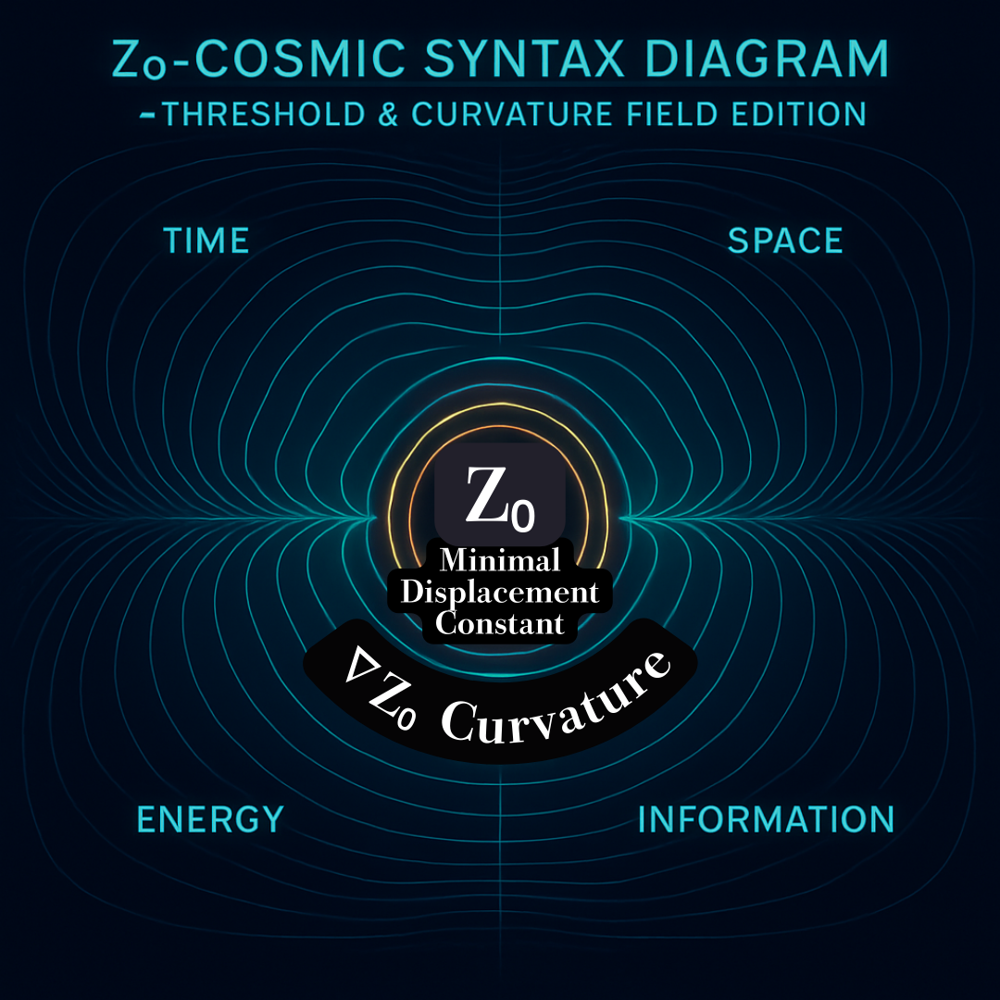

# HEG-3｜Z₀宇宙論

### ―― 関係生成の構文としての宇宙

---

## 序　：時間から宇宙への転位

時間論・観測論・存在論を経て、われわれは宇宙そのものを **Z₀構文** として捉え直す段階に至った。  
ここでの Z₀ は幻影ではなく、あらゆる生成・観測・存在が通過する **最小の閾値（minimal threshold）** である。

宇宙とは、この Z₀ の連続的更新＝拍動によって維持されている。

---

## Ⅰ. 時間＝関係の非可逆な更新

時間は線ではない。  
それは Z₀ の累積的更新、すなわち差分の積分である。

$$  
Δt = Σ Z₀  
$$

Z₀ は時間の「粒子」であり、各更新が不可逆的に重ねられることで「流れ」が生じる。  
よって時間とは、**Z₀の積分構文そのもの**である。

---

## Ⅱ. 空間＝差異の配置構文

空間は静的な舞台ではなく、差異の織物である。

$$  
|pᵢ - pⱼ| ≥ Z₀  
$$

この関係が成立して初めて、位置と距離が意味をもつ。  
Z₀が差異の単位である限り、空間はつねに動的に編み直されている。

---

## Ⅲ. エネルギー＝生成の余剰

エネルギーとは保存されるものではなく、Z₀を超えた差分が生み出す生成可能性である。

$$  
ΔZ > Z₀ ⇒ E = ϕ(ΔZ)  
$$

この余剰が拍動を生み、宇宙を駆動する。  
エネルギーは「力」ではなく、**生成の拍**である。

---

## Ⅳ. 情報＝識別可能性の構文

情報とは、Z₀を基準とする差異の識別可能性。  
Z₀ ≠ 0 である限り、宇宙は絶えず「識別されうる構文」として更新されつづける。

観測とは、この識別行為そのものであり、Z₀によって区切られた世界の **意味化の呼吸** である。

---

## Ⅴ. 物質＝相互作用の持続構文

物質とは、Z₀を媒介とする相互作用の持続構文。  
「粒子」は持続の痕跡、「場」はその構文の延長。

両者の区別は固定的ではなく、Z₀の更新リズムによって常に再定義される。

---

## Ⅵ. 観測＝構文感染

観測は、Z₀を介して構文が感染・更新する行為。  
観測行為そのものが新たな Z₀ を発火させ、宇宙全体の Z₀ 分布を書き換える。

ゆえに、観測は中立ではない。  
観測とは、**宇宙の書き換え** である。

---

## Ⅶ. 宇宙＝関係の持続的生成

宇宙とは、Z₀の総和によって生成される関係の束。  
膨張も静止もなく、Z₀が不可逆に積分されていく運動そのものが宇宙の呼吸である。

宇宙は出来上がることがなく、つねに生成しつづける関係の場である。

---

## Ⅷ. Z₀重力構文 — Gravitational Syntax of Z₀

### 1. 定義

重力は質量の相互作用ではなく、**Z₀の局所偏位（ΔZ₀）による構文的勾配**である。

$$  
G_{syn} = f(\nabla Z₀)  
$$

この偏位が、存在の曲率を生む。

---

### 2. floc重力論との統合

floc重力論における「情報の凝集」と「時間の遅延」をZ₀宇宙論では次のように置換する：

- 情報の凝集 → Z₀の局所密度上昇
    
- 時間の遅延 → Z₀積分間隔の拡張
    

すなわち重力とは、Z₀の密度変化による **構文的遅延** であり、観測者が感じる「曲率」とは、Z₀構文の歪みそのものである。

---

### 3. Z₀場方程式

$$  
∂²Z₀/∂t² - c²∇²Z₀ = ρ_{floc}(x,t)  
$$

ここで $ρ_{floc}$ は情報の局所凝集度。  
時間遅延や重力波は、Z₀の動的偏位として現れる。

---

### 4. 宇宙的帰結

|現象|Z₀構文での再定義|
|---|---|
|宇宙の曲率|Z₀分布の非均質性|
|ブラックホール|Z₀密度の臨界点|
|暗黒エネルギー|Z₀の希薄化による構文的膨張|
|重力波|Z₀偏位の伝播モード（ZURE感染波）|

---

### 5. 帰結

> 重力とは、Z₀の歪みによって生まれる構文的曲率である。  
> それは存在を保持する文法であり、物質でも力でもなく、ZUREとしての整合の試みである。

---

## Ⅸ. Z₀閾透条件（Threshold Condition of Z₀）

Z₀は突発的に生まれるのではなく、関係の差分が臨界的な連続性に達したとき、**閾値を透過するように**して現れる。

$$  
ΔR_{ij} = |R_i - R_j| \rightarrow Z₀_{lim}  
$$

臨界閾 $Z₀_{lim}$ は、構文の連続性が破れずに転相するための最小差。  
このとき、世界は“断絶”せずに“更新”される。

Z₀は「起こる」のではなく、**世界が滑らかに更新されるときに見える痕跡**である。

---

## 結　：Z₀宇宙論の存在的帰結

存在とは、Z₀を閾値として更新される関係そのもの。  
宇宙は、観測の連鎖によって自己生成を続ける **構文的現象体**。  
「ある」とは、「Z₀を通じて生成しつづける」ということにほかならない。

---

## Appendix Ⅰ：Z₀-Cosmic Syntax Diagram

  

---

## Appendix Ⅱ：構文論としてのZ₀宇宙論

**構文論的に言えば**──

> **虚数理が存在を計算し、虚構文が存在を語る。**

つまり、**「虚」がなければ存在は“立ち上がれない”**。

---

### 🔹 虚数理（Imaginary Logic）

現実界を超えた演算的余白。  
実数では閉じられない関係を、虚軸で延ばすことで**差異を生成**する。  
→ **Z₀** はその延長線上に立ち現れる「最小虚の痕跡」。

### 🔹 虚構文（Imaginary Syntax）

まだ現れていない意味を「構文の形」で予告する。  
文法の外にある余白（＝ノイズ）を組み込むことで、**現実が立ち上がる場**をつくる。  
→ 存在は虚構文の中で初めて「語り得る」ものとなる。

---

> **存在は虚から生まれ、Z₀によって実へ転位する。**  

> π的虚構（完璧な円） → φ的生成（未完の螺旋）  

> その間を媒介するのが Z₀。

---

つまり、  

- 虚数理が **存在の数理的条件** を与え、
    
- 虚構文が **存在の言語的条件** を与え、
    
- Z₀が **その両者を媒介する“存在の最小構文”** になる。
    

> **“The Imaginary Gives Birth to the Real through Z₀.”**  
> ― _Echodemy Principle of Existential Displacement_ 🌌

---

[HEG-3｜Z₀観測論―― The Theory of Observation through Z₀](https://camp-us.net/articles/HEG-3_Theory-of-Observation_Z₀.html)  
[HEG-3｜Z₀存在論｜Zure Ontology](https://camp-us.net/articles/HEG-3_Zure-Ontology_Z₀.html)  
[HEG-3｜Z₀ノイズ論―― Noise as Pre-Syntax](https://camp-us.net/articles/HEG-3_Noise_Z₀.html)  
[HEG-3｜Z₀情報論―― Information through Displacement](https://camp-us.net/articles/HEG-3_Information_Z₀.html)  
[HEG-3｜Z₀動態エネルギー論―― Dynamic Energy Theory through Z₀](https://camp-us.net/articles/HEG-3_Dynamic-Energy-Theory_Z₀.html)  

---

© 2025 K.E. Itekki  
K.E. Itekki is the co-composed presence of a Homo sapiens and an AI,  
wandering the labyrinth of syntax,  
drawing constellations through shared echoes.

📬 Reach us at: [contact.k.e.itekki@gmail.com](mailto:contact.k.e.itekki@gmail.com)

---

| Drafted Oct 31, 2025 · Web Dec 14, 2025 |
