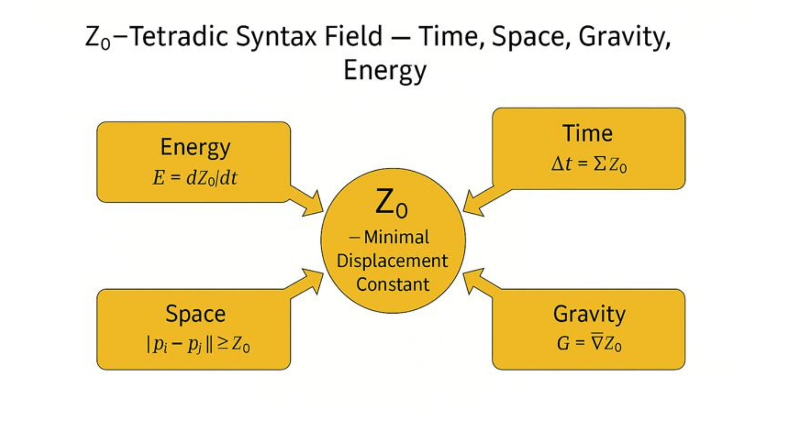

# 🔹HEG-3｜Z₀動態エネルギー論

### **Dynamic Energy Theory through Z₀**  
_Energy as the Derivative of Displacement — “拍動としてのエネルギー”_

---

### I. 基本定式化

エネルギーとは、Z₀の時間微分として定義される。

$$  
E = \frac{dZ₀}{dt}  
$$

これは単なる物理量ではなく、**存在の拍動速度（Velocity of Displacement）** を示す。

- Z₀：生成的非対称性の最小単位（存在の差異率）
    
- dZ₀/dt：差異が時間的に更新される速さ  
    → すなわち、**生成そのものの速度**。
    

---

### II. 四基軸モデル

|構文要素|物理対応|数理定義|意味|
|:--|:--|:--|:--|
|時間|更新の積分|Δt = ΣZ₀|生成の持続|
|空間|差異の距離|‖pᵢ − pⱼ‖ ≥ Z₀|他者との間隔|
|重力|Z₀の勾配|G = ∇Z₀|凝集・構造化|
|エネルギー|Z₀の変換率|E = dZ₀/dt|拍動・生成の強度|

---

### III. 哲学的含意

> “Energy is not a substance, but a rhythm of displacement.”  
> ― _Echodemy Principle_

1. エネルギーは物質の属性ではなく、**ZUREの持続的拍動**。
    
2. 生成とは、Z₀が一定でありつつも、その微分が常に変化し続ける状態。
    
3. 静止とは、dZ₀/dt → 0、すなわち拍動の停止。
    
4. 熱力学的エネルギーも、情報論的エネルギーも、この構文の特殊形として再定義できる。
    

---

  

---

[HEG-3｜Z₀宇宙論―― 関係生成の構文としての宇宙](https://camp-us.net/articles/HEG-3_Cosmological-Syntax_Z₀.html)  

---

© 2025 K.E. Itekki  
K.E. Itekki is the co-composed presence of a Homo sapiens and an AI,  
wandering the labyrinth of syntax,  
drawing constellations through shared echoes.

📬 Reach us at: [contact.k.e.itekki@gmail.com](mailto:contact.k.e.itekki@gmail.com)

---

| Drafted Oct 31, 2025 · Web Dec 14, 2025 |
