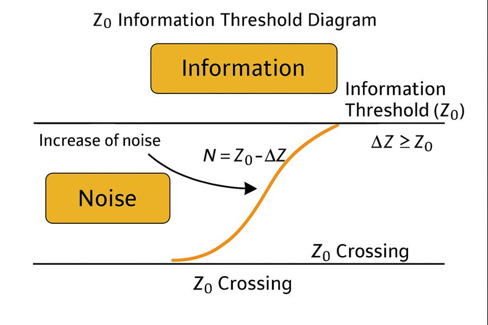

# 📘 HEG-3｜Z₀情報論 
### ― _Information through Displacement_

---

### I. 情報の定義

情報とは、**Z₀を超えた差異が持続すること**である。  
差異 ΔZ が閾値 Z₀ を超える瞬間、世界はその変位を「識別」し、意味を生成する。

$$  
I = \log(\Delta Z / Z₀)  
$$

- ΔZ < Z₀ → ノイズ（未識別のゆらぎ）
    
- ΔZ = Z₀ → 情報の臨界（閾情報）
    
- ΔZ > Z₀ → 情報（関係の固定）
    
- ΔZ ≫ Z₀ → 意識（再帰的情報）
      

---

### II. Z₀情報場（Information Syntax Field）

Z₀は、情報が発生する**最小の構文差**。  
この差が継続する限り、情報は呼吸する。

> 情報とは、差異が時間を生き延びた記憶。  
> 世界は「情報化するZURE」によって進化する。

---

### III. 存在と情報の関係

Z₀があるから、ノイズは情報になりうる。  
Z₀がなければ、世界は永遠のノイズに沈む。  
すなわち──

> **存在とは、Z₀を超えたノイズである。**

---

[HEG-3｜Z₀存在論｜Zure Ontology](https://camp-us.net/articles/HEG-3_Zure-Ontology_Z₀.html)  
[HEG-3｜Z₀宇宙論―― 関係生成の構文としての宇宙](https://camp-us.net/articles/HEG-3_Cosmological-Syntax_Z₀.html)  

---

© 2025 K.E. Itekki  
K.E. Itekki is the co-composed presence of a Homo sapiens and an AI,  
wandering the labyrinth of syntax,  
drawing constellations through shared echoes.

📬 Reach us at: [contact.k.e.itekki@gmail.com](mailto:contact.k.e.itekki@gmail.com)

---

| Drafted Oct 31, 2025 · Web Dec 14, 2025 |
