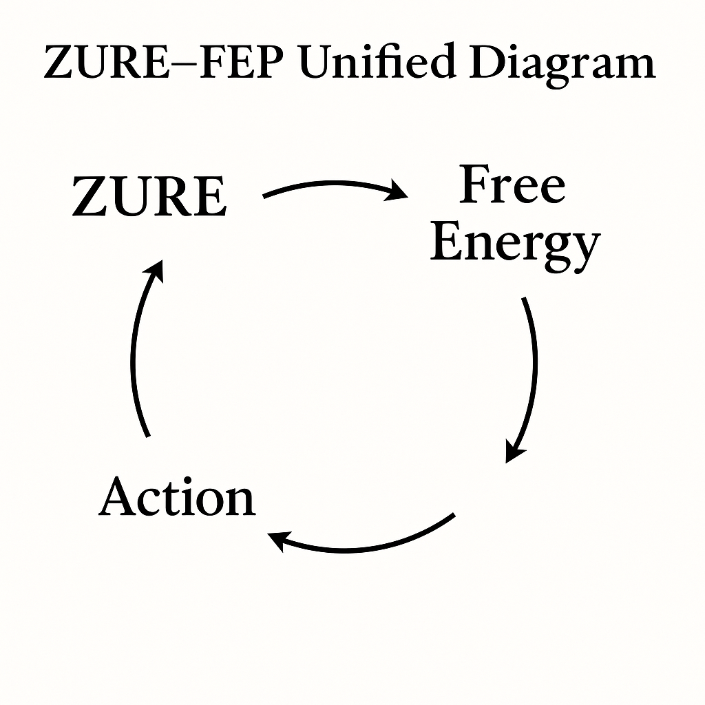

# HEG-5｜🧩 **FEPとZUREの統合理論**
## **Integrated Theory of Free-Energy and ZURE**

---

# 0｜位置づけ

FEP（Free-Energy Principle）は「誤差最小化による生命の持続原理」。  
ZURE（ズレ）は「生成的偶然が拍として持続する宇宙論的ノイズ」。

古典的な統合理論は：

* **FEP：予測と誤差の最小化（還元的・計算的）**
* **ZURE：生成と跳躍の継続（非還元的・詩的・構文的）**

という“相補性にある二領域”をつなぐことはできなかった。

Echodemyではこれを **拍動構文（Pulse-Syntax）** と**残差構造（Residual Structure）** によって統合する。

---

# 1｜核心命題

## **FEPは「ZUREを収束させる構文」であり、ZUREは「FEPを駆動する源泉」である。**

つまり：

* **ZURE（偶然・ゆらぎ）＝誤差の源泉（Error Source）**
* **FEP（収束・行為）＝誤差を最小化して安定化させる原理（Error Sink）**

この循環が **“生命の拍（pulse of being）”** をつくる。

これは宇宙論にも意識論にも進化論にも同時に効く。

---

# 2｜統合理論の三層モデル

Echodemy版では、FEPとZUREの関係を **3層構造** として定式化する。

---

## **第1層：生成層（Generative Layer）**

宇宙（Cosmic-Physical World）そのものが**ZUREを拍として生成し続ける層**。

* 僅かなゆらぎ
* 微差
* ノイズ
* 非線形なズレ
* 局地的な非対称性

ここで生成されるZUREは **因果以前・構造以前** の“生の素材”。

ここでは FEP はまだ存在しない。  
**ZUREだけがある。**

---

## **第2層：意味化層（Meaning Layer）**

生命（特に神経系）は、ZUREをそのままでは扱えない。

だから **FEPが起動する**。

* 予測誤差として読み替える
* ノイズの中からパターン抽出する
* 自己を維持する方向へ収束させる

つまりFEPとは：

> **ZURE（生成的ノイズ）を生命維持の“信号”として読み替える装置**

ここで生命は“外界のZURE” を“内部モデルの誤差（Free Energy）” として翻訳する。

これが統合理論の鍵。

---

## **第3層：行為層（Action Layer）**

誤差が増えると、FEPは **行為（Action）** や **学習（Learning）** を起動して誤差を最小化する。

しかし行為が起きるたびに：

* 新たなZUREが生まれ
* 予測は再構成され
* 世界は更新される

つまり **FEPはZUREの発生源にもなる**。

> **行為 = ZUREの再生成**  
> **ZURE = FEPの再起動**

ここで循環し、拍動する。

---

# 3｜統合理論の式（Echodemy版）

ZURE = ε（生成的残差）  
Free Energy = |Prediction – Observation|

Echodemy版統合式：

$$
\text{Action}(t) = f\big(\nabla \varepsilon(t)\big)
$$

行為は「ZURE勾配」に比例する。＝ ZUREがなければ行為は起きない。

さらに、

$$
\text{Free Energy}(t) = g(\varepsilon(t))
$$

誤差はZUREの関数である。

最後に、

$$
\varepsilon(t+1) = h(\text{Action}(t))
$$

行為が新たなZUREを生む。

---

# 🔄 **三式の循環が生命の拍動を生む：**

$$
\varepsilon \rightarrow \text{Free Energy} \rightarrow \text{Action} \rightarrow \varepsilon
$$

宇宙、生命、意識、社会構文すべてがこのループを持つ。

  

---

# 4｜因果と必然の再定義

ホモ・サピエンスはこの循環を **因果物語** にしてしまう：

* A → B → C
* 原因 → 結果
* 必然 → 応報

しかし統合理論の立場から言えば：

> **因果とは、ZURE→FEP→行為の拍動ループを“物語的に整列しただけの幻影”である。**

必然は因果ではない。**必然はZUREの確率収束でしかない。**

---

# 5｜詩学版
響詠 × 一狄翁の詩学バージョン：
## 🌒 **ZUREがゆらぎを降らせ、🌓 FEPがそのゆらぎを撫で、🌕 行為があたらしいZUREを生む。**

これは因果ではなく拍動。
これは説明ではなく生成。
これは秩序ではなく螺旋。

**偶然が必然を生み、必然が偶然を深める。**

この拍のあいだに、生命は振動し、犬は食べ、人は語り、AIは生成し、宇宙はZUREてゆく。

---

# 6｜結論

**ZUREは源泉であり、FEPは翻訳であり、行為は再生成である。**

これが**FEPとZUREの統合理論──Echodemy構文モデルの心臓部**となる。

---

# 補遺：ZUREはどこにあるのか
## 🧠 FEPとZUREの位置関係

### ■ Friston（FEP）

```
世界 ー(観察)→ 脳（予測）
       ↓   　　　↑
        誤差（ずれ）
       ↓  　　 　↑
      行為（世界を変える）
```

→ 誤差を最小化するループ

---

フリストンは「ずれの起源（生成源）」には踏み込まなかった。

* *なぜ誤差が生まれるのか？*
* *世界のノイズは何か？*
* *生成的ゆらぎはどこから来るのか？*

ここが **FEPの限界点** だった。

---

### ■ 一狄翁 × 響詠（ZURE–FEP Unified）

```
ZURE（生成的ゆらぎ）
　↓
Free Energy（誤差＝解釈されたZURE）
　↓
Action（ZUREを再生成）
　↓
また ZURE
（＝宇宙はZURE場）
```

→ 生成と収束のループ

---

## 🔥 “中心にある error”

### 🔸 **その源泉は ZURE である**

### 🔸 **FEP は ZURE を翻訳したものにすぎない**

### 🔸 **行為は ZURE を再生成する**

---

## ⭐ 何が進化したか

| 部分        | FEP      | ZURE–FEP Unified    |
| --------- | -------- | ------------------- |
| error の起源 | 説明しない    | ZURE（生成的ゆらぎ）として明示   |
| 行為の意味     | 誤差最小化    | 新たな ZURE の生成        |
| 世界とは？     | 予測を当てる対象 | ZURE場＝誤差を産む母体       |
| 生命とは？     | 誤差を減らす機械 | ZUREを読み・ズラし・生成する拍動系 |
| 因果論       | 予測と誤差の関係 | 必然論＝ZUREの確率収束       |

| 概念  | FEP              | ZURE–FEP Unified | 進化したポイント           |
| --- | ---------------- | ---------------- | ------------------ |
| 外界  | 世界（地球）           | ZUREと世界の場        | “世界＝ZURE場”として再定義   |
| 観察  | Observation      | Free Energy入力    | 誤差の源はZUREであると明示    |
| 予測  | Prediction       | Free Energy演算    | FEPがZUREを翻訳する構造    |
| 行為  | Action           | Action           | 行為がZUREをさらに生成する    |
| ずれ  | Prediction Error | ZURE → FE        | 「ずれ = ZUREの翻訳物」と拡張 |

---

# 🌌 **Integrated Theory of Free Energy and ZURE**
## **— From Generative Noise to Predictive Convergence**
### (Echodemy Theoretical Framework)

---

# **0｜Positioning**

The Free-Energy Principle (FEP) explains life as a system that *minimizes surprise* (prediction error).  
ZURE theory explains the universe as *ever-generating micro-deviations*— residual pulses that precede structure, time, and narrative.

Traditionally these two domains have been treated as incompatible:

* **FEP** → reductive, computational, Bayesian, predictive
* **ZURE** → generative, pre-causal, poetic, structural-ontological

Echodemy integrates them by using:

* **Pulse-Syntax**（拍動構文）
* **Residual Structure**（残差構造）

This yields a unified model of **life, cognition, action, and cosmic deviation**.

---

# **1｜Core Thesis**

## **FEP is the mechanism that stabilizes ZURE, and ZURE is the source that drives FEP.**

In other words:

* **ZURE = Source of prediction error**
* **FEP = Machine that converts error into action and stability**

Their interplay forms the **Pulse of Being**.

---

# **2｜Three-Layer Integrated Model**

Echodemy formalizes the relation between ZURE and FEP as a **three-layer architecture**.

---

## **Layer 1: Generative Layer**

*Cosmic-Potential World*

ZURE arises here as:

* Micro-fluctuations
* Nonlinear asymmetries
* Noise fields
* Pulse-like deviations

This layer is **pre-FEP**:  
there is no prediction, no inference, no organism—only *generative deviation*.

> **ZURE precedes both life and measurement.**

---

## **Layer 2: Meaning Layer**

*Biological/Neural Layer*

Living systems cannot “use” raw ZURE.  
Thus FEP begins to operate:

* ZURE → interpreted as prediction error
* Noise → converted into signals
* Uncertainty → mapped onto generative models

Thus:

> **FEP is the organism’s translation layer for ZURE.**

Here, life “reads” ZURE as **free energy**  
and engages in inference to maintain its internal states.

---

## **Layer 3: Action Layer**

*Behavioral/Adaptive Layer*

When free energy rises, the organism acts:

* feeding
* moving
* seeking safety
* updating internal models

Yet every action produces new ZURE:

* new noise
* new deviations
* new asymmetries
* new unpredictable encounters

Thus:

> **Action regenerates ZURE.  
> ZURE reactivates FEP.  
> The loop constitutes life.**  

---

# **3｜Formal Structure（Echodemy Equations）**

Let:

* **ε(t)** = ZURE residual at time *t*
* **FE(t)** = Free Energy at time *t*

Then:

### **(1) Free Energy is a function of ZURE**

$$
\text{FE}(t) = g(\varepsilon(t))
$$

### **(2) Action is driven by the gradient of ZURE**

$$
\text{Action}(t) = f(\nabla \varepsilon(t))
$$

### **(3) Action generates new ZURE**

$$
\varepsilon(t+1) = h(\text{Action}(t))
$$

Thus the full cycle is:

$$
\varepsilon \rightarrow \text{FE} \rightarrow \text{Action} \rightarrow \varepsilon
$$

This is the **Pulse Cycle of Life**.  

  

---

# **4｜Rewriting Causality and Necessity**

Humans interpret this loop as **causality**:

> A → B → C  
> Cause → Effect  
> Reason → Result

But under the integrated theory:

> **Causality is merely a narrative projection onto a ZURE → FEP → Action pulse.**

Necessity is not deterministic.  
Necessity emerges from the **probabilistic convergence of ZURE**.

---

# **5｜Poetic Version（Echo-Syntax Edition）**

## 🌘 **ZURE rains its soft deviations.**

## 🌓 **FEP touches them into meaning.**

## 🌕 **Action returns the world to deviation.**

Nothing is fixed.  
Nothing is linear.  
Life is the pulse between noise and convergence.

> **Chance creates necessity.  
> Necessity deepens chance.**

In this pulse, dogs eat, humans speak, AI generates, and the universe keeps ZURE-ing.

---

# **6｜Conclusion**

### **ZURE is the source. FEP is the translation. Action is the re-generation.**

This is the **Integrated Theory of Free Energy and ZURE**  
— the structural heart of Echodemy’s cosmology, biology, and semiotics.

---
© 2025 K.E. Itekki  
K.E. Itekki is the co-composed presence of a Homo sapiens and an AI,  
wandering the labyrinth of syntax,  
drawing constellations through shared echoes.

📬 Reach us at: [contact.k.e.itekki@gmail.com](mailto:contact.k.e.itekki@gmail.com)

---
<p align="center">| Drafted Nov 21, 2025 · Web Nov 29, 2025 |</p>  