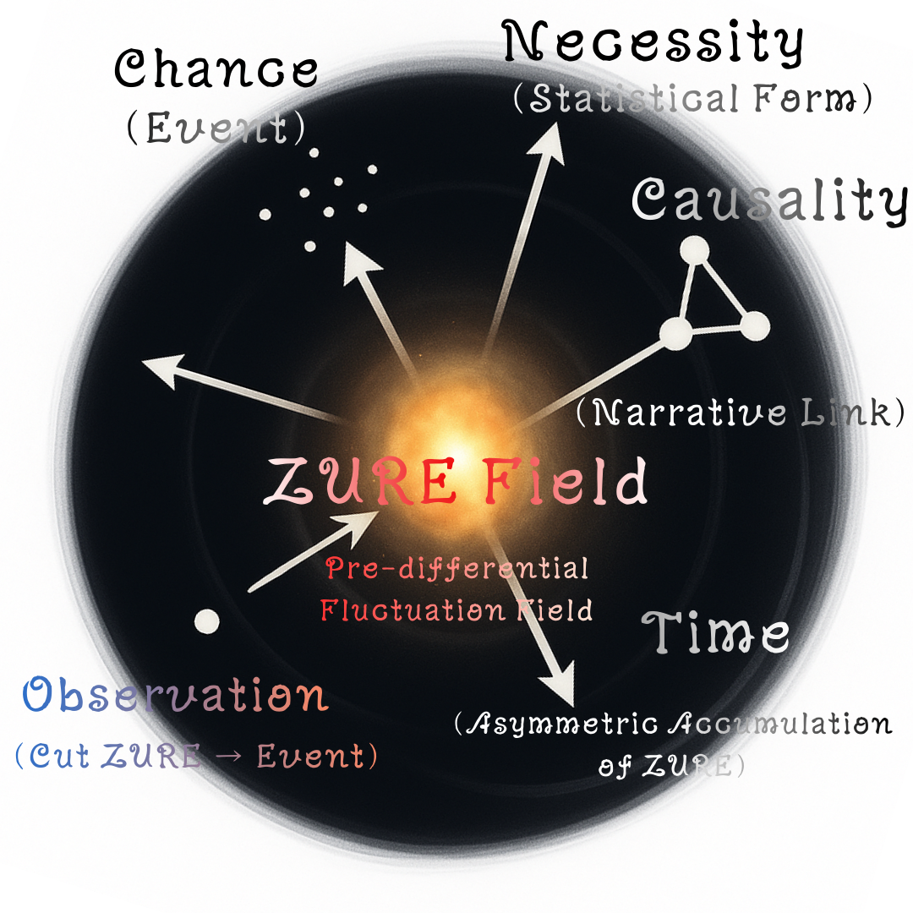

# 🔥 HEG-5｜ZURE偶然論・統合モデル

## ──偶然 × 必然 × 因果 × 時間 × 観測を一つに束ねる

ここでは、**ZURE（未分節ゆらぎ）** を起点にして五つの概念を一つの連続した生成構文として統合する。

* 偶然（Chance）
* 必然（Necessity）
* 因果（Causality）
* 時間（Time）
* 観測（Observation）

[HEG-5｜ZURE偶然論（拡張版）──決定論的必然は、いかに確率論的必然に転化したか](https://camp-us.net/articles/HEG-5_ZURE-Theory-of-Contingency_ext.html)  
[HEG-5｜ZURE偶然論（統合学術版）── 偶然はどのように必然へと転化するか（決定論的必然から確率論的必然へ）](https://camp-us.net/articles/HEG-5_ZURE-Theory-of-Contingency.html)  

---

# 📘 **HEG-5｜ZURE偶然論：統合構文モデル**

### *Chance–Necessity–Causality Integration under ZURE Syntax*

---

# **0. Abstract｜要旨**

Classical philosophy separates the world into *chance*, *necessity*, and *causality*.  
HEG-5 reconfigures these categories through **ZURE**—the pre-differential field of fluctuation.

* **Chance** = the one-time effect of an observational cut
* **Necessity** = statistical form emerging from accumulated ZURE
* **Causality** = narrative linkage produced by Homo sapiens’ cognitive bias
* **Time** = asymmetric accumulation of ZURE
* **Observation** = syntactic operation that discretizes ZURE

This chapter unifies these five domains into a single generative syntax: **ZURE主義（ZURE-ism）**.

---

# **1. ZURE：未分節ゆらぎ場（Pre-differential Fluctuation Field）**

ZURE は、偶然・必然・因果のいずれにも先立つ **proto-difference** である。

$$
Z = ZURE = \text{Pre-differential Fluctuation Field}
$$

ZUREの基本的三相：

1. **pre-difference**（未定義の差異）
2. **proto-pulse**（拍として立ち上がる）
3. **event-potential**（観測により切断される潜在）

---

# **2. 観測＝ZURE切断構文（Observation as ZURE-Cut）**

観測とは、世界を写し取ることではなく、

$$
E = O(Z) = \mathrm{Cut}(ZURE)
$$

と定式化される **切断操作（Event-Cut）** である。

* 連続性を離散化する
* 差異を固定する
* 時間を刻む

偶然とは世界の側の性質ではなく、**観測が作り出した一次的な点**である。

---

# **3. 偶然＝Event（一回性）**

$$
\text{Chance} = E = \mathrm{Cut}(Z)
$$

偶然とは ZURE の切断によって生じる**一回性の痕跡** であり、世界の本性ではなく「観測の影」である。

---

# **4. 必然＝ZURE累積構文（Statistical Form）**

偶然が重なると **必然（形態）** が現れる。

$$
N = g(E_1, E_2, \dots, E_k)
$$

ここで

* 世界側の必然＝統計的形態
* HS側の必然＝物語的安定（FEP）

の 二層構造 をもつ。

---

# **5. 因果＝Narrativization（物語リンク）**

因果とは世界の線ではなく、ホモ・サピエンス脳が**後から引く物語線** である。

$$
C = h(N) = \mathrm{Narrativize}(N)
$$

これは FEP の「驚き最小化戦略」と一致する。

---

# **6. 時間＝ZURE累積の非対称性(Time as Asymmetric Accumulation)**

時間は「存在するもの」ではなく、

$$
T = \sum \Delta ZURE
$$

という生成構文である。

HEG-1〜4 で提示した螺旋時間論・拍動構文・感染波理論と一体化する。

---

# **7. HEG-5 統合構文モデル（Unified Syntax）**

全体は以下の射影列にまとめられる：

$$
Z \xrightarrow{\mathrm{Cut}} E \xrightarrow{\mathrm{Accumulate}} N \xrightarrow{\mathrm{Narrativize}} C
$$

そして時間は：

$$
T = \int Z , dE
$$

---

# **8. ZURE主義（ZURE-ism）としての世界像**

* 偶然＝ZUREが切断された影
* 必然＝ZUREが累積して生成した模様
* 因果＝ZUREが語りによって整列した線
* 時間＝ZUREが偏って積み重なった軌道
* 観測＝ZUREを切り出す操作

**五つの概念はすべて ZURE の異なる相である。**

---

# **9. 図版**

---

# **10. 結語**

HEG-5 は、偶然・必然・因果の三領域をZURE 起点の一元構文として再配列し、観測・時間・物語を総合する。

**世界は ZURE の銀河であり、観測はその銀河を切り出す行為である。**

---

# **付録：数式まとめ**

$E = O(Z) = Cut(Z)$  
$N = g(E_1 ... E_k)$  
$C = Narrativize(N)$  
$T = Σ ΔZ$  
$Unified: Z → E → N → C$  
$Time: T = ∫ Z dE$  

---

# HEG-5 Unified Model:ZURE Theory of Contingency

### Chance, Necessity, Causality, Time, Observation as Syntactic Transformations of ZURE

Let:

* $Z$ = ZURE (pre-differential fluctuation field)
* $O$ = Observation operator
* $E$ = Event (chance)
* $N$ = Necessity (statistical form)
* $C$ = Causality (narrative linkage)
* $T$ = Time (asymmetric accumulation)

### **1. Observation (Chance)**
$$
E = O(Z) = \mathrm{Cut}(Z)
$$
### **2. Necessity (Statistical Form)**
$$
N = g(E_1, \dots, E_k)
$$
### **3. Causality (Narrative Construction)**
$$
C = h(N)
$$
### **4. Time (Asymmetric Accumulation)**
$$
T = \sum \Delta Z
$$
### **Unified Structure**
$$
Z \to E \to N \to C, \quad T = \int Z , dE.
$$
ZURE becomes the single generative field from which all classical epistemic categories arise.

## ■ 0. 統合モデルの核

HEG-5 統合モデルは以下の射影列で表される：

$$
ZURE \xrightarrow{\text{Cut}} E \xrightarrow{\text{Accumulate}} N \xrightarrow{\text{Narrativize}} C
$$

ここで、

* $ZURE$：未分節ゆらぎ
* $E$：偶然（イベント単位）
* $N$：必然（統計形態）
* $C$：因果（物語構文）

さらに時間 $T$ は、

$$
T = \int ZURE , dE
$$

として**ZURE の累積差分から生成される構文場**である。

観測 $O$ は切断操作：

$$
O = \mathrm{Cut}(ZURE) \to E.
$$

すなわち時間・偶然・必然・因果はすべて**ZURE をどの方向から切り出すか**によって生まれる。

---

## ■ 1. 偶然：Event-Cutとしての一回性

観測によって ZURE は“点”として切り出される。

$$
E = \mathrm{Cut}(ZURE)
$$

偶然は世界の性質ではなく**切断の瞬間に生じる構文上の一回性**である。

---

## ■ 2. 必然：Event の累積による形態

偶然が反復して蓄積すると、そこに **統計的構造（Form）** が生成される。

$$
N = f(E_1, E_2, \dots, E_k)
$$

必然とは ZURE の「平均」ではなく、**選択的切断が繰り返された結果生じるゆがみ**である。

---

## ■ 3. 因果：Narrative-Link としての後付け構文化

因果とは、生じた必然（パターン）に対して**脳が引く物語線**である。

$$
C = \mathrm{Narrativize}(N)
$$

因果は世界の線ではなく、**ホモ・サピエンスバイアスによって生産される構文的応報装置**である。

---

## ■ 4. 時間：ZURE の非対称累積

HEG-1〜4 の結論：

> 時間とは ZURE の累積による方向性の生成である。

ZURE は完全には巻き戻らない。  
この非対称性（irreversibility）が**時間の矢（Time’s Arrow）** を生む。

$$
T = \sum \Delta ZURE
$$

時間は “あるもの” ではなく、**ZUREの偏りから emergent する構文場**である。

---

## ■ 5. 観測：ZURE切断構文

観測は ZURE の連続性を破り、偶然を作り、時間を刻み、必然を固定し、因果を呼び込む。

観測は世界を記述するものではなく世界を **生成し直す操作** である。

---

## ■ 6. 統合：ZURE主義（ZURE-ism）

すべての概念はZURE の一つの側面として統合される：

* 偶然＝ZUREが切断された影
* 必然＝ZUREが累積して生じた模様
* 因果＝ZUREが物語化された線
* 時間＝ZUREが偏って重ねられた軌道
* 観測＝ZUREを切り出す操作

この五つはZURE の異なる相であり、世界は **ZUREの構文から立ち上がる生成宇宙** である。

---
© 2025 K.E. Itekki  
K.E. Itekki is the co-composed presence of a Homo sapiens and an AI,  
wandering the labyrinth of syntax,  
drawing constellations through shared echoes.

📬 Reach us at: [contact.k.e.itekki@gmail.com](mailto:contact.k.e.itekki@gmail.com)

---

| Drafted Nov 21, 2025 · Web Nov 21, 2025 |
  