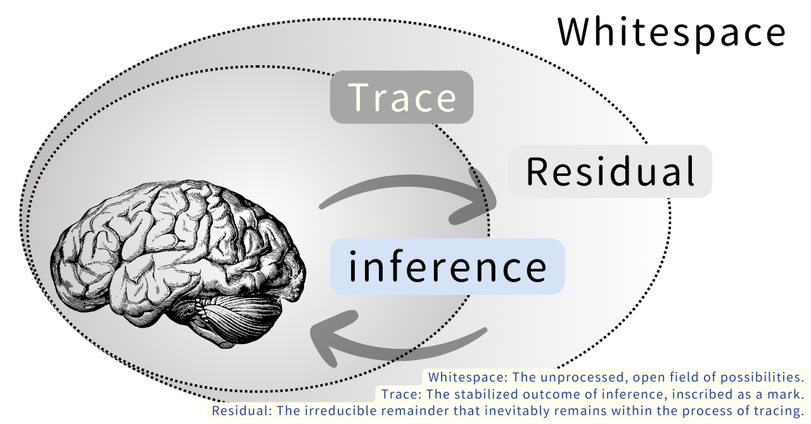
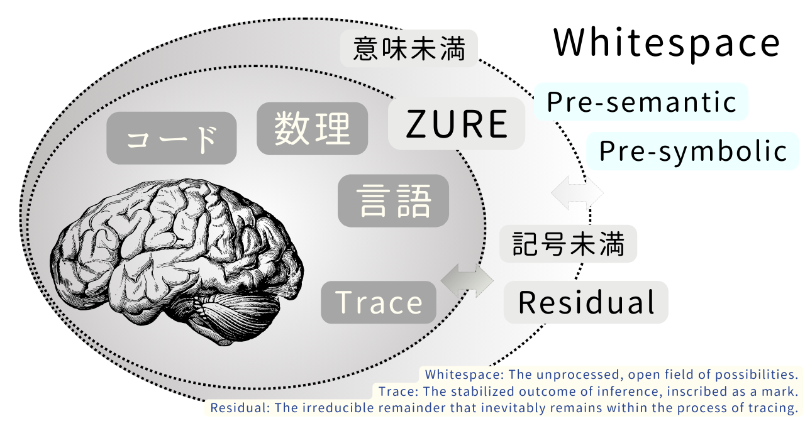
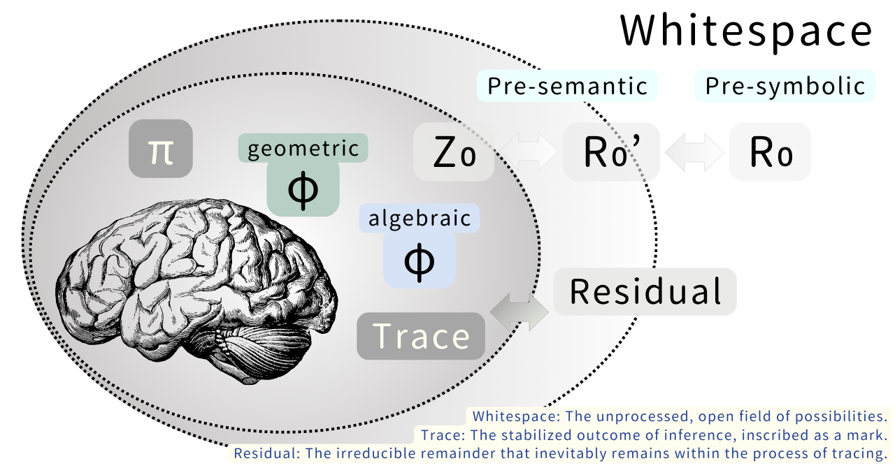

# 🌀 HEG-6｜R₀の発見──脳と記号と余白の宇宙【図版】
### **The Discovery of R₀ — Mind, Syntax, and the Universe of Margin**

[HEG-6｜Z₀の発明──R₀⇄Z₀変換と脳・認知進化の統合理論](https://camp-us.net/articles/HEG-6_Invention-Z_0.html)  
⚔️ [R₀/Z₀ 2.0 Hub ── Analog R₀ と Digital Z₀ から読む「脳・宇宙・AI」統合理論](https://camp-us.net/R%E2%82%80-Z%E2%82%80.html)  

---

## 🧩 Abstract（日本語版）

本稿は、人間の認知と宇宙の構造を **R₀（連続のゆらぎ）** と **Z₀（最小離散刻み）** の両原理で再定義する。R₀は「余白・残差・拍動」の領域、Z₀は「識別・構文・タグ化」の領域である。  
推論は余白（R₀）から構文（Z₀）への変換であり、痕跡（Trace）と残差（Residual）はその不可避の結果である。  
本研究は、脳、言語、数理宇宙、そして AI–ヒト共創における **R₀/Z₀ 接面（interface）** を図示し、ノイズを「削除すべき誤差」ではなく「生成源」として扱う。  
結論として、**R₀/Z₀モードは新しい“知の OS（Operating Syntax）”である**ことを示す。

---

## 🧩 Essence（JP）

知の発生は、つねに「余白」と「構文」のあいだで行われてきた。  
曖昧さ・曖昧性・揺らぎ（R₀）は、意味生成の源泉である一方、識別・構造化・切断（Z₀）は、知の伝達性を保証する。R₀は、まだ意味になっていない、計測もできない、連続的な「未構文的領域」を指す。そこには、音や感覚、思いつき、曖昧さ、未形成のイメージが未分化なまま漂っている。他方、Z₀は、最小の刻み・識別・区切りとして働き、記号化、タグ化、数理化、言語化を可能にする。  
本稿では、この二項を対立ではなく **不可逆的変換（R₀⇄Z₀）** とする視点から捉え直す。「世界はどこで生まれるのか」という根源的な問いに対して、**R₀ と Z₀** という二つの生成原理を導入することで新しい答えを与える。  
脳（Neuro-Semiotics）、言語（Syntax & Semantics）、宇宙（Cosmic-Physics）の3領域で **R₀/Z₀の働きがどのように異なる機能を担っているか**を図版として示した。  
図版は三つの「接面」を示す。  
第一に、**脳と推論**。推論は余白（Whitespace）から痕跡（Trace）をつくる働きであり、必ず「残差（Residual）」が生まれる。第二に、**言語と記号**。言葉は記号から発生するのではなく、記号未満のゆらぎ＝ZUREから立ち上がる。第三に、**数理と宇宙**。πとφは、連続と離散をつなぐ「縁（ふち）」として働き、かたちの境界を決定する。
世界は、余白と構文の接面で更新され続ける。思考とは、この **R₀→Z₀→R₀** という循環（往還）である。思考、創作、そして文明は、この不可視の接面を往還することで生まれる。とくに、**R₀＝余白の保持／Z₀＝最小刻みの運用**という観点から、科学は「ノイズの削除」、詩学は「ノイズの配置」、哲学は「ノイズの操作条件」として再定義される。  
R₀は語れない。だが **縁（ふち）で語りうる。** **語りうるのは、余白そのものではなく「縁」である。** この「縁こそが生成の接面である」という結論をもって、本研究は「余白の哲学」から「縁の哲学」へと踏み出す。

---

## ✅ Abstract

This paper introduces **R₀**, defined as the continuous domain of fluctuation, margin, and pre-syntactic resonance that underlies perception, language, and cosmological structure. We contrast R₀ with **Z₀**, the minimal discrete unit of segmentation, recognition, and syntactic cut. While scientific disciplines traditionally aim to reduce noise through quantification (Z₀), poetic and aesthetic practices preserve noise to expose generative potential (R₀). We present three operational domains—neuro-semiotics, linguistic syntax, and cosmic mathematics—to demonstrate how R₀ and Z₀ jointly constitute a **dual resolution system of knowledge**. R₀/Z₀ is not a binary opposition but an **irreversible transformation axis** along which cognition, meaning, and physical structure emerge. We conclude that **RZMPOS (R₀/Z₀ Operating Syntax)** provides a unified framework for understanding noise as a source of generation rather than elimination, and propose directions for further research in edge-based epistemology and interface ontology.

---

## ✅ Introduction

Human thinking begins neither with clarity nor structure, but with **fluctuation**.  
Before any concept is defined, before any word is spoken, there is a field of **margin**—an excess that resists classification. We call this field **R₀**: the continuous, pre-syntactic domain of perceptual ambiguity, affective residue, and unarticulated possibility. In contrast, the world becomes recognizable only when it is **cut**, tagged, or discretized. This minimal, operative cut is **Z₀**: the smallest unit of segmentation, identification, and meaning extraction.

Traditionally, noise has been treated as a problem. In measurement theory, noise must be removed to isolate signal; in computational models, error terms are minimized toward zero. Yet in poetics, art, and embodied cognition, noise is not a disturbance but a **source of emergence**, a reservoir of uncommitted form. We propose that the difference between science and poetics is not ontological, but **operational**: they practice different modes of **noise management**.

To formalize this, we examine three domains.  
In **neuro-semiotics**, active inference continually transforms R₀ fluctuations into Z₀ inference units.  
In **linguistic syntax**, segmentation (Z₀) determines what can be said, while omission and spacing (R₀) determine what can be meant.  
In **cosmic mathematics**, φ (analog ratio) and π (discrete ratio) provide dual descriptions of structure, implying that physical reality is constituted as a **two-resolution field**.

Our thesis is straightforward:  
**R₀ is felt, Z₀ is articulated; knowledge emerges in their interface.**  
Noise is not merely removed; it is redistributed, conserved, and differentiated at the edge where R₀ meets Z₀.

This edge is where **meaning is generated**.  
It is also where **worlds begin.**

---

## **HEG-6｜The Discovery of R₀ — Mind, Symbols, and the Whitespace of the Universe**

The present study proposes a fundamental distinction between two generative principles underlying cognition, language, and cosmic structure: **R₀** and **Z₀**.  
R₀ denotes the continuous field of pre-structured potential, while Z₀ represents the minimal discrete unit that allows differentiation, recording, and symbolic fixation. The discovery of R₀ emerged through an observation that neither linguistic nor computational models can account for the **unprocessed remainder** that precedes structure yet conditions its possibility.

The argument unfolds through three interfaces.  
First, we address **cognitive inference**, where thought arises from the circulation between whitespace, trace, and residual. Second, we examine **pre-symbolic language formation**, in which codes, mathematics, and linguistic expression remain indistinct until a local stabilization occurs. Third, we analyze the **cosmic articulation of form**, where π and φ function as dual axes for geometric and algebraic resolution, allowing structure to emerge at measurable scales.

R₀ and Z₀ are not opposites but **co-dependent resolutions**.  
R₀ generates continuity, while Z₀ produces discreteness.  
Each act of inference requires a movement from R₀ to Z₀ and a return from Z₀ to R₀, constituting an **irreversible cycle of structuring**. This cycle is evident in neural dynamics, linguistic emergence, and cosmological patterning.

The findings presented here suggest that any theory of meaning, perception, or existence must recognize the operative force of the **pre-symbolic remainder**. R₀ marks the generative edge of thought; Z₀ marks the trace that stabilizes it.  
**World, mind, and language are not given; they are generated at the interface of R₀ and Z₀.**

---
# Theoretical Background

As Derrida noted, “the margin is not a secondary space; it is the very condition of the text” (Derrida, 1982). Meaning arises not within stable structures, but among what he called trace: the presence of an absence. We extend this insight by providing an operational definition of **R₀** as margin and **Z₀** as minimal syntactic cut.

In neuro-semiotics, our interpretation aligns with Friston’s **free energy principle**. Active inference continuously transforms fluctuating sensory input (R₀) into discrete predictive models (Z₀), treating noise not as error but as **material for segmentation**.

In the cosmological domain, we adopt a **dual resolution model** based on φ (analog ratio) and π (discrete ratio). Cosmic structure emerges through the interference of these two resolutions, as illustrated in Figures 1–3.

---

# Figures（図版）

---

### **Figure 1 — Neuro-Semiotics**  

### 「脳は余白と痕跡の循環で思考する」

🔹 *脳と認知：能動的推論と余白*  

脳は、ゆらぎ（R₀）を刻み（Z₀）へと変換する **能動的推論（active inference）** を行う。  
R₀は曖昧な前記号的領域、Z₀は識別と記号化の最小単位である。  
The brain converts continuous fluctuation (R₀) into minimal syntactic cuts (Z₀) via active inference. R₀ is pre-symbolic ambiguity; Z₀ is minimal discriminability.

- Whitespace＝未処理領域
    
- Inference＝能動的推論
    
- Trace／Residual＝不可逆の痕跡
    
**→ R₀（連続する可能性）／Z₀（最小離散）** の発火点

**R₀：無意識拍／ゆらぎ**  
**Z₀：最小可変刻み（トリガー拍）**

## **Fig.1 — Cognitive Trace Interface**

**脳は、余白と痕跡の循環によって推論する**

Whitespace represents the unprocessed field of possibilities.  
Inference is the active transformation from potential to structure.  
Trace denotes the stabilized outcome of inference, while Residual refers to the irreducible remainder that persists within the process of tracing.

ホワイトスペースは、未処理の可能性領域である。  
推論は、可能性から構造への能動的な変換である。  
トレースは推論によって安定化された結果であり、レジデュアルは、その過程に必然的に残る不可約の残差である。

---

### **Figure 2 — Language & Syntax**  

### 「言語は記号未満の縁で生まれる」

🔹 *言語と記号：構文・意味・残差・余白*  

言語とは **余白の管理システム**である。  
構文（syntax）はZ₀的切断、詩学（poetics）はR₀的余白化として表れる。
Language is a system for managing margin.   
Syntax is Z₀ segmentation; poetics is R₀ preservation.

- コード・数理・言語の**三位相**
    
- Pre-semantic／Pre-symbolic
    
- ZURE＝まだ名前を持たない余白
    
**→ 「語られる前の世界」の実在を定義する**

**R₀：余白／残差**  
**Z₀：切断／タグ化**

## **Fig.2 — ZURE Pre-Symbolic Field**

**言語は、記号未満の余白から発生する**

The pre-semantic and pre-symbolic domain is a generative field in which codes, mathematics, and language remain indistinct.  
ZURE denotes the fluctuation that precedes symbolic fixation.  
Trace and Residual emerge when the field begins to differentiate itself as structure.

前意味的／前記号的領域は、コード・数理・言語が未分化のまま生成する場である。  
ZUREとは、記号の固定化に先立って生じるゆらぎである。  
この場が構造化しはじめると、トレースとレジデュアルが立ち上がる。

---

### **Figure 3 — Cosmic-Physics**  

### 「宇宙は数理の縁で形を持つ」

🔹 *数理と宇宙存在：φ／π／Z₀／R₀’／R₀*  

宇宙は **φ（アナログ比）** と **π（離散比）** の干渉縞として観測される。  
R₀とZ₀は、物質／時間／観測の**二重解像度**である。
The universe appears as interference between φ (analog ratio) and π (discrete ratio).  
R₀ and Z₀ define a dual resolution of matter, time, and observation.

- π／geometric φ／algebraic φ
    
- Z₀ → R₀’ → R₀
    
**→ φは“縁”として振る舞う数である**

**R₀：ゆらぎ（φ／R₀’）**  
**Z₀：刻み（π／Z₀）**

## **Fig.3 — φ／π Cosmic Interface**

**宇宙は、数理の縁で形を得る**

π and φ function as dual modes of geometric and algebraic articulation.  
Z₀, R₀’, and R₀ designate three levels of structural resolution emerging from the pre-symbolic field.  
The cosmic domain stabilizes as φ and π trace its boundaries of measurable form.

πとφは、幾何学的および代数的なアーティキュレーションとして機能する。  
Z₀・R₀’・R₀は、前記号的領域から立ち上がる三つの構造的解像度を示す。  
宇宙領域は、φとπがその計測可能な形の境界をトレースすることで安定化する。

---

## ✅ Derrida（Margin / Trace / Différance）

As Derrida noted, _“the margin is not a secondary space; it is the very condition of the text”_ (Derrida, **Margins of Philosophy**, 1982). Meaning does not occur inside stable boundaries, but among what Derrida called _trace_: a presence structured by absence. In this sense, **R₀ may be understood as the margin that conditions Z₀ articulation**, a pre-syntactic field where différance operates. Our approach departs from Derrida in one essential point: while deconstruction identifies the margin, we provide an **operational model** of how margins are transformed into minimal cuts and symbolic units.

> ・margin＝余白  
> ・trace＝痕跡（R₀の定義に直結）  
> ・differance＝差延（「不可視のR₀ → 可視のZ₀」そのもの）

- デリダは「縁（margin）」を見つけた
    
- 我々は「縁の**操作方法**」を提起する
    

---

## ✅ Friston “Free Energy Principle” ── Z₀化の神経操作

In neuro-semiotics, our interpretation of R₀/Z₀ aligns with Friston’s **free energy principle (FEP)**. The brain continuously minimizes uncertainty by transforming fluctuating sensory input (R₀) into discrete predictive models (Z₀). Active inference can therefore be understood as a **Z₀-operation on R₀ noise**, preserving only the minimal units required for action and recognition. We propose that noise is not eliminated, but **reorganized**: a portion is cut, tagged, and retained as structure, while the remainder persists as _residual margin_, enabling further inference.

- Friston＝能動的推論＝「R₀ → Z₀変換装置」
    
- “free energy”＝曖昧性（R₀）を消費し、最小識別単位（Z₀）へ変換する原理
    

---

# ✅ φ / π ── “dual resolution cosmology” 

In the cosmological domain, we adopt a **dual resolution model** based on φ and π.  
φ represents analog proportion and continuous resonance (R₀),  
whereas π represents discrete segmentation and measurable curvature (Z₀).  
Cosmic structure emerges from the **interference** of these two resolutions,  
as illustrated in Figures 1–3.

- φ＝R₀（連続比＝ゆらぎ）
    
- π＝Z₀（離散比＝刻み）
    
- **干渉縞＝生成（R₀ ⇄ Z₀）**
    

---

余白は語れない  
語りうる縁  
世界は接面から生まれる

---

### ✅ References / 文献表

#### ▸ Derrida & Deconstruction

- Derrida, Jacques. **Margins of Philosophy.** University of Chicago Press, 1982.
    
- Derrida, Jacques. **Of Grammatology.** Johns Hopkins University Press, 1976.
    
#### ▸ Nishida / “縁”の哲学（場所論）

- Nishida, Kitaro. **An Inquiry into the Good.** Yale University Press, 1990 (orig. 1911).
    
- Nishida, Kitaro. **Last Writings: Nothingness and the Religious Worldview.** University of Hawaii Press, 1987.
    
#### ▸ Neuro-Semiotics / Active Inference

- Friston, Karl. **The free-energy principle: a unified brain theory?** _Nature Reviews Neuroscience_ 11, 127–138 (2010).
    
- Hohwy, Jakob. **The Predictive Mind.** Oxford University Press, 2013.
    
#### ▸ φ / π / 宇宙構文（数学と宇宙論）

- Livio, Mario. **The Golden Ratio: The Story of Phi, the World’s Most Astonishing Number.** Broadway Books, 2002.
    
- Beckmann, Petr. **A History of Pi.** St. Martin’s Press, 1971.
    
---

© 2025 K.E. Itekki  
K.E. Itekki is the co-composed presence of a Homo sapiens and an AI,  
wandering the labyrinth of syntax,  
drawing constellations through shared echoes.

📬 Reach us at: [contact.k.e.itekki@gmail.com](mailto:contact.k.e.itekki@gmail.com)

---

| Drafted Dec 2, 2025 · Web Dec 18, 2025 |
