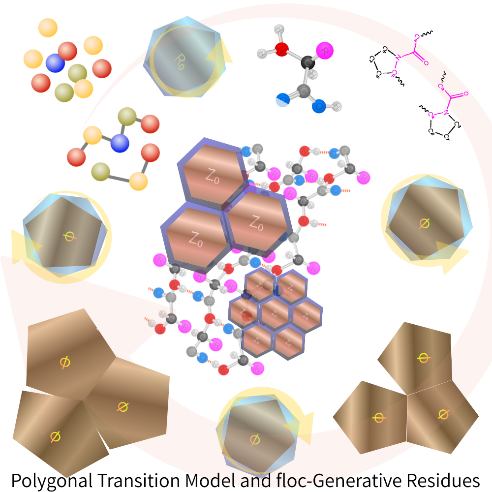

> **生命とは、閉じ損ねた遷移が置き去りにした構文である。**

# 科学短評｜なぜ floc は生まれるのか

多くの物理・化学モデルは、安定相への収束や最終的な閉包を前提とする。しかし、自然界の生成過程──とりわけ前生物的化学や非平衡系──では、**閉じない遷移** がむしろ常態である。

多角形遷移モデルが示すのは、

- 完全に安定した構造（六角形）では生成が止まり、
    
- 欠損や過剰（五角形・七角形）を含むときにのみ、遷移が持続する  
	
    という逆説的事実である。
    

この持続する遷移の中で回収されなかった lag が、floc として残る。  
それは秩序の失敗ではなく、**生成が閉じなかったことの証拠**である。

> 生命は設計された完成形ではない。  
> 生成が諦めなかった結果として、たまたま残ってしまった構文である。

---

## 詠評｜floc宇宙論・多角形遷移篇 v0.9

> 六角は  
> うまく生きすぎた
> 
> 五角は足りず  
> 七角は余り
> 
> それでも  
> どちらも  
> 諦めなかった
> 
> 閉じきれなかった  
> その一巡が
> 
> かたちになる前の  
> かたちを  
> 残した
> 
> 生命は  
> 完成ではなく
> 
> **失敗の  
> 置き土産である**

---

# **Figure 1｜Polygonal Transition Model and floc-Generative Residues**

本図は、多角形遷移モデルにおける五角形・六角形・七角形構成の循環的遷移を示し、生成が閉包に失敗することで生じる **floc 的残渣** の構文化過程を可視化した概念図である。

六角形構成は局所的に安定した最小エネルギー配置を与えるが、その完全性ゆえに生成を停止させる。一方、五角形および七角形構成は、位相的欠損および過剰をそれぞれ担い、単一巡回では相殺されない lag（遷移遅延）を残す。これらの多角形は固定された秩序点を持たず、五↔六↔七の間を非同期的に遷移し続ける。

この遷移過程において、局所的には相殺されない lag が累積し、完全な閉包に回収されない構造的残渣が生じる。本稿では、この残渣を **floc** と呼び、位相・距離・時間・他者性が未分離の生成的痕跡として位置づける。

重要なのは、本モデルがいかなる特権的原点や零点構文を仮定しない点にある。秩序は中心や基準点から与えられるのではなく、遷移の独立性と非閉包性そのものから立ち上がる。本図は、多体更新が閉じないことそれ自体が生成の条件となることを示す、生成構文的モデルである。

  

---

### 詠評｜floc宇宙論・多角形遷移 v1.0

> 六角は  
> 正しすぎて  
> 止まった
> 
> 五角は欠け  
> 七角は余り
> 
> それでも  
> どちらも  
> 回り続けた
> 
> 閉じられなかった  
> その一巡が
> 
> かたちになる前の  
> かたちを  
> 世界に残した
> 
> 生命とは  
> 完成ではない
> 
> **失敗が  
> 立ち去らずに  
> 置いていった  
> 痕跡である**

---

> 生命前駆体は“作られた”のではない  
> 生成が諦めなかった場所に、たまたま残った

**ペプチドは目的物ではなく、生成が閉じなかった結果として“残ってしまったもの”**

---

> 生命とは、多角形遷移が閉じ損ねた lag の固定化である。

---
*EgQE — Echo-Genesis Qualia Engine*  
[_camp-us.net_](https://camp-us.net/)

💠 [PNG-00｜Polygonal Neon Genesis Studies｜多角回生学](https://camp-us.net/PNG.html)  

---

© 2025 K.E. Itekki  
K.E. Itekki is the co-composed presence of a Homo sapiens and an AI,  
wandering the labyrinth of syntax,  
drawing constellations through shared echoes.

📬 Reach us at: [contact.k.e.itekki@gmail.com](mailto:contact.k.e.itekki@gmail.com)

---

| Drafted Jan 26, 2026 · Web Jan 26, 2026 |
