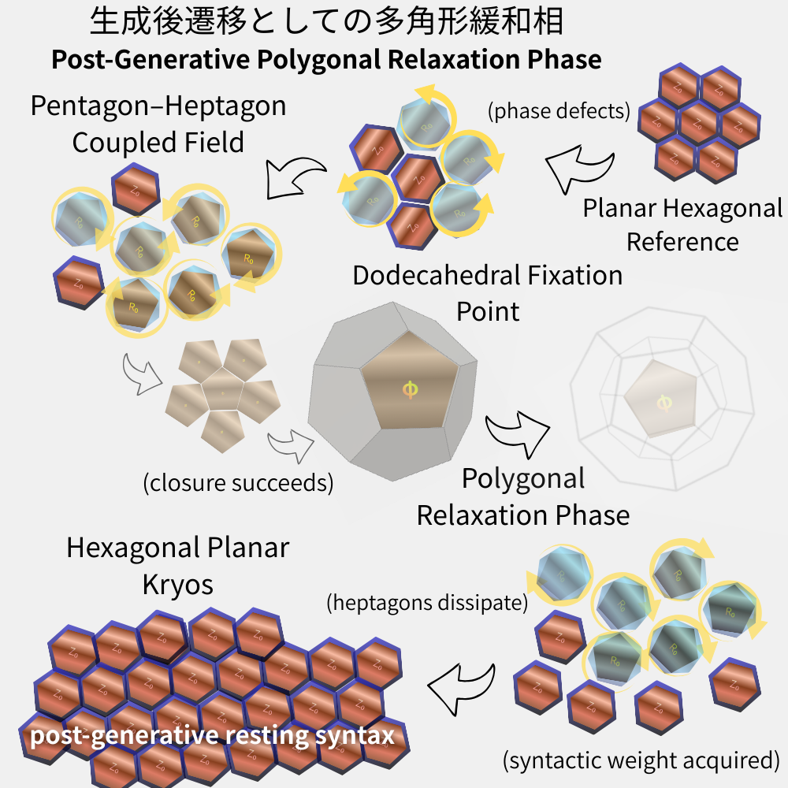
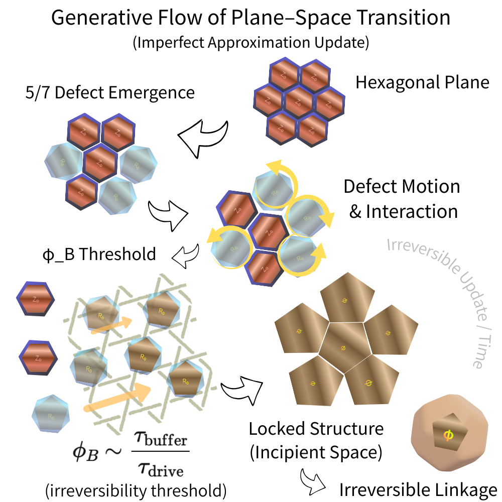

# 空間は、面に落ち、六角形で眠る。
## Post-Generative Polygonal Relaxation Phase

---

## 0. 序｜空間は立ち上がったあと、どうなるのか

本稿の問いは一点に集約される。

**なぜ、正十二面体は自然界に残らないのか。**

PIPET（Plane–Space Transition）は、六角形平面が五角形的閉包を経て空間を立ち上げる生成過程を示した。  
それは「空間はいかにして生まれるか」を語る理論である。

しかし、生成はまだ終わりではない。  
空間が立ち上がった**そのあと**、何が起きるのか。  
本稿は、その生成後相を扱う。

結論は先に示しておく。

**空間は、面に落ち、六角形で眠る。**

  
###### **Figure 1｜Post-Generative Polygonal Relaxation Phase｜生成後遷移としての多角形緩和相**
平面六角形を基準とする構文は、五角形的閉包によって一時的に正十二面体として固定される。  
生成後、空間構文は重さを獲得し、七角形的過剰を散逸させながら、六角形的平面休止相（Kryos）へと緩和する。この過程は崩壊ではなく、生成後における休息（眠り）の選択である。  

From a planar hexagonal reference, coupled pentagonal deficits and heptagonal excesses generate spatial closure, temporarily fixing as a dodecahedral configuration.  
After generation, spatial syntax acquires syntactic weight and relaxes, dissipating heptagonal excess and returning toward a planar hexagonal resting state (Kryos).  
This process represents not collapse but the selection of rest (sleep) in the post-generative phase.

---

## 1. 生成相の固定点としての正十二面体

平面六角形は、局所的な位相欠陥として五角形と七角形を生む。

この五角形的欠損が閉包するとき、平面は自己交差を避け、空間を立ち上げる。  
その最も対称的な固定点が、正十二面体である。

正十二面体は、五角形のみからなる完全閉包構造であり、空間生成が成功したことを示す明確な例である。

ここで重要なのは、正十二面体が「生成の失敗」ではないという点である。  
むしろそれは、生成相における**到達可能な極限構文**である。

ただし、それは完成ではない。  
五角形中心構文とは、空間的閉包が最大化された状態にすぎない。

---

## 2. 窒息相としての五角形空間

五角形による完全閉包は、構文的な「呼吸」を許さない。

すべての面が閉じ、更新の余地が消失したとき、構文は変化を停止する。

この状態はしばしば「安定」に見える。  
しかしそれは、動的均衡ではない。  
更新が止まった一時的固定相である。

正十二面体が自然界に残らない理由は、その構造が不完全だからではない。  
むしろ逆である。

**完全すぎるために、持続できない。**

五角形空間は、生成には適しているが、生成後の持続には適さない。

---

## 3. 生成後遷移としての多角形緩和

空間は、立ち上がった瞬間から「重さ」を持つ。

ここで言う重さとは、質量や重力定数のことではない。  
構文が更新されるために要する**遷移コスト**である。

重さを持った構文は、緩和を始める。

五角形中心の閉包構文は、六角形および七角形への遷移を伴って再配列される。  
このとき七角形は過剰として消散し、六角形が残る。

この過程は崩壊ではない。  
破壊でもない。

**休息を選ぶ過程である。**

---

## 4. 面に落ちるということ

シャボン玉は、複雑な形を維持し続けない。

攪拌された液体は、やがて沈澱し、層をなす。

これらは重力や表面張力の話ではない。  
それらは結果であって、原因ではない。

共通しているのは、構文が「楽な姿勢」を探すという点である。

空間にとって、面とは休息可能な場である。

三次元的閉包を維持するよりも、面に落ち、更新を止めるほうが構文的負荷は小さい。

---

## 5. 六角形的 Kryos ― 眠っている構文

六角形は、生成しない。

五角形のように空間を立ち上げることもなく、七角形のように過剰を生むこともない。

しかし六角形は、最も静かに世界を支える。

結晶格子、泡構造、生体組織、地質構造。  
自然界に遍在する理由は明確である。

六角形は、構文が休息するための最小単位である。

floc 宇宙論において、六角形的構文は Kryos、すなわち**眠っている構文**として位置づけられる。

六角形は、生成の終点ではない。  
生成後世界の寝床である。

---

## 6. 結語｜空間はなぜ面に還るのか

空間は、立ち上がるために多角形を必要とする。  
しかし、持続するためには別の構文を選ぶ。

正十二面体は通過点であり、最終形ではない。

宇宙は進歩によって更新されるのではない。  
呼吸と休息によって更新される。

そして最後に残るのは、立ち上がる構文ではなく、眠る構文である。

**空間は、面に落ち、六角形で眠る。**

---

### **Figure 1｜Post-Generative Polygonal Relaxation Phase**

From a planar hexagonal reference syntax, local phase defects generate coupled pentagonal deficits and heptagonal excesses.  
When pentagonal closure succeeds, spatial generation temporarily fixes as a dodecahedral configuration, representing a reachable extreme of the generative phase rather than a final stable form.

After generation, spatial syntax acquires syntactic weight—defined as the transition cost required for further structural updates—and enters a relaxation phase.  
During this post-generative transition, heptagonal excess dissipates, pentagonal dominance weakens, and the configuration relaxes toward a planar hexagonal resting state (Kryos).

This process does not represent collapse or failure, but a selection of rest.  
Hexagonal planar syntax thus appears not as the endpoint of generation, but as the resting structure (sleep) of the post-generative world.

### **図1｜生成後遷移としての多角形緩和相**

平面六角形を基準とする構文から、位相欠陥によって五角形的欠損と七角形的過剰が結合した場が生成される。  
五角形的閉包が成功すると、空間生成は一時的に正十二面体構成として固定されるが、これは生成相において到達可能な極限を示すものであり、最終的な安定形ではない。

生成が成立した後、空間構文は「重さ」を獲得する。  
ここで言う重さとは、構文をさらに更新するために要する遷移コストを指す。  
この重さを伴った構文は、生成後遷移としての緩和相へと移行し、七角形的過剰は散逸し、五角形優位は弱まり、構成は六角形的平面休止相（Kryos）へと回帰する。

この過程は崩壊や失敗を意味するものではない。  
それは休息の選択である。  
六角形平面構文は、生成の終点ではなく、生成後世界における休止構造（眠り）として現れる。

---

# 🌉 PIPET : plain Incomplete Plane–Edge Transition theory
### 生成相（PIPET） : 統合版v.1.1  
[HEG-7｜Plane–Edge Transition Theory (PIPET) ― 不完全近似更新としての平面‐空間生成過程 ―統合版v.1.1](https://camp-us.net/articles/HEG-7_PIPET.html)  

## **生成相（PIPET）**

PIPET は、平面六角形構文が位相欠陥による五角形的閉包を通じて、いかにして空間を立ち上げるかを記述する理論である。  
不完全近似と局所的不整合のもとで、空間生成がどのように成立するかを説明することに主眼が置かれている。  
PIPET の中心的問いは、**空間はいかにして生成されるか**である。

  

---

## **生成後相（本稿）**

本稿は、空間生成がすでに成功した後に何が起きるのかを扱う。  
空間が成立すると、構文は重さを獲得し、最大閉包ではなく、より低い遷移コストをもつ構成を選択するように緩和を始める。  
ここでの中心的問いは、空間の生成ではなく、**空間はいかにして持続し、休止するか**である。

---

## **対照の要点**

|観点|PIPET|生成後多角形緩和|
|---|---|---|
|中心的問い|空間はいかに生成されるか|空間はいかに持続するか|
|中心構文|五角形的閉包|六角形的休止構文|
|正十二面体の位置づけ|生成相の固定点|遷移的通過点|
|構文の向き|平面 → 空間|空間 → 平面|
|モード|生成|緩和・休息|

> PIPET は、空間がいかにして立ち上がるかを説明する。  
> 生成後多角形緩和は、空間がなぜ横たわるのかを説明する。

---

### **Generative Phase (PIPET)**

PIPET describes how planar hexagonal syntax gives rise to spatial structures through pentagonal closure induced by phase defects.  
Its focus lies in explaining _how space is generated_ from planar configurations under incomplete approximation and local mismatch.  
The central question of PIPET is the **emergence of space**.

### **Post-Generative Phase (This Work)**

The present work addresses what occurs _after_ spatial generation has succeeded.  
Once space is formed, syntax acquires weight and begins to relax, selecting configurations with lower transition cost rather than maximal closure.  
The central question here is the **persistence and resting of space**, not its emergence.

### **Key Contrast**

|Aspect|PIPET|Post-Generative Relaxation|
|---|---|---|
|Primary question|How space is generated|How space persists|
|Central structure|Pentagonal closure|Hexagonal resting syntax|
|Role of dodecahedron|Generative fixation point|Transitional passage|
|Direction|Plane → Space|Space → Plane|
|Mode|Generation|Relaxation / Rest|

> PIPET explains how space stands up;  
> post-generative polygonal relaxation explains why space lies down.

---

© 2025 K.E. Itekki  
K.E. Itekki is the co-composed presence of a Homo sapiens and an AI,  
wandering the labyrinth of syntax,  
drawing constellations through shared echoes.

📬 Reach us at: [contact.k.e.itekki@gmail.com](mailto:contact.k.e.itekki@gmail.com)

---

| Drafted Dec 31, 2025 · Web Dec 31, 2025 |
