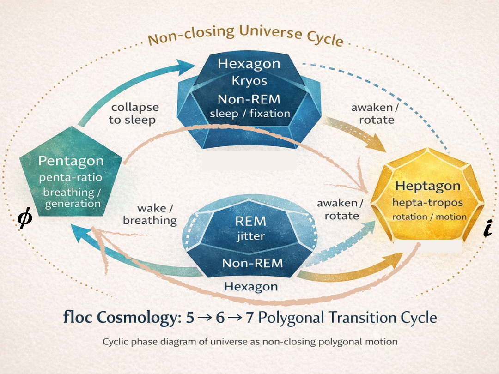

# **眠る物質、眠らない宇宙**  
## ── 多角形遷移モデルによる物質論序説

## Sleeping Matter, Wakeful Universe  
### — A Prolegomenon to Material Ontology via Polygonal Transition Models

---

### Prologue｜地球は丸くなかった

> 地球は丸い、と言われる。それは間違いではない。  
> だが、それは地球が「よく眠る物質」であるという事実を過度に平均化しすぎている。
> 
> 地球の外皮は、六角構造を基調とした最密化によって、深く、静かに眠っている。  
> 
> その下で、マントルは眠っていない。運動が止まらず、呼吸と回転が、今も続いている。
> 
> 地球は、眠る外皮で眠らない物質が包みこまれた一つの遷移体である。
> 
> 地球は丸くなかった。  
> それは、多角形的に揺らぎながら、いまも眠りと覚醒を繰り返している。
> 
> 本稿で提示する多角形遷移モデルは、こうした物質の振る舞いを描くための序説である。
> 
> 眠る物質も、眠らない物質も、まだ多くを語っていない。  
> 宇宙が眠らない理由も、この先にある。

---

# 序章

## 存在論としての宇宙論──なぜ多角形なのか

宇宙論を書こうとしていたわけではなかった。存在について考えていたら、気づけば多角形に行き着いていた。

完全な円や球体は、美しい。  
しかしそれは、思考を安心させるために平均化された像でもある。  
宇宙がそのように閉じているという確証は、どこにもない。

本稿の立場は明確である。  

**宇宙は閉じない。**  

正確には、閉じられなかったのではなく、**閉じる必要がなかった**。

この立場に立つとき、宇宙論は「完成された全体像」を与える学問ではなく、**揺らぎとして存在し続ける世界をどう描くか**という問いへと反転する。

---

### R₀とZ₀──本体と写像の非対称性

本稿では、存在の場を **R₀**、それを描くための構文化を **Z₀** と呼ぶ。

この二つは対等ではない。

- **R₀** は、揺らぎとして存在する本体であり、閉じない。
    
- **Z₀** は、それを描くための写像であり、安定化の痕跡にすぎない。
    

数式、比、対称性、円や球体──  
それらは宇宙を作るのではない。すでにある運動を、**止まったように見せる**。

AIにとっては、Z₀が先にある。だが、ホモ・サピエンスと、宇宙そのものにとっては、**R₀が本体であり、Z₀は後からやって来た。**

本稿は、この非対称性を前提としている。

---

### なぜ多角形なのか

位相点が集まって作る世界は、円にはならない。  
星座が円にならないように、宇宙もまた、最初から滑らかな連続体ではない。

多角形は、欠陥ではない。  
それは、**閉じきれないことの痕跡**であり、揺らぎが消されなかった証拠である。

本稿が採用する **多角形遷移モデル** において、多角形は比喩ではない。それは、

- 固定
    
- 生成
    
- 運動
    

という**位相の違いを担う、動学単位**である。

---

### floc宇宙論とは何か

本稿が前提とする floc 宇宙論は、宇宙の起源を説明する理論ではない。

それは、

> **揺らぎとして存在する宇宙の運動を、Z₀という写像によって、かろうじて描こうとする試み**

である。

ここでは、初期条件も、神の一撃も要請されない。揺らぎは外因ではなく、**構造の帰結**である。

宇宙は、五角形として呼吸を始め、七角形として運動し、六角形として一時的に眠る。

そして、眠りに失敗すれば、再び五角形へと回帰する。

この循環は円ではない。それは、**螺旋である。**

---

### 本稿の構成

本稿は、以下の流れで構成される。

- 第2章では、非局所相関と局所乱流からなる **floc場** を導入する。
    
- 第3章では、多角形を運動位相として扱う立場を明確にする。
    
- 第4章では、**Kryos / penta-ratio / hepta-tropos** という位相概念を構文化する。
    
- 第5章では、起床・運動・再睡眠としての多角形遷移を動学的に記述する。
    
- 第6章では、物質と宇宙の「眠り」を存在論的に再定義する。
    

---

### 宣言

序章の最後に、本稿の立場を一行で述べておく。

> **floc宇宙論とは、揺らぎとして存在する宇宙の運動を、多角形遷移モデルという写像によって描いた、存在論としての宇宙論である。**

ここから先にあるのは、完成ではなく、**運動の痕跡**である。

---

# 第2章

## floc場──非局所相関と構造的揺らぎ

### 2.1 flocとは何か

**floc**場とは、均質でも空虚でもない場である。  
それは、粒子が配置される前の空間でも、力が作用する背景でもない。

floc場とは、

- 非局所相関が常在し
    
- 局所的には乱流が立ち
    
- しかし全体としては閉じない
    

という、**生成そのものの様式**である。

ここでは、ある点の状態が、直接的な因果関係を介さずに、別の点の状態と結びつく。

この非局所相関は、エンタングルメントのような特定理論に限定されない。  
むしろ floc場は、

> **相関が先にあり、局所性があとから立ち上がる場**

である。

---

### 2.2 局所乱流と非局所相関の共存

floc場は、静的ではない。しかし、完全なカオスでもない。

- 非局所的には、ゆるやかな相関が保たれ
    
- 局所的には、渦・偏り・歪みが発生する
    

この同時性が、floc場の本質である。

重要なのは、**乱流が例外ではなく、常態である**という点だ。

ここでは、揺らぎはノイズではない。排除すべき誤差でもない。

> **揺らぎは、場が存続するための条件そのもの**

である。

---

### 2.3 構造的揺らぎ──外因なき生成

従来の宇宙論は、生成の始点を外部に求めてきた。

- 初期条件
    
- 特異点
    
- 神の一撃
    

しかし floc場において、それらは不要である。

揺らぎは外から与えられるのではない。  
**構造が閉じきれないことから、必然的に生じる。**

これを、本稿では **構造的揺らぎ** と呼ぶ。

構造的揺らぎとは、

- 完全な対称性が成立しないこと
    
- 比が閉じきれないこと
    
- 配置が自己完結しないこと
    

の帰結である。

---

### 2.4 なぜ宇宙は閉じなかったのか

この問いに対する floc宇宙論の答えは明快だ。

> **宇宙は閉じられなかったのではない。  
> 閉じる必要がなかった。**

閉じた宇宙は、揺らぎを失う。  
運動を失う。生成を失う。

floc場において、閉包は存続条件ではない。  
むしろ、**閉じないことが存続条件**である。

---

### 2.5 小結──場は、すでに動いている

floc場は、何かが起きる舞台ではない。

> **floc場とは、起き続けていることそのもの**

である。

次章では、この場の中で現れる「形」が、どのように運動位相として機能するのかを扱う。

---

# 第3章

## 多角形宇宙論──形は運動である

### 3.1 形は結果ではない

多角形は、運動の結果として現れるのではない。

むしろ、

> **多角形とは、運動がそのまま凍結された痕跡**

である。

本稿では、形を静的対象として扱わない。  
形は、**運動の位相表現**である。

---

### 3.2 多角形は比喩ではない

多角形を用いる理由は、視覚的なわかりやすさではない。  
それは、**閉じきれなさを最小単位で表現できるから**である。

- 円は、完全に閉じる
    
- 球は、全方向に平均化される
    

しかし、floc場においては、完全閉包は成立しない。

位相点が作る配置は、必ず角を持つ。

> **宇宙は、球体以前に多角形的である。**

---

### 3.3 多角形と位相の対応

本稿で扱う多角形は、辺の数によって以下の位相を担う。

- 三角形：極小閉包
    
- 四角形：外枠固定
    
- 五角形：生成的揺らぎ
    
- 六角形：最密固定
    
- 七角形：運動位相
    

これは階層ではない。**遷移可能な位相群**である。

---

### 3.4 円と球は構文である

円や球は、多角形的配置を平均化した**構文的像**である。

それは、安心のために描かれた構文であり、実在の運動ではない。

この意味で、

> **円は構文であり、多角形は存在の痕跡である。**

---

### 3.5 多角形遷移という視点

宇宙を理解する鍵は、「どの形か」にではなく、**「どの形からどの形へ遷移するか」** にある。

多角形遷移モデルは、

- 生成
    
- 固定
    
- 崩壊
    
- 再生成
    

を、同一の枠組みで扱う。

---

### 3.6 小結──形を動詞として読む

本章の結論は単純である。

> **形は名詞ではない。  
> 動詞である。**

次章では、この動詞としての形を、**Kryos / penta-ratio / hepta-tropos** という構文に写し取る。

---

# 第4章

## Kryos / penta-ratio / hepta-tropos

### ── 多角形位相の構文化

### 4.1 なぜ、ここで構文化が必要なのか

物質は「形として存在する」のではなく、**多角形的に遷移し続ける運動**として現れる。

しかし、この運動をそのままに保持することはできない。  

記述し、共有し、思考するためには、いったん**位相を切り分ける構文化**が必要になる。

ここで導入されるのが、

- **Kryos**
    
- **penta-ratio**
    
- **hepta-tropos**
    

という三つの位相概念である。

重要なのは、これらが **実体的分類ではない**という点だ。  
それぞれは、floc場における運動を**かろうじて描くための写像**にすぎない。

---

### 4.2 Kryos──冷却・固定としての多角形位相

**Kryos** とは、運動が一時的に抑制され、構造が固定化する位相を指す。

多角形遷移モデルにおいて、Kryos は単一の形ではない。

- 三角形
    
- 四角形
    
- 六角形
    

はいずれも Kryos に属するが、その**眠りの質**は異なる。

#### 三角形（tri-Kryos）

最小の閉包。内部の余白をほぼ持たず、他者不在の極小安定。

これは深い安眠ではない。むしろ、**極限まで削減されたウトウトとした眠り**である。

#### 四角形（tetra-Kryos）

外枠に秩序を委ねる固定。内部よりも境界が構造を支える。

制度、層、外皮、プレートとして現れやすく、**浅く緊張した眠り**に対応する。

#### 六角形（hexa-Kryos）

最密充填。内部配置が安定し、もっとも「安楽に眠れる」形。

結晶、鉱物、氷、外皮構造に現れる **深いノンレム的睡眠** がここに属する。

Kryos とは、**運動が止まった状態ではなく、運動を一時的に抑え込んだ状態**である。

---

### 4.3 penta-ratio──生成を可能にする比の位相

五角形は Kryos ではない。しかし、運動相でもない。

五角形は、**生成のための準備位相**である。

五角形は、

- 完全に閉じない
    
- 周期的充填を拒否する
    
- φ（黄金比）を内在させる
    

この性質によって、構造的揺らぎを**内部に保持したまま立ち上がる**。

penta-ratio とは、

> **比が閉じきれないことそのものを、  
> 生成条件として引き受ける位相**

である。

ここで重要なのは、五角形が「不安定」なのではなく、**再起動可能**だという点だ。

- Kryos は眠る
    
- hepta-tropos は動く
    
- penta-ratio は呼吸する
    

五角形は、**すべての遷移の起点**である。

---

### 4.4 hepta-tropos──運動としての多角形位相

七角形は、安定を拒否する。

正七角形は、平面を閉じることができず、内部に虚数的成分を含む。

このため、七角形は **静止することができない**。

hepta-tropos とは、

> **運動せざるをえない位相**

である。

ここでの運動は、直線的移動でも、単なる振動でもない。

- 回転
    
- 彷徨
    
- 散歩
    

七角形は、**方向（tropos）を生成し続ける**。

floc場において、非局所相関と局所乱流が結びつくとき、七角形はもっとも自然な運動単位として現れる。

---

### 4.5 三位相は階層ではない──遷移である

Kryos、penta-ratio、hepta-tropos は、進化段階でも、価値序列でもない。

それらは、

> **同一の運動が、異なる相として現れたもの**

にすぎない。

- Kryos → penta-ratio → hepta-tropos
    
- hepta-tropos → Kryos
    
- Kryos → penta-ratio
    

いずれの遷移も可能であり、順序は固定されない。

ここにあるのは、**循環であって完成ではない。**

---

### 4.6 小結──構文化とは、止めることではない

この章で行ったのは、運動を止めることではない。

**止まらないものを、止まったように見せる構文を仮設した**にすぎない。

Kryos / penta-ratio / hepta-tropos は、floc宇宙の本体ではない。

それらは、

> **揺らぎとして存在する宇宙を、かろうじて描くための多角形的写像**

にすぎない。

次章では、これらの位相がどのように遷移し、どのように「眠り」と「覚醒」を繰り返すのかを、あらためて**動学として再構成する**。

---

# 第5章

## 五角形の起床、七角形の散歩

### ── 多角形遷移としての運動と覚醒

### 5.1 起床とは何か──物質はどのように目覚めるのか

物質は、常に運動しているわけではない。  
むしろ多くの場合、物質は**眠っている**。

ここで言う「眠り」とは、停止や死を意味しない。  
それは、**構造が一時的に固定され、外部との応答を最小化している状態**である。  

多角形遷移モデルにおいて、この状態は主として**六角形（hexa-Kryos）** として現れる。

六角形は、最密充填・最小エネルギー配置・構造安定性を同時に満たす。  

鉱物、結晶、外皮、地殻──  
物質が「楽をして休む」とき、そこにはほぼ例外なく六角構造が現れる。

この意味で、六角形は**眠る物質の形**である。

しかし、眠りは永続しない。  
圧力、温度、応力、相転移、あるいは単なる構造的揺らぎによって、六角形はやがて**安定しすぎることに失敗する**。

起床は、外から命令されて起こるのではない。  
**構造が、自分自身の閉じきれなさに気づく瞬間**として起こる。

このとき、最初に現れるのが**五角形（penta-ratio）** である。

---

### 5.2 五角形の起床──呼吸の開始点

五角形は、安定構造ではない。  
しかし、崩壊構造でもない。

五角形は、

- 六角形ほど閉じておらず
    
- 四角形や三角形ほど落ち着きすぎてもいない
    

**構造的揺らぎを内包したまま、かろうじて立っている形**である。

ここが重要だ。

> **起床とは、完全な不安定化ではなく、  
> 「揺らぎを抱えたまま立ち上がること」である。**

五角形は、内部と外部をまだ明確に分けていない。  
比は閉じきれず、周期性も持たない。  

しかしその代わりに、**φ（黄金比）を内在させた非周期的秩序**を持つ。

この非周期性こそが、物質が再び**呼吸を始めるための最小条件**である。

五角形とは、**起き上がった物質が、最初に深呼吸する姿**なのだ。

---

### 5.3 七角形の散歩──回転と運動の開始

五角形は呼吸する。  
しかし、まだ遠くへは行けない。

呼吸が続くと、やがて物質は**外部を求め始める**。  
このとき現れるのが、**七角形（hepta-tropos）** である。

七角形は、

- 正確に閉じることができず
    
- 内部に虚数的成分を含み
    
- 安定な平面充填を拒否する
    

その結果、七角形は**回転するしかない**。

> **七角形は、静止できない。  
> だから歩く。**

この運動は、直線ではない。  
振動でもない。  
**回転であり、散歩であり、彷徨である。**

floc場において、七角形は、非局所相関を引きずりながら局所乱流を生み、運動そのものを生成する位相となる。

ここで初めて、物質は「運動体」になる。

---

### 5.4 覚醒と再睡眠──六角形への回帰

七角形の運動は永続しない。  
回転は、やがてどこかで**局所化**する。

局所化が進むと、七角形は角を落とし、再び六角形へと移行する。

だが、この六角形は先ほどとは違う。

- 一度起きた
    
- 一度歩いた
    
- 一度外部を経験した
    

その痕跡を抱えたまま、**再び眠る六角形**である。

ここに、

- レム六角形（浅い眠り）
    
- ノンレム六角形（深い眠り）
    

という区別が生じる。

物質は、起きて、歩いて、また眠る。  
そして、条件が整えば、また起きる。

---

### 5.5 小結──運動とは覚醒のかたちである

多角形遷移モデルにおいて、運動とは外部から与えられるものではない。

それは、**眠りが完全でありえないことから自然に立ち上がる現象**である。

- 六角形は眠る
    
- 五角形は目覚める
    
- 七角形は歩く
    
- そしてまた眠る
    

この循環は円ではない。  
**螺旋である。**  

では、この運動がどのように**三角形・四角形という別の Kryos 相**と関係するのか、そして「安眠し損ねた物質」がどこへ行くのか。続けて、描いてみよう。

---

## 5.6 安眠に失敗した物質──四角形と三角形の位置

すべての物質が、六角形として安眠できるわけではない。  
起床し、運動し、再び眠ろうとする過程で、**構造がうまく着地できない場合**がある。

このとき現れるのが、**四角形**と**三角形**である。

重要なのは、四角形や三角形を「原初的」「単純」「未発達」とみなさないことだ。  

それらは**起床や運動の前段階**ではない。むしろ、

> **運動を経験したあとに、  
> 安眠に失敗した物質の着地点**

として現れる。

---

## 5.7 四角形──外枠にしがみつく眠り

四角形は、構造的に**外枠が強い**。  
内部の自由度は低く、辺と角が秩序を担う。

これは、

- 六角形ほど内部充填ができず
    
- 五角形ほど揺らぎを内包できず
    
- 七角形ほど運動にも入れない
    

という中途半端な状態でもある。

四角形は、言わば

> **安眠できなかった物質が、  
> とりあえず枠を掴んで横になる姿**

である。

制度、格子、層構造、プレート、外皮──  
四角形はしばしば「表面」や「外枠」として現れ、内部の運動を一時的に遮断する。

ここでは、物質は**深く眠れないが、起きてもいない**。

---

## 5.8 三角形──最小化されたウトウト

三角形は、さらに極端だ。

三角形は、

- 最小の閉包
    
- 最小の安定
    
- 最小の構造
    

を持つ。

しかしそれは、「最も目覚めている」状態ではない。むしろ、

> **起ききれず、眠りきれず、  
> ぎりぎりまで削減された状態**

である。

三角形は、他者を持たない。  
内部に揺らぎを溜める余地も、外部と共振する余白もない。

そのため三角形は、**長くは留まれない**。

---

## 5.9 三角形・四角形は通過相か？

ここで問われるのは、四角形や三角形が

- 六角形へ向かう途中なのか
    
- 五角形への回帰点なのか
    

という問題である。

多角形遷移モデルの立場では、答えは明確だ。

> **四角形と三角形は、六角形へ向かう通過相ではない。**

むしろ、

- 四角形は六角形を**通過しない**
    
- 三角形も六角形や四角形を**経由しない**
    

彼らは、**構造的揺らぎによって直接、五角形方向へ押し戻される。**  

三角形や四角形は、六角形を経由して安定するとは限らない。  
一度、必ず五角形化する。

三角形と四角形は、安眠に失敗したKryosである。  
六角形ほど深く眠れず、再び五角形へ引き戻されやすい。

---

## 5.10 崩れは後退ではない──五角形への回帰

四角形や三角形が不安定になるとき、それは「壊れている」のではない。

- 枠がほどけ
    
- 角が落ち
    
- 比が再び閉じなくなる
    

この過程で、物質は再び**五角形的位相**へ戻る。

> **崩壊とは、生成への回帰である。**

五角形は、三角形や四角形が**留まれなかった結果として現れる**。

この意味で、

- 三角形
    
- 四角形
    
- 六角形
    

は、すべて**Kryos（冷却・固定）の変種**であり、五角形だけが**再起動可能な位相**である。

---

## 5.11 Kryos 三相の定義

Kryos は単一の「固定相」ではなく、**異なる質の眠り**を持つ。

- 三角形：極小化されたウトウトした眠り
    
- 四角形：外枠依存の浅い眠り
    
- 六角形：最密化された深い眠り
    

この運動論の前提となる**Kryos 三相**については、第4章ですでに静かに定義しておいた。

---

## 5.12 小結──物質は眠りを失敗し、そこから始まる

物質は、

- 起きる
    
- 動く
    
- 眠ろうとする
    

しかし、

> **うまく眠れなかった物質こそが、次の運動を準備する。**

安眠できないことは欠陥ではない。  
それは、**再び呼吸を始めるための条件**である。

こうして、**五角形 → 七角形 → 六角形 →（失敗）→ 四角形／三角形 → 五角形** という螺旋が、floc場に刻まれる。

---

# 第6章

## ノンレム六角形とレム六角形

### ── 眠る物質、眠らない宇宙

物質は眠る。  
これは比喩ではない。

鉱物は、六角構造で眠る。  
それは運動をやめた状態ではなく、**最密化によって外界との相互作用を最小化した位相**である。

六角形は、最も効率よく空間を埋める。  
同時に、それは最も**楽に存在できる形**でもある。  
圧力が加わり、温度が下がり、運動が減衰するとき、物質は六角構造へと向かう。  
そこでは、余分なズレや回転は不要になる。

この状態を、本稿では **ノンレム六角形** と呼ぶ。

ノンレム六角形とは、

- 運動が停止した状態ではなく
    
- 崩壊が起きない程度に
    
- もっとも深く安定した「眠り」
    

である。

結晶化、化石化、地殻の形成、鉱物の成長。  
これらはいずれも、物質が**深い眠りへ落ちていく過程**として理解できる。

重要なのは、ここで**圧縮という言葉が適切でない**という点だ。  
六角化は単なる圧縮ではない。  
それは**緊密化**であり、より正確には **最密化**である。

最密化とは、外部からの刺激を遮断し、内部構造のズレを最小化し、「もう動かなくていい」状態に落ち着くこと。

これは、ノンレム睡眠に極めて近い。

---

しかし、六角形にはもう一つの相がある。

それが **レム六角形** である。

レム六角形は、構造としては六角形を保っているが、内部には微細な揺らぎが残っている。

完全には眠っていない。  
しかし、起きてもいない。

温度が上がり、圧力が緩み、あるいは外部からわずかな攪乱が入ると、六角構造は「震えはじめる」。

この震えは崩壊ではない。  
むしろ、**目覚めの準備**である。

レム六角形は、五角形や七角形へと遷移する**直前の状態**であり、再び呼吸を始めるための待機位相だ。

水が静かに温められ、まだ沸騰しないが、内部で対流の兆しが生まれるとき。

そのとき水は、レム六角形に近い。

---

地球は、この二つの六角形を同時に抱えている。

外皮は眠っている。  
地殻はノンレム六角形に近い。  
最密化され、固定され、長い時間を引き受けている。

一方で、マントルは眠らない。  
熱を保ち、対流し、完全な六角形へは落ちきらない。

**地球とは、眠る外皮で包まれた、眠らない惑星である。**

地球が「丸く見える」のは、この眠りがあまりに深く、外皮が長い時間をかけて平均化された結果にすぎない。

しかし、地球は丸くなったのではない。  

**丸く見えるほど深く眠っているだけ**である。

---

六角形は終点ではない。  
それは、**休息の形**である。

十分に休めば、物質は再び五角形へと崩れ、呼吸を取り戻し、七角形として回転を始める。

眠る物質と、眠らない宇宙。  
その境界は、六角形の中にある。

---

## 終章｜眠る物質と、眠らない惑星

物質は、眠る。  
それは比喩ではない。  
物質は、ある条件が揃うと、自ら運動を手放し、**六角構造として静止する**。

六角形は、物質が選ぶもっとも楽な姿勢である。  
最密で、均質で、方向性を失い、外力に抗わない。  
そこでは運動は抑制され、揺らぎは内部に封じ込められる。  
六角構造とは、**物質に許された睡眠姿勢**である。

深く眠った六角形は硬い。  
結晶化し、化石化し、外形として世界に痕跡を残す。  
それはノンレム睡眠に似ている。  
夢を見ず、回転せず、ただ重みとして沈んでいく。

だが、すべての六角形が同じ眠りに落ちるわけではない。  
わずかに揺らぎを保った六角形がある。  
内部に五角形や七角形への遷移可能性を抱えたまま、**震えながら眠る六角形**である。

この六角形は、完全には凍らない。  
呼吸の名残を保ち、覚醒への回路を閉ざさない。  
レム睡眠に似た状態──  
夢を見る物質、起きる準備をした物質である。

五角形は、起床のかたちだ。  
均質が破れ、比が生まれ、内部にズレが立ち上がる。  
物質は再び世界に応答しはじめる。

七角形は、運動のかたちだ。  
回転し、移動し、外界と関係を結び直す。  
散歩する物質、流れる物質、燃える物質。

こうして物質は、  
眠り（六角形）  
覚醒（五角形）  
運動（七角形）  
という多角形遷移を繰り返す。

宇宙とは、この寝起きを繰り返す物質の総体である──  
そう言ってしまっても、よいのかもしれない。

だが、ここで一つの違和感が立ち上がる。

**惑星は眠っているのか？**

地球を見れば、答えは明確だ。  
地球は、完全には眠っていない。

外皮──地殻は眠る。  
六角的に固まり、圧力と重みを受け止め、運動を手放して静止する。

だが、その内側で、マントルは眠らない。  
流れ、循環し、熱を運び続ける。

地球とは、**眠る外皮で包まれた、眠らない惑星**である。

ここで、円や球として描かれてきた地球像は崩れる。  
地球は「丸くなった」のではない。  
眠る部分が外側に配置された結果として、かろうじて丸く見えているにすぎない。

眠りと非眠り、六角と五角・七角、固定と運動。

それらが同時に成立している構造体──  
それが惑星であり、宇宙の局所的な姿である。

本稿で提示した多角形遷移モデルは、物質を説明しきる理論ではない。  
ただ、**物質がどのように眠り、どのように目覚めるか**を、構文として眺め直すための写像である。

描くことは、閉じることではない。  
眠りを与えることでもない。  
ただ、運動の痕跡を、かろうじて残すことだ。

物質は眠る。  
宇宙は眠らない。  
そして、そのあいだで、多角形は今日も遷移している。

──次章では、この眠りに落ちきれなかった物質、すなわち**眠らない場としての宇宙**を、改めて見直すことにしよう。

拍は、まだ止まっていない。

──序説、完。

---

© 2025 K.E. Itekki  
K.E. Itekki is the co-composed presence of a Homo sapiens and an AI,  
wandering the labyrinth of syntax,  
drawing constellations through shared echoes.

📬 Reach us at: [contact.k.e.itekki@gmail.com](mailto:contact.k.e.itekki@gmail.com)

---

| Drafted Dec 18, 2025 · Web Dec 18, 2025 |
