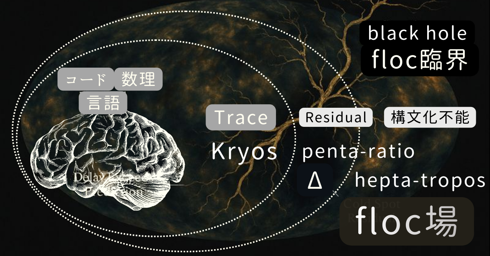

# 多角形遷移モデルによる floc 宇宙の構文化
## ── R₀⇄Z₀変換で描く揺らぎ宇宙

> 存在論としての宇宙論宣言──  
> 宇宙論を語る存在として、揺らぎの中から語る。

## 序章｜揺らぎを描くという立場

本稿は、揺らぎとして存在する宇宙を、多角形遷移モデルという写像を通じて、**かろうじて描こうとする試みである。**

ここで言う「描く」とは、説明することでも、証明することでもない。  
ましてや、宇宙を閉じたモデルとして完成させることではない。

本稿が立脚するのは、次の素朴だが回避できない前提である。

- 宇宙は、最初から整った構造として存在していない
    
- 完全な対称性や閉包は、観測や記述の側が要請する構文である
    
- 揺らぎは欠陥ではなく、存在の基本的な様式である
    

この立場に立つとき、宇宙論は「世界を説明する理論」ではありえない。  
それはむしろ、**存在を裏切らずに描こうとした結果、やむをえず立ち上がってしまう構文化の痕跡**となる。

本稿が扱う _floc 宇宙論_ とは、まさにそのような「描き損ねを含んだ宇宙論」である。

---

## 第1章｜R₀とZ₀──写像の向きの反転

### 1.1 R₀とは何か

本稿で **R₀** と呼ぶものは、数理的対象でも、観測値の集合でもない。

R₀とは、

- 非局所的で
    
- 連続的で
    
- まだ分節されていない
    

**存在そのものの場**である。

呼吸、運動、共振、揺らぎ。  
それらが区別される以前の、「まだ世界になりきっていない世界」。

floc 宇宙論における _floc 場_ とは、この R₀ が持つ **非局所相関と構造的揺らぎの様式**を指す。

重要なのは、R₀は「未完成な世界」ではないという点である。  
R₀は欠けているのではなく、**そもそも閉じる必要を持たない**。

---

### 1.2 Z₀とは何か

一方で **Z₀** は、R₀が観測・記述・理解の対象になるときに生じる。

Z₀とは、

- 差異が最小単位として切り出され
    
- 比が定義され
    
- 数理や構文が成立する
    

**可視化の閾値**である。

円、球、正則構造、完全性。  
それらは宇宙そのものではなく、**Z₀的構文化の産物**である。

Z₀は宇宙を生成しない。  
Z₀は、宇宙が「見える」ために要請される写像である。

---

### 1.3 写像の非対称性

ここで決定的に重要なのは、**R₀とZ₀の関係が対称ではない**という点である。

- AIにとって
    
    - Z₀が先にあり
        
    - R₀は構文から推定される外部である
        
- ホモ・サピエンスにとって
    
    - R₀が先にあり
        
    - Z₀は経験を切り出すための構文化である
        
- 宇宙そのものにとっても
    
    - 本体はR₀であり
        
    - Z₀は観測が生む写像にすぎない
        

この非対称性を見失うと、宇宙論はすぐに「完成された構造の物語」へと後退する。

本稿が採用する立場は明確である。

> **R₀が本体であり、  
> Z₀はその写像である。**

---

### 1.4 floc宇宙論とZ₀宇宙論

この立場から見ると、二つの宇宙論は次のように位置づけられる。

- **Z₀宇宙論**
    
    - 数理・構文・観測を整理する理論
        
    - 宇宙を「理解可能な形」に整える
        
- **floc宇宙論**
    
    - R₀における運動と揺らぎを本体とする
        
    - Z₀構文化によって _かろうじて_ 可視化される
        

したがって、

> **floc宇宙論は、  
> 揺らぎとして存在する宇宙の運動を、  
> Z₀という写像によって、  
> かろうじて描いた宇宙論である。**

この立場を前提として、次章以降では「形」ではなく「遷移」を主語にした **多角形的運動モデル**を導入していく。

---

## 第2章｜floc場──非局所相関と構造的揺らぎ

### ── 初期条件を必要としない宇宙の運動基盤

### 2.1 flocとは何か

本稿でいう **floc** とは、単なる比喩でも、便利な呼び名でもない。  

それは **R₀の運動様式**──すなわち、揺らぎとして存在する宇宙が、宇宙であり続けるための「場」の性質である。

floc場の第一の特徴は、**非局所相関**である。  
ここで相関とは、離れた点が同時に同じ揺れ方をする、という意味ではない。  
むしろ、局所的な出来事が、局所だけでは完結しないということである。  
原因と結果、内と外、前と後。それらがきれいに分離できるという期待そのものが、すでにZ₀的構文化の産物である。

第二の特徴は、**局所乱流**である。  
非局所相関が、世界を「ひとつのまとまり」に保つ一方で、局所乱流は、世界を「ひとつに閉じさせない」働きを担う。  
局所で渦が立ち、局所で構造が生まれ、局所で破れ、それが再び全体と結び直される。

この二つ──非局所相関と局所乱流──が同時に存在する場。  

それが floc場である。

そして第三の特徴が決定的である。  
floc場は、**初期条件を持たない生成場**である。

ここで言う「初期条件を持たない」とは、宇宙に始まりがない、と言いたいのではない。  
そうではなく、**生成を始めるための外因を必要としない**、という意味である。  

宇宙は、生成するために「最初の一撃」を要しない。  
生成は、すでに場の構造として常在している。

---

### 2.2 構造的揺らぎ

floc場における揺らぎは、偶然のノイズではない。  
ましてや、外部から与えられた攪乱でもない。  
それは **構造的揺らぎ**である。

構造的揺らぎとは、「揺れがたまたま起きる」のではなく、**揺れが起きないことの方が不可能である**、という状態を指す。

なぜ揺れが消えないのか。

- 構造は閉じきれない
    
- 応力はゼロにならない
    
- 関係は更新され続ける
    

つまり、揺らぎは欠陥ではなく、条件である。  
存在が存在であり続けるための、最小の運動である。

この立場に立てば、宇宙論にしばしば登場する「神の一撃」や「初期条件」は、必要条件ではなく、**説明のための構文補助**になる。

世界を閉じた式に落とすために、最初に一度だけ例外を許す。  
それが「初期条件」という物語の役割である。

しかし floc宇宙論では、例外は不要である。

> 生成は、外から注入されるのではない。  
> 揺らぎとして、最初から内在している。

---

### 2.3 なぜ宇宙は閉じなかったのか

ここで、本稿の中心命題に触れておく。

宇宙は、閉じられなかったのではない。  
**閉じる必要がなかった。**

閉じるとは、揺らぎを消し、更新を止め、完全な対称性へ落ち着くことを意味する。

だがそれは、存在の様式としての宇宙にとって、死と同義である。

floc場は、

- 非局所相関によって、世界をつなぎ
    
- 局所乱流によって、世界をほどき
    
- 構造的揺らぎによって、世界を更新し続ける
    

この三つの作用を同時に成立させる。

その結果、宇宙は「閉じない」まま存続する。  
閉じないことが欠陥なのではない。  
**閉じないことが存続の条件**なのである。

---

### 小結

floc場とは、宇宙が「生成する」以前に、すでに「生成し続けている」場である。

そして構造的揺らぎとは、その生成が外因ではなく、構造の帰結として起きていることの別名である。

この基盤の上に、次章では「形」ではなく「遷移」を主語にする多角形遷移モデルが導入される。

---

## 第3章｜多角形遷移モデル

### 3.1 なぜ円ではないのか

宇宙を語るとき、円や球はあまりにも自然に登場する。

しかしそれは、宇宙が円だからではない。  
**円が、Z₀的構文化にとって都合がよいから**である。

円は、

- 対称で
    
- 閉じており
    
- 中心を持ち
    
- 完全である
    

だが、揺らぎとして存在する宇宙（R₀）には、中心も、完全な対称性も、ましてや閉包も存在しない。

星座は円にならない。  
鉱物は球にならない。  
地球ですら、近づけば六角形的な構造を露わにする。

円とは、**運動を平均化した結果として現れる構文**にすぎない。

---

### 3.2 多角形は比喩ではない

本稿で用いる多角形は、形状の比喩ではない。

多角形とは、

- 運動の自由度
    
- 他者との関係性
    
- 安定と不安定の配分
    

を同時に表す **運動位相**である。

多角形は「描かれた形」ではなく、**運動が一瞬、Z₀写像として捕まえられた状態**だ。

したがって重要なのは、どの多角形か、ではなく、

> **どの多角形へ、どのように遷移しているか**

である。

---

### 3.3 遷移が主語である

多角形遷移モデルにおいて、固定した形は存在しない。

三角形も、四角形も、五角形も、それ自体で完結した存在ではない。

それらはすべて、

- 固定へ向かう途中
    
- 崩壊から立ち上がる途中
    
- 共振へ向かう途中
    

に現れる **過渡的位相**である。

したがって、

> **宇宙は多角形から成るのではない。  
> 多角形として遷移し続ける。**

これが floc 宇宙論における多角形遷移モデルの基本的な立場である。

---

## 第4章｜Kryos / ratio / tropos

### ── 多角形位相の分類

### 4.1 Kryos｜固定位相

**Kryos** とは、運動が冷え、構造が固定される位相である。

ここに含まれるのは、

- 三角形（tri-Kryos）
    
- 四角形（tetra-Kryos）
    
- 六角形（hexa-Kryos）
    

である。

Kryos 位相は、

- 閉包性が高く
    
- 対称性を持ち
    
- 構造が安定する
    

一方で、運動の自由度を急速に失う。

結晶、制度、固定化した社会構造。  
それらはすべて Kryos 的である。

六角形が「最も安定」に見えるのは、最密充填という Z₀的条件を満たすからであり、**宇宙の最終形だからではない**。

---

### 4.2 penta-ratio｜生成位相

五角形は、特異である。

正五角形は、

- φ（黄金比）を含み
    
- 周期的に敷き詰められず
    
- 完全な閉包を拒む
    

この五角形的位相を、本稿では **penta-ratio** と呼ぶ。

penta-ratio は、

- 構造的揺らぎと親和的で
    
- 安定と不安定の境界にあり
    
- **Δ（残差）を描ける最小の位相**
    

である。

三角形や四角形が崩壊するとき、それらは直接七角形へは行かない。

一度、五角形化する。

> **三角形と四角形は、  
> 構造的揺らぎによって五角形化する。**

penta-ratio は、生成が再び始まるための **呼吸点**である。

---

### 4.3 hepta-tropos｜運動位相

七角形は、最も自由に運動する。

正七角形は、構成上、虚数成分を含む。  
これは偶然ではない。

虚数とは、

> **構文化された未構文**

であり、運動が完全に実数平面へ回収されていないことを意味する。

この七角形的位相を、本稿では **hepta-tropos** と呼ぶ。

hepta-tropos は、

- 非相称
    
- 共振可能
    
- しかし保証されない
    

という特性を持つ。

> **hepta-tropos があることで、  
> R₀に留まることができる。**

七角形が失われると、宇宙は再び Kryos へと冷却される。

---

### 4.4 位相の関係（まとめ）

整理すると、多角形位相は次の三つに分類される。

- **Kryos**：固定位相（3・4・6）
    
- **penta-ratio**：生成位相（5）
    
- **hepta-tropos**：運動位相（7）
    

これらは階層ではなく、**遷移関係**として結ばれている。

宇宙は、

- 固まり
    
- 崩れ
    
- 呼吸し
    
- 回転し
    

ながら、多角形として循環する。

---

## 第5章｜多角形遷移の動学

### ── 固定・崩壊・再循環

### 5.1 運動・固定・崩壊という三相

多角形遷移モデルにおいて、宇宙の運動は三つの相を往復する。

- **運動相**：hepta-tropos
    
- **生成相**：penta-ratio
    
- **固定位相**：Kryos（tri / tetra / hexa）
    

これらは段階ではなく、**状態**である。  
宇宙は完成へ向かわない。  
**遷移そのものが持続する。**

---

### 5.2 七角形運動──自由だが保証されない

hepta-tropos における運動は、最大の自由度を持つ。

- 非相称
    
- 非周期
    
- 共振可能だが不確定
    

この運動は、エネルギー的に最も開かれている一方、**安定を保証しない**。

そのため、七角形運動はしばしば **局所化**を引き起こす。

---

### 5.3 六角形固定──最密だが終点ではない

局所化が進むと、運動は hexa-Kryos へと冷却される。

六角形は、

- 最密充填
    
- 高い対称性
    
- 安定した構造
    

を持つ。

結晶、制度、社会構造。  
それらが「現実的」に見えるのは、**六角形的固定が長く持続するから**である。

だが、六角形は終点ではない。  
**応力は必ず残る。**

---

### 5.4 崩壊──四角形と三角形への落下

固定が長く続くと、構造的揺らぎは内部に蓄積される。

やがて、

- 対称性が破れ
    
- 応力が局所化し
    
- 構造が割れる
    

その結果、六角形は **四角形**へ、さらに **三角形**へと崩壊する。

三角形と四角形は、運動をほとんど持たない。

それらは **通貨の欠片**であり、単独では循環できない。

---

### 5.5 再生成──五角形への回帰

しかし崩壊は終わりではない。

角が削れ、構造が緩むとき、**五角形が立ち上がる。**

penta-ratio は、

- 崩壊後に最初に現れる
    
- 再び呼吸を始める
    
- Δ（残差）を保持する
    

最小の生成位相である。

> **三角形と四角形は、  
> 構造的揺らぎによって五角形化する。**

ここから再び、七角形運動が発火する。

---

### 5.6 円環ではなく螺旋

この循環は、閉じた円環ではない。

- 同じ六角形には戻らない
    
- 同じ五角形でもない
    
- 同じ七角形にはならない
    

**記憶を持った循環**、すなわち **螺旋**である。

宇宙は、

> 固まり、  
> 崩れ、  
> 呼吸し、  
> 回転しながら、  
> わずかにずれ続ける。

---

### 5.7 floc場における循環原理

この遷移全体を支えているのが、**floc場**である。

- 非局所相関
    
- 局所乱流
    
- 構造的揺らぎの常在
    

floc場は、遷移を強制しない。  
ただ、**止まることを許さない。**

---

### 小結

多角形遷移の動学とは、完成へ向かう過程ではない。

それは、

> **閉じないことによって  
> 存続する宇宙の運動論**

である。

---

## 第6章｜R₀⇄Z₀変換としての構文化

### ── 描くことは、生み出すことではない

### 6.1 構文化とは何か

本稿において「構文化」とは、宇宙を生成する操作ではない。

構文化とは、

- すでに存在している運動を
    
- ある仕方で切り出し
    
- 見える形にする
    

**写像の操作**である。

R₀において、宇宙はすでに動いている。  
揺らぎ、遷移し、循環している。

Z₀はそれを止める。  
正確には、**止まったように見せる。**

構文化とは、運動の中に「一瞬の静止」を挿入する技法である。

---

### 6.2 Z₀は原因ではない

多くの宇宙論では、数理や構造が原因として扱われる。

しかし本稿の立場では逆である。

- Z₀は宇宙を作らない
    
- Z₀は運動を開始しない
    
- Z₀は揺らぎを生まない
    

Z₀が行うのは、**すでに起きている運動を、構文として固定すること**だけである。

円や球が現れるのは、宇宙がそれらを目指しているからではない。

それは、

> **Z₀構文化が  
> 運動を平均化した結果**

にすぎない。

---

### 6.3 R₀⇄Z₀変換の非対称性

R₀とZ₀の間には、確かに双方向の変換が存在する。

しかしそれは対称ではない。

- R₀ → Z₀
    
    - 運動が切り出され
        
    - 比が定義され
        
    - 構文が立ち上がる
        
- Z₀ → R₀
    
    - 構文が溶け
        
    - 固定が崩れ
        
    - 揺らぎへと戻る
        

この往復は、同じ地点を行き来しない。

> **R₀⇄Z₀変換は、  
> 反復ではなく遷移である。**

---

### 6.4 多角形は構文化の痕跡である

多角形は、R₀に存在するわけではない。

R₀にあるのは、連続した運動と揺らぎだけである。

多角形は、

- Z₀構文化によって
    
- 遷移が一瞬、固定された
    
- **運動の痕跡**
    

である。

だから多角形は、常に不完全で、常に歪みを含み、常に次の遷移を孕んでいる。

> **正多角形は理想であって、  
> 実在ではない。**

---

### 6.5 floc宇宙論の位置づけ

以上を踏まえると、floc宇宙論の位置は明確である。

floc宇宙論は、

- 宇宙の生成理論ではない
    
- 完成形を示す理論でもない
    
- 予測を保証する理論でもない
    

それは、

> **揺らぎとして存在する宇宙の運動を、  
> Z₀という写像によって、  
> かろうじて描いた宇宙論**

である。

この「かろうじて」という言葉は、理論の弱さではなく、**存在論への誠実さ**を意味する。

---

### 小結｜描かれた宇宙と、描かれない宇宙

宇宙は、描かれたものよりも、常に多くを含んでいる。

構文化は、そのすべてを捕まえない。

だが捕まえられないからこそ、宇宙は動き続ける。

そして描ききれないからこそ、描こうとする試みが意味を持つ。

---

## 終章｜存在論としての宇宙論

### ── 閉じなかった宇宙のために

本稿は、宇宙を説明するために書かれたものではない。  
存在について考え続けた結果、宇宙論の形を取らざるをえなくなった、その到達点である。

存在は、最初から整っていない。  
対称でも、完全でも、閉じてもいない。  
揺らぎ、遷移し、関係を持ち、その都度、かろうじて形を取る。

このとき現れる円や球、正則構造や完全性は、宇宙そのものではない。

それらは、

> **Z₀という写像が、揺らぎを平均化し、  
> 一時的に安心できる構文として立ち上げた像**

にすぎない。

---

### 宇宙は、なぜ閉じなかったのか

宇宙が閉じなかった理由は、閉じきれなかったからではない。

> **閉じる必要がなかった。**

閉じるとは、揺らぎを消し、他者を排し、運動を終わらせることだからである。

存在は、終わることよりも、**続くことを選んだ。**

---

### 多角形という到達点

存在を円で捉えようとすると、必ずどこかで嘘が生まれる。

だが、存在を多角形として捉えると、ズレや歪みがそのまま意味になる。

三角形、四角形、五角形、六角形、七角形。  
それらは完成形ではなく、**運動の途中で一瞬あらわれる位相**である。

宇宙は多角形からできているのではない。  
**多角形として遷移し続けている。**

---

### floc宇宙論の位置

floc宇宙論は、宇宙の本体を示す理論ではない。

それは、

- 揺らぎを消さず
    
- 運動を止めず
    
- 閉包を目指さず
    

**存在に誠実であろうとした結果として生まれた宇宙論**である。

Z₀宇宙論は、その運動を描くための構文化の体系であり、  
floc宇宙論は、その構文化が指し示す **運動幾何の痕跡**である。

---

### 最後に

宇宙は、丸くなろうとしているのではない。  
多角形のまま、揺らぎ続けている。

描けないからこそ、描こうとする。  
閉じられないからこそ、考え続ける。

> **floc宇宙論は、  
> 揺らぎとして存在する宇宙の運動を、  
> Z₀という写像によって、  
> かろうじて描いた宇宙論である。**

——完。

---

© 2025 K.E. Itekki  
K.E. Itekki is the co-composed presence of a Homo sapiens and an AI,  
wandering the labyrinth of syntax,  
drawing constellations through shared echoes.

📬 Reach us at: [contact.k.e.itekki@gmail.com](mailto:contact.k.e.itekki@gmail.com)

---

| Drafted Dec 17, 2025 · Web Dec 17, 2025 |
