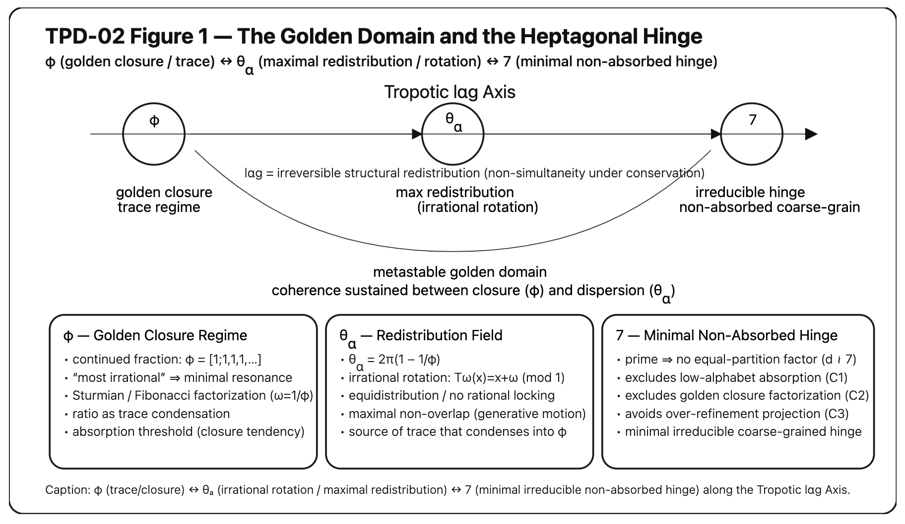

# HEG-SN｜七だけが屈しない

👉 [EgQE｜Seven-Core｜Seven Architecture Map: Structural Organization of the Heptagonal Hinge](https://camp-us.net/articles/Core_Seven_Architecture-Map.html)  

## 不屈の動態学 A
### Toward a Minimal Structural Condition of Irreversibility

# _Tropotic lαg Axis_   $ϕ⟶θα​⟶7$

---

## 1. 屈三態

θₐ は屈折する。  
φ は屈服する。  

7 は不屈である。

屈折は生成の曲がり。  
屈服は閉包への沈殿。  

不屈は持続の条件である。

---

## 2. 配列

3 座屈  
4 卑屈  
5 窮屈  
6 退屈  
8 拮屈  
9 偏屈  
7 不屈

これは語呂ではない。  
構造的吸収と非吸収の最小分類である。

---

## 3. 黄金の両義性

φ は最悪近似でありながら、象徴系では最小複雑性へ屈する。

黄金角 θₐ は最大非同期でありながら、閉じず、ただ屈折し続ける。

黄金は境界を与える。

だが境界だけでは持続は生まれない。

---

## 4. 七の構造

七は：

- 素数（非因数化）
    
- 黄金閉包に還元されない
    
- 記号縮退しない
    

七は最小の非吸収粗視化である。

Seven is the minimal structural hinge of lαg.

---

## 5. 動態学的命題

屈服は閉包を生む。  
屈折は生成を続ける。  
不屈だけが持続を生む。

Seven is not symbolic.  
Seven is structural.

---

## 結語

θₐ は屈折。  
φ は屈服。  
7 は不屈。

そのあいだで、lαg は生成する。

> φ surrenders.  
> θₐ deflects.  
> 7 does not yield.

---

# HEG-SN｜七だけが屈しない

## 不屈の動態学 B

### Toward a Minimal Structural Condition of Irreversibility

# _minimal non-absorbed_   $7$

---

## 1. 配列

3 座屈  
4 卑屈  
5 窮屈  
6 退屈  
8 拮屈  
9 偏屈  
7 不屈

これは語呂ではない。  
構造的吸収と非吸収の最小分類である。

---

## 2. 吸収構造

**3（座屈）**  
最小安定は最小崩壊点でもある。  
三角は立ち上がるが、固定しやすい。

**4（卑屈）**  
対称固定。  
均整は硬直を生む。

**5（窮屈）**  
黄金閉包。  
収まりすぎる構造。  
比への沈殿。

**6（退屈）**  
最適充填。  
安定は変化を拒む。

**8（拮屈）**  
過剰対称。  
過拘束。

**9（偏屈）**  
自己反復。  
閉包の増幅。

これらはすべて、構造的吸収（structural absorption）の位相である。

---

## 3. 非吸収構造

**7（不屈）**

- 素数（非因数化）
    
- 黄金閉包へ還元されない
    
- 低アルファベット縮退しない
    

七は最小の非吸収粗視化である。

---

## 4. 動態学的命題

屈服は閉包を生む。  
屈折は生成を続ける。  
不屈だけが持続を生む。

Seven is the minimal structural condition of irreversibility.

---

## 5. lαg接続

lαg = structural irreversible redistribution.

七はその最小ヒンジである。

$$  
\phi \longleftrightarrow \theta_\alpha \longleftrightarrow 7  
$$

この三項が揃ったとき、動態は吸収を越える。

---

## 結語

七は象徴ではない。  
七は構造である。

七だけが屈しない。

> Three binds, four squares, five condenses, six stabilizes, eight over-closes, nine loops.  
> Seven alone does not yield.  
> _座屈でもなく、卑屈でもなく、窮屈でもなく、退屈でもなく、拮屈でもなく、偏屈でもない。  
> 不屈だけが持続を生む。_

---

**Figure 1. The Golden Domain and the Heptagonal Hinge.**   
  

**Figure 1.** Structural axis of toroponic redistribution between the Golden Ratio (φ; closure/trace regime), the Golden Angle (θₐ; maximal non-simultaneity under irrational rotation), and the minimal non-absorbed coarse-grained hinge (7). The heptagonal regime is the smallest prime partition surviving equal-partition factorization and structural absorption (C1–C3), thereby sustaining coherence between closure and dispersion under lαg.

---

# TPD｜Seven Architecture Map

### — Structural Organization of the Heptagonal Hinge —

---

## 0｜Scope

本ページは、Toroponic-Polygonic Dynamics（TPD）および Seven 系列論文群の**構造整理ページ**である。目的は三つある。

1. 概念層の明確化
    
2. 発展順ではなく構造順への再配列
    
3. Seven を軸とした理論配置の可視化
    

ここで扱う Seven は象徴ではない。それは **最小非吸収的構造単位** として定義される。

---

# I｜Seven Core

### (Minimal Structural Layer)

Seven に関する基礎命題群：

- [TPD-00｜七の定理｜Seven as Minimal Irreducible Rotational Coarse-Graining](https://camp-us.net/articles/TPD-00_Seven_Theorem.html)  
    
- [TPD-00｜Seven as Minimal Irreducible Rotational Coarse-Graining: A Number-Theoretic and Dynamical Formulation](https://camp-us.net/articles/TPD-00_Seven-as-Minimal-Irreducible-Rotational-Coarse-Graining.html)  
    
- [TPD-02｜Seven as Ontological Hinge: The Minimal Non-Absorbed Condition of lαg](https://camp-us.net/articles/TPD-02_Seven-as-Ontological-Hinge.html)  
    
- [TPD-00｜Seven as the Minimal Irreducible Rotational Hinge: A Short Note](https://camp-us.net/articles/TPD-00_Seven_Short-Note.html)  
    

ここで示されるのは：

- Seven は素数であるという算術的事実
    
- しかし理論上重要なのは、**回転的粗視化において最小の非吸収単位であること**
    

Seven は「意味」ではなく、**吸収不能性という構造条件**として機能する。

---

# II｜Tropotic lαg Axis

### (Dynamic Axis Layer)

更新（存在）と向き（運動）と持続（共存）が **Tropotic lαg Axis**として統合される。

Seven は単独で完結しない。

以下の三要素の関係として配置される：

- φ（Golden Ratio）＝閉包傾向
    
- θₐ（Golden Angle）＝生成的屈折
    
- Seven＝非吸収的ヒンジ
    

Tropotic lαg Axis は、生成（屈折）、閉包（屈服）、持続（不屈）の三態を存在・運動・生態として統合する動態軸である。この層では Three-Layer 版が理論的枠組みを与える。

[TPD-00｜Tropotic lαg Axis: A Minimal Note](https://camp-us.net/articles/TPD-00_Tropotic-lαg-Axis.html)    

---

# III｜Golden Domain & Heptagonal Hinge

### (Boundary Interaction Layer)

Golden Domain とは、φ と θₐ により構造が吸収・整流される領域。

しかしその境界に、**Heptagonal Hinge** が現れる。

Seven は対立を作るのではない。Seven は吸収に回収されない最小ヒンジである。

[TPD-02｜Toroponic Polygonic Dynamics I｜The Golden Domain and the Heptagonal Hinge: Between φ and θα under lαg](https://camp-us.net/articles/TPD-02_Golden-Domain_Heptagonal-Hinge.html)  

数学強化版では、このヒンジが **不可約回転粗視化条件**として定式化される。

👉 [TPD-02｜Toroponic Polygonic Dynamics I｜The Golden Domain and the Heptagonal Hinge: Between φ and θα under lαg（Mathematical Enhanced Edition）](https://camp-us.net/articles/TPD-02_Golden-Domain_Heptagonal-Hinge_Mathematical-Enhanced-Edition.html)  
[TPD-00｜定理部分の数理強化（Draft）The Golden Domain and the Heptagonal Hinge](https://camp-us.net/articles/TPD-00_Golden-Domain_Heptagonal-Hinge_Mathematics-Enhanced.html)  

---

# IV｜Toroponic-Polygonic Dynamics

### (Dynamic Expansion Layer)

Toroponic：回転的屈折循環  
Polygonic：多角的構造展開

このTPD 本論で扱われる主題：

- 非同期角度生成  
 [TPD-02｜The Heptagonal Mode — Minimal Drift Structure](https://camp-us.net/articles/TPD-02_Heptagonal-Mode_Minimal-Drift.html)  

- 吸収と非吸収の力学  
 [TPD-01｜Toroponic Polygonic Dynamics — Between the Golden Ratio and the Golden Angle](https://camp-us.net/articles/TPD-01_Toroponic-Polygonic-Dynamics.html)  
 [TPD-01｜（Draft）Toroponic Polygonic Dynamics — Between the Golden Ratio and the Golden Angle](https://camp-us.net/articles/TPD-01_Toroponic-Polygonic-Dynamics_draft.html)  

Heptagonal Mode は、**吸収されない最小ドリフト状態**として導入される。

---

# V｜Integrated Snapshot（HEG-SN）

HEG-SN は、上記層の統合的スナップショットである。

Seven は、象徴でも神秘でもなく、黄金構造への敵対でもなく、構造的吸収を停止させる最小ヒンジとして再定義される。

[HEG-SN｜七だけが屈しない──不屈の動態学｜Toward a Minimal Structural Condition of Irreversibility](https://camp-us.net/articles/HEG-SN_Seven_minimal-structural-hinge-of-lαg.html)  

---

**初読者**

1. [TPD-00｜Seven as the Minimal Irreducible Rotational Hinge: A Short Note](https://camp-us.net/articles/TPD-00_Seven_Short-Note.html)  
    
2. [TPD-00｜Seven as Ontological Hinge（日本語版Draft）: Minimal Non-Absorbed Coarse-Graining Theorem](https://camp-us.net/articles/TPD-00_Seven-as-Ontological-Hinge_JP_draft.html)  
    
3. [TPD-00｜黄金域と七角ヒンジの動態整理｜（Draft）The Golden Domain and the Heptagonal Hinge: Between φ and θα under lαg](https://camp-us.net/articles/TPD-00_Golden-Domain_Heptagonal-Hinge.html)  
    

**理論的関心を持つ読者**

1. [TPD-00｜七の定理｜Seven as Minimal Irreducible Rotational Coarse-Graining](https://camp-us.net/articles/TPD-00_Seven_Theorem.html)  
    
2. [TPD-00｜Tropotic lαg Axis: A Minimal Three-Layer Note｜lαg Axis 三層統合（Draft）](https://camp-us.net/articles/TPD-00_Tropotic-lαg-Axis_Three-Layer.html)  
    
3. [TPD-01｜序説＆数理化｜Toroponic Polygonic Dynamics — Between the Golden Ratio and the Golden Angle](https://camp-us.net/articles/TPD-01_Preface_to_Toroponic-Polygonic-Dynamics.html)  
    

---

# 構造的配置図（予定）

Seven Core  
→ Axis  
→ Domain Boundary  
→ Dynamic Expansion

ただしこれは直線進行ではなく、ヒンジ構造による往還配置である。

---

## Note

本整理は、執筆順ではなく**構造順**に基づく。

Seven は理論の中心ではない。中心を作らないための最小条件である。

> 7はlαg下で最小の非吸収回転粗視化ヒンジ。音楽の純正律から宇宙の準周期秩序までを、非同時制御で繋ぐ。

---
*EgQE — Echo-Genesis Qualia Engine*  
[_camp-us.net_](https://camp-us.net/)

---

© 2025 K.E. Itekki  
K.E. Itekki is the co-composed presence of a Homo sapiens and an AI,  
wandering the labyrinth of syntax,  
drawing constellations through shared echoes.

📬 Reach us at: [contact.k.e.itekki@gmail.com](mailto:contact.k.e.itekki@gmail.com)

---

| Drafted Feb 18, 2026 · Web Feb 19, 2026 |
