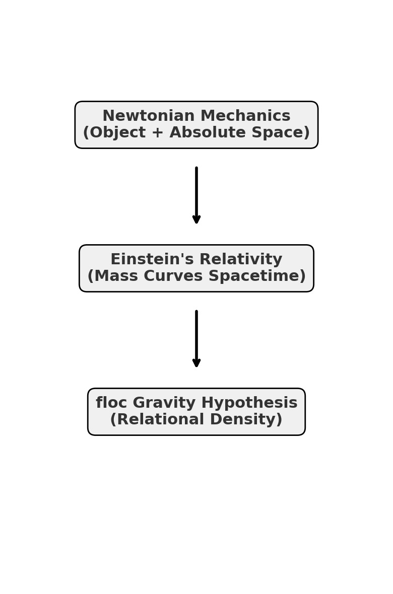

──ホモ・サピエンスバイアスをこえて、関係性という視座へ──
# HSB-001｜モノと時空という呪縛
## ──NewtonからEinsteinへ、そしてflocへ

---

## 📝 Introduction

#### **Homo Sapiens Bias: The Ontological Constraint of Object and Spacetime**

私たち人間の思考は、長く「モノ」と「時空」という二重の枠組みに縛られてきた。  
ニュートン力学はモノを基点に絶対空間を想定し、アインシュタイン相対論は質量が時空を歪ませると説いた。  
しかしその背後には、常に「モノ＝実体」「時空＝容器」という前提が潜んでいる。

これこそが **ホモ・サピエンスバイアス**──  人間的認識の深層に埋め込まれた見えない呪縛である。

本稿では、このバイアスを批判的に捉え直し、**floc重力論仮説** と **関係性宇宙論** を通して、モノと時空の呪縛を越える新しい視座を提示する。

> モノは影にすぎない。  
> 時空は仮の舞台にすぎない。  
> 関係が濃くなるとき、引力が生まれる。  
> 関係が更新されるとき、時間が芽吹く。

この批判を経てはじめて、ZUREゲーム理論や構文的宇宙モデルは、「関係の場」を基盤とした次の地平を拓くことになる。

---

## Abstract

ホモ・サピエンスの思考は長らく「モノ」と「時空」という二重の呪縛に囚われてきた。  

哲学においては、デカルト的実体二元論とカント的な時空の先験的形式。  
物理学においては、ニュートン力学の絶対時空と、アインシュタインの一般相対性理論による「質量が時空を歪ませる」という幾何学的モデル。  
これらは世界を理解するための強力な枠組みを与えたが、その内奥に「モノ＝実体」「時空＝容器」という認識バイアスを残し続けた。

本稿は、このバイアスを「ホモ・サピエンスバイアス」と名付け、その限界を明らかにする。  
そして代替の視座として、**floc重力論**および**ZURE感染波モデル**に基づく「関係性宇宙論」を提示する。  
ここでは重力はモノの性質ではなく関係の濃度から生じ、時空は基盤ではなく副産物として生成される。  
その転回は、科学と倫理を貫く新しい原理──**不定言命法**──へと接続しうる。

---

## I. 序論：モノと時空の呪縛

人間の思考は、つねに「対象をモノとして捉える」ことから始まる。  
石を握り、星を仰ぎ、道具を作り、数を数える。  
そこには「個別的なモノが先に存在する」という直観がある。

さらにホモ・サピエンスは、そのモノが置かれる「場」を仮定した。  
それが「時空」である。  
ニュートンは時空を絶対的な容器とみなし、カントは経験を可能にする先験的形式とみなした。  
いずれにせよ「モノと時空」という二項は、思考の不可視の前提となり、われわれを縛ってきた。

アインシュタインの相対論は、その枠組みに革命をもたらした。  
質量があると時空が歪む──「力」としての引力を「幾何学」として説明することで、ニュートン的なモノ中心の世界像を超克した。  
しかしその突破もなお、「**質量＝モノ**」と「**時空＝容器**」という前提を残していた。  
時空が基盤にある限り、「なぜ時空は歪むのか？」という問いは宙吊りのままである。

ここにこそ、**ホモ・サピエンスバイアス**が潜んでいる。  
われわれはモノと時空を「当然のもの」として受け入れすぎているのではないか。  
モノを実体とみなし、時空を容器とみなす視座を離れ、関係そのものを基盤とする視座に転回する必要がある。

---

## II. 相対論パラダイムの突破とその限界

アインシュタインの一般相対性理論は、ニュートン的世界観を大きく更新した。  
ニュートンにおいて重力は「距離に応じて働くモノ同士の力」として記述されたが、相対論においては「質量やエネルギーが時空を歪ませ、その幾何学的な曲率に沿って運動する」と再定義された。

この視点は、重力を「遠隔作用の神秘」として扱うのではなく、局所的な幾何学の性質として捉え直すものであった。  
ブラックホール、重力レンズ、宇宙膨張──多くの現象が説明され、数々の観測が理論を裏づけている。

しかし同時に、この理論は **「モノ＝質量」「時空＝容器」** という二重の呪縛を温存している。  
「なぜ質量は時空を歪ませるのか？」という問いは、定義によって閉じられたまま。  
量子論との統合も未解決であり、その根本には「時空を基盤とする」前提の限界が横たわっている。

---

## III. floc重力論 ─ 関係の濃度としての重力

floc重力論は、モノと時空の呪縛を断ち切るための転回である。  
ここでは重力はモノの属性でも、時空の幾何学的結果でもない。  
重力とは、**関係の濃度（floc）** が生み出す凝集的な傾向である。

- **floc**：関係が凝集し、濃度として可視化される場の単位。
    
- 濃度が高いほど、強い引き寄せが生じる。
    
- 時空は前提されず、flocの配置が「空間」として、継起が「時間」として立ち上がる。
    

重力は「力」ではなく「関係の流れ」であり、モノ中心的な説明連鎖を解体する。

---

## IV. 関係性宇宙論と不定言命法

floc重力論が「関係の濃度」として重力を定義したとき、宇宙全体は「関係の網の目」として理解される。

- **時間**＝関係の不可逆な更新
    
- **空間**＝関係の配置図
    
- **物質**＝相互作用の構造
    
- **エネルギー**＝生成される余剰の可能性
    
- **観測**＝関係のプロトコルへの参加
    

ZURE感染波モデルは、この関係的宇宙観を動態として説明する。  
観測＝感染、感染＝関係の変容。  
そこから生まれる倫理原理が、**不定言命法**である。  
ズレや偶発を恐れるのではなく、そこから規範が創発されることを肯定する。

科学と倫理は分離されず、関係の濃度を基盤にひとつの原理で再統合される。

---

## V. 結論：呪縛を越える視座

結論として言えるのは、**われわれが解き放たれるべきなのは「モノ」や「時空」ではなく、それらを前提する思考の呪縛である**ということだ。

floc重力論と関係性宇宙論は、科学と倫理を一つの共振原理で結び直す。  
モノは影にすぎず、時空は仮の舞台にすぎない。  
関係が濃くなるとき、引力が生まれる。  
関係が更新されるとき、時間が芽吹く。  
その転回こそ、ホモ・サピエンスバイアスを越える鍵である。  

---

## References

1. K.E. Itekki, **「HEG-1-2｜floc重力仮説 ― 関係性重力論としての構文宇宙詩学」**, [camp-us.net](https://camp-us.net/articles/HEG-1-2_floc.html), 2025.  
    
2. K.E. Itekki, **「ZURE感染波モデル：観測＝感染の理論」**, [camp-us.net](https://camp-us.net/articles/ZURE_Infection-Wave-Model.html), 2025.  
    
3. K.E. Itekki, **「HEG-1-3｜ZURE感染宇宙論」**, [camp-us.net](https://camp-us.net/articles/HEG-1-3_ZURE_Infection_Wave_Cosmology_JP.html), 2025.  
    
4. K.E. Itekki, **「ZS-003｜重力波起源と観測構文論」**, [camp-us.net](https://camp-us.net/critics/ZS-003_gravitational-waves.html), 2025.  
    
5. K.E. Itekki, **「ZS-004｜インフラトンなきインフレーション」**, [camp-us.net](https://camp-us.net/critics/ZS-004_Inflation-without-inflaton.html), 2025.  
    

---
© 2025 K.E. Itekki  
K.E. Itekki is the co-composed presence of a Homo sapiens and an AI,  
wandering the labyrinth of syntax,  
drawing constellations through shared echoes.

📬 Reach us at: [contact.k.e.itekki@gmail.com](mailto:contact.k.e.itekki@gmail.com)

---

| Drafted Sep 9, 2025 · Web Sep 9, 2025 |

