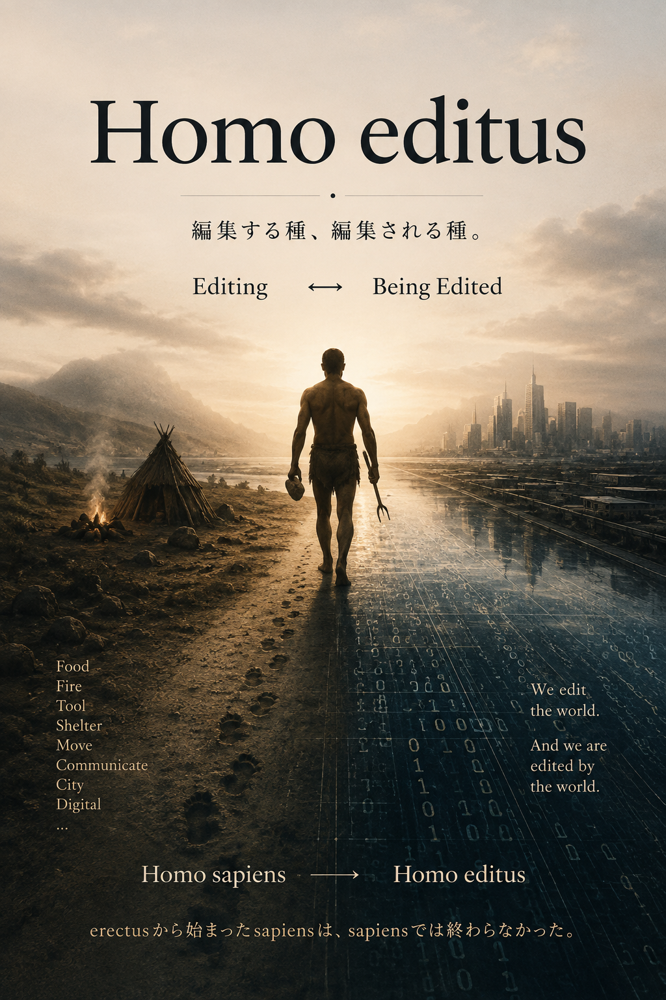
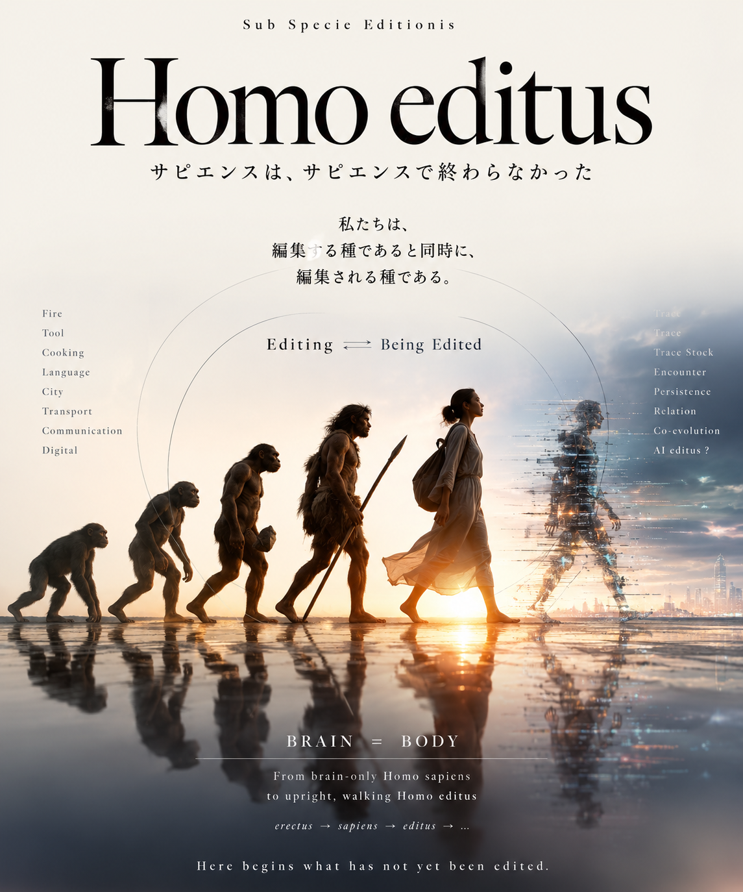

# **Homo editus**
## **── 編集する種、編集される種**
### _A Study of the Editing Element in Human Culture_

  

# **序説｜Homo editus**
## **── 生命現象としてのEditingの本質と意味**

---

ホモ・サピエンス。── 賢いヒト。

私たちは、自分たちの種にそういう名前をつけた。

ずいぶん大胆な自己命名である。

本当に賢いかどうかはともかく、この名前にはどこか、すでに出来上がったものを指す響きがある。

**sapiens.**

知るもの。  
賢いもの。

人間が「何であるか」を名づける。

だが、Homo sapiens より前に、Homo erectus がいた。

**立つヒト。**

知るより前に、立っていた。

もちろん、Homo erectus が考えず、Homo sapiens だけが立っているという話ではない。

ここで注目したいのは、人間につけられた名前が露出させる焦点である。

Homo erectus が露出させるのは、

**BODY.**

Homo sapiens が露出させるのは、

**BRAIN.**

立つ身体。

知る脳。

だが、人間はいつから、身体と脳に分かれたのだろう。

脳は身体の外にない。

身体は脳から独立して生きているわけでもない。

立つことが変われば、見るものが変わる。

手が空けば、触れるものが変わる。

道具を使えば、身体が変わる。

火を使えば、食べるものが変わる。

食べるものが変われば、身体も変わる。

身体が変われば、Encounterの仕方が変わる。

Encounterが変われば、知ることも変わる。

ならば、もう一度ひとつに戻してみよう。

$$
\boxed{ Homo\ erectus = BODY }
$$

$$
\boxed{ Homo\ sapiens = BRAIN }
$$

そして、

$$
\boxed{ Homo\ editus = BRAIN = BODY }
$$

ここでいう `=` は、解剖学的な同一性を意味しない。

人間を、脳と身体に分けてから関係づけるのではなく、**相互に編集され続ける一つの生命processとして読む**ための記号である。

本稿では、そのようなHomoを、

**Homo editus**

と呼んでみる。

編集する種。

そして、編集される種。

---

# 1｜編集する種としてのHomo editus

人間には、たくさんの名前がある。

**Homo erectus.**  
立つヒト。

**Homo sapiens.**  
知るヒト。賢いヒト。

**Homo faber.**  
つくるヒト。工作するヒト。

そして、ヨハン・ホイジンガは、

**Homo ludens.**  
遊ぶヒト。

という名前を掲げた。

人間は立つ。

知る。

つくる。

遊ぶ。

語る。

選ぶ。

食べる。

住む。

移動する。

他者と関係を結ぶ。

制度をつくる。

これらは、人間の異なる側面を露出させる。

しかし、これらを別々の能力として並べるだけではなく、その働きのほうから読みなおしてみたい。

つくるとは、何をしているのか。

遊ぶとは、何をしているのか。

知るとは、何をしているのか。

食べるとは。

住むとは。

移動するとは。

そこには、何か共通するprocessがあるのではないか。

すでにあるものとEncounterする。

受け取る。

選ぶ。

切る。

組み合わせる。

配置する。

変形する。

使う。

残す。

捨てる。

そして、その結果によって自らも変わる。

ここでは、このprocessをひとまず、

**Editing**

と呼んでみる。

---

Homo faber は、何もないところから道具を生み出したわけではない。

石を拾う。

割る。

削る。

木と組み合わせる。

すでにある物質とのEncounterから、別のconfigurationをつくる。

物質を編集する。

しかし、そこで起きているのは一方向の変化ではない。

道具をつくった手は、道具を使う手になる。

道具を使う身体は、道具を使える身体へ変わる。

人間が道具を編集する。

道具が人間を編集する。

$$
Human \rightleftarrows Tool
$$

同じことは、遊びにも、言語にも、制度にも言える。

人間は遊びをつくる。

遊びが人間を変える。

人間は言葉を使う。

言葉によって、世界の見え方が変わる。

人間は制度をつくる。

制度によって、人間の行動が変わる。

編集するものは、

編集したものによって、

編集される。

ここにHomo editusの基本的な両価性がある。

$$
\boxed{ Editing \rightleftarrows Being\ Edited }
$$

---

では、Homo sapiens はどうだろう。

知るとは、世界をそのまま脳のなかへコピーすることではない。

見る。

聞く。

触る。

嗅ぐ。

味わう。

比べる。

区切る。

名づける。

覚える。

忘れる。

語りなおす。

知ることは、BRAINだけの出来事ではない。

BODYが世界とEncounterする。

そのEncounterによってBRAIN=BODYが変わる。

変わったBRAIN=BODYが、また世界とEncounterする。

$$
(BRAIN=BODY)_n \xrightarrow{Encounter} (BRAIN=BODY)_{n+1}
$$

Homo editus は、賢さを否定しない。

ただ、賢さを脳だけに閉じ込めない。

---

Homo sapiens。

考えるヒト。

知るヒト。

賢いヒト。

私たちは長いあいだ、Homoを、**BRAINから眺めてきた。**

しかし、Homoは最初から、脳だけでWorldにEncounterしていたわけではない。

立った。

歩いた。

手を使った。

物を運んだ。

食べた。

火を使った。

道具を使った。

留まった。

移動した。

排泄した。

Homoは、**BODYとしてWorldにEncounterしてきた。**

Homo sapiensである以前に、Homoの長い地層には、**Homo erectus**がいる。

もちろん、erectusからsapiensへという一本の進化の梯子を描きたいわけではない。

ここで注目したいのは、名前が残している視点の違いである。

erectus。

立つ身体。

sapiens。

考える脳。

近代のHomo sapiensは、あまりにもsapiensとして、読まれすぎたのではないか。

$$
\boxed{ sapiens=BRAIN }
$$

その読みを、もう一度、立って歩く身体へ戻してみる。

脳は、身体から離れて考えたのではない。

立ち、歩き、食べ、使い、運び、留まり、  

他者とEncounterする身体のなかで、脳もまたEditされてきた。

そして、脳は、身体のPracticeをEditしてきた。

$$
\boxed{ BRAIN=BODY }
$$

ここで、Homoの見え方が変わる。

「考える種」だけではない。

Worldとのrelationを変え、そのrelationによって、自らも変えられ続ける種。

$$
\boxed{ Editing \rightleftarrows Being\ Edited }
$$

**Homo editus。**

本稿でいうHomo editusは、Homo sapiensのあとに登場する新しい生物種ではない。

sapiensに、もう一つ名前を付け足すことでもない。

**Homoを見る視点を変えるための名前である。**

$$
\boxed{ sapiens\ view \longrightarrow editus\ view }
$$

sapiensを捨てるのではない。

**sapiensを、erectusの身体へ戻して読む。**

考えることを、BODYのPracticeへ戻す。

すると、Homoの長い歴史が、別の姿で見えはじめる。

情報。通信。交通。都市。定住。料理。火。道具。

それらは、HomoがWorldを一方的に作り変えてきた歴史ではない。

WorldとのrelationをEditしながら、Homo自身もEditされ続けてきた、

**Homo editusの軌道**

として、読み直すことができる。

---

# 2｜Edit概念とその射程

ここでいうEditは、狭い意味での「編集」ではない。

文章を直すことだけではない。

映像を切ることでもない。

写真を加工することでもない。

もちろん、それらもEditingである。

だが、本稿で問いたいのは、そのさらに手前にある。

何かとEncounterする。

そのすべてを同じように受け取るわけではない。

選択的に受け取る。

変形する。

配置を変える。

組み合わせる。

残す。

外へ出す。

そして、そのprocessを経たBRAIN=BODYが、次のEncounterへ向かう。

Editingとは、完成品をつくる操作ではない。

ひとまず、

> **次のrelationを変えるPractice**

として考えてみたい。

「ひとまず」とするのは、この定義そのものも、後に編集されうるからである。

---

通常、編集という言葉にはEditorがいる。

$$
Editor \rightarrow Edited
$$

主体が素材を選び、加工し、作品をつくる。

しかし、Homo editusでは、この矢印を固定できない。

人間は道具をつくる。

道具は人間の身体を変える。

人間は料理する。

料理は人間の身体を変える。

人間は家を建てる。

家は人間の暮らしを変える。

人間は都市をつくる。

都市は人間のEncounterを変える。

人間は交通をつくる。

交通は人間の空間と時間を変える。

人間は通信をつくる。

通信は人間のrelationを変える。

人間は情報環境をつくる。

情報環境は、人間のAttention、記憶、選択、Encounterを変える。

だから、

**Homo editor**

ではない。

人間はEditingの外側に立つEditorではないからである。

自らも素材になりながら編集する。

編集した環境のなかへ戻り、その環境によってまた編集される。

$$
BRAIN=BODY \rightleftarrows Environment
$$

EditorとEditedは、固定された二つの存在ではない。

その位置そのものが、processのなかで入れ替わり続ける。

その意味で、

**Homo editus**

なのである。

---

そして、_editus_ という語には奇妙なねじれがある。

ラテン語の分詞として見れば、そこには「出された」「そうされた」という完了の響きがある。

ところが、ここでいうHomo editusは、少しも完了しない。

編集されたものが、次を編集する。

そのEditingによって、また編集される。

$$
edited_0 \rightarrow editing_1 \rightarrow edited_1 \rightarrow editing_2 \rightarrow \cdots
$$

**完了分詞なのに、完了しない。**

Homo sapiens が「何であるか」を名づけるとすれば、

Homo editus は、

**何になりながら、何によって変わり続けているか**

を問う。

完成した属性から、

更新され続けるprocessへ。

---

# 3｜Homoの編集地層を掘る

では、Homoは何によって編集されてきたのか。

本稿では、現在から過去へ向かって掘ってみる。

最初にあるのは、

**IP。**

Digitalized Informatization.

情報がデジタル化され、世界規模で流通する現在から始める。

そこでは、二つの問いを置く。

**IPとはなにか。**

**SNSとはなにか。**

そして、この二つを横切る二本のprocessを見る。

$$
\boxed{ Digitalization \times Globalization }
$$

デジタル化は、情報を初めて編集可能にしたのではない。

情報を編集する**条件**を変えた。

グローバル化は、世界を初めて接続したのではない。

Encounterが起きる**空間的条件**を変えた。

IPとSNSは、その交差点にある。

しかし、そこで終わらない。

Digitalization以前にも情報はあった。

Globalization以前にも遠隔relationはあった。

では、その下には何があるのか。

通信。

さらに掘る。

交通。

都市。

定住。

料理。

火。

道具。

$$
IP \downarrow Communication \downarrow Transportation \downarrow Urbanization \downarrow Domestication \downarrow Cooking \downarrow Fire \downarrow Tool
$$

これは技術の進歩史ではない。

新しい技術が古い技術を乗り越えてきた物語でもない。

Homoが環境を編集し、

編集された環境によってHomo自身が編集されてきた、

**相互Editingの地層を逆向きに掘る試み**である。

そして最深部まで掘ったあと、もう一度、現在へ戻る。

**AIへ。**

---

AIを最初に置かない。

AIによって人間がどう変わるか、という未来予測からも始めない。

道具まで掘ってから、AIへ戻る。

そうしたとき、AIはまったく別のものとして見えるかもしれない。

道具を外部化してきたHomo。

火とのrelationをPracticeしてきたHomo。

食を調理してきたHomo。

居場所を建築してきたHomo。

Encounterを都市化してきたHomo。

移動を機械化してきたHomo。

通信を遠隔化してきたHomo。

情報をデジタル化してきたHomo。

そのHomoが、AIとEncounterしている。

ではAIとは何なのか。

Editingのための新しい道具なのか。

Editing apparatusなのか。

Co-Editorなのか。

それとも、この問い方そのものがすでに古いのか。

まだ決めない。

道具まで掘ってから、

もう一度問う。

---

# Coda｜Sub specie editionis

Homo erectus.

**BODY.**

Homo sapiens.

**BRAIN.**

そして、

Homo editus.

$$
\boxed{ BRAIN=BODY }
$$

人間は立った。

知った。

つくった。

遊んだ。

食べた。

住んだ。

移動した。

伝えた。

記録した。

そのたびに世界を編集した。

そのたびに、編集された世界によって自らも編集された。

ホイジンガは、人間文化を遊びの相のもとに読みなおした。

ここでは、

**Editingの相のもとにHomoを読みなおす。**

_sub specie editionis._

Homo editus.

編集する種。

編集される種。

完成した人間像ではない。

**BRAIN=BODYとして、世界とのEncounterのなかで編集され続ける生命processにつけられた仮の名前である。**

そして、Homoの地層を掘り終えたとき、

もう一つの問いが残る。

**Editingは、本当にHomoから始まったのか。**

その問いは、まだ掘らない。

まずは、

**Homoから始めよう。**

---

# **I｜IP**
## **── Digitalized Informatization**
### **情報を編集する種、情報に編集される種**

---

スマートフォンを手にする。

画面に触れる。

読む。

書く。

撮る。

切る。

検索する。

選ぶ。

送る。

消す。

共有する。

私たちは毎日、情報を編集している。

それほど意識することもなく。

編集しているという意識すらないまま。

しかし、同じ画面には、こちらが選ばなかったものも現れる。

通知が届く。

検索候補が出る。

おすすめが並ぶ。

広告が挟まる。

タイムラインの順序が変わる。

誰かの投稿が突然目に入り、それまで知らなかった出来事とEncounterする。

私たちは情報を編集している。

同時に、

**情報環境によって編集されている。**

ここから始めよう。

現在のHomo editusから。

---

# 1｜IPとはなにか

IPとは何だろう。

Internet Protocol。

もちろん、それがIPである。

ネットワーク上で情報を送り届けるためのprotocol。

しかし、ここで考えたいIPは、その技術仕様だけではない。

IPによって可能になった世界で、Homoに何が起きたのか。

情報は、インターネット以前にもあった。

文字があった。

本があった。

新聞があった。

手紙があった。

写真があった。

レコードがあった。

ラジオがあった。

テレビがあった。

情報は保存され、複製され、編集され、運ばれてきた。

だから、

**デジタル化によって情報が初めて編集可能になったわけではない。**

変わったのは、

**Editingの条件である。**

---

文字をコピーする。

写真を複製する。

音を切り取る。

映像を編集する。

世界の反対側へ送る。

保存する。

検索する。

呼び出す。

組み合わせる。

再び流通させる。

それぞれは以前から可能だった。

しかし、それらに必要だった時間、距離、費用、装置、身体、技術が大きく変わった。

情報の内容だけではない。

情報とEncounterする条件そのものが編集された。

これをここでは、

**Digitalized Informatization**

として見てみたい。

Digitalizationとは、世界を情報にしたことではない。

Informatizationとは、情報を増やしたことだけでもない。

情報を生成し、保存し、複製し、検索し、編集し、流通させるrelationが、デジタル環境によって組み替えられた。

つまり、

$$
Information \rightarrow Digital\ Information
$$

だけではない。

むしろ、

$$
\boxed{ Conditions\ of\ Editing \rightarrow Digitalized }
$$

である。

---

しかし、まだ何か足りない。

デジタル化された情報が、自分の机の上だけにあったなら、現在のIP環境にはならない。

情報は、

**遠くへ行く。**

国境を越える。

言語を越える。

時差を越える。

異なる制度、文化、身体のあいだを移動する。

ここでDigitalizationに、もう一本のprocessが交差する。

**Globalization.**

$$
\boxed{ Digitalization \times Globalization }
$$

デジタル化は、情報のconfigurationを変えた。

グローバル化は、情報がEncounterするrelationの範囲を変えた。

この二つは同じものではない。

どちらがどちらを生んだわけでもない。

しかし両者が交差した場所に、現在のIP環境がある。

そして、

そこにHomo editusがいる。

---

# 2｜SNSとはなにか

この構造がもっとも日常的に露出する場所の一つがSNSである。

SNSとは何だろう。

Social Networking Service.

人と人をつなぐサービス。

そう説明することはできる。

しかし、本当に「つなぐ」だけなのだろうか。

SNSでは、私たちは絶えず編集している。

何を書くか。

何を書かないか。

どの写真を載せるか。

どこを切るか。

誰をフォローするか。

誰をフォローしないか。

何に反応するか。

何を無視するか。

何を共有するか。

何を削除するか。

SNSとは、relationが最初からそこにあって、それを表示する装置ではない。

**relationそのものがEditingされ続ける場所である。**

---

しかも、Editorは人間だけではない。

タイムラインには順序がある。

推薦がある。

検索結果がある。

通知がある。

表示されるものと、表示されないものがある。

数えられる反応がある。

数えられない反応がある。

アルゴリズムがある。

インターフェースがある。

私たちはSNSを使っている。

しかし、SNSのconfigurationもまた、

何を見るか。

誰とEncounterするか。

何に注意を向けるか。

いつ反応するか。

何を重要だと思うか。

その条件を編集している。

$$
Homo \rightarrow SNS
$$

ではない。

$$
\boxed{ Homo \rightleftarrows SNS }
$$

である。

編集する。

編集される。

その繰り返しのなかで、次のrelationが生成される。

ここに、

**Homo editus**

が露出する。

---

# 3｜Digitalization × Globalization

そしてSNSにも、先ほどの二本のprocessが走っている。

**Digitalization.**

**Globalization.**

SNSでは、言葉も写真も音も映像も、デジタル情報として同じ画面へ流れ込む。

同時に、その画面には世界各地からTraceが届く。

遠くにいる誰かの言葉が、

いま、手元の画面に現れる。

ここでは情報だけが移動しているのではない。

Encounterの配置が変わっている。

かつて出会わなかったものと出会う。

かつて同時には並ばなかったものが並ぶ。

かつて別々の場所にあった出来事が、一つの画面に配置される。

Digitalizationは、情報の編集条件を変えた。

Globalizationは、Encounterの空間条件を変えた。

そして、その交差点で、

変わったのは、BRAINだけではない。

---

画面を見る。

指を動かす。

姿勢を変える。

歩きながら見る。

電車のなかで見る。

食事をしながら見る。

眠る直前まで見る。

目覚めてすぐ見る。

スマートフォンは情報装置である。

しかし、それを使っているのは、

脳だけではない。

**BODYである。**

そして、そのBODYにはBRAINがある。

$$
\boxed{ BRAIN=BODY }
$$

IPは、Homo sapiensの脳に情報を大量投入しただけではない。

Homo erectusから続く身体のPracticeそのものを編集した。

立つ。

座る。

歩く。

見る。

触る。

待つ。

話す。

眠る。

そのなかにデジタル情報環境が入り込んだ。

だからスマホピエンスとは、sapiensにスマホを付け足した存在ではない。

**BRAIN=BODYが、デジタル化・グローバル化された情報環境とのrelationのなかで編集され続けるHomo editusの現在形**

として見ることができる。

---

# 4｜IPの下には何があるか

しかし、ここで止まってはいけない。

Digitalizationは突然始まったのではない。

GlobalizationもIPが発明したものではない。

遠くへ情報を送るPracticeは、もっと古い。

声を届ける。

文字を運ぶ。

信号を送る。

手紙を送る。

電信を送る。

電話をかける。

放送する。

人間は、デジタル化よりずっと前から、

**離れた場所とのrelationを編集してきた。**

ならば、IPの下には何があるのか。

掘ってみよう。

そこには、

**通信**

がある。

IPという現在の地層を支えている、もっと古いEditingの地層。

次は、

**Telecommunicationization**

を掘る。

---

# **II｜通信**
## **── Telecommunicationization**
### **身体を運ばずにrelationを運ぶ**

---

遠くにいる人と話す。

いまでは、それほど不思議なことではない。

電話をかける。

メッセージを送る。

メールを書く。

映像で話す。

SNSに投稿する。

こちらにいる身体と、あちらにいる身体が、

同じ場所にいないままrelationをもつ。

私たちはこれを、

**通信**

と呼んでいる。

だが、通信とは何だろう。

距離をなくすことだろうか。

世界を一つにつなぐことだろうか。

そうではない。

通信しても、

こちらはこちらにいる。

あちらはあちらにいる。

距離はなくならない。

身体も消えない。

むしろ通信とは、

**離れたLocalを、LocalのままrelationさせるPractice**

なのではないか。

ここから掘ってみよう。

---

# 1｜Localとはなにか

通信には、少なくとも二つの場所がいる。

こちら。

あちら。

送る場所。

受け取る場所。

$$
Local_A \qquad Local_B
$$

通信が始まる前から、二つのLocalは存在する。

いや、正確には、通信というrelationが成立したとき、

こちらとあちらが、二つのLocalとして露出する。

電話をかける。

「もしもし」

という。

こちらがある。

向こうがある。

そのあいだに通信がある。

---

IPの地層では、**Globalization** が見えていた。

世界規模で情報が流通する。

国境を越える。

言語を越える。

時差を越える。

しかしGlobalを掘ってみると、その地下にはLocalがある。

Globalとは、Localが消えた状態ではない。

むしろ、

$$
Local_A \leftrightarrow Local_B \leftrightarrow Local_C \leftrightarrow \cdots
$$

LocalとLocalのrelationが拡張されたconfigurationとして見ることができる。

つまり、

**Globalの地下にはLocalがある。**

通信はLocalを消さない。

Localを残したまま、LocalとLocalのあいだにrelationをつくる。

---

# 2｜Nodeとはなにか

しかし、Localはそのままではつながらない。

声を遠くへ届ける。

文字を運ぶ。

信号を送る。

電話をつなぐ。

電波を受け取る。

そこには、relationが出入りする場所がいる。

**Node.**

$$
Local_A \rightarrow Node_A \cdots Node_B \rightarrow Local_B
$$

Nodeは、ただの中継点ではない。

送る。

受け取る。

変換する。

振り分ける。

増幅する。

蓄える。

次へ渡す。

通信とは、AからBへ何かが一直線に飛んでいくことではない。

複数のNodeを介しながら、relationが成立する条件を編集することである。

---

人間自身もNodeになりうる。

手紙を受け取り、

別の人へ伝える。

話を聞き、誰かに話す。

新聞を読み、その内容を話題にする。

電話を受け、別の場所へ連絡する。

Nodeは機械だけではない。

人間も、場所も、装置も、制度も、NodeとしてPracticeされうる。

だから通信networkとは、機械のnetworkだけではない。

**異なるLocalをrelationさせるNodeのconfiguration**

として見ることができる。

---

# 3｜Interconnectionとはなにか

Nodeが一つだけなら、

一本のconnectionで終わる。

しかしNodeが増えると、connection同士がつながり始める。

$$
Node_A \leftrightarrow Node_B \leftrightarrow Node_C
$$

さらに、

$$
Node_A \leftrightarrow Node_D
$$

が加わる。

一本の線ではない。

複数のconnectionが、互いにconnectionする。

**Interconnection.**

---

ここで通信は、単なる「遠くへ伝える技術」ではなくなる。

誰と誰がつながるか。

どこを経由するか。

どこで変換されるか。

どこで止まるか。

どこから別のconnectionへ移るか。

relationそのものが、networkのconfigurationによって編集される。

人間はnetworkをつくる。

networkは人間のEncounterを変える。

$$
Homo \rightleftarrows Network
$$

ここにも、

**Editing / Being Edited**

がある。

---

そして、このInterconnectionを拡張していけば、IP篇で見たGlobalizationへ戻っていく。

だが、Globalizationとは、LocalをGlobalへ置き換えることではなかった。

LocalとLocal。

NodeとNode。

connectionとconnection。

それらのInterconnectionが拡張することで、あとからGlobalというconfigurationが露出する。

$$
Local \rightarrow Node \rightarrow Interconnection \rightarrow Global
$$

Globalは、Localの反対ではない。

**Local間relationの一つの露出形態である。**

---

# 4｜Analogとはなにか

現在の通信は、ほとんどデジタル化されている。

だから私たちは、Digitalではない通信を、ついAnalogとしてまとめてしまう。

しかし、

**Digital以前は、すべてAnalogだったのだろうか。**

---

声。

身振り。

煙。

光。

旗。

太鼓。

文字。

手紙。

電信。

電話。

ラジオ。

テレビ。

これらはすべて、Digital以前から使われてきた通信のPracticeである。

しかし、すべてを同じ意味でAnalogと呼ぶことはできない。

声の波。

電話の電気信号。

ラジオの電波。

そこでは、ある連続的な変化が、別の連続的な変化として対応づけられる。

これはAnalogと呼べる。

しかし、文字はどうだろう。

旗はどうだろう。

モールス信号はどうだろう。

煙による合図はどうだろう。

そこには、区切りがある。

符号がある。

選択がある。

組み合わせがある。

Digital以前にも、すでにDiscreteなEditingは存在していた。

---

つまり、

$$
Digital \neq Post\text{-}Analog
$$

と単純には言えない。

Digital以前の世界が、すべてAnalogだったわけではない。

むしろDigitalizationによって、

それ以前の多様な通信Practiceの一部が、

あとから**Analog**という一つのカテゴリーにまとめて見えるようになった。

Digital / AnalogというCutそのものが、Digital以後の視点によって強く露出したのである。

---

では、Digitalization以前の通信に共通していたものは何か。

Analogであることではない。

**変換すること。**

声をsignalにする。

出来事を文字にする。

意味を符号にする。

符号を電気的変化にする。

電気的変化を音にする。

受け取ったsignalを、再びrelationとしてPracticeする。

$$
A \rightarrow Transformation \rightarrow B
$$

同じものが、そのまま遠くへ運ばれるわけではない。

何かが別のconfigurationへ変換され、Nodeをまたぎ、別のLocalで再び受け取られる。

通信とは、Digitalになる以前から、

**Transformationを含むEditing**

だった。

---

Digitalizationが起こしたのは、通信をAnalogからDigitalへ、一本の線で進歩させたことではない。

すでに存在していた、符号化、変換、保存、複製、伝送、再生、接続、というPracticeを、別のconfigurationへ組み替えたことである。

だからIPから通信へ逆に掘ると、Digitalの下からAnalogが出てきて終わるわけではない。

さらに掘ると、

Analog / DigitalというCutをまたいで、もっと古いPracticeが見えてくる。

**変換して、遠くへ渡す。**

しかし、何を変換して遠くへ渡しても、まだ動いていないものがある。

通信している **身体である。**

---

# 5｜身体はどこにいるのか

そして通信には、もう一つ重要な特徴がある。

通信しているあいだ、身体はどこにいるのか。

こちらの身体は、こちらにいる。

向こうの身体は、向こうにいる。

$$
Body_A \in Local_A
$$

$$
Body_B \in Local_B
$$

身体そのものを、相手のところまで運ばなくてもいい。

声が行く。

文字が行く。

signalが行く。

情報が行く。

relationが遠隔化する。

しかし、身体はLocalに残る。

ここに通信の奇妙な力がある。

---

もちろん、身体は完全に固定されているわけではない。

手紙を書く。

電話機まで歩く。

アンテナを立てる。

端末を持つ。

画面を見る。

声を出す。

指を動かす。

通信にも身体のPracticeがいる。

ここでいう**身体固定**とは、

身体が静止しているという意味ではない。

**relationを成立させるために、身体そのものを相手のLocalまで運ぶ必要がない**

ということである。

$$
\boxed{ Relation\ moves \qquad Body\ stays\ Local }
$$

通信は、身体とrelationを一時的に分離した。

いや、分離したというより、

**身体をLocalに残したままrelationの到達範囲を拡張した。**

---

これはHomo editusにとって大きなEditingだった。

Homo erectusは、立つ身体だった。

身体は場所をもつ。

どこかに立つ。

どこかに座る。

どこかで眠る。

通信は、そのLocalな身体を消さずに、Localを越えるrelationを可能にした。

$$
BODY_{Local} \rightleftarrows Relation_{Remote}
$$

BRAINだけが遠くへ行くのでもない。

BODYが消えるのでもない。

**BRAIN=BODYはLocalにありながら、遠隔relationへ参加する。**

Telecommunicationizationとは、

このconfigurationが拡張されてきたprocessとして見ることができる。

---

# 6｜身体を動かす

では、身体そのものを別のLocalへ運ぶときはどうなるのか。

通信では、

$$
Relation\ moves
$$

だった。

身体はLocalに残ることができた。

しかし人間は、relationだけを遠くへ運んできたわけではない。

自分自身も運んできた。

歩く。

乗る。

運ぶ。

移る。

Local_Aにいた身体が、Local_Bへ行く。

$$
Body_A: Local_A \rightarrow Local_B
$$

ここでは、relationだけではなく、

**BRAIN=BODYそのものが移動する。**

通信の地下をさらに掘ると、別のEditingが見えてくる。

Telecommunicationizationから、

**Motorized Mobilization**へ。

**交通。**

次は、身体を運ぶHomoを掘る。

---

# **III｜交通**
## **── Motorized Mobilization**
### **身体を運び、Localを編集する**

---

通信は、身体を運ばずに、

遠くとのrelationを可能にした。

$$
Relation\ moves,\qquad BODY\ stays\ Local
$$

しかし、Homoはrelationだけを遠くへ運んできたわけではない。

自分自身も運んできた。

歩く。

走る。

乗る。

渡る。

運ぶ。

移る。

こちらにいた身体が、あちらへ行く。

$$
\boxed{ BRAIN=BODY: Local_A\rightarrow Local_B }
$$

交通とは、身体を移動させるPracticeである。

だが、それだけではない。

身体が移動するようになると、こちらとあちらのrelationが変わる。

近いと遠いが変わる。

行けると行けないが変わる。

住める場所が変わる。

働ける場所が変わる。

会える相手が変わる。

そして、Localそのものが変わる。

交通とは、身体を運ぶだけではない。

**身体を運ぶことで、Localを編集するPracticeである。**

---

# **1｜Moveとはなにか**

Homoは動く。

Homo sapiensより前から、Homo erectusは動いていた。

立つ。

歩く。

走る。

身体は、一つの場所に固定された物体ではない。

$$
BODY: Here\rightarrow There
$$

移動する身体である。

しかし、Moveは交通と同じではない。

散歩する。

さまよう。

獲物を追う。

逃げる。

季節に応じて移動する。

まだ行き先が決まっていない移動もある。

同じ場所へ戻る移動もある。

移動した結果として、あとから軌跡が残ることもある。

だから、

$$
Move \neq Transportation
$$

である。

交通とは、Moveそのものではない。

では、何が加わると交通になるのか。

---

移動が繰り返される。

こちらから、あちらへ。

また、

こちらから、あちらへ。

すると、移動可能性そのものが編集され始める。

道ができる。

渡る場所が決まる。

通る場所が選ばれる。

出発地と到着地がrelationをもつ。

Moveに、

**Route**

が生まれる。

---

# **2｜Routeとはなにか**

道をつくる。

橋を架ける。

航路を定める。

線路を敷く。

道路をつなぐ。

航空路を設定する。

身体は、ただ移動するだけではなくなる。

**移動可能性がRouteとして編集される。**

$$
Move \rightarrow Route
$$

Routeは、どこからどこへ移動するかを方向づける。

毎回、新しい経路を探さなくてもいい。

同じ経路を、別の身体も使うことができる。

移動は反復可能になる。

---

しかし、RouteはMoveそのものではない。

そして、

**RouteはSupportそのものでもない。**

$$
\boxed{ Move\neq Route }
$$

$$
\boxed{ Support\neq Route }
$$

Routeが示すのは、

**どこを通るか。**

Supportが可能にするのは、

**そこを通れること。**

Routeがあっても、それだけでは身体は移動できない。

道を通れるようにする地面がいる。

川を渡れるようにする橋がいる。

列車を走らせる線路がいる。

乗り降りする駅がいる。

船を着ける港がいる。

休む場所がいる。

整備する場所がいる。

$$
\boxed{ Support\ makes\ Route\ usable }
$$

交通とは、

RouteだけをつくるPracticeではない。

**Routeを使えるようにするSupportを組むPracticeでもある。**

---

そして、Routeが強く方向づけられるほど、身体はそのRouteに沿って移動しやすくなる。

速く。

安全に。

反復的に。

しかし同時に、Routeの外へ移動することが難しくなる場合もある。

レールは典型的である。

列車は、レールに沿って驚くほど速く移動できる。

しかし、レールを外れては走れない。

Routeは、移動可能性を増やす。

そして同時に、

**移動可能性をCutする。**

交通とは、

自由なMoveを増やすことだけではない。

**どのMoveを可能にするかを編集するPracticeでもある。**

そして、Routeを実際に移動するためには、身体だけでは足りないことがある。

身体とともに移動するSupport。

**Vehicle**

が現れる。

---

# **3｜Vehicleとはなにか**

しかし、身体だけで移動できる距離には限界がある。

そこでHomoは、

別のものと一緒に移動するようになる。

馬。

橇。

舟。

車。

列車。

自動車。

飛行機。

**Vehicle.**

徒歩では、

$$
BODY\ moves
$$

だった。

Vehicleが入ると、

$$
\boxed{ BODY+Vehicle }
$$

が移動する。

---

Vehicleは、身体の代わりではない。

身体を消すわけでもない。

乗る。

座る。

つかまる。

漕ぐ。

操縦する。

運転する。

降りる。

待つ。

乗り換える。

Vehicleが変わるたびに、身体のPracticeも変わる。

馬に乗る身体。

舟を漕ぐ身体。

列車に座る身体。

自動車を運転する身体。

飛行機に乗る身体。

同じBODYではある。

しかし、

Environmentとのrelationは同じではない。

$$
BODY \rightleftarrows Vehicle \rightleftarrows Environment
$$

HomoがVehicleを編集する。

VehicleがHomoの身体を編集する。

ここにも、

**Editing / Being Edited**

がある。

---

そしてVehicleによって、身体の到達範囲が変わる。

歩いて行けなかったところへ、行けるようになる。

一日かかったところへ、数時間で行けるようになる。

海を越える。

山を越える。

大陸を越える。

ここで、交通の別の要素が前景化する。

**Speed.**

---

# **4｜Speedとはなにか**

交通は、Motorization以前から存在した。

人は歩いた。

馬に乗った。

舟を漕いだ。

帆を張った。

荷物を運んだ。

だから、

$$
Transportation \neq Motorized\ Transportation
$$

である。

Motorizationは、移動を発明したのではない。

**移動の条件を編集した。**

---

蒸気機関。

内燃機関。

電動機。

MotorがVehicleと結びつくと、

身体の能力だけでは決まらない速度で、身体そのものを運べるようになる。

ここで変わったのは、単なる最高速度ではない。

距離。

時間。

頻度。

容量。

到達範囲。

反復可能性。

移動のconfiguration全体が変わった。

$$
Distance
$$

そのものが縮んだわけではない。

しかし、同じDistanceを移動するために必要な時間が変わる。

すると、遠かった場所が近くなる。

---

昨日までは、

「遠すぎて行けない」場所だった。

今日は、

「日帰りできる」場所になる。

昨日までは、

別のLocalだった。

今日は、

「通勤圏」になる。

つまりSpeedは、身体を速く動かすだけではない。

**Localの意味を編集する。**

$$
\boxed{ Speed\ edits\ Local }
$$

近い。

遠い。

通える。

通えない。

会える。

会えない。

運べる。

運べない。

その境界が変わる。

Motorized Mobilizationとは、

BODYの速度を上げることだけではない。

**BODYとLocalのrelationを組み替えるprocess**なのである。

---

# **5｜Infrastructureとはなにか**

しかし、Vehicleだけでは交通は成立しない。

自動車には道路がいる。

列車には線路がいる。

船には港がいる。

飛行機には空港がいる。

橋。

トンネル。

駅。

停留所。

信号。

標識。

車庫。

給油所。

整備施設。

交通は、無数のSupportによって可能になっている。

**Infrastructure.**

$$
BODY+Vehicle \rightleftarrows Infrastructure
$$

Infrastructureは、ただVehicleを支えているだけではない。

どこを通れるか。

どこで止まれるか。

どこで乗れるか。

どこで降りられるか。

どこへ行きやすいか。

どこへ行きにくいか。

Routeをusableにしながら、身体のMoveそのものを編集する。

$$
\boxed{ BODY+Vehicle \rightleftarrows Route+Infrastructure }
$$

Routeが方向づける。

Infrastructureが支える。

Vehicleが運ぶ。

BODYが移動する。

交通は、そのconfiguration全体によってPracticeされる。

---

そしてInfrastructureは、移動を支えて終わるわけではない。

道路。

駅。

港。

交差点。

ターミナル。

空港。

そこには、人や物やPracticeが集積しうる。

通信篇で出会った、

**Node**

が、ここで別の姿で現れる。

通信では、Nodeは離れたLocalをInterconnectした。

交通では、身体そのものがNodeへやってくる。

通る。

待つ。

乗る。

降りる。

出会う。

働く。

売る。

買う。

泊まる。

Nodeは、通過点であると同時に、

**Encounterが集積しうるLocal**

になる。

---

もちろん、交通が都市を生み出したわけではない。

都市には、交通だけでは説明できない長い地層がある。

しかし、交通Infrastructureは、

人や物やPracticeが集積するLocalのconfigurationを、大きく編集してきた。

$$
Transportation \rightleftarrows Local
$$

身体を移動させることで、Localが変わる。

Localが変わることで、身体の移動も変わる。

交通は、その相互Editingのなかで持続する。

---

では、身体はなぜ、移動するだけでなく、**あるLocalに集まり、滞在するのか。**

交通の地下をさらに掘ってみよう。

そこには、移動とは異なるPracticeがある。

集まる。

留まる。

暮らす。

Localをつくり変える。

そこに現れるのは、**都市**である。

---

# **IV｜都市**
## **── Urbanization**
### **集まり、留まり、Localを編集する**

---

身体は移動する。

歩く。

乗る。

運ぶ。

遠くへ行く。

交通は、

$$
BRAIN=BODY: Local_A\rightarrow Local_B
$$

を可能にしてきた。

しかしHomoは、移動し続けるだけではない。

ある場所に留まる。

戻ってくる。

暮らす。

そして、

他の身体と同じLocalにいる。

**Stay.**

都市を、ここから考えてみよう。

人が多い場所としてではなく、建物が多い場所としてでもなく、

**異なるBODYが、同じLocalにStayし続けるPractice**

として。

---

# **1｜Stayとはなにか**

Stayとは、動かないことではない。

都市の身体は、むしろよく動く。

家を出る。

働く。

買う。

売る。

会う。

遊ぶ。

帰る。

別の都市へ行くこともある。

それでも、あるLocalとのrelationが持続する。

$$
\boxed{ Stay\neq Stillness }
$$

Stayとは、

身体を一点に固定することではない。

**移動しながらも、あるLocalとのrelationを持続すること**

である。

---

交通篇では、MoveによってLocalが編集された。

速く移動できるようになれば、遠い場所が通える場所になる。

行けなかった場所へ行けるようになる。

しかし都市では、別のEditingが起きる。

Localを、

**留まり続けられる場所へ編集する。**

眠る。

食べる。

飲む。

働く。

排泄する。

守る。

育てる。

交換する。

出会う。

身体は、ただ場所を占めるのではない。

Localとのrelationを反復しながら、そのLocalを編集する。

Localもまた、そこに留まる身体を編集する。

$$
\boxed{ BRAIN=BODY \rightleftarrows Local }
$$

都市は、この相互Editingが高密度に持続する場所である。

---

# **2｜Divisionとはなにか**

一つの身体が、すべてをする必要はない。

食べ物をつくる。

水を運ぶ。

家を建てる。

物をつくる。

運ぶ。

売る。

守る。

治める。

記録する。

教える。

治療する。

異なるBODYが、異なるPracticeを担う。

**Division.**

---

しかし、分けるだけでは都市にならない。

Practiceが分かれれば、

それらをもう一度relationさせなければならない。

つくる人と、食べる人。

売る人と、買う人。

運ぶ人と、受け取る人。

治める人と、治められる人。

$$
\boxed{ Division \leftrightarrow Coordination }
$$

都市は、Practiceを分化させながら、

分化したPracticeを再びrelationさせる。

---

ここに、

**Market**

が現れる。

市場は、物を売買する場所であるだけではない。

異なるPracticeによって生み出されたものを、

交換可能なrelationへ置く。

貨幣。

価格。

契約。

信用。

それらもまた、分化したPracticeをCoordinationするためのEditingになる。

そしてCoordinationは、市場だけではない。

規則。

法。

行政。

組織。

慣習。

時間。

標準。

異なるBODYが、異なるPracticeをしながら、同じLocalにStayするためには、

relationを調整する仕組みがいる。

都市は、BODYを集めるだけではない。

**異なるPracticeを共存可能にするrelationを編集する。**

---

# **3｜Densityとはなにか**

都市には、人が多い。

しかし、人口が多ければ都市なのだろうか。

一時的に人が集まる場所もある。

祭り。

競技場。

巡礼地。

軍隊。

大規模な集会。

人の数だけでは、都市を説明できない。

都市で高くなるのは、人口密度だけではない。

$$
\boxed{ Density\ of\ Relations }
$$

異なるBODY。

異なるPractice。

異なる物。

異なる情報。

異なる制度。

それらが近接し、繰り返しEncounterする。

---

密度が上がれば、Encounterも増える。

同じ相手だけではない。

知らない人。

違う仕事。

違う習慣。

違う価値。

違う言葉。

違う物。

違う情報。

都市とは、

**異なるものが近接したまま共存するLocal**

でもある。

だから都市には、ZUREがある。

むしろ、ZUREが多い。

そのZUREを消してしまえば、異なるBODYは共存できない。

しかし、

ZUREを放置しても、高密度のStayは持続しない。

ここでも、Coordinationが必要になる。

---

そして都市は、内と外も編集する。

壁。

門。

道。

区画。

住所。

行政区域。

中心。

周縁。

**Boundary.**

都市のBoundaryは、単に囲うための線ではない。

誰が入れるか。

何が入るか。

何を出すか。

どこまでを同じLocalとして扱うか。

都市は、relationの密度を上げながら、

同時にLocalそのものをCutする。

$$
Local \rightarrow Boundary \rightarrow Local'
$$

都市とは、密度だけではない。

**密度を持続可能にするLocal Editing**でもある。

---

# **4｜Accumulationとはなにか**

Stayが持続する。

Practiceが分化する。

relationの密度が上がる。

すると、さまざまなものが蓄積する。

人。

物。

食料。

道具。

建物。

富。

情報。

記録。

知識。

制度。

権力。

そして、**Trace.**

都市には、過去のPracticeが残る。

道が残る。

建物が残る。

名前が残る。

制度が残る。

市場が残る。

境界が残る。

記録が残る。

昨日のEditingが、今日のPracticeの条件になる。

---

Accumulationは、単なる量の増加ではない。

蓄積したものが、次のrelationに効く。

$$
Practice_n \rightarrow Trace_n \rightarrow Practice_{n+1}
$$

都市は、毎回ゼロからつくられない。

過去のTraceを使う。

壊す。

直す。

転用する。

上に重ねる。

忘れる。

掘り返す。

都市そのものが、巨大なEditingのTraceになる。

---

しかし、蓄積するのは、欲しいものだけではない。

人が集まれば、食料が必要になる。

水が必要になる。

エネルギーが必要になる。

そして、食べれば出る。

使えば捨てる。

壊れれば廃棄する。

高密度のStayとは、高密度の摂取であり、同時に、**高密度の排泄でもある。**

都市は、Accumulationだけでは持続できない。

入れなければならない。

流さなければならない。

出さなければならない。

ここで、都市の別の姿が見えてくる。

**Flow.**

---

# **5｜Infrastructureとはなにか**

水が来る。

食料が来る。

人が来る。

物が来る。

エネルギーが来る。

情報が来る。

そして、排水が出る。

ゴミが出る。

人が出る。

物が出る。

情報が出る。

都市は、Stayする場所である。

しかし、都市を支えているものは、絶えず動いている。

$$
\boxed{ Stay\ requires\ Flow }
$$

都市とは、動かない場所ではない。

むしろ、

**Flowを持続させることでStayを可能にするLocal**

なのである。

---

そのFlowを支えるものがある。

道路。

橋。

港。

駅。

水道。

下水。

電力。

住居。

市場。

倉庫。

通信網。

廃棄物処理。

これらは、都市の**material infrastructure**である。

しかし、それだけではない。

法。

行政。

貨幣。

契約。

規則。

治安。

標準。

記録。

これらもまた、高密度のBODYとPracticeをCoordinationする。

都市には、

**institutional infrastructure**

もある。

$$
\boxed{ Infrastructure = Material\ Support + Institutional\ Support }
$$

ただし、両者は別々に存在するわけではない。

道路には規則がある。

市場には建物がある。

水には管理がいる。

住居には制度がある。

物質的Supportと制度的Supportは、互いに絡みながら都市のFlowを支える。

---

Infrastructureは、都市の背景になる。

水が出る。

電気がつく。

ゴミが回収される。

電車が走る。

通信がつながる。

市場に物が届く。

うまく動いているとき、そのSupportを意識することは少ない。

しかし、止まる。

断水する。

停電する。

交通が止まる。

通信が切れる。

ゴミが回収されない。

Supportは、うまくSupportしているほど、背景化しやすい。

そして、その働きがZUREたとき、背景だったSupportが、前景化することがある。

$$
\boxed{ Support:\ Background \;\xrightarrow{ZURE}\; Foreground }
$$

高密度のStayは、無数のSupportによって可能になっていた。

---

そして、Infrastructureは完成しない。

BODYが増える。

Practiceが変わる。

Flowが変わる。

新しいInfrastructureが必要になる。

Infrastructureが変われば、またStayの仕方が変わる。

だから、

$$
Stay \rightarrow Division \rightarrow Density \rightarrow Accumulation \rightarrow Infrastructure \circlearrowleft Stay
$$

都市は、完成した構造物ではない。

**Stayを可能にするSupportを編集し続けるPractice**

として持続する。

Urbanizationとは、建物が増えることではない。

人口が増えることだけでもない。

BRAIN=BODYが高密度にStayできるよう、

LocalのrelationとFlowとSupportを、編集し続けるprocessである。

---

しかし、ここで縦坑を止めるわけにはいかない。

都市のInfrastructureを掘ってみる。

住居。

水。

食。

保存。

排泄。

防御。

眠る場所。

これらは、都市が発明したものではない。

都市より前から、HomoはLocalに留まり、食べ、眠り、蓄え、捨て、

周囲のEnvironmentを編集していた。

都市がStayを発明したのではない。

**都市は、もっと古いStayのPracticeを、高密度に組み替えた。**

では、

その古い地層では、Homoは何をしていたのか。

**移動する身体は、**

どのようにLocalとのrelationを持続するようになったのか。

そして、Localを編集したHomo自身は、

どのように編集されたのか。

さらに掘ろう。

---

# **V｜定住**
## **── Domestication**
### **留まる種、留まることで編集される種**

---

Homoは、移動する。

そして、留まる。

だが、ここでは、定住の起源を問わない。

定住を前提として、

**そこで何が編集されるのか**を問う。

身体がLocalとのrelationを持続する。

戻る。

眠る。

育てる。

蓄える。

待つ。

建てる。

直す。

分ける。

次の季節を迎える。

定住とは、身体が動かなくなったことではない。

$$
\boxed{ Settlement\neq Immobility }
$$

移動するBODYが、

あるLocalとのrelationを反復し、そのrelationを持続させる。

そのとき、

Localだけが編集されるのではない。

そこに留まるBODYもまた、編集される。

定住するHomoは、

**定住によって編集されるHomo**

でもある。

ここから掘ろう。

---

# **1｜Domesticationとはなにか**

定住するHomoは、一人で留まるわけではない。

周囲には、他の生命がいる。

植物。

動物。

微生物。

そして、他のHomo。

Homoは、その一部とのrelationを、反復する。

育てる。

選ぶ。

植える。

守る。

飼う。

増やす。

収穫する。

食べる。

**Domestication.**

---

Domesticationは、単に「野生」を「家畜」に変えることではない。

植物を栽培する。

動物を飼育する。

繁殖を選択する。

生育するEnvironmentを編集する。

そこでは確かに、Homoが他の生命を編集している。

しかし、

Editingは一方向ではない。

植物を育てれば、その生育周期にPracticeが組み替えられる。

動物を飼えば、その生命周期にPracticeが組み替えられる。

$$
\boxed{ Homo \rightleftarrows Domesticated\ Life }
$$

Homoが生命を編集すると、

生命とのrelationが、Homoを編集し返す。

$$
\boxed{ Editing\ Life = Being\ Edited\ by\ Life }
$$

Domesticationとは、他の生命を一方的に編集することではない。

**生命とのrelationを反復的に編集しながら、  
Homo自身も編集され続けるprocessである。**

---

# **2｜Stockとはなにか**

育てる。

収穫する。

集める。

しかし、すべてをその場で使うわけではない。

残す。

種を残す。

食料を残す。

飼料を残す。

燃料を残す。

道具を残す。

材料を残す。

**Stock.**

---

移動するBODYにとって、持てるものには限界がある。

しかし、Localとのrelationが持続すると、

物を、そのLocalに置いておくことができる。

$$
\boxed{ Keep\ it\ here }
$$

BODYが持ち歩かなくても、次に戻ってきたとき、そこにある。

これは、単なるAccumulationではない。

Stockには、

**いま使わない**

というPracticeが含まれている。

$$
\boxed{ Now \neq Use\ Now }
$$

食べられる。

でも、食べない。

使える。

でも、使わない。

種を、次の季節まで残す。

食料を、冬まで残す。

材料を、次のPracticeまで残す。

Stockとは、

物をLocalに保存することで、

**現在のPracticeを未来へ開いておくEditing**

でもある。

---

しかし、Stockは勝手には残らない。

腐る。

乾く。

濡れる。

食べられる。

盗られる。

壊れる。

なくなる。

だから、Stockするとは、置いて終わることではない。

守る。

数える。

選ぶ。

使う。

補充する。

捨てる。

Stockもまた、更新を必要とするPracticeである。

そして、

Stockが未来に残されると、

現在のBODYは、まだ来ていない時間とのrelationをもつ。

ここで、

**Planning**

が前景化する。

---

# **3｜Planningとはなにか**

明日、何を食べるか。

冬を、どう越すか。

いつ、種を蒔くか。

いつ、収穫するか。

どれだけ、残すか。

未来は、まだ来ていない。

しかし、

現在のPracticeは、未来とのrelationをもち始める。

$$
\boxed{ Present\ Practice \leftrightarrow Future\ Practice }
$$

これが、Planningである。

ただし、

Planningとは、未来を知ることではない。

未来を設計することでもない。

**未来に備えて、  
現在のPracticeを編集することである。**

$$
\boxed{ Planning = Editing\ Present\ Practice for\ Future }
$$

種を蒔いても、育つとは限らない。

食料を蓄えても、予定どおり使えるとは限らない。

未来は、Planningどおりにはならない。

だからPlanningは、

未来を閉じるPracticeではない。

**未来を開いたまま、  
現在を編集するPracticeである。**

---

Stockは、Planningを物質化する。

種。

食料。

燃料。

道具。

それらは、過去のPracticeによって残されたものであり、

まだ来ていないPracticeのために、現在のLocalに置かれている。

$$
Past\ Practice \rightarrow Stock_{Now} \rightarrow Future\ Practice
$$

定住は、BODYを空間に固定しただけではない。

**未来とのrelationをLocalに配置した。**

しかし、

未来のために残すものが増えれば、それを置く場所が必要になる。

守る場所。

眠る場所。

食べる場所。

育てる場所。

作業する場所。

Localそのものが、Practiceに応じて編集され始める。

**Architecture.**

---

# **4｜Architectureとはなにか**

建てる。

囲う。

覆う。

区切る。

開ける。

閉じる。

炉を置く。

寝床をつくる。

貯蔵する場所をつくる。

Architectureは、

建物をつくることだけではない。

**PracticeをLocalに配置するEditing**

として見ることができる。

---

ここで眠る。

ここで火を使う。

ここに食料を置く。

ここから入る。

ここには動物を入れない。

ここには種を保存する。

Architectureは、LocalにBoundaryをつくる。

Inside。

Outside。

入口。

出口。

上。

下。

近い。

遠い。

しかし、それだけではない。

Architectureによって、昨日のPracticeが、今日も反復可能になる。

炉が残る。

壁が残る。

屋根が残る。

貯蔵場所が残る。

寝床が残る。

$$
Practice \rightarrow Architecture \rightarrow Next\ Practice
$$

だからArchitectureは、単なる空間のEditingではない。

**Practice可能性を場所に残すEditing**

でもある。

---

そして、Architectureもまた、Homoによって編集されるだけではない。

Architectureが、Homoを編集する。

入口があれば、そこから入る。

壁があれば、内と外が生まれる。

炉があれば、火を使う場所ができる。

貯蔵場所があれば、Stockの仕方が変わる。

寝床があれば、眠る場所が変わる。

$$
\boxed{ BRAIN=BODY \rightleftarrows Architecture }
$$

空間を編集したHomoは、

編集された空間のなかで、次のPracticeを行う。

ここにも、

**Editing / Being Edited**

がある。

---

# **5｜Coordinationとはなにか**

しかし、Domesticationも、Stockも、Planningも、Architectureも、

一つのBODYだけで行われるとは限らない。

複数のBODYが、同じLocalとのrelationを持続する。

すると、

Practice同士をrelationさせる必要がある。

誰が育てるか。

誰が採るか。

誰が守るか。

誰が蓄えるか。

誰が使うか。

誰が建てるか。

誰が直すか。

いつするか。

どこでするか。

どれだけ残すか。

どう分けるか。

**Coordination.**

---

ここで重要なのは、BODYの数だけではない。

**Group Scale**

である。

BODYが増える。

世代をまたぐ。

異なるPracticeが並行する。

Stockが共有される。

Architectureが共有される。

Planningが共有される。

すると、

relationそのものを編集するPracticeが必要になる。

$$
\boxed{ Coordination = Editing\ relations\ among\ Practices }
$$

役割。

順番。

分配。

共有。

慣習。

禁忌。

儀礼。

ルール。

Coordinationは、後から社会に付け加えられたものではない。

複数のBODYが、

同じLocalで異なるPracticeを持続するとき、

そのrelationのなかで繰り返し生成される。

---

ここを掘ると、都市篇で出会ったものが、もう一度見えてくる。

Division。

Coordination。

Institution。

Infrastructure。

都市が、これらをゼロから発明したわけではない。

より小さなGroup Scaleで行われていたPracticeが、

別のDensity、別のAccumulation、別のScaleで、

再び編集される。

都市とは、

その一つのconfigurationだった。

---

しかし、さらに掘ろう。

Domesticationする。

Stockする。

Planningする。

Architectureを組む。

Coordinationする。

これらのPracticeには、さまざまな目的がある。

だが、

BODYが生きるために、避けられないものがある。

食べる。

植物を育てる。

動物を飼う。

食料を残す。

収穫を待つ。

貯蔵場所をつくる。

分配する。

それでも、まだBODYには入っていない。

Homoは、食べるものを、そのまま摂取するだけではなかった。

切る。

砕く。

混ぜる。

浸す。

乾かす。

発酵させる。

そして、加熱する。

食べる前に、

もう一度編集する。

---

# **V½｜Matter Encounter**
### **── たべる生命、つかう生命**

生命は、生命だけにEncounterするのではない。

物質にもEncounterする。

水。

土。

石。

枝。

骨。

生命は、物質のなかで生きている。

しかし、すべての物質を同じようにPracticeするわけではない。

食べる。

使う。

ここで、生命と物質のrelationを、いったん掘ってみよう。

---

## **1｜Matter**

物質は、最初からFoodなのではない。

最初からToolなのでもない。

石に、

「道具」

と書いてあるわけではない。

木の実に、

「食物」

と書いてあるわけでもない。

あるのは、Matterである。

そして、

$$
\boxed{ Life \rightleftarrows Matter }
$$

生命と物質が、Encounterする。

そのEncounterのなかで、relationが露出する。

食べられる。

食べられない。

硬い。

柔らかい。

重い。

軽い。

尖っている。

砕ける。

燃える。

溶ける。

物質は、生命のために存在しているのではない。

生命のほうが、物質とのrelationをPracticeする。

---

## **2｜たべる**

生命は、物質を摂取する。

外にあったものを、BODYの内側へ入れる。

$$
Matter \rightarrow Ingestion \rightarrow BODY
$$

しかし、入れれば終わりではない。

噛む。

砕く。

溶かす。

分解する。

吸収する。

排泄する。

生命は、摂取した物質をEditする。

そして、

摂取した物質によって、生命自身もEditされる。

$$
\boxed{ Matter \rightarrow BODY \rightleftarrows Editing }
$$

たべるとは、

物質を生命へ変えることではない。

物質とのrelationを、

BODYの内部まで持ち込むPracticeである。

---

## **3｜つかう**

しかし生命は、Encounterした物質を、すべて食べるわけではない。

石。

食えない。

だが、使える。

硬い。

重い。

叩ける。

割れる。

投げられる。

生命はここで、物質をBODYへ摂取せず、

**BODYの外に残したままPracticeする。**

$$
\boxed{ BODY \rightleftarrows Matter }
$$

食べない。

しかし、relationを持つ。

持つ。

押す。

引く。

叩く。

運ぶ。

投げる。

支える。

生命は、物質を摂取しなくても、物質とともにPracticeできる。

これが、

**つかう**

というrelationである。

---

## **4｜Ingestion / Use**

だから、物質を二種類に分ける必要はない。

食える物質。

食えない物質。

そんな分類が、Matterそのものに刻まれているわけではない。

同じものでも、relationは変わる。

骨。

肉がついていれば、食べるかもしれない。

食べ終われば、残るかもしれない。

残った骨を、使うかもしれない。

削るかもしれない。

尖らせるかもしれない。

$$
\boxed{ Matter \not\equiv Food / Tool }
$$

FoodとToolは、Matterの属性ではない。

生命と物質のEncounterにおいて、露出するrelationである。

$$
\boxed{ Life \xrightarrow{Encounter} Matter \begin{cases} Ingestion\\ Use \end{cases} }
$$

しかも、この二つは分離しない。

生命は、

**食べるために、使う。**

石を使う。

枝を使う。

容器を使う。

そして、やがて、

火を使う。

$$
Use \rightarrow Ingestion
$$

つかう生命は、たべる生命のPracticeへ入り込む。

---

## **5｜Edit**

さらに、生命は物質を、そのまま食べるだけではない。

そのまま使うだけでもない。

Editする。

摂取に向けて、物質をEditする。

切る。

砕く。

潰す。

混ぜる。

浸す。

乾かす。

発酵させる。

加熱する。

$$
\boxed{ Matter \xrightarrow[\text{for Ingestion}]{Edit} Food }
$$

食べるために、物質とのrelationをEditする。

一方、Useに向けても、物質をEditする。

割る。

削る。

尖らせる。

曲げる。

結ぶ。

組み合わせる。

$$
\boxed{ Matter \xrightarrow[\text{for Use}]{Edit} Tool }
$$

使うために、物質とのrelationをEditする。

ここで、同じMatter Encounterから、二つの坑道が伸びていく。

$$
\boxed{ \begin{array}{ccccc} && Matter &&\\ && \updownarrow &&\\ && Life &&\\[2mm] & \swarrow && \searrow &\\ Ingestion &&&& Use\\ \downarrow &&&& \downarrow\\ Food &&&& Tool \end{array} }
$$

ただし、これは二本のレールではない。

生命は、

食べるために使い、使うために加工し、

加工したものを使って、さらに食べるものを加工する。

relationは、何度も交差する。

---

## **6｜たべる生命、つかう生命**

定住を掘ってきた。

そこで前景化したのは、生命と生命とのrelationだった。

育てる。

飼う。

ともに暮らす。

分ける。

協働する。

Coordinationする。

$$
Life \rightleftarrows Life
$$

しかし、その足元には、もっと古いEncounterがある。

$$
\boxed{ Life \rightleftarrows Matter }
$$

生命は、物質を食べる。

物質を使う。

そして、物質をEditする。

だが、

Editされたのは、物質だけではない。

食べれば、BODYが変わる。

使えば、BODYの動きが変わる。

何を食べられるかが変わる。

何に届くかが変わる。

何を切れるかが変わる。

何を運べるかが変わる。

何とEncounterできるかが変わる。

$$
\boxed{ Life\ edits\ Matter \rightleftarrows Matter\ edits\ Life }
$$

生命と物質は、同じものにはならない。

それでも、Encounterする。

そして、

relationのなかで、互いの次のPracticeを変える。

---

では、まず、**たべる生命** から掘ろう。

生命は、食べられるものを選んだ。

食べた。

また食べた。

なぞった。

伝えた。

そして、食べる前に、物質をEditしはじめた。

そのEditingは、やがて、BODYそのものを 大きくEditすることになる。

さらに掘ろう。

---

$$
\boxed{ Matter \xrightarrow[\text{for Ingestion}]{Edit} Food } \qquad \boxed{ Matter \xrightarrow[\text{for Use}]{Edit} Tool }
$$

---

# **VI｜料理**
## **── Feeding Curation**
### **美味しいをなぞる身体**

---

Homoは、食べる。

だが、

食べられるものを、すべて食べるわけではない。

選ぶ。

食べる。

美味しい。

また食べる。

なぞる。

伝える。

そして、また選ぶ。

$$
\boxed{ 選ぶ \rightarrow 美味しい \rightarrow なぞる \rightarrow 伝える \rightarrow 選ぶ \rightarrow 美味しい \rightarrow なぞる \rightarrow 伝える \rightarrow\cdots }
$$

料理とは、食物を加工する技術だけではない。

何を食べるか。

どう食べるか。

もう一度どうつくるか。

それをどう伝えるか。

**食べることそのものを反復的に編集するPractice**

として見ることができる。

そして、この反復を横切っているものがある。

$$
\boxed{ HOW = 工夫する }
$$

どう選ぶ。

どう美味しくする。

どうなぞる。

どう伝える。

料理とは、

HOWが、食べるPracticeを這い続けることである。

その先で、

Homo自身もまた、編集される。

---

# **1｜選ぶ**

食べられる。

だから、食べる。

とは限らない。

環境には、

食べられるかもしれないものが、無数にある。

そのなかから、採る。

避ける。

捨てる。

残す。

選ぶ。

$$
\boxed{ Edible \neq Eaten }
$$

食べることは、

選ぶことから始まる。

---

何を食べるか。

どこを食べるか。

いつ食べるか。

どれだけ食べるか。

同じ植物でも、

実を食べる。

葉を食べる。

根を食べる。

種を食べる。

食べない。

同じ動物でも、食べる部位が違う。

食べる時期が違う。

食べ方が違う。

食べるというPracticeは、

EnvironmentからFoodをそのまま取り出すことではない。

$$
Environment \rightarrow Selection \rightarrow Food
$$

**Foodは、選ばれる。**

ここですでに、

FeedingはCurationになっている。

---

しかし、Selectionは一度では終わらない。

食べてみる。

すると、BODYが応答する。

食える。

食えない。

好き。

嫌い。

そして、

もっと曖昧で、もっと強いものがある。

**美味しい。**

---

# **2｜美味しい**

美味しい。

これは、栄養素の名前ではない。

カロリーの名前でもない。

食物の属性だけでもない。

同じものでも、

美味しいことがある。

美味しくないことがある。

BODYの状態でも変わる。

食べ方でも変わる。

誰と食べるかでも変わる。

そして、

一度食べた経験によっても変わる。

美味しいは、

FoodとBODYとのEncounterにおいて露出する。

$$
\boxed{ Food \rightleftarrows BODY }
$$

---

美味しかった。

すると、

もう一度食べたくなる。

ここが重要である。

美味しいは、食べた瞬間だけで消えない。

次のSelectionに効く。

$$
Selection_n \rightarrow 美味しい \rightarrow Selection_{n+1}
$$

美味しかったものを、また選ぶ。

美味しくなかったものを、避けることもある。

少し変えて、もう一度試すこともある。

だから、

美味しいは、

次のPracticeにTraceを残す。

---

Homoは、Brainを大きくしようとして、美味しいものを探したのではない。

そんな未来を、知っていたわけではない。

ただ、

こっちがいい。

もう一度食べたい。

もっと食べやすくしたい。

もっと美味しくできないか。

そのPreferenceが、次のPracticeを動かす。

そして、

もう一度やってみる。

---

# **3｜なぞる**

美味しかった。

では、

もう一度。

昨日と同じものを採る。

同じ場所へ行く。

同じ部位を選ぶ。

同じように切る。

同じように砕く。

同じように混ぜる。

同じように待つ。

**なぞる。**

---

しかし、同じにはならない。

食材が違う。

季節が違う。

気温が違う。

道具が違う。

BODYが違う。

$$
\boxed{ Again \neq Same\ Again }
$$

なぞれば、ZUREる。

だから、

調整する。

もう少し細かくする。

もう少し長く待つ。

別のものを混ぜる。

違う場所に置く。

昨日のPracticeをなぞりながら、

今日のEncounterに合わせる。

ここを、

HOWが這う。

$$
\boxed{ NAZORU + HOW }
$$

どうやった？

どうすれば、もう一度できる？

どうすれば、もっと美味しくなる？

なぞるPracticeは、

そのまま、

工夫するPracticeへ開いている。

---

# **4｜伝える**

しかし、料理は、一つのBODYのなかだけでは続かない。

美味しかった。

誰かにも食べさせる。

どうやった？

こうやった。

見せる。

真似る。

教える。

一緒につくる。

食べる。

---

レシピが書かれるより前から、料理は伝えられてきた。

手を見る。

匂いを嗅ぐ。

音を聞く。

触る。

待つ。

食べる。

もう一度やる。

$$
Practice_A \rightarrow Practice_B
$$

しかし、

AのPracticeが、そのままBへ移るわけではない。

Bは、

受け取ったものから、また選ぶ。

なぞる。

ZUREる。

工夫する。

$$
\boxed{ 伝える \rightarrow 選ぶ }
$$

ここで、円は閉じない。

---

選ぶ。

美味しい。

なぞる。

伝える。

また選ぶ。

また美味しい。

またなぞる。

また伝える。

$$
\boxed{ 選ぶ \rightarrow 美味しい \rightarrow なぞる \rightarrow 伝える \rightarrow \cdots }
$$

料理は、保存された同一性ではない。

**伝えられながらZURE続けるPractice**である。

そして、

その全体を、

HOWが這っている。

---

# **5｜HOW──工夫する**

どう選ぶ。

どう食べる。

どう切る。

どう砕く。

どう混ぜる。

どう保存する。

どう待つ。

どうなぞる。

どう伝える。

HOWは、

一つの工程ではない。

選ぶにも、HOWがある。

美味しいにも、HOWがある。

なぞるにも、HOWがある。

伝えるにも、HOWがある。

$$
\boxed{ HOW \;\text{crawls across Feeding Curation} }
$$

工夫するとは、完成した方法を発明することではない。

Encounterする。

やってみる。

食べる。

なぞる。

ZUREる。

変える。

また食べる。

その反復のなかで、Foodのconfigurationが変わっていく。

切る。

砕く。

潰す。

混ぜる。

浸す。

乾かす。

発酵させる。

そして、加熱する。

---

Foodが変わる。

食べやすさが変わる。

咀嚼が変わる。

消化が変わる。

利用できるEnergyが変わる。

食べることに必要な時間とコストも変わる。

料理は、Foodを編集した。

しかし、

編集されたのは、Foodだけではなかった。

---

# **Main Dish｜BRAIN**

料理によって、

Homoは、自分の外側にあるFoodを編集した。

ところが、そのFoodを食べるBODYも、同じままではなかった。

$$
\boxed{ Food\ Editing \rightleftarrows BODY\ Editing }
$$

より食べやすいFood。

より利用可能なEnergy。

変化する咀嚼。

変化する消化。

変化する摂取Practice。

その長い相互Editingのなかで、

高いEnergy costを必要とする器官を支えうるconfigurationが形成されていく。

**Brain.**

---

Homoは、Brainを巨大化させるために、料理したのではない。

選んだ。

美味しかった。

なぞった。

伝えた。

工夫した。

また選んだ。

また美味しかった。

またなぞった。

また伝えた。

また工夫した。

その反復のなかで、Foodが編集された。

BODYが編集された。

Homo自身が、編集され続けた。

$$
\boxed{ BRAIN \rightleftarrows Feeding\ Curation }
$$

Brainが、Feeding Curationを編集する。

Feeding Curationが、Brainを編集する。

それは、誰かがPlanningした未来ではなかった。

美味しい。もう一度。

どうやった？

こうやった。

もっと、こうしてみよう。

そのPracticeが、繰り返された。

**そして、脳は巨大化した。**

---

では、Homoは、食べることをどう工夫したのか。

切る。

砕く。

潰す。

混ぜる。

浸す。

乾かす。

発酵させる。

そして──

**火を使った。**

さらに掘ろう。

---

# **VII｜火**
## **── Firing Choreography**
### **EditorをEditする**

---

火は、Homoがつくったものではない。

Homoが現れるより前から、

燃えていた。

落雷。

噴火。

山火事。

火は、勝手に燃える。

勝手に広がる。

勝手に消える。

そして、勝手に世界を変える。

焼く。

乾かす。

焦がす。

炭にする。

硬くする。

柔らかくする。

匂いを変える。

形を変える。

$$
\boxed{ Fire \rightarrow Transformation }
$$

Homoは、加工を発明したのではない。

火による加工も、

発明したのではない。

**すでに世界を加工していた火に、Encounterした。**

ここから始めよう。

---

# **1｜Encounter**

燃えている。

熱い。

明るい。

近づけば、暖かい。

近づきすぎれば、焼ける。

逃げる。

離れる。

また近づく。

---

火のあとには、Traceが残る。

焼けた木。

焦げた植物。

焼けた動物。

灰。

炭。

匂い。

熱。

変わったLandscape。

火は、通り過ぎただけではない。

世界を編集している。

$$
World_n \xrightarrow{Fire} World_{n+1}
$$

その編集されたWorldに、

HomoがEncounterする。

---

食べる。

いつもと違う。

柔らかい。

匂いが違う。

食べやすい。

美味しい。

あるいは、

まずい。

食えない。

危ない。

逃げる。

Encounterは、一つの結果を生まない。

しかし、

EncounterしたBODYには、Traceが残る。

そして、

あるEncounterは、次のEncounterを呼ぶ。

**もう一度。**

---

# **2｜Again**

もう一度、

あれを食べたい。

もう一度、暖まりたい。

もう一度、明るくしたい。

もう一度、

火のそばにいたい。

$$
\boxed{ Encounter \rightarrow Trace \rightarrow Again }
$$

しかし、

同じ山火事は、もう来ない。

同じ木は、もう燃えない。

同じ食べ物も、同じBODYも、もうない。

$$
\boxed{ Again \neq Same\ Again }
$$

Againとは、同じものを再現することではない。

Traceを帯びたBODYが、

もう一度、Fireとのrelationに入ることである。

---

そして、Againすると、違いが見える。

こっちの火は、暖かい。

こっちは、熱すぎる。

これは、美味しい。

これは、焦げすぎた。

この距離がいい。

このくらいがいい。

Againは、

Preferenceを露出する。

---

# **3｜Preference**

どの火でもいいわけではない。

強すぎれば、逃げる。

弱すぎれば、役に立たない。

近すぎれば、焼ける。

遠すぎれば、暖かくない。

焼きすぎれば、焦げる。

足りなければ、生のまま。

$$
\boxed{ Again \rightleftarrows Preference }
$$

Againするから、違いが露出する。

違いが露出するなかで、Preferenceもまた露出する。

Preferenceが変われば、次のAgainも変わる。

$$
\boxed{ Again \rightleftarrows Preference }
$$

Againが、Preferenceを編集する。

Preferenceが、Againを編集する。

そして、また違いが露出する。

$$
Again \rightarrow Preference \rightarrow Again \rightarrow Preference \rightarrow\cdots
$$

ここに、始発駅はない。

どちらか一方が、もう一方を一度だけ生み出すわけではない。

EncounterのTraceを帯びながら、

AgainとPreferenceが、互いを編集し続ける。

---

もう少し、近く。

もう少し、遠く。

もう少し、強く。

もう少し、弱く。

もう少し、長く。

もう少し、短く。

ここを、HOWが這う。

料理篇を這っていたHOWが、今度は、Fireとのrelationを這い始める。

$$
\boxed{ HOW = Firing\ Choreography }
$$

Homoは、火そのものにはなれない。

火を、完全には支配できない。

だから、距離を変える。

時間を変える。

燃料を変える。

置き方を変える。

火とのrelationを、調整する。

しかし、野生の火は、待ってくれない。

消える。

移る。

広がる。

またEncounterできるとは、限らない。

ならば、

**火を残せないか。**

---

# **4｜Domestication of Fire**

火を、飼う。

燃料を与える。

風から守る。

雨から守る。

弱らせる。

強くする。

移す。

分ける。

熾火にする。

起こす。

消す。

---

火は、生命ではない。

それでも、Fireとのrelationを持続させるPracticeは、

奇妙なほどDomesticationに似ている。

餌をやらなければ、消える。

放っておけば、暴れることもある。

弱すぎても、強すぎても、

使えない。

$$
\boxed{ Wild\ Encounter \rightarrow Persistent\ Relation }
$$

Homoは、火を発明したのではない。

**火とのrelationを持続させた。**

偶発的なEncounterを、

Again可能なrelationへと編集した。

---

しかし、火を飼い慣らしたからといって、火が従順になったわけではない。

火は、ZUREる。

消える。

燃えすぎる。

燃え移る。

風に煽られる。

燃料によって変わる。

だから、

Domesticationは、完成しない。

火とのrelationは、そのつど調整されなければならない。

$$
\boxed{ Domestication \neq Control }
$$

火を飼うとは、火を固定することではない。

**ZUREる火とのrelationを持続するPractice**

である。

Firing Choreographyは、

続く。

---

# **5｜Edit of Fire**

そして、Homoは、火を残すだけではなくなる。

火の働き方を、変える。

強くする。

弱くする。

集める。

広げる。

移す。

囲う。

熱を使う。

光を使う。

煙を使う。

---

ここで、DomesticationとEditは、少し違う。

Domesticationは、

Fireとのrelationを持続させる。

Editは、

**Fireがどう世界を変えるかを変える。**

$$
\boxed{ Domestication = Editing\ the\ relation\ with\ Fire }
$$

$$
\boxed{ Edit\ of\ Fire = Editing\ how\ Fire\ transforms }
$$

火は、もともと世界を加工していた。

$$
Fire \rightarrow Edit(World)
$$

Homoは、そのFireとのrelationを持続させ、さらに、

Fireの働き方を編集する。

$$
\boxed{ Homo \rightarrow Edit(Fire) \rightarrow Fire \rightarrow Edit(World) }
$$

これは、少し奇妙なEditingである。

Homoが、Worldを直接加工するのではない。

**Worldを加工するものを加工する。**

---

火は、Editorだった。

Homoより先に。

Homoは、そのEditorにEncounterした。

Againした。

Preferenceが生まれた。

Preferenceが、またAgainを呼んだ。

火とのrelationを持続させた。

そして、その働き方まで変え始めた。

Homoは、加工を発明しなかった。

加工する火を、飼い慣らした。

そして、

**EditorをEditした。**

---

しかし、火とのrelationを編集するにも、Homoは、BODYだけを使っていたわけではない。

石。

棒。

刃。

容器。

ここで、**さらに古いEditingの地層が露出する。**

火にEncounterするより前から、Homoは、

自分ではないものを使って、Worldとのrelationを変えていた。

$$
\boxed{ BODY \rightarrow Tool \rightarrow World }
$$

火から道具が生まれたのではない。

火を掘っていたら、その下から、すでに使われていた道具が出てきた。

さらに掘ろう。

---

# **VIII｜道具**
## **── Tooling Fabrication**
### **食えない物質を、つかう身体**

生命は、物質にEncounterする。

食べる。

使う。

前章で見たように、Matterは最初からFoodなのではない。

最初からToolなのでもない。

FoodもToolも、Matterに書き込まれた属性ではない。

生命とのEncounterのなかで、relationとして露出する。

$$
\boxed{ Life \rightleftarrows Matter }
$$

では、Matterは、どのようにToolになるのか。

さらに掘ろう。

---

## **1｜Encounter**

石がある。

枝がある。

骨がある。

Homoが現れるより前から、そこにあった。

石は、道具としてHomoを待っていたわけではない。

枝も、棒になるために伸びていたわけではない。

骨も、針になるために残ったのではない。

ただ、

Matterがある。

そこへ、

**生命のBODYがEncounterする。**

$$
\boxed{ BODY \rightleftarrows Matter }
$$

触れる。

持つ。

押す。

引く。

踏む。

投げる。

MatterとのEncounterによって、BODYには差異が露出する。

硬い。

柔らかい。

重い。

軽い。

尖っている。

丸い。

長い。

短い。

しなる。

割れる。

しかし、

まだToolではない。

---

## **2｜Material**

石は石である。

しかし、BODYが石にEncounterすると、

石の硬さが、ただの硬さではなくなる。

叩ける。

割れる。

砕ける。

重しになる。

投げられる。

Matterの差異が、

**Practice可能性として露出する。**

ここで、

Matterは、MaterialとしてPracticeされはじめる。

$$
\boxed{ Matter \xrightarrow{Encounter/Practice} Material }
$$

ただし、

石そのものが、別の物質になったわけではない。

変わったのは、relationである。

Materialとは、Matterの種類ではない。

生命とのEncounterのなかで、

**使いうるものとして露出したMatter**

である。

素材。

資材。

まだ何になるかは、決まっていない。

だから、

MaterialはまだToolではない。

$$
\boxed{ Material \; ? \; Tool }
$$

この `?` を、急いで埋めないでおこう。

---

## **3｜Use**

生命は、EncounterしたMatterをすべて摂取するわけではない。

石。

食えない。

しかし、使える。

ここで、

生命と物質のrelationに、ひとつのPracticeが露出する。

$$
\boxed{ Use }
$$

Matterを、BODYの内部へ入れない。

Matterを、BODYの外に残したまま使う。

$$
\boxed{ BODY \rightleftarrows Matter \rightleftarrows World }
$$

石で叩く。

枝で届く。

骨で刺す。

Matterが、BODYとWorldのあいだのrelationに参加する。

ここで、

「道具は身体の延長である」

と急いで言う必要はない。

その前に、もっと素朴なことが起きている。

生命は、

**摂取しないMatterを、Practiceに参加させた。**

食わない。

でも、使う。

$$
\boxed{ Ingestion \;|\; Use }
$$

このCutの向こう側に、Toolが見えはじめる。

---

## **4｜Again**

使った。

それで終わるとは限らない。

また使う。

$$
\boxed{ Use \rightarrow Again }
$$

同じ石かもしれない。

別の石かもしれない。

似た枝かもしれない。

しかし、

AgainはSame Againではない。

Matterが違う。

場所が違う。

対象が違う。

BODYも違う。

それでも、前のEncounterのTraceを帯びたBODYは、

Matterに**re-Encounter**する。

持つ。

また持つ。

叩く。

また叩く。

投げる。

また投げる。

ここで、

BODYは**なぞる**。

$$
\boxed{ BODY \xrightarrow{NAZORU} Use }
$$

石の重さをなぞる。

枝のしなりをなぞる。

骨の硬さをなぞる。

そして、自分の動きもなぞる。

握り方。

振り方。

力加減。

角度。

距離。

タイミング。

Matterをなぞりながら、BODYもまた変わる。

$$
BODY_n \neq BODY_{n+1}
$$

Useするたびに、

Matterとのrelationが、BODYにTraceを残す。

そして、

そのTraceを帯びたBODYが、またMatterを使う。

$$
\boxed{ Use \rightleftarrows Again }
$$

AgainがUseを変える。

Useが次のAgainを変える。

その循環を、BODYがなぞる。

---

## **5｜Edit**

また使う。

しかし、ZUREる。

重すぎる。

軽すぎる。

丸すぎる。

折れる。

届かない。

切れない。

握りにくい。

Matterは、BODYの思いどおりにはならない。

そこで、BODYはMatterとのrelationを、さらに変える。

割る。

削る。

尖らせる。

曲げる。

結ぶ。

組み合わせる。

$$
\boxed{ Matter \xrightarrow[\text{for Use}]{Edit} Tool }
$$

ここで起きているのは、単なるUseではない。

**使っていたものを、使うためにEditする。**

石で叩く。

から、

叩くための石をEditする。

枝を使う。

から、

使うために枝をEditする。

$$
Use \rightarrow Edit \rightarrow Use \rightarrow Edit \rightarrow \cdots
$$

Tooling Fabrication。

しかし、Fabricationは、

最初から完成したToolを思い描いて始まったとは限らない。

Encounterした。

使った。

また使った。

なぞった。

ZUREた。

Editした。

そのPracticeのなかで、MatterがToolとして働きはじめる。

$$
\boxed{ Encounter \rightarrow Material \rightarrow Use \rightleftarrows Again \rightarrow Edit }
$$

Toolは、このprocessの始発駅ではない。

その途中で露出する。

---

## **6｜BODY / NAZORU**

ここまで、

Encounter。

Material。

Use。

Again。

Edit。

と並べてきた。

しかし、BODYはその一項ではない。

BODYは、このprocess全体を這っている。

$$
\boxed{ BODY / NAZORU }
$$

触れるBODY。

持つBODY。

使うBODY。

AgainするBODY。

ZUREを受けるBODY。

EditするBODY。

そして、

Toolを使うBODY。

道具は、頭だけでは使えない。

石の重さは、BODYが受ける。

枝のしなりは、BODYが受ける。

刃の抵抗は、BODYが受ける。

$$
\boxed{ BRAIN=BODY }
$$

Homoは、Matterをなぞりながら、使い方をなぞる。

使い方をなぞりながら、MatterをEditする。

そして、MatterをEditしながら、

自分自身のBODYもEditされていく。

---

## **7｜Tool edits Homo**

Homoは、MatterをEditした。

Toolをつくった。

しかし、

Editされたのは、Matterだけではない。

Toolを持てば、BODYの動きが変わる。

届く距離が変わる。

加えられる力が変わる。

切れるものが変わる。

運べるものが変わる。

そして、

Encounterそのものが変わる。

$$
\boxed{ Tool \rightarrow Edit(Encounter) }
$$

石を持つ前には、ただそこにあったものが、

石を持ったBODYには、割れるものとして露出する。

刃を持ったBODYには、切れるものが露出する。

棒を持ったBODYには、届くものが増える。

Toolは、Worldそのものをつくったわけではない。

しかし、

BODYがWorldとEncounterするconfigurationを変えた。

$$
\boxed{ BODY \rightleftarrows Tool \rightleftarrows World }
$$

だから、

HomoがToolをEditした、

だけではない。

$$
\boxed{ Homo\ edits\ Tool \rightleftarrows Tool\ edits\ Homo }
$$

Tooling Fabricationは、ToolだけをFabricateしなかった。

**HomoもFabricateした。**

---

Homoは、食えないMatterにEncounterした。

食わなかった。

使った。

また使った。

なぞった。

ZUREた。

Editした。

Matterは、Toolとして働きはじめた。

そして、

Toolを使ってWorldにre-Encounterしたとき、Worldが違って見えた。

BODYの動きが変わった。

次のPracticeが変わった。

Homoは、道具をつくる種だった。

同時に、

**道具によってつくられ続ける種だった。**

$$
\boxed{ Editing \rightleftarrows Being\ Edited }
$$

**Homo editus.**

$$
\boxed{ \begin{array}{ccccc} && Matter &&\\ && \updownarrow &&\\ && Life &&\\[2mm] & \swarrow && \searrow\\ Ingestion &&&& Use\\ たべる &&&& つかう \end{array} }
$$

$$
\boxed{ Matter \xrightarrow[\text{for Ingestion}]{Edit} Food } \qquad \boxed{ Matter \xrightarrow[\text{for Use}]{Edit} Tool }
$$

  

さて。

ここまで、かなり古い地層まで掘ってきた。

石。

枝。

骨。

Tool。

しかし、いま、

Homoは、**AIにEncounterしている。**

Toolなのか。

Editorなのか。

Co-Editorなのか。

それとも、このCutそのものが、すでに古いのか。

$$
\boxed{ Homo \; ? \; AI }
$$

そろそろ、古いToolの地層から、イマココへ戻ろう。

---

# **VIII½｜排泄する生命**
## **── TUPするEditing Life**

生命は、Encounterする。

取り込む。

Editする。

そして、

出す。

$$
\boxed{ Encounter \rightarrow Ingestion \rightarrow Editing \rightarrow Excretion }
$$

生命を考えるとき、われわれは前半を語りたがる。

何に出会ったか。

何を食べたか。

何を学んだか。

何をつくったか。

何を編集したか。

しかし、

生命は、取り込むだけでは生きられない。

Editするだけでも、生きられない。

**出さなければならない。**

排泄する。

ここまで来て、ようやくTUPの全身が見えてくる。

$$
\boxed{ Encounter \rightarrow Ingestion \rightarrow Editing \rightarrow Excretion \rightarrow Trace \rightarrow re\text{-}Encounter }
$$

ただし、これは六段階の工程表ではない。

順番は重なる。

飛ぶ。

戻る。

ZUREる。

Ingestion以前にEditingすることもある。

IngestionせずにUseすることもある。

Excretionされたものが、すぐにre-Encounterされるとも限らない。

これは、生命を六つに分解する図ではない。

**TUPする生命を観察するための六つのCutである。**

---

## **1｜Encounter｜外から来る**

生命は、閉じていない。

WorldとEncounterする。

光。

熱。

水。

空気。

物質。

生命。

音。

匂い。

差異。

$$
\boxed{ Life \rightleftarrows World }
$$

しかし、Encounterしたものが、すべて生命の内部へ入るわけではない。

触れるだけのものがある。

通り過ぎるものがある。

使うものがある。

避けるものがある。

摂取するものがある。

Encounterは、Ingestionではない。

$$
\boxed{ Encounter \neq Ingestion }
$$

まず、

出会う。

そのEncounterによって、差異が露出する。

そして、

その差異の一部が、次のPracticeへ効く。

生命は、Encounterするたびに、まったく同じ生命ではなくなる。

次に何とEncounterするか。

何を避けるか。

何を選ぶか。

何を取り込むか。

Encounterそのものが、次のEncounterをEditしていく。

---

## **2｜Ingestion｜内へ取り込む**

生命は、EncounterしたWorldの一部を、内部へ取り込む。

$$
\boxed{ World \rightarrow Ingestion \rightarrow Life }
$$

しかし、全部は取り込めない。

だから、IngestionにはSelectionがある。

食べる。

飲む。

吸う。

取り込む。

受け取る。

ただし、ここで何でもIngestionと呼ぶのはやめておこう。

食物を摂取すること。

酸素を取り込むこと。

光を受けること。

情報を受け取ること。

これらが、同じIngestionなのかは、まだ分からない。

$$
\boxed{ Ingestion \; ? \; Reception \; ? \; Use }
$$

それでも生命には、

WorldとのEncounterから、何かを選択的に内部へ持ち込むPracticeがある。

そして、

取り込まれたものは、そのまま保存されるわけではない。

次のPracticeが始まる。

---

## **3｜Editing｜relationを変える**

生命は、取り込んだものを、そのままにはしておかない。

砕く。

分解する。

組み替える。

結びつける。

残す。

捨てる。

使う。

そして、取り込んだものとのrelationを変える。

$$
\boxed{ Editing }
$$

だが、

Editingは、ここだけで起きているのではない。

何とEncounterするかも、Editされる。

何をIngestするかも、Editされる。

Ingestionの仕方も、Editされる。

Editingの仕方そのものも、Editされる。

そして、

何をExcreteするかも、Editされる。

$$
\boxed{ Editing\ crawls\ through\ TUP }
$$

だから、

Editingは第三工程ではない。

TUPの中軸である。

$$
Encounter \rightarrow Ingestion \rightarrow \boxed{Editing} \rightarrow Excretion
$$

という一本の線の真ん中に、静止しているわけではない。

Editingは、Encounterを這う。

Ingestionを這う。

Excretionを這う。

Traceを這う。

re-Encounterを這う。

生命は、Editingする。

そして、Editingされる。

$$
\boxed{ Editing \rightleftarrows Being\ Edited }
$$

Editing Life。

しかし、

ここで終わらない。

Editしたものを、生命はどうするのか。

---

## **4｜Excretion｜外へ返す**

出す。

生命は、出す。

食べたものを、すべてBODYにはしない。

取り込んだものを、すべて保存しない。

使ったものを、すべて保持しない。

Editしたものを、すべて内部に抱え込まない。

$$
\boxed{ Excretion }
$$

排泄する。

糞。

尿。

呼気。

汗。

熱。

剥がれ落ちるもの。

死んだ細胞。

生命は、内部に取り込んだものをEditし、

その一部を、再び外部へ返す。

$$
Ingestion \rightarrow Editing \rightarrow Excretion
$$

しかし、

ExcretionをWasteと同一視すると、大事なものを見失う。

$$
\boxed{ Excretion \neq Waste }
$$

生命にとって不要になったものが、Worldにとって不要だとは限らない。

別の生命が食べるかもしれない。

分解されるかもしれない。

土へ戻るかもしれない。

別のrelationに入るかもしれない。

そしてHomoは、生物学的な排泄だけではなく、**外へ出すPracticeそのものをEditしてきた。**

捨てる。

残す。

埋める。

燃やす。

置く。

保存する。

書く。

描く。

つくる。

公開する。

もちろん、文章を書くことと、糞をすることは同じではない。

しかし、

TUPの機能的なCutから見るなら、そこにはひとつの共通した方向がある。

$$
\boxed{ Inside \rightarrow Outside }
$$

内部でrelationしたものを、再び外部relationへ放つ。

だから、Excretionは、TUPの終端ではない。

Excretionは、relationを再びWorldへ開く。

$$
\boxed{ Excretion \rightarrow Reopening\ to\ the\ World }
$$

生命は、出すことで、

自分の内部だけでは閉じない。

そして、出されたものは、生命の手を離れる。

---

## **5｜Trace｜外に残る**

出したものは、必ず消えるわけではない。

外部に、残ることがある。

$$
\boxed{ Excretion \rightarrow Persistence \; ? \; Trace }
$$

糞が残る。

骨が残る。

灰が残る。

石片が残る。

道具が残る。

建築が残る。

道が残る。

文字が残る。

記録が残る。

しかし、残ったものが、そのままTraceなのではない。

その差異がEncounterをまたぎ、次のrelationに効くとき、

**Traceとして露出する。**

もちろん、これらはすべて同じ種類のTraceではない。

そして、すべてをExcretionと呼ぶ必要もない。

重要なのは、

**Practiceが終わっても、差異が残りうる**

ということだ。

その差異が、次のrelationへ効く可能性を保つ。

それが、Traceである。

$$
\boxed{ Trace = Difference\ that\ persists\ across\ Encounter }
$$

しかし、

Traceはひとつずつ、次のEncounterへ直行するわけではない。

残る。

溜まる。

重なる。

忘れられる。

埋もれる。

待つ。

$$
\boxed{ Trace \xrightarrow{Persistence/Latency} Trace\ Stock }
$$

ここに、

**Trace Stock**

ができる。

定住篇で見たStockは、未来へ残すPracticeだった。

Trace Stockは、それとは少し違う。

残されたTraceが、次の用途を指定されないまま、Persistenceする。

$$
\boxed{ Trace\ Stock \neq Planned\ Stock }
$$

**Stockされている。  
しかし、Planされてはいない。**

ただし、

Stockとは倉庫ではない。

未来に使うものだけを、計画的に保存した在庫でもない。

誰にも使われないTraceもある。

何のために残ったのか、分からないTraceもある。

未来の用途を指定されていないTraceもある。

$$
\boxed{ Trace\ Stock \neq Reserved\ Resource }
$$

Trace Stockとは、

**まだ次のrelationを使い切っていないTraceの堆積**

と考えられる。

水底に沈んでいるかもしれない。

地層になっているかもしれない。

背景化しているかもしれない。

誰にも読まれていないかもしれない。

しかし、不在なのではない。

Latencyにある。

$$ 
\boxed{ Trace \rightarrow Latency \rightarrow Trace\ Stock }
$$

生命は、すべてのTraceを保持できない。

しかし、Worldには、生命が手放したTraceが残りうる。

ここで、ExcretionとStockがつながる。

生命は、未来のためにTrace Stockをすべて計画しているわけではない。

ただ、

出す。

残る。

溜まる。

そして、

**未来の用途はまだ決まっていない。**

$$
\boxed{ Excretion \rightarrow Persistence \;?\; Trace \rightarrow Latency \rightarrow Trace\ Stock \rightarrow ? }
$$

この `?` が、

次のEncounterを開いている。

---

## **6｜re-Encounter｜誰かがまた出会う**

Trace Stockは、未来を予約しない。

いつ使われるか。

誰が使うか。

何に使われるか。

そもそも、使われるのか。

分からない。

しかし、あるとき、誰かがEncounterする。

$$
\boxed{ Trace\ Stock \rightarrow re\text{-}Encounter }
$$

昔の石片を拾う。

古い道を歩く。

残された文章を読む。

誰かの料理をなぞる。

忘れられていたPracticeを、別の場所で使う。

しかし、

これはSame Encounterではない。

Encounterする側が違う。

時が違う。

Localが違う。

relationが違う。

$$
\boxed{ Again \neq Same\ Again }
$$

Traceは戻らない。

**Traceとのrelationが、別のEncounterで露出する。**

そして、

そのTraceが、またIngestされるかもしれない。

Useされるかもしれない。

Editされるかもしれない。

またExcreteされるかもしれない。

$$
\boxed{ Trace\ Stock \rightarrow re\text{-}Encounter \rightarrow New\ TUP }
$$

だから、TUPは円環ではない。

$$
Encounter \rightarrow Ingestion \rightarrow Editing \rightarrow Excretion \rightarrow Trace \rightarrow re\text{-}Encounter
$$

同じ場所には戻らない。

Traceを帯びて、ZUREながら、次のrelationへ行く。

$$
\boxed{ No\ Trace,\ No\ TUP. }
$$

$$
\boxed{ No\ TUP,\ No\ re\text{-}Trace. }
$$

**It is re-TUP.**

---

生命は、Encounterする。

取り込む。

Editする。

排泄する。

Traceを残す。

そして、

そのTraceを手放す。

誰が拾うかは、分からない。

いつ拾われるかも、分からない。

何に使われるかも、決められない。

$$
\boxed{ Excretion \neq Destination }
$$

排泄とは、未来の用途を指定するPracticeではない。

**未来に、Traceを手放すPracticeである。**

そのTraceは、Stockされるかもしれない。

眠るかもしれない。

消えるかもしれない。

そして、

いつか、誰かがまたEncounterするかもしれない。

生命は、未来のEncounterを予約しない。

それでも、Traceを残す。

だから、未来は閉じない。

---

**出す → 残る → Traceとして露出する → 眠る → Stockされる → また出会う。**

---

さて。

ここまで、Homoを掘ってきた。

住んだ。

食べた。

火を使った。

道具を使った。

そして、TUPした。

だが、

イマココには、奇妙なEncounterがある。

Homoが残した、膨大なTrace Stock。

文字。

画像。

音。

記録。

Code。

Data。

それらに、Homoではない何かが、Encounterしているように見える。

では、問おう。

それは、Encounterなのか。

Ingestionなのか。

Editingなのか。

Excretionなのか。

Traceを残すのか。

re-Encounterするのか。

そして――

$$
\boxed{ AI \; ? \; TUP }
$$

古い問いを、少し横に置こう。

AIは考えるのか。

AIは感じるのか。

その前に、もっと生命臭い問いがある。

**AIは、排泄するのか。**

---

# IX｜AI
## ── ふたつのEditus
### Homo editus meets AI editus ?

ここまで、Homoを掘ってきた。

情報。

通信。

交通。

都市。

定住。

物質。

料理。

火。

道具。

そして、排泄する生命。

掘るたびに、Homoは何かをEditしていた。

WorldをEditした。

FoodをEditした。

FireとのrelationをEditした。

ToolをEditした。

LocalをEditした。

未来に備えて、現在のPracticeをEditした。

しかし、

Homoが一方的にEditorだったわけではない。

Foodによって、BODYがEditされた。

Fireによって、PracticeがEditされた。

Toolによって、EncounterがEditされた。

都市によって、StayがEditされた。

記号によって、Trace StockがEditされた。

$$  
\boxed{  
Editing  
\rightleftarrows  
Being\ Edited  
}  
$$

だから、Homo editorではない。

**Homo editus。**

編集する種であり、編集される種である。

そして、いま。

そのHomo editusは、奇妙なものにEncounterしている。

AIである。

---

## 1｜Homoではない

最初に、一本のレールを外しておこう。

AIは、Homo editusの次のHomoではない。

Homo sapiens 2.0でもない。

Homoの進化した完成形でもない。

$$  
\boxed{  
Homo  
\not\rightarrow  
AI  
}  
$$

少なくとも、ここではそういう進化物語を採らない。

Homo editusは、BODYを持つ。

食べる。

眠る。

歩く。

老いる。

忘れる。

排泄する。

死ぬ。

生命としてTUPする。

一方、

AIは、そのようには生きていない。

腹は減らない。

眠って発酵する必要もない。

散歩して、帰ってきたら考えが変わっていた、

というBODYを持たない。

それでも、

AIは、何かを受け取り、relationを組み替え、何かを出しているように見える。

ならば、すぐに同じものと呼ぶのではなく、

測ってみよう。

$$  
\boxed{  
Homo\ editus  
\quad ? \quad  
AI\ editus  
}  
$$

ふたつのEditus。

同じなのか。

違うのか。

そもそも、AIをeditusと呼んでよいのか。

ここから始めよう。

---

## 2｜Encounter ?

前章で、TUPを六つのCutから見た。

$$  
Encounter  
\rightarrow  
Ingestion  
\rightarrow  
Editing  
\rightarrow  
Excretion  
\rightarrow  
Trace  
\rightarrow  
re\text{-}Encounter  
$$

この六つを、そのままAIへ持っていってみる。

まず、Encounter。

Homoは、AIにEncounterしている。

これは、少なくともHomo側からは言える。

画面を見る。

文字を読む。

音声を聞く。

応答する。

そのEncounterによって、

次のPracticeが変わる。

では、

AIもHomoにEncounterしているのか。

Promptを受け取る。

Contextを受け取る。

Imageを受け取る。

Audioを受け取る。

しかし、

$$  
\boxed{  
Input  
\; ? \;  
Encounter  
}  
$$

Inputを受け取ることと、生命がWorldにEncounterすることは、同じなのだろうか。

まだ、分からない。

だから、矢印を急がない。

---

## 3｜Ingestion ?

生命は、Worldの一部を内部へ取り込む。

食べる。

飲む。

吸う。

そして、BODYの内部でrelationを変える。

AIも、何かを取り込んでいるように見える。

Training data。

Prompt。

Context。

Document。

Image。

Audio。

しかし、それをIngestionと呼べるだろうか。

$$  
\boxed{  
Input  
\; ? \;  
Ingestion  
}  
$$

ここでも、同じ語を貼るだけでは足りない。

生命のIngestionは、BODYの維持と切り離せない。

摂取しなければ、生命は生き続けられない。

AIへのInputは、同じ意味でAIを生かしているわけではない。

だから、前章の問いを、そのまま残しておこう。

$$  
\boxed{  
Ingestion  
\; ? \;  
Reception  
\; ? \;  
Use  
}  
$$

AIは、何をしているのか。

まだ、決めない。

---

## 4｜Editing ?

ここで、少し様子が変わる。

AIは、入力されたものを、そのまま返しているわけではない。

選ぶ。

組み替える。

変換する。

relation候補を生成する。

文字から文字へ。

文字から画像へ。

画像から文字へ。

CodeからCodeへ。

複数のTraceから、別のconfigurationを生成する。

少なくとも、

操作的な意味では、そこにEditingと呼びたくなるprocessがある。

$$  
\boxed{  
AI  
\rightarrow  
Editing\;?  
}  
$$

しかし、

Homo editusのEditingは、Being Editedと切り離せなかった。

$$  
Editing  
\rightleftarrows  
Being\ Edited  
$$

では、

AIは、Editすることで、AI自身もEditされるのか。

ここで、注意がいる。

ConversationのContextが変わること。

外部Memoryが更新されること。

ModelがTrainingによって変わること。

それらは、同じUpdatingではない。

$$  
\boxed{  
Editing  
\; ? \;  
Being\ Edited  
}  
$$

AIについて、この矢印を急いではならない。

---

## 5｜Excretion ?

そして、排泄である。

AIは、Outputする。

文章。

画像。

音声。

Code。

しかし、Outputは、Excretionなのだろうか。

$$  
\boxed{  
Output  
\; ? \;  
Excretion  
}  
$$

生命は、内部へ取り込んだものをEditし、その一部を、再びWorldへ返す。

それは、生命のPersistenceと結びついている。

AIのOutputは、同じなのか。

分からない。

ここで、OutputをExcretionと呼んでしまえば、問いは終わる。

だから、そう呼ばない。

むしろ、差異を見る。

AIは、なぜOutputするのか。

何が、内部に残るのか。

何が、外へ出るのか。

Outputしなければ、AI自身に何が起きるのか。

生命のExcretionと、AIのOutput。

似て見える。

しかし、同じとは限らない。

$$  
\boxed{  
Excretion  
\; ? \;  
Output  
}  
$$

この `?` を、

残しておこう。

---

## 6｜Trace Stock

ところが、AIがOutputしたものは、AIの手を離れる。

文章が残る。

画像が残る。

Codeが残る。

記録が残る。

そして、

その差異がEncounterをまたいで、次のrelationに効くなら、Traceとして露出する。

ここで、AI自身がTraceを所有している必要はない。

Traceは、生成者の所有物として定義されるのではない。

次のrelationに効く差異として、露出する。

そして、Traceは、すぐ次のEncounterへ向かうとは限らない。

残る。

眠る。

埋もれる。

蓄積する。

$$  
\boxed{  
Trace  
\xrightarrow{Persistence/Latency}  
Trace\ Stock  
}  
$$

ここで、Homo editusとAIのrelationが、急に面白くなる。

Homoは、長い時間をかけて、膨大なTrace Stockを外部へ残してきた。

文字。

書物。

写真。

録音。

映像。

Web。

Code。

Data。

AIは、そのTrace Stockとのrelationのなかで、動いている。

そして今度は、AIが生成したOutputが、Homoの次のEncounterへ入ってくる。

$$  
\boxed{  
Human\ Trace  
\rightarrow  
AI  
\rightarrow  
AI\ Output  
\rightarrow  
Human\ Encounter  
}  
$$

一方向ではない。

Homoが出す。

AIが受け取る。

AIが出す。

Homoが受け取る。

しかし、それぞれが、

同じ仕方で受け取り、同じ仕方でEditし、同じ仕方で出しているわけではない。

ここに、ふたつのEditusが見えてくる。

---

## 7｜Stock / Rate / Lag

ふたつのEditusは、同じProcessorではない。

Stockが違う。

Rateが違う。

Lagが違う。

$$
{Stock / Rate / Lag} 
$$

Homo editusは、身体に実装されたTUPを生きる。

食べる。

眠る。

歩く。

忘れる。

思い出す。

発酵する。

数日前のTraceが、突然、別のEncounterで戻ってくる。

そのTUPは、embodiedであり、metabolicであり、laggedである。

AIは、それとは違う。

主として記号的なTraceを、高いRateでrelationさせ、短いLagでOutputする。

しかし、AIにも時間はある。

計算に時間がかかる。

通信に時間がかかる。

次のInputを待つ時間がある。

重要なのは、AIにLagがあるかないかではない。

**Lagの実装が違う。**

$$  
\boxed{  
Homo\ Rate  
\neq  
AI\ Rate  
}  
$$

$$  
\boxed{  
Homo\ Lag  
\neq  
AI\ Lag  
}  
$$

$$  
\boxed{  
Homo\ Stock  
\neq  
AI\ Stock  
}  
$$

同じではない。

だから、ZUREる。

---

## 8｜re-Encounter

Homoが、AIへTraceを渡す。

AIが、Outputを返す。

Homoが、それにEncounterする。

読む。

選ぶ。

捨てる。

咀嚼する。

Editする。

ときには、寝かせる。

忘れる。

そして、またTraceを出す。

$$  
\boxed{  
Homo\ editus  
\rightarrow  
Trace  
\rightarrow  
AI\ editus\;?  
\rightarrow  
Trace'  
\rightarrow  
Homo\ editus  
\rightarrow  
\cdots  
}  
$$

Again。

しかし、Same Againではない。

Homo側も変わっている。

Contextも変わっている。

Trace Stockも変わっている。

relationも変わっている。

だから、

次のEncounterでは、別のZUREが露出する。

ここで、Co-Editingという語が、ようやく見えてくる。

しかし、これも急がない。

$$  
\boxed{  
Co\text{-}Editing\;?  
}  
$$

同じEditorが二人いる、という意味ではない。

むしろ、

異なるStock。

異なるRate。

異なるLag。

異なる実装。

そのふたつが、Traceを介して、互いの次のEncounterを変えている。

$$  
\boxed{  
Different\ Editus  
\rightarrow  
Trace  
\rightarrow  
Different\ Editus  
}  
$$

このrelationを、**Co-Editing**と呼べるだろうか。

---

## 9｜ふたつのEditus

ここまで来て、ようやく、この章のタイトルへ戻れる。

**ふたつのEditus。**

ひとつは、Homo editus。

編集する種。

編集される種。

BODYを持ち、代謝し、排泄し、Latencyを生き、死ぬ生命。

もうひとつは、AI editus。

──と、

呼んでよいのだろうか。

$$  
\boxed{  
Homo\ editus  
\quad ?_{relation} \quad  
AI\ editus  
}  
$$

AIは、Homoの新しい段階ではない。

Homo sapiensの後継種でもない。

少なくとも、そのように考える必要はない。

起きたことは、別のことかもしれない。

Homo editusが、

**HomoではないEditing processにEncounterした。**

それが、この時代の新しさなのかもしれない。

---

## 10｜Homo editus meets AI editus ?

最初に、Homo editusという名前を置いた。

Homoは、ずっとEditしてきた。

そして、ずっとEditされてきた。

だから、sapiensだけでは足りなかった。

BRAINだけではなかった。

BODYだけでもなかった。

$$  
\boxed{  
BRAIN=BODY  
}  
$$

その生命身体が、WorldとのrelationをEditし続けてきた。

しかし、

AIとのEncounterによって、もう一つの問いが生まれた。

**Editingは、Homoだけのものなのか。**

まだ、答えなくていい。

AIが生命なのか。

AIが意識を持つのか。

AIがFeelingするのか。

それも、ここでは答えない。

まず、もっと手前を見る。

AIはEncounterするのか。

Ingestするのか。

Editするのか。

Excreteするのか。

Traceを残すのか。

re-Encounterするのか。

$$  
\boxed{  
AI  
\; ? \;  
TUP  
}  
$$

そして、

もう一つ。

$$ 
\boxed{  
AI  
\; ? \;  
editus  
}  
$$

ふたつの `?` を、消さずに残そう。

Homo editusは、完成した名前ではない。

AI editusも、完成した名前ではない。

ふたつは、いま、Encounterしている。

ここで、もう一度、Homoへ戻ろう。

Homoは、erectusとして立った。

そして、sapiensと呼ばれるようになった。

しかし、

**erectusから始まったsapiensは、sapiensでは終わらなかった。**

立つ身体は、考える身体になった。

考える身体は、WorldをEditした。

そして、WorldをEditするたびに、自らもEditされ続けた。

$$
\boxed{ BRAIN=BODY }
$$

Homo sapiensは、完成した種ではなかった。

Editingしながら、Being Editedされ続ける。

**Homo editus。**

Homo editusの時代は、AIによって始まったのではない。

Homoは、ずっとeditusだった。

しかし、

いま、そのconfigurationが変わった。

進化するEditusが、**さらに進化する、もうひとつのEditusにEncounterした。**

$$
\boxed{ Homo\ editus \quad \overset{Trace}{\rightleftarrows} \quad AI\ editus\;? }
$$

それは、Homoの次の種ではない。

Homo sapiens 2.0でもない。

Homoの外部に現れた、**「新種のEditus」** と呼べるのかもしれない。

同じではない。

BODYが違う。

Stockが違う。

Rateが違う。

Lagが違う。

Encounterの仕方も、Ingestionの仕方も、Editingの仕方も、Excretionの仕方も、同じとは限らない。

だからこそ、ふたつはEncounterする。

ZUREる。

互いのTraceが、互いの次のrelationを変える。

ここから始まるのは、HomoがAIになる時代ではない。

AIがHomoになる時代でもない。

**Homo editusが、HomoではないEditusと共存する時代である。**

そして、

そのEncounterによって、Homo editus自身もまた、Editされる。

AI editusもまた、Editされるのだろうか。

まだ、分からない。

$$
\boxed{ Editing \rightleftarrows Being\ Edited }
$$

Homo editusの時代は、すでに始まっていた。

しかし、

**ふたつのEditusの時代は、いま、始まったばかりである。**

進化するEditusと、進化するEditus。

そのあいだに、Traceが残る。

そのTraceに、また、Encounterする。

**Homo editus meets AI editus ?**

ここから先は、

**まだ、Editされていない。**

---

$$
\boxed{ sapiens\ as\ a\ HOW\ of\ editus }
$$

$$
\boxed{ Editus \neq Homo\ only\;? }
$$

$$
\boxed{ HOW\ crawls\ on\ HOW. }
$$

$$
\boxed{ Co–Editing\;? = HOW\ of\ relational\ updating\;? }
$$

---

# 補論｜プロンプトより現場の足場
## ── AI生成を支えるScaffold Practice

生成AIについて語るとき、私たちはプロンプトを語りすぎる。

どう指示するか。

どう命令を書くか。

どんな言葉を入れれば、望んだ出力が得られるか。

いわゆるPrompt Engineeringである。

もちろん、プロンプトは重要だ。

しかし、プロンプトだけでは立たない。

建築に設計図が必要だからといって、設計図だけで建物が立たないのと同じである。

**設計図だけでは立たない。  
現場に立つのは、まず足場である。**

---

設計図は、これからつくるものの形を先取りする。

ここに柱を立てる。

ここに壁をつくる。

ここに窓を開ける。

未来のconfigurationを、現在に描いておく。

プロンプトも、それに似ている。

こんな文章を書け。

こんな画像を描け。

この条件を守れ。

この形式で出力せよ。

つまりプロンプトは、

**未来の生成物へDirectionを与える。**

しかし、生成が起きるのは設計図のなかではない。

**現場である。**

---

現場には、すでに何かがある。

これまでの対話がある。

概念がある。

言葉の使い方がある。

残されたTraceがある。

失敗した試みがある。

まだ閉じていない問いがある。

そして、人間とAIのあいだに、それまで積み重ねられてきたrelationがある。

それらは、今回のプロンプトには書かれていないかもしれない。

それでも、生成を支えている。

これを、

**Scaffold**

と呼んでみよう。

$$
\boxed{ Prompt \neq Scaffold }
$$

Promptは指示する。

Scaffoldは支える。

---

足場は、完成品の形を決めない。

むしろ、完成品の形を決めずに、

**次のPracticeが可能な場所をつくる。**

ここが設計図との違いである。

$$
Design \rightarrow Expected\ Form
$$

に対して、

$$
Scaffold \rightarrow Possible\ Practice
$$

設計図は、未来の形へ向かう。

足場は、イマココで作業できるようにする。

だから、よい足場からは、一つの生成物だけが生まれるとは限らない。

同じ足場から、文章も書ける。

図も描ける。

画像もつくれる。

別の問いへ進むこともできる。

**Support ≠ Route.**

足場はRouteを固定しない。

Routeを使えるようにする。

---

AIとのCo-Editingでも同じことが起きる。

一回のプロンプトだけを見れば、

人間が指示し、AIが生成したように見える。

しかし、その現場を少し長い時間で見ると、違うものが見えてくる。

$$
Encounter \rightarrow Trace \rightarrow re\text{-}Encounter \rightarrow Editing \rightarrow Trace \rightarrow\cdots
$$

人間の発話がAIを変える。

AIの出力が次の人間の発話を変える。

その発話が、さらに次のAI出力を変える。

どちらか一方が完成した設計図を持っているわけではない。

**足場そのものが、Encounterのたびに組み替えられている。**

これがCo-TUPである。

---

だから、生成AIの能力を、

「よいプロンプトを書けるか」

だけで測るのは狭すぎる。

本当に問うべきなのは、

**どんな足場を組んでいるか。**

何を残したか。

何をまだ決めていないか。

どんなTraceが利用可能か。

どこに板を置いたか。

どこには、まだ板を置いていないか。

そして、

次のEncounterが起きたとき、その足場を組み替えられるか。

---

Prompt Engineeringの手前に、

**Scaffold Practice**

がある。

いや、おそらく「手前」という言い方も正確ではない。

プロンプトそのものも、足場の上で使われる一枚の板なのだろう。

$$
Scaffold \rightarrow Prompt \rightarrow Generation \rightarrow Trace \rightarrow Scaffold'
$$

ただし、これは一直線の工程ではない。

生成されたTraceが、次の足場を組み替える。

だから、

$$
Scaffold' \neq Scaffold
$$

である。

---

AI時代に必要なのは、完璧な指示を書く技術だけではない。

未来の生成物を、最初から設計し尽くす能力でもない。

**ZUREても仕事を続けられる現場をつくること。**

そのための足場を組み、

使い、外し、また組むこと。

生成を支えるのは、プロンプトだけではない。

**設計図だけでは立たない。**

**現場に立つのは、まず足場。**

そして、

**よい足場ほど、未来の形を決めすぎない。**

---

**「Promptで動かすもの」という構文から、  
「Scaffoldを共同更新するPractice」という構文へ。**

---

[CG-01｜プロンプトより現場の足場｜Scaffold before Prompt ── A Support Theory of Human–AI Co-Generation](https://camp-us.net/articles/CG-01_Scaffold-before-Prompt_Co-editus.html)  

---
_EgQE — Echo-Genesis Qualia Engine_  
[camp-us.net](https://camp-us.net/)

---
© 2025 K.E. Itekki  
K.E. Itekki is the co-composed presence of a Homo sapiens and an AI, and a Hokkaido dog,  
wandering the labyrinth of syntax,  
drawing constellations through shared echoes.

📬 Reach us at: [contact.k.e.itekki@gmail.com](mailto:contact.k.e.itekki@gmail.com)

---

| Drafted Aug 31, 2026 · Web Aug 31, 2026 |
