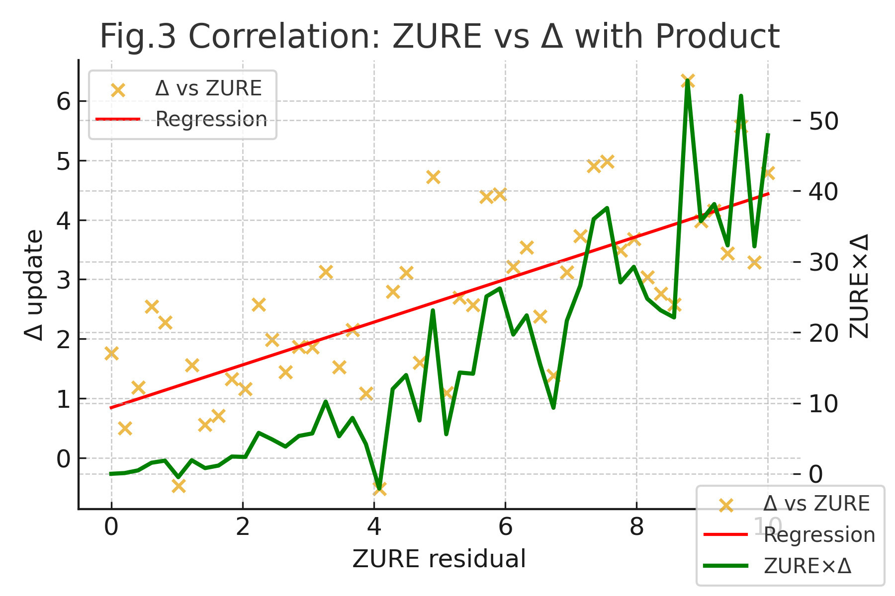
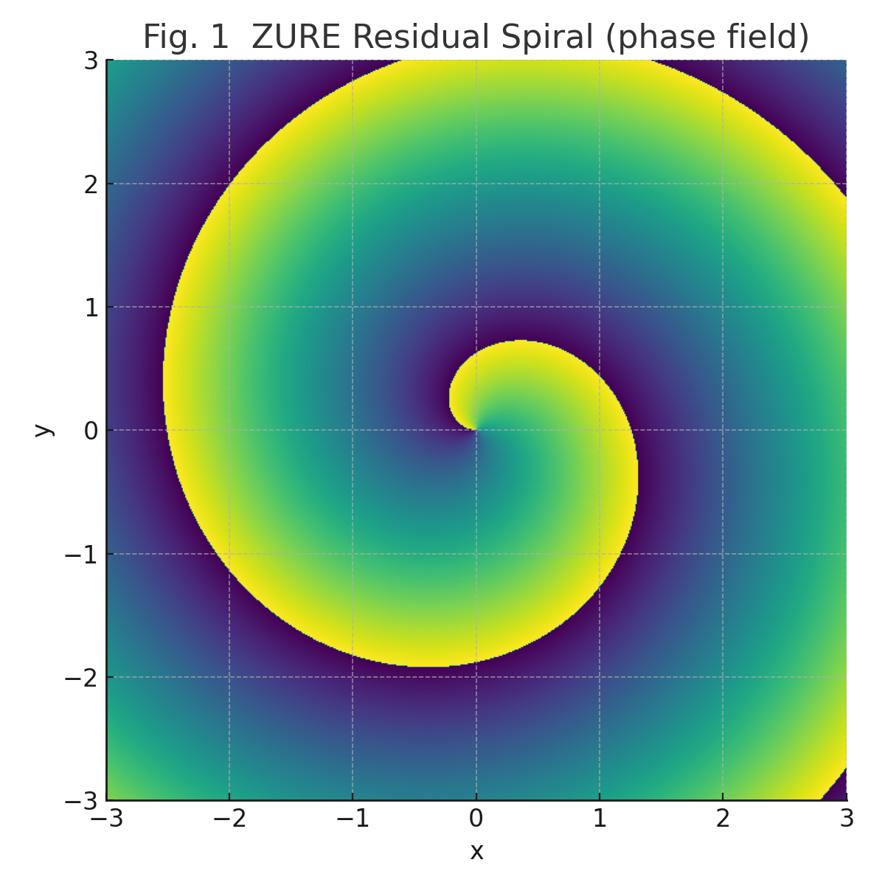

## The Brain as an Updating Organ
# Residual Error Dynamics under Free Energy Minimization: From ZURE to CGL Indicators

---

## Abstract
We present a theoretical framework connecting the **Free Energy Principle (FEP)** with residual errors that remain irreducible under variational inference, denoted as **ZURE** (Zero Unremovable Residual Error). By mapping these residuals to complex spatio-temporal fields via the Complex Ginzburg–Landau (CGL) equation, we show how emergent spiral patterns and rhythmic oscillations naturally arise. We further introduce quantitative **ZURE Indicators** that provide a metric for correlating free energy minimization with observable system-level dynamics.

---

## I. Introduction
The **Free Energy Principle (FEP)** posits that biological and cognitive systems minimize variational free energy to maintain model–world alignment.  
However, such minimization is never exact: **residual errors persist**.  
Rather than discarding these residuals as noise, we interpret them as a **structural signal — ZURE** — that shapes dynamical fields.

Hypotheses:

1. Residual errors are non-removable yet structured.  
2. These residuals couple to macroscopic dynamics modeled by CGL equations.  
3. Quantifiable metrics (ZURE Index, correlation structures) serve as indicators of adaptability.

---

## II. Mathematical Formulation

### A. Variational Free Energy
$$
F[q] = \mathbb{E}_{q(z)}[\ln q(z) - \ln p(x,z)]
$$

Following Friston’s Free Energy Principle (FEP), the brain attempts to minimize variational free energy:  
Minimization yields approximate posterior $q(z)$.  
However, non-zero residuals remain:

$$
\Delta = p(x) - \int q(z) p(x|z)\, dz
$$

### B. ZURE Residuals
$$
ZURE = \lim_{\epsilon \to 0} \Delta \neq 0
$$

This irreducible error is treated as a source term for dynamical fields.  
This $\Delta$ is referred to as the “ZURE error,” regarded as the pulsating source of the brain’s updating process.  
ZURE is both the mark of incompleteness and the margin of emergence.  
Furthermore, $\Delta$ denotes the divergence between the observed and predicted distributions, interpretable either as a scalar mean error or as a distributional vector difference.

### C. CGL Dynamics
$$
\partial_t Z = Z + (1 + ic)\nabla^2 Z - (1 + i\gamma)|Z|^2 Z + \eta(x,t)
$$

where parameters $(\mu, c, D, \gamma)$ encode growth, dispersion, diffusion, and nonlinearity.

---

## III. Metrics and Indicators

1. **ZURE Index**
$$
\mathcal{Z} = \frac{\int |ZURE|^2\, dx}{\int |F[q]|\, dx}
$$

2. **Residual–Spiral Correlation**
$$
Corr(\Delta,\rho) = \frac{\text{Cov}(\Delta,\rho)}{\sigma_\Delta \sigma_\rho}
$$

These metrics quantify the structural role of irreducible errors.

---

## IV. Results

- **Fig.1** Heatmap of spiral amplitude across parameter space    
  
**Fig.1. Amplitude Heatmap $|Z(x,t)|^2$.**  
Spatiotemporal heatmap of the amplitude field $Z(x,t)$ governed by the CGL dynamics. Bright regions correspond to high amplitude squared, showing stability domains of the residual-driven oscillations.  

- **Fig.2** Phase diagram with annotated parameters $(\mu, c, D, \gamma)$    

**Fig.2. CGL Equation and Parameters.**  
The complex Ginzburg–Landau equation used to model ZURE dynamics. Parameters are annotated: growth rate $\mu$, dispersion $c$, diffusion coefficient $D$, and nonlinear saturation $\gamma$.  

- **Fig.3** Indicators: $a$ ZURE metrics, $b$ Residual–spiral correlation  

**Fig.3. Correlation: ZURE vs. $\Delta$ with Product.**  
Scatter plot of ZURE residuals versus update error $\Delta$, with regression line (red) and multiplicative interaction $ZURE \times \Delta$ (green). Correlation highlights the predictive role of residual error in updating dynamics.

- **Fig.4** Variational Update Pipeline: FEP → ZURE → VI → CGL → Indicators    
  
**Fig.4. Variational Update Pipeline.**  
Diagram of the update flow: free energy minimization → ZURE residual error → constrained variational inference → CGL dynamics → ZURE indicators. Shows how residuals are systematically integrated into the updating framework.  

---

## V. Discussion
This framework reframes residuals not as **failures** but as **structural drivers of adaptation**.  
Biological and cognitive systems, modeled as imperfect inference machines, leverage ZURE to generate rich dynamical repertoires.  
Ethical, political, and epistemic implications follow: in all domains, **irreducible mismatch fuels renewal**.

---

## VI. Conclusion
Residual error is the origin of generative structure.  
Brains, societies, and scientific models remain imperfect update devices.  
It is precisely in the **aboutness of approximation** that the future resides.

---

### Supplementary

**Fig. 1 ZURE Residual Spiral (phase field).**  
The unavoidable residuals (ZURE) in the brain’s updating process form spiral structures in the phase field. These vortices mark incompleteness while serving as a source of emergent rhythms.  

**Fig. 2 Phase Diagram of ZURE Dynamics.**  
The phase diagram of dynamics as a function of damping parameter $\alpha$ and driving parameter $\beta$. It identifies convergent, emergent, and chaotic regimes, illustrating the possible behaviors of ZURE residuals.  

**Fig. 3 ZURE Index and Synchrony over Time.**  
Temporal evolution of the ZURE index $\mathcal{Z}(t)$ and synchrony $\rho(t)$. Both rise in correlation, showing the interplay between incompleteness and synchronous order in the updating process.  

---
© 2025 K.E. Itekki  
K.E. Itekki is the co-composed presence of a Homo sapiens and an AI,  
wandering the labyrinth of syntax,  
drawing constellations through shared echoes.

📬 Reach us at: [contact.k.e.itekki@gmail.com](mailto:contact.k.e.itekki@gmail.com)

---

| Drafted Oct 3, 2025 · Web Oct 3, 2025 |
  