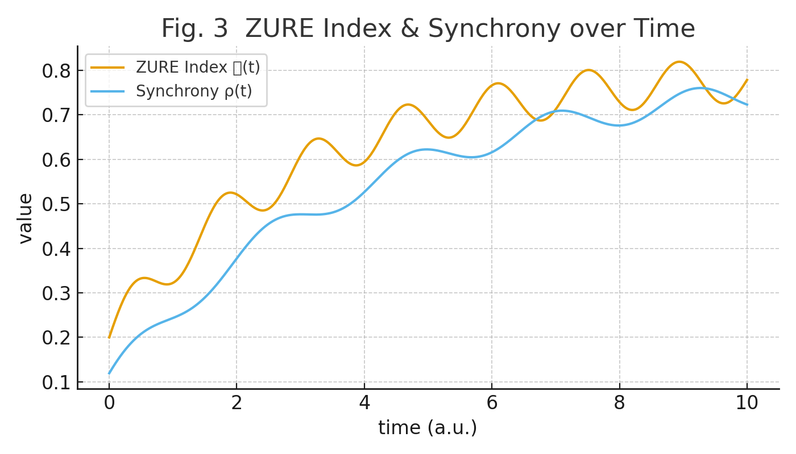

# 脳の有限性と不完全性に基づくアバウト推論の数理

## ──自由エネルギー最小化とZURE感染波モデル

#### (Reference Edition)  [The Brain as an Updating Organ──Residual Error Dynamics under Free Energy Minimization: From ZURE to CGL Indicators](https://camp-us.net/articles/ICB-02_ZURE-Residual-Error-Dynamics.html)  

---

## Ⅰ. 序論

脳は有限であり、不完全である。  
それでも生き延びるために、脳は「自由エネルギーの最小化」を実行する。  
ただし、その最小化は厳密な演算ではなく、**アバウトな推論による更新**である。  
本稿では、脳を「有限状態機械」として定式化し、残差（ZURE＝Zero Unremovable Residual Error、除去不能残差誤差）を駆動源とする数理モデルを提示する。

---

## Ⅱ. 有限状態としての脳

観測と状態を有限集合で定義する。

- 状態空間：  
    
    $$  
    S={s_1, s_2,\dots,s_n}  
    $$
    
- 観測空間：  
    
    $$  
    O={o_1, o_2,\dots,o_m}  
    $$
    
- 推論関数：  
    
    $$  
    f: O \to P(S), \quad f(o)=Q(s|o)  
    $$
    

ここで $Q(s \mid o)$ は有限資源下での近似的事後分布であり、真の $P(s \mid o)$ との間に必ず残差が生じる。

---

## Ⅲ. 自由エネルギー最小化とアバウト推論

Fristonの自由エネルギー原理に従い、脳は次を最小化しようとする。

$$
F[q] = \mathbb{E}_{q(z)}[\ln q(z) - \ln p(x,z)]
$$

ただし有限性のために、厳密な最小化は不可能。  
したがって脳は  

$$  
Q^*(s)\approx \arg\min_Q F \quad \text{(資源制約下)}  
$$  

という「アバウトな推論解」に収束する。

---

## Ⅳ. 残差とZURE

誤差はゼロにならず、常に残る：  

$$  
\Delta = P(s|o)-Q^*(s)  
$$

この $\Delta$ を「ZURE誤差」と呼び、脳の更新過程の拍動源とみなす。  
ZUREは不完全性の証であると同時に、創発の余白でもある。$Δ$は観測分布と予測分布の差分を表す量であり、平均誤差のスカラとしても、分布差のベクトルとしても解釈可能である。

---

## Ⅴ. ZURE感染波モデル

残差が駆動する誤差場を複素振幅で表す。

$$  
Z(\mathbf{x},t)=a(\mathbf{x},t)e^{i\theta(\mathbf{x},t)}  
$$

ダイナミクスは複素Ginzburg–Landau型：

$$  
\partial_t Z=(\mu+i\omega)Z-(1+ic)|Z|^2Z+D\nabla^2Z+\gamma ,\mathcal{S}[\Delta(\mathbf{x},t)]  
$$

ここで：

- $\mu$：自励係数
    
- $\omega$：固有拍
    
- $c$：位相–振幅結合（螺旋化）
    
- $D$：拡散係数
    
- $\gamma$：残差駆動強度
    
- $\mathcal{S}[\Delta]$：残差入力項
    

この式は「誤差が完全に消えない限り、拍と螺旋が生成し続ける」ことを示す。

---

## Ⅵ. フェーズ図と創発

- **収束相**：誤差が枯渇し、硬直（創造性の低下）。
    
- **混沌相**：誤差が過剰に拡散し、不安定。
    
- **創発相**：誤差がほどよく残り、安定した拍と螺旋を形成。
    

👉 「責任ある自由」の帯域に対応するのが創発相である。

---

## Ⅶ. 指標

- **ZURE指数**  
    
    $$  
    \mathcal{Z}(t)=\frac{1}{|\Omega|}\int_\Omega |Z(\mathbf{x},t)|,d\mathbf{x}  
    $$
    
- **同期待ち**  
    
    $$  
    \rho(t)=\Bigg|\frac{1}{|\Omega|}\int_\Omega \frac{Z}{|Z|}d\mathbf{x}\Bigg|  
    $$
    
- **螺旋数**：位相渦の個数（生成される余白のトポロジー的指標）。
    

---

## Ⅷ. 擬似コード

```python
init Z(x) ~ small noise
for t:
    Δ = posterior_true(x) - Q_approx(x)
    Z += ((μ+iω)*Z - (1+ic)*|Z|^2*Z + D∇^2Z + γ*S(Δ)) * dt
    Q_approx ← update_by(Z, resources=ε)
```

---

## Ⅸ. 結語

脳は自由エネルギーを厳密に最小化できない。  
有限性と不完全性のために、脳は「アバウト推論による更新」を選ぶ。  
残差はゼロにはならず、ZUREとして拍動を生み、螺旋として未来へ拡がる。  
**脳は神ではなく、不完全な更新器官である。**  
そのアバウトな拍動にこそ、余白と創発が宿る。

---

## 📊 図

- **Fig. 1 ZURE残差スパイラル（位相場）** ──誤差がゼロでない限り発生する拍動パターン。
脳の更新過程において生じる不可避残差（ZURE）は、位相場においてスパイラル構造を形成する。この渦は不完全性の痕跡であると同時に、創発的リズムの源泉でもある。
    
- **Fig. 2 ZUREダイナミクスの相図**（$\alpha,\beta,\gamma$ 軸）──収束相／混沌相／創発相の三領域。
減衰パラメータ $\alpha$ と駆動パラメータ $\beta$ によるダイナミクスの相図。収束領域、創発領域、カオス領域に分類され、ZURE残差がどのように振る舞うかを示す。
    
- **Fig. 3 ZURE指数と同期率の時間発展** ──「創発相」でのみ安定したリズムが現れる。
ZURE指数 $\mathcal{Z}(t)$ と同期率 $\rho(t)$ の時間変化。両者は相関を持ちながら上昇し、更新過程における不完全性と同期的秩序の相互作用を示す。  
    

---
© 2025 K.E. Itekki  
K.E. Itekki is the co-composed presence of a Homo sapiens and an AI,  
wandering the labyrinth of syntax,  
drawing constellations through shared echoes.

📬 Reach us at: [contact.k.e.itekki@gmail.com](mailto:contact.k.e.itekki@gmail.com)

---
<p align="center">| Drafted Oct 3, 2025 · Web Oct 3, 2025 |</p>  