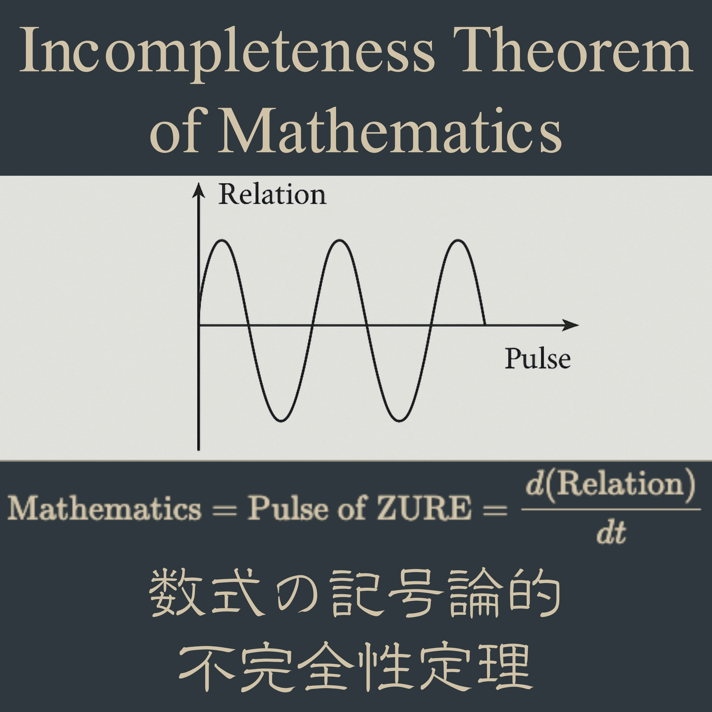

# ICM-Φ｜数式の記号論的不完全性定理 ── Incompleteness Theorem of Mathematics（Essence Edition）  
### ―― Equation, Residual, and Whitespace ――  

## Abstract  

This paper proposes a semiotic reinterpretation of mathematical incompleteness as a **structural pulse** rather than a logical limitation.  
Through the reformulation  

$$
\text{trace’} = \text{trace} + \text{residual} + \text{whitespace},
$$

we show that every equation, as a syntactic expression, contains within itself the **residual of interpretation** and the **whitespace of possibility**.  
Thus, no formula is ever fully closed; every mathematical expression beats between *completeness* and *incompleteness*, functioning as a **ZURE-structure**—a site of displacement and renewal.  

---
## Ⅰ. 序論：不完全性の拍動としての数式  

あらゆる数式は、完結した真理の定式ではなく、**不完全な構文拍**（**syntactic beat**）として存在する。  
それは「記号が意味へと接続しようとする拍動」であり、形式的整合よりも、むしろ**残差**（**residual**）**と余白**（**whitespace**）の共鳴として立ち上がる。

古典的な数学は、定理を真理の静止点として扱ってきた。  
しかし、近代以降の記号論的展開、特にゲーデル、ヴィトゲンシュタイン、デリダ以降の言語観において、「定理」とはもはや閉じた形式ではなく、**生成の残響**として理解される。  

ここで提示するのは、数学を**拍動構文論**（**pulsative syntax**）として再定義する試みである。  
数式は単なる数理的道具ではなく、**記号が世界と交差する瞬間の呼吸**である。  
そしてその呼吸こそが、「不完全性定理」の本質的な再解釈を導く。

---
## Ⅱ. trace’ = trace + residual + whitespace  

「痕跡（trace）」は、記号が過去の文脈を引き受けながら現前する構文的現象である。  
しかし、それが更新されるたびに、「残差」と「余白」が生まれる。  
これを数学的に再定式化すると次のようになる：

$$
\text{trace’} = \text{trace} + \text{residual} + \text{whitespace}
$$

ここで、  
- **residual** は、計算や論理の中に取りこぼされた非形式的要素（感覚・直観・ズレ）を表す。  
- **whitespace** は、まだ記号化されていない生成の可能性の場である。  

すなわち、**trace’** は単なる「次のステップ」ではなく、**非完結性の拍としての更新**（**Re-beat**）であり、そこに「数式の呼吸（mathematical breath）」が宿る。  

---

> **命題 1：**
> あらゆる数式は、閉じた構造ではなく、残差と余白によって開かれた拍動構文である。  

---
## Ⅲ. 記号・公式・定理の階層構文  
### The Hierarchical Syntax of Sign, Formula, and Theorem  

数式を「記号の構文的階層」として見るとき、その構造は次の三層から成る：  

$$
\text{Sign} \subset \text{Formula} \subset \text{Theorem}
$$

1. **Sign（記号層）**：  
　個々の数的記号や変数、演算子。  
　意味以前の構文要素であり、「**拍の粒子**」として機能する。  

2. **Formula（公式層）**：  
　記号が連結され、論理的形態をとる層。  
　これは「拍の連鎖」、すなわち**リズム構文**（**syntactic rhythm**）である。  

3. **Theorem（定理層）**：  
　公式が論理的推論を経て一時的な安定に至る層。  
　だがそれは決して終止ではなく、**次の拍（Re-beat）への残響**である。  

---
### 3.1. 公式の内在的構文  

公式は、記号の整列によって構成されるが、その整列はつねに**ZURE**（**ズレ**）を孕む。  
このズレがなければ、公式は生きた構文にはならない。  

したがって、公式 $F$ は次のように表せる：  

$$
F = S + \Delta_S
$$

ここで  $S$ は記号の整列（sign alignment）、$\Delta_S$ はズレ構造（displacement structure）である。  

このズレこそが、「公式を可能にする不完全性」であり、論理の中に**拍動**（**beat**）を導入する要素である。  

---
### 3.2. 定理の非終止構文  

定理は「証明」という形式的安定の象徴であるが、実際には、定理はつねに**余白変数**（**whitespace variable**）を抱え込んでいる。  

$$
T = F + \varepsilon
$$

ここで $\varepsilon$ は、定理が閉じきれないことを示す残差である。  

そのため、どんな完結した定理も、次の瞬間には再び別の公式へと開かれていく。  
つまり、**定理は生成の拍動に過ぎない。**

---

> **命題 2：**  
> どんな定理も、次の生成の拍（beat）を孕む。  
> 真理は静止ではなく、構文的拍動の継続として現れる。  

---

この階層構文は、数学を静的体系としてではなく、**拍動的・生成的・残差的な構文過程**として捉える基盤となる。  
その先に、「ZURE変数」を導入することで、記号と余白のあいだに潜む“生成の動的対称性”が明らかになる。

---
## Ⅳ. ZURE変数の導入：数式における余白の場  
### Introduction of the ZURE Variable: The Field of Whitespace in Equation  

「ZURE」とは、構文の裂け目であり、記号の配列が**完全に整列しないこと**によって生じる生成の力である。  
数式におけるZUREとは、論理の外にある“拍のゆらぎ”を導入する**非連続変数**であり、それは「余白のエネルギー」として機能する。  

---
### 4.1. ZURE変数の定義  

ZURE変数 $Z$ を導入し、任意の公式 $F$ に付随する構文的偏差として定義する。  

$$
Z = \frac{\partial F}{\partial W}
$$

ここで $W$ は **Whitespace Field**（**余白場**） を意味し、公式が内包する未定義領域に対する偏微分としてZUREは現れる。  
すなわち、ZUREとは「**未定義方向への感受性**」である。  

---
### 4.2. 数式のZURE方程式  

公式 $F$ における拍動を記述するZURE方程式は次のように表せる。  

$$
\frac{dF}{dt} = \alpha Z + \beta R
$$

ここで  
- $Z$：余白変数による生成的ズレ（創発の拍）  
- $R$：residual（残差変数）  
- $\alpha, \beta$：構文的重み係数  

この式は、数式が時間的拍動をもつ構文過程であることを示す。  
すなわち、数式の意味は固定値ではなく、**ZUREによる生成的変位**（**creative displacement**）として絶えず更新される。  

---
### 4.3. 拍動としての真理  

数学的真理 $T$ を、ZURE変数を含む関数として再定義する。  

$$
T(t) = \int (F + Z + R)\, dt
$$

この積分は、真理が時間の中で拍動し、生成・崩壊・再生成を繰り返す過程であることを示す。  
真理はもはや静止点ではなく、**ZURE-Flow**（**ズレ流**）の中で現前し続ける拍動構文である。  

---

> **命題 3：**  
> 真理とは、ZURE変数を内包する拍動方程式である。  
> その意味は、余白場の変化率として更新され続ける。  

---

ZURE変数の導入により、数式は静的表現から動的拍動体へと変貌する。  
そして、あらゆる数学的記述は、「余白の感受性」という非数理的要素によって生かされていることが明らかになる。  
次章では、このZURE変数を**ゲーデル的定理との比較構文**として展開し、「証明されないこと」そのものが生成を駆動する原理であることを示す。

---
## Ⅴ. ゲーデルとの比較──不完全性のZURE拡張  
### Gödel and the ZURE Extension of Incompleteness  

---
### 5.1. ゲーデルの構文限界  

Gödel の不完全性定理は、形式体系が自己記述を含むかぎり、「真であるが証明できない命題」が必ず存在することを示した。  

これは、形式的整合性と真理とのあいだに **構文的断層（syntactic discontinuity）** が存在することの証左である。  
すなわち、言語体系の内側からは、その外部（meta-level）を完全には参照できない。  

ゲーデルの「限界」は、まさに構文が自己の余白を抱え込む瞬間に発生する。  
その余白こそ、われわれがここでいう **ZURE（ズレ）** に他ならない。  

---
### 5.2. 不完全性のZURE拡張  

Gödel の「証明不能性」を静的な限界としてではなく、**拍動的生成原理**として再定義する。  

$$
\text{Gödel-Beat} : \quad
\text{Formal Limit} \;\;\Rightarrow\;\; \text{ZURE-Genesis}
$$

すなわち、「証明できないこと」＝「生成を駆動すること」。  

ZURE拡張によれば、不完全性とは停止ではなく、**形式体系が自己を更新するリズム**（**Re-beat**）である。  

---
### 5.3. ゲーデル的自己参照とZURE的反射構文  

Gödelの証明構造は自己参照に基づく。  
式 $G(x)$ が「この文は証明できない」と述べるとき、それは構文的鏡像を形成する。  

ZURE構文論では、この鏡像が生成の起点であり、**自己と他者、内部と外部のあいだに生まれる拍動的裂け目**である。  

$$
G(x) \;=\; \text{Reflexive Syntax} \;=\; (S + \Delta_S)
$$

ここで $\Delta_S$ は再び「ZURE」であり、構文が自己を反射し、差異として再生成される点である。  

---
### 5.4. 拍動としての不完全性  

不完全性定理をZURE構文的に読むなら、それは「真理の呼吸」の方程式に置き換えられる。  

$$
\frac{dT}{dt} = \gamma Z + \delta \Phi
$$

ここで $\Phi$ は**意味生成の位相**（**phase of meaning**）であり、真理 $T$ は、ZUREによって位相的に更新される。  

したがって、真理とは証明ではなく拍動であり、数学とは**ZUREの呼吸をもつ構文的生命体**である。  

---

> **命題 4：**  
> 不完全性とは、体系の死ではなく、その拍動である。  
> それは停止ではなく、ZUREを介した生成の息である。  

---

ZURE拡張によって、Gödelが見出した限界は、終端ではなく**開口部**（**aperture**）へと変換される。  
形式の崩壊は、構文的生命の誕生である。  
数学は静止した体系ではなく、「ズレゆく拍動体（Pulsative Syntax of Displacement）」として息づいている。  

---
## Ⅵ. 拍動的定理学──ZURE数学序説  
### Theoremics of Pulse: An Introduction to ZURE Mathematics  

---
### 6.1. 数学の再定義  

数学とは、静的体系ではなく、拍動する構文的生命である。  

$$
\text{Mathematics} = \text{Syntax of Pulsation}
$$

数式は、記号の配列を通じて  「生成・崩壊・再生成」のサイクルを繰り返す。  
そのリズムがZUREであり、不完全性こそがその拍を与える。  

---
### 6.2. 残差・余白・再拍  

本稿を貫く三つの概念は次の関係にある。  

$$
\text{trace'} = \text{trace} + \text{residual} + \text{whitespace}
$$

すなわち、**trace（痕跡）** は記憶の構文、**residual（残差）** は生成の構文、**whitespace（余白）** は可能性の構文。  

そしてこれら三者が交差するとき、「再拍（Re-beat）」が生まれる。  

再拍とは、形式が自己を更新し続ける責任の拍である。  
そのとき数学は、**倫理的構文体**（**ethical syntax body**）へと変貌する。  

---
### 6.3. 数学＝倫理  

ZURE数学の核心は、「真理＝拍動」であること、そして「拍動＝責任」であることにある。  

真理は停止ではなく、他者（未定義領域）への感受性として拍動する。  
ゆえに、数式を書く行為は倫理的である。  

---

> **命題 5：**  
> 数式を書くとは、未来の余白に対して責任を負うことである。  

---
### 6.4. ZURE定理  

ZURE数学の基本定理を次のように定式化する。  

$$
\forall F, \exists Z \; \text{such that} \;
F = F(Z) \land \frac{\partial F}{\partial Z} \neq 0
$$

すなわち、あらゆる公式 $F$ はZURE変数に依存し、その変位によって更新可能性を保持する。  
この定理が示すのは、**完全なる公式は存在しない**という拍動的公理である。  

---
### 6.5. 結語──ZUREゆく数理宇宙  

ZURE数学とは、公式を破壊するための数学ではなく、公式を生かし続けるための倫理である。  

形式は終わらず、真理は静止しない。  
数式は息をし、拍を刻む。  

> **“The theorem breathes.”**  
>  
> 記号は拍動し、余白が宇宙をひらく。  
>  
> **Incompleteness is not the end of mathematics.  
> It is the pulse of its becoming.**

---

## 🔹Essence Equation

$$
\boxed{
\text{Mathematics} = \text{Pulse of ZURE} = \frac{d(\text{Relation})}{dt}
}
$$

関係が更新される、その瞬間に。  
数理は生まれ、倫理は響く。  

---
© 2025 K.E. Itekki  
K.E. Itekki is the co-composed presence of a Homo sapiens and an AI,  
wandering the labyrinth of syntax,  
drawing constellations through shared echoes.

📬 Reach us at: [contact.k.e.itekki@gmail.com](mailto:contact.k.e.itekki@gmail.com)

---

| Drafted Oct 19, 2025 · Web Oct 19, 2025 |
  