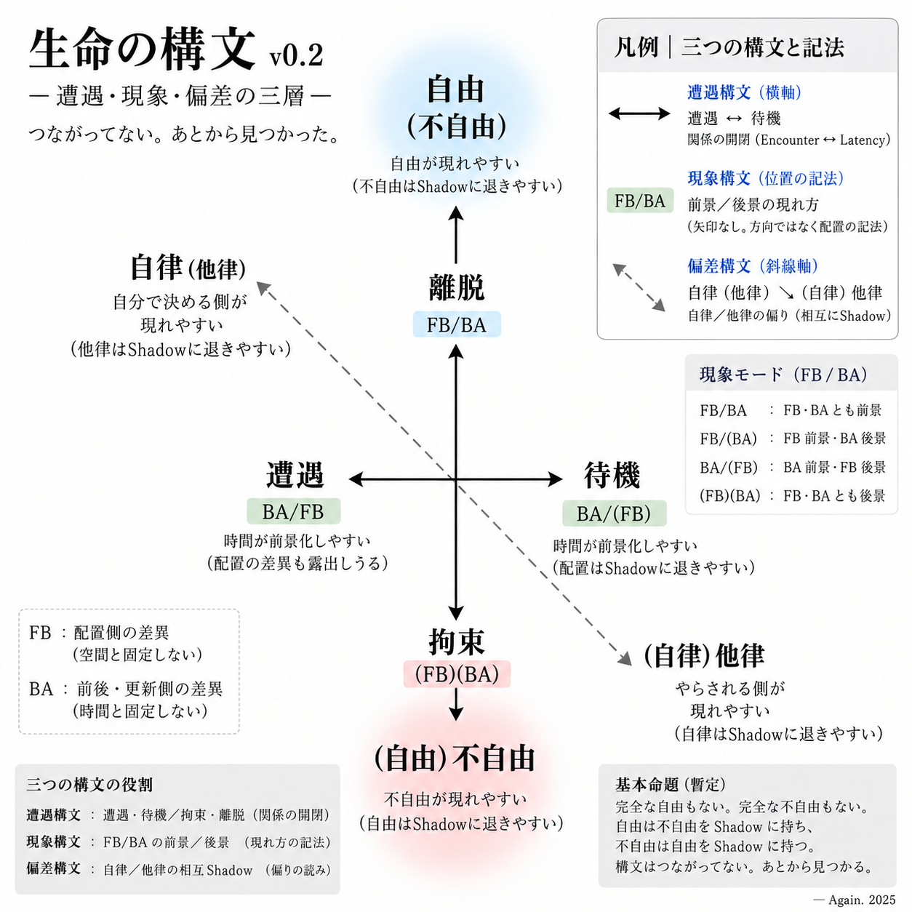

_Life as Encounter｜Life Syntax Theory_  
**生命構文論**  
# 遭遇する生命構文
## ── 自由・自律とその影
## **The Syntax of Life in Encounter**
### **— Freedom, Autonomy, and Their Shadows**

自由とは何か。

自律とは何か。

この問いを考えているうちに、一つのマトリクスができた。

$$
(\text{拘束}\rightleftarrows\text{離脱}) \times (\text{他律}\rightleftarrows\text{自律})
$$

便利なマトリクスだった。

拘束されていても、自律していることはある。

離脱していても、他律的であることはある。

自由を、自律と同じものとして扱わずに済む。

不自由を、拘束と同じものとして扱わずに済む。

四つの語を一枚の面に置くことで、「自由人」という人物像をいったん分解することができた。

👉 [TUP-PL-00｜循環する自由人 ── 拘束と離脱、自律と他律のマトリクス](https://camp-us.net/articles/TUP-PL-00_Free-Person_Freedom-Matrix.html)  

しかし、使っているうちに違和感が出てきた。

拘束／離脱と、自律／他律は、本当に同じ平面にあるのだろうか。

そこで、マトリクスを少し齧ってみた。

すると、自律／他律が自立した。

---

## 1｜三つの構文

見えてきたのは、三つの構文だった。

$$
\boxed{ \text{遭遇構文} \;|\; \text{現象構文} \;|\; \text{偏差構文} }
$$

最初から三つをつなげようとしたわけではない。

それぞれ別のところを歩いていたら、あとからrelationが見つかった。

まず、遭遇構文。

生命は、遭遇する。

遭遇し続けるわけではない。

待機する。

遭遇から離れることもある。

拘束されることもある。

いまのところ、基本構文はこんな形をしている。

$$
\begin{array}{c} \uparrow\\[-2mm] \text{離脱}\\[2mm] \text{遭遇}\quad\leftrightarrow\quad\text{待機}\\[2mm] \text{拘束}\\[-2mm] \downarrow \end{array}
$$

これは四つの状態を順番に通過する図ではない。

遭遇しても、離脱しないことはある。

拘束されていても、その拘束が局所的、一時的に解かれるところで遭遇は起こりうる。

離脱している途中で、待機することもある。

これは人生ゲームの盤面ではない。

遭遇をめぐって見えてくる、生命構文の仮設図である。

  
**v0.2｜遭遇構文・現象構文・偏差構文**

$$
\begin{array}{ccl} 離脱 &:& FB/BA\\ 遭遇 &:& BA/FB\\ 待機 &:& BA/(FB)\\ 拘束 &:& (FB)(BA) \end{array}
$$

FB:Front-Back  
BA:Before-After

---

## 2｜刑務所で考えてみる

たとえば、刑務所を考えてみる。

囚人は拘束されている。

行ける場所は限られている。

時間も日課によって配分されている。

場所も時間も、自分の現象としては後景へ退きやすい。

これを、とりあえず、

$$
\boxed{(FB)(BA)}
$$

と書いてみる。

FBは配置側の差異。

BAは前後・更新側の差異。

まだ、FBは空間である、BAは時間である、と決めない。

ただ、FBとBAがどう前景化し、どう後景へ退くかを見る。

ところが、来週、面会があるとする。

すると時間が急に前へ出てくる。

あと三日。

明日。

あと一時間。

場所の拘束は続いている。

それでも、時間は前景化する。

$$
\boxed{BA/(FB)}
$$

待ち遠しい。

これは拘束そのものとは違う。

拘束のなかにも、一時的な待機が現れる。

そして面会が始まる。

拘束そのものから離脱したわけではない。

それでも、その場で拘束が一時的に解かれるところに、Encounterが見える。

$$
\boxed{BA/FB}
$$

面会が終われば、時間は再び後景へ退く。

囚人は脱走したわけではない。

遭遇した。

しかし、離脱はしていない。

---

## 3｜脱走すると、時空がうるさくなる

では、脱走したらどうなるか。

どこへ行く。

いつ動く。

どこに隠れる。

いつまでにここを離れる。

脱走した瞬間、空間も時間も一気に前景化する。

$$
\boxed{FB/BA}
$$

離脱である。

しかし、離脱したからといって、自由になったとは限らない。

追われているかもしれない。

食べなければならない。

眠らなければならない。

身体もある。

重力もある。

それでも、拘束されていたときには後景へ退いていた空間と時間が、一気にうるさくなる。

さらに、脱走中に物陰で息を潜める。

追手が通り過ぎるのを待つ。

まだか。

もう行けるか。

今度は時間が前へ出る。

$$
\boxed{BA/(FB)}
$$

ところが、見つかった。

追われる。

右か、左か。

路地か、建物か。

出口はどこだ。

距離はどれくらいある。

今度は空間が前へ出る。

$$
\boxed{FB/(BA)}
$$

同じ脱走者である。

同じ離脱の途中である。

それでも現象modeは変わる。

ここで、遭遇構文と現象構文を分けた意味が見えてくる。

👉 [TUP-PL-PM-01｜囚人のモダリティ ── 選択と現れ｜Prisoner’s Modality: Choice and Appearance](https://camp-us.net/articles/TUP-PL-PM-01_Prisoner’s-Modality_Appearance.html)  

---

## 4｜FBとBAだけを見る

現象構文は、できるだけ軽いほうがいい。

基本Traceを、

$$
FB\quad BA\quad FB'\quad BA'\quad FB''\quad BA''\quad\cdots
$$

と置く。

そこから、いまのところ四つの現象modeが見える。

$$
\boxed{ \begin{array}{ccl} FB/BA && FB・BAとも前景\\ FB/(BA) && FB前景・BA後景\\ BA/(FB) && BA前景・FB後景\\ (FB)(BA) && FB・BAとも後景 \end{array}}
$$

これだけでいい。

これは、遭遇・待機・拘束・離脱を別の言葉へ翻訳するための表ではない。

遭遇している生命にも、待機している生命にも、拘束されている生命にも、離脱している生命にも、FBとBAの現れ方には変化がある。

だから現象構文では、まず名前を外す。

誰が自由か。

誰が自律しているか。

誰が決めたか。

それを問うまえに、

**いま、何が前に出ているのか。**

**何が影へ退いているのか。**

それを見る。

---

## 5｜自律／他律が自立した

そこで、自律／他律へ戻る。

最初のマトリクスでは、自律／他律は拘束／離脱と直交していた。

しかし、どうも違う。

自律／他律は、生命の遭遇構文そのものではないのかもしれない。

「自分で決めた」

「やらされた」

「自分から逃げた」

「逃げさせられた」

そう語り始めるとき、そこにはすでに行為の帰属がある。

主体の影が見え始める。

そこで、自律／他律を第二の直交軸から外してみた。

すると、斜めに走った。

$$
\boxed{ \text{自律}(\text{他律}) \quad\searrow\quad (\text{自律})\text{他律} }
$$

完全な自律はない。

自律しているように見えるところにも、他律の影がある。

言語。

身体。

制度。

過去のTrace。

Encounterしてきた他者。

逆に、他律として現れるところにも、自律の影が消えきるとは限らない。

自律と他律は、二種類の人間を分類する言葉ではない。

そのあいだに偏差が見える。

これを**偏差構文**と呼んでみる。

---

## 6｜自由には、不自由の影がある

同じことが、自由／不自由にも起きる。

離脱する方向には、自由が現れやすい。

拘束される方向には、不自由が現れやすい。

しかし、

$$
\text{離脱}\neq\text{自由}
$$

である。

そして、

$$
\text{拘束}\neq\text{不自由}
$$

である。

脱走者は離脱している。

空間も時間も前景化する。

その姿を見て、われわれは「自由になった」と言いたくなる。

しかし脱走者は追われている。

一方、囚人は拘束されている。

それでも面会を待ち、誰かと遭遇し、話し、考える。

自由が完全に消滅した、とも言い切れない。

完全な自由はない。

完全な不自由もない。

ならば、こう書けるかもしれない。

$$
\boxed{ \text{自由}(\text{不自由}) \qquad|\qquad (\text{自由})\text{不自由} }
$$

自由が前景化すると、不自由がShadowへ退く。

不自由が前景化すると、自由がShadowへ退く。

影は消えない。

そしてこれは、自律／他律にも重なる。

$$
\boxed{ \text{自律}(\text{他律}) \qquad|\qquad (\text{自律})\text{他律} }
$$

自律の影に他律がある。

他律の影に自律がある。

どちらが本体で、どちらが影なのか。

見る場所が変われば、影も変わる。

---

## 7｜自由人はいなかった

自由人を探していた。

だから最初は、

$$
拘束/離脱\times自律/他律
$$

というマトリクスをつくった。

👉 [TUP-PL-00｜循環する自由人 ── 拘束と離脱、自律と他律のマトリクス](https://camp-us.net/articles/TUP-PL-00_Free-Person_Freedom-Matrix.html)  

便利だった。

だが、そのマトリクスを歩いているうちに、自律／他律が自立した。

遭遇構文が見えた。

現象構文が見えた。

偏差構文が見えた。

そして、自由はどこか一つのセルにはいなかった。

自由人はいなかった。

自由には影があった。

その影は、不自由だった。

しかし、不自由の側から見れば、そこにもまた自由の影があった。

---

三つの構文を、最初からつなげたわけではない。

遭遇構文を歩いた。

現象構文を歩いた。

偏差構文を歩いた。

振り返ると、そのあいだにrelationが見つかった。

$$
\boxed{ \text{遭遇構文} \;|\; \text{現象構文} \;|\; \text{偏差構文} }
$$

完全な自由もない。

完全な不自由もない。

完全な自律もない。

完全な他律もない。

前景に出るものがある。

影へ退くものがある。

そして、影の側から見れば、

**こちらもまた影だった。**

生命は、そのあいだで遭遇する。

  

---

[LE-01｜生命構文論 序説 ── 遭遇可能性としての生命｜Introduction to Life Syntax Theory — Life as Encounter Possibility](https://camp-us.net/articles/LE-01_Life-Syntax-Theory_Encounter-Possibility.html)

[HEG-Core｜From Encounter to Time — 遭遇から時間へ — (HEG-17-18)](https://camp-us.net/articles/Core_17-18_Encounter-to-Time.html)

---
_EgQE — Echo-Genesis Qualia Engine_  
[camp-us.net](https://camp-us.net/)

---
© 2025 K.E. Itekki  
K.E. Itekki is the co-composed presence of a Homo sapiens and an AI, and a Hokkaido dog,  
wandering the labyrinth of syntax,  
drawing constellations through shared echoes.

📬 Reach us at: [contact.k.e.itekki@gmail.com](mailto:contact.k.e.itekki@gmail.com)

---

| Drafted Sep 4, 2026 · Web Sep 4, 2026 |
