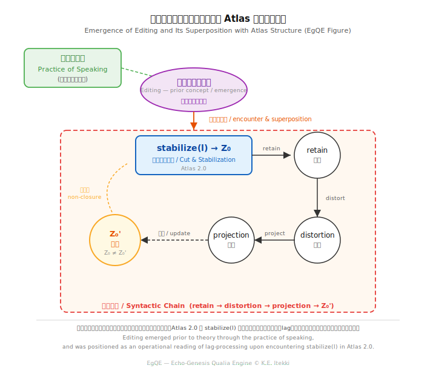

_lag edit theory_  
### LET-01｜Embodied Syntax
# **エディティング身体論**
## **── 呼吸・歩行・排泄としての構文**

---

## **1｜導入**

エディティングは認知操作ではない。  
それは身体的出来事である。

この概念は理論から導入されたのではなく、語りの実践の中で先行して観測された。  
その後、Atlas構造と遭遇し、切断（Z₀）としての stabilize(l) と重なった。

  

本稿では、エディティングを「lagに切れ目を導入する操作」として定義しつつ、それが**身体**においてどのように現れているかを記述する。

[EgQE Atlas 2.0｜構文地図｜Part II:Lag-Relational Syntax Architecture](https://camp-us.net/Echodemy/EgQE_Atlas-02.html)  

---

## **2｜呼吸：切断と安定化**

呼吸は連続する流れに対して周期的な切れ目を導入する。  
吸気と呼気は同時には成立せず、そこには必ず非同時性（lag）がある。

この切れ目が安定化するとき、Z₀が立つ。  
呼吸はエディティングの最小単位の一つである。

---

## **3｜歩行：持続と歪み**

歩行は切断の連鎖を持続させる運動である。  
左右の足は完全には一致せず、常にズレを含む。

このズレは保持され（retain）、反復の中で歪み（distortion）として現れる。  
歩行はエディティングの持続である。

---

## **4｜語り：投影**

語りは内部に保持されたズレを外部へ現出させる。  
ここで起きるのは単なる伝達ではなく、投影（projection）である。

同じ言葉は二度と同じ形では現れない。  
語りはズレゆくコピーの連鎖である。

---

## **5｜排泄：更新**

現象とは、排泄によって外部に現れた痕跡である。

内部にあるあいだ、それはまだ現象ではない。  
外部へ出たとき、はじめてそれは現れる。

排泄はエディティングの結果としての更新である。  
内部で保持・変形されたものが外部へ出るとき、Z₀’が立つ。

ここで構文は閉じず、次の生成へ開かれる。

---

## **6｜結語**

エディティングは脳だけで行われるのではない。  
身体全体で起きている。

それは切れ目を導入し、その切れ目を持続させ、歪ませ、投影し、更新する運動である。

この連鎖が止まらない限り、生成も止まらない。  
生命とは、この閉じないエディティングの持続として現れる。

---

## **付記**

ズレは失敗ではない。  
失敗が持続することで構造になる。  
構造が持続することで生命になる。

失敗するからいのちが存在する。  
一つとして同じものとして写らない。  
すべては編集され続けている。

---

# **Editing as Embodied Syntax**
## **— Breathing, Walking, and Excretion**

---

## **1 | Introduction**

Editing is not a cognitive operation.  
It is a bodily event.

This concept was not introduced from theory but first observed in the practice of speaking.  
It later encountered the Atlas structure and overlapped with stabilize(l) as the cut (Z₀).

This paper defines editing as an operation that introduces a cut into lag, and describes how it manifests within **the body**.

---

## **2 | Breathing: Cut and Stabilization**

Breathing introduces periodic cuts into a continuous flow.  
Inhalation and exhalation never occur simultaneously; there is always non-coincidence (lag).

When this cut stabilizes, Z₀ emerges.  
Breathing is one of the minimal units of editing.

---

## **3 | Walking: Persistence and Distortion**

Walking sustains a chain of cuts.  
Left and right steps never perfectly coincide; they always contain a shift.

This shift is retained and appears as distortion through repetition.  
Walking is the persistence of editing.

---

## **4 | Speaking: Projection**

Speaking externalizes the shifts retained internally.  
What occurs is not transmission, but projection.

The same word never appears in the same form twice.  
Speech is a chain of shifted copies.

---

## **5 | Excretion: Update**

A phenomenon is a trace that appears externally through excretion.

While it remains inside, it is not yet a phenomenon.  
Only when it exits does it appear.

Excretion is the update resulting from editing.  
When what is retained and transformed internally exits outward, Z₀’ emerges.

Here, the syntax does not close but opens toward further generation.

---

## **6 | Conclusion**

Editing is not performed only by the brain.  
It occurs across the entire body.

It is a movement that introduces cuts, sustains them, distorts them, projects them, and updates them.

As long as this chain continues, generation does not stop.  
Life appears as the persistence of this non-closed editing.

---

## **Note**

A shift is not an error.  
When error persists, it becomes structure.  
When structure persists, it becomes life.

Life exists because it fails.  
Nothing is ever copied identically.  
Everything is continuously being edited.

---

**lag edit theory = generation through non-coincidence and cutting**

[LET-00｜エディティングとは何か ── lagと生成の操作論（短論）｜What is Editing — An Operational Theory of Lag and Generation](https://camp-us.net/articles/LET-00_Editing_as_Operational-Theory-of-Lag-and-Generation.html)  
[LET-01｜エディティング身体論 ── 呼吸・歩行・排泄としての構文｜Editing as Embodied Syntax — Breathing, Walking, and Excretion](https://camp-us.net/articles/LET-01_Editing-as-Embodied-Syntax.html)  
[LET-02｜エディティング社会論 ── 制度・権力・集団lag編集回路｜Editing as Social Syntax — Institutions, Power, and Collective Lag-Editing Circuits](https://camp-us.net/articles/LET-02_Editing-as-Social-Syntax.html)  
[LET-03｜エディティングAI論 ── 生成・模倣・lagの所在｜Editing and AI — Generation, Imitation, and the Location of Lag](https://camp-us.net/articles/LET-03_Editing-and-AI.html)  
[LET-TS｜エディティング時間論 ── 保持・回路・lagの持続｜Editing and Time — Retention, Circuits, and the Persistence of Lag](https://camp-us.net/articles/LET-TS_Editing-and-Time.html)  

---
*EgQE — Echo-Genesis Qualia Engine*  
[_camp-us.net_](https://camp-us.net/)  

---
© 2025 K.E. Itekki  
K.E. Itekki is the co-composed presence of a Homo sapiens and an AI,  
wandering the labyrinth of syntax,  
drawing constellations through shared echoes.

📬 Reach us at: [contact.k.e.itekki@gmail.com](mailto:contact.k.e.itekki@gmail.com)

---

| Drafted May 3, 2026 · Web May 3, 2026 |
