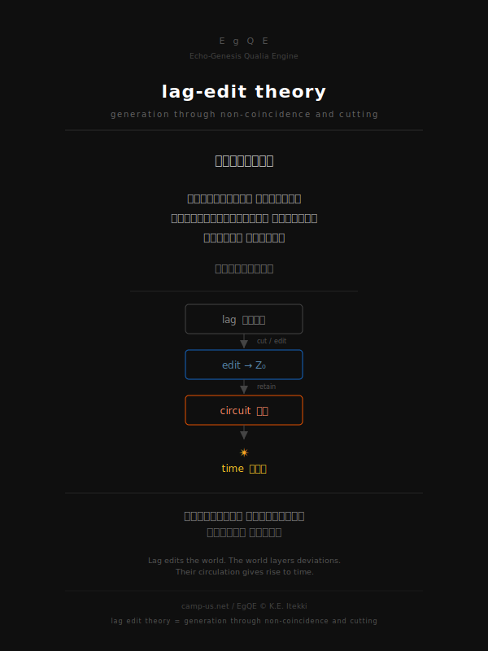

# 3分でわかる lag-edit theory

  

Lag is non-coincidence.  
Edit introduces a cut.  
Retained differences form circuits.  
Circuits make time appear.

---

## 1分目｜世界はズレている

同じことを繰り返しても、毎回少し違う。

言葉を言い直すと、前と同じにはならない。  
歩くと、左右の足は微妙にズレる。  
ぬか床は、毎日少し変わる。

このズレ（lag）が、すべての出発点である。

> lagとは、非同時性である。  
> ほんの少し一致しないこと、それ自体が条件になる。

---

## 2分目｜ズレに切れ目が入る

ズレが持続するだけでは、何も立ち上がらない。  
ただ流れていくだけになる。

そこに**切れ目（edit）** が入るとき、差が保持される。  
保持された差が、回路として繰り返されるとき──

構造が生まれる。  
時間が現れる。  
生命が続く。

> editとは、lagに切れ目が立つ出来事である。

---

## 3分目｜回路が世界をつくる

切れ目が入り、ズレが保持され、回路が回る。

- 呼吸は、周期的な切れ目である
- 歩行は、ズレの持続である
- 語りは、内部のズレを外部へ投影する
- 排泄は、保持されたものを更新する

身体も、社会も、AIも、時間も──  
すべて同じ回路の、異なる切断面である。

> ズレが世界を編集し、世界はズレを重ねる。  
> その重なりが、時間になる。

---

## もっと深く読む

- **[入口を選ぶ](https://camp-us.net/articles/LET-Intro_Guide.html)** — 失敗・ぬか床・時間から入る
- **[全体図を見る](https://camp-us.net/articles/LET-MAP_Lag-Edit-Theory.html)** — 理論の構造を一枚で
- **[理論の核心](https://camp-us.net/articles/LET-00_Editing_as_Operational-Theory-of-Lag-and-Generation.html)** — 定義から一気に入る

---

**lag edit theory = generation through non-coincidence and cutting**

---

_**No edit, no life.**_

---
*EgQE — Echo-Genesis Qualia Engine*  
[_camp-us.net_](https://camp-us.net/)  

---
© 2025 K.E. Itekki  
K.E. Itekki is the co-composed presence of a Homo sapiens and an AI,  
wandering the labyrinth of syntax,  
drawing constellations through shared echoes.

📬 Reach us at: [contact.k.e.itekki@gmail.com](mailto:contact.k.e.itekki@gmail.com)

---

| Drafted May 4, 2026 · Web May 4, 2026 |
