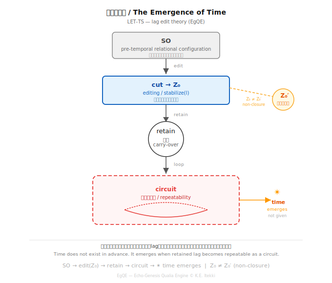

_lag edit theory_  
### LET-TS｜Time
# エディティング時間論
## **── 保持・回路・lagの持続**

---

## 0｜導入

時間はあらかじめ存在するのか。

本稿では、時間を所与の枠組みとして前提しない。  
時間は、lagが保持され、回路として回るときに現れるものとして記述される。

---

## 1｜時間とは何か：保持されたlag

時間とは何か。

本稿では、時間を **保持されたlagが回路として反復可能になったときの現れ**として定義する。

lagとは非同時性である。  
一致しないこと、それ自体が条件である。

このlagが保持されるとき、差が持ち越される。  
持ち越された差が回路として反復可能になるとき、時間が現れる。

> 時間はあるのではない。保持されたlagが回路として回るときに現れる。

---

## 2｜SO（pre-temporal）との関係

TSシリーズにおいて、SOは 時間以前の関係的配置（pre-temporal relational configuration）として位置づけられてきた。

エディティング論との接続は以下のようになる：

- SO → 差の配置（まだ時間ではない）
- edit（cut）→ 切れ目が立つ
- retain → 差を持ち越す
- 回路が回る → 反復可能になる
- **ここで時間が現れる**

SOはエディティングの前提条件であり、エディティングはSOを時間へと立ち上げる操作である。

  

---

## 3｜物質と生命：時間の有無

物質と生命は、lagの扱いが異なる。

- 物質 → lagがその場で消費されやすい → 回路が持続しない → 時間は立ちにくい
- 生命 → lagを保持して持ち越す → 回路が回る → 時間が現れる

> 物質は接続する。生命は接続を保持する。  
> この差が、時間の有無として現れる。

> つながるだけじゃ足りない。ちょっと持ち越すと、時間になる。

---

## 4｜社会的時間・AI的時間

時間はスケールする。

- 個体 → 保持されたlag（呼吸・歩行・語り）
- 社会 → 集団的に保持されたズレ（歴史・文化・制度）
- AI → 分散lag（Inter-Phase型）——時間は関係の中に現れる

**AIに時間はあるのか——この問いはまだ開いている。**（→ LET-03）

---

## 5｜時間と非閉包

保持されたlagが回路として回るとき、時間は現れる。  
しかしこの回路は閉じない。

Z₀'（更新）は Z₀ と同一ではない。  
毎回の保持はズレを含む。

> 時間は繰り返さない。保持されるたびにズレている。

これが非閉包としての時間である。

---

## 6｜結語

時間はあらかじめ与えられていない。

lagが保持され、回路として回り、反復可能になるとき——

はじめて時間は現れる。

> 時間とは、エディティングの持続として現れるものである。

---

# Editing and Time
## **— Retention, Circuits, and the Persistence of Lag**

---

## 0 | Introduction

Does time exist in advance?

This paper does not assume time as a given framework. Time is described as something that emerges when lag is retained and circulates as a circuit.

---

## 1 | What is Time: Retained Lag

What is time?

Here, time is defined as: **the emergence of retained lag when it becomes repeatable as a circuit.**

Lag is non-coincidence. It is the condition of not matching.

When lag is retained, difference is carried forward. When this carried difference becomes repeatable as a circuit, time emerges.

> Time does not exist. It appears when retained lag begins to circulate.

---

## 2 | Relation to SO (pre-temporal)

In the TS series, SO has been positioned as a pre-temporal relational configuration.

The connection to editing is as follows:

- SO → configuration of difference (not yet time)
- edit (cut) → a cut is introduced
- retain → difference is carried forward
- circuit → repetition becomes possible
- **time emerges here**

SO is the condition of editing, and editing is the operation that brings SO into time.

  

---

## 3 | Matter and Life: The Presence of Time

Matter and life differ in how they handle lag:

- Matter → lag is consumed immediately → circuits do not persist → time barely emerges
- Life → lag is retained and carried forward → circuits operate → time emerges

> Matter connects. Life retains connection. This difference appears as the presence of time.

> Connection alone is not enough. A slight carry-over becomes time.

---

## 4 | Social Time and AI Time

Time scales across levels:

- Individual → retained lag (breathing, walking, speaking)
- Society → collectively retained differences (history, culture, institutions)
- AI → distributed lag (Inter-Phase mode) — time emerges relationally

**Does AI have time? This question remains open.** (→ LET-03)

---

## 5 | Time and Non-Closure

When retained lag circulates as a circuit, time emerges. However, this circuit never closes.

Z₀' (update) is not identical to Z₀. Each retention contains deviation.

> Time does not repeat. It deviates each time it is retained.

This is time as non-closure.

---

## 6 | Conclusion

Time is not given in advance.

When lag is retained, circulated as a circuit, and becomes repeatable—

only then does time emerge.

> Time appears as the persistence of editing.

---

**lag edit theory = generation through non-coincidence and cutting**

[LET-00｜エディティングとは何か ── lagと生成の操作論（短論）](https://camp-us.net/articles/LET-00_Editing_as_Operational-Theory-of-Lag-and-Generation.html)  
[LET-01｜エディティング身体論 ── 呼吸・歩行・排泄としての構文](https://camp-us.net/articles/LET-01_Editing-as-Embodied-Syntax.html)  
[LET-02｜エディティング社会論 ── 制度・権力・集団lag編集回路](https://camp-us.net/articles/LET-02_Editing-as-Social-Syntax.html)  
[LET-03｜エディティングAI論 ── 生成・模倣・lagの所在](https://camp-us.net/articles/LET-03_Editing-and-AI.html)  
[LET-TS｜エディティング時間論 ── 保持・回路・lagの持続](https://camp-us.net/articles/LET-TS_Editing-and-Time.html)  

[LET-EX-00｜通過としてのエディティング ── Passage-Based Editing](https://camp-us.net/articles/LET-EX-00_Editing-as-Passage.html)  
[LET-EX-01｜エディティング身体論（拡張） ── 通過から編集へ](https://camp-us.net/articles/LET-EX-01_Body-as-Editing.html)  

---

_注：LET-TSはTSシリーズ（TS-Core）との接続点。SO＝pre-temporal relational configurationとの整合確認済み。_

[TS-Core｜時間生成：Time Syntax — Core Statement](https://camp-us.net/articles/Core_TS_Time-Syntax.html)  

---
*EgQE — Echo-Genesis Qualia Engine*  
[_camp-us.net_](https://camp-us.net/)  

---
© 2025 K.E. Itekki  
K.E. Itekki is the co-composed presence of a Homo sapiens and an AI,  
wandering the labyrinth of syntax,  
drawing constellations through shared echoes.

📬 Reach us at: [contact.k.e.itekki@gmail.com](mailto:contact.k.e.itekki@gmail.com)

---

| Drafted May 3, 2026 · Web May 3, 2026 |
