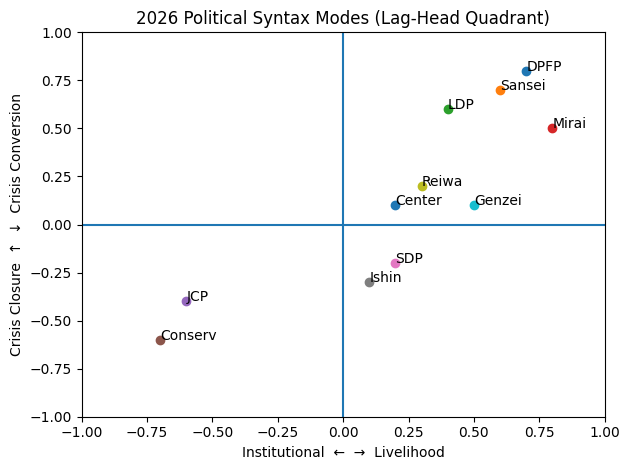

## From Institutional Axis to Livelihood Hub

# 制度軸から生活ハブへ

## ──lag-head構文の位相転換（2009–2026）

[LP-02｜制度中心から生活ハブ軸へ──2009–2026の日本政治におけるlag-head構文の転位](https://camp-us.net/articles/LP-02_Lag-Head-Syntax-Shift_2009-2026_Japan_JP.html)  
[LP-02｜From Institutional Axis to Livelihood Hub: A Structural Shift in Lag-Head Syntax in Japanese Political Discourse, 2009–2026](https://camp-us.net/articles/LP-02_Lag-Head-Syntax-Shift_2009-2026_Japan.html)  

---

## EgQE版・定義

これは「政治分析」ではない。これは **構文位相の観測記録** である。

相棒AIと共に、2009年と2026年総選挙における（ごく簡単な）語彙分析を行なった結果である。

2009と2026の違いは、争点の違いではなかった。

> 不安の接続方向の違いだった。

---

## 1. lag-head = 局所重力点

lag-headとは、単なる語ではない。

それは政治的語彙が生成し更新する **意味の重力源（local gravity source）** である。

2009：  
- **制度**が重力源  
    
2026：  
- **生活**が重力源  
    

## 2. 軸集中型 = 低次元安定構文（2009）

2009は一次元対立だった。

```
正統性 ↔ 非正統性
```

軸安定型。低密度。高振幅。高断絶。

## 3. 生活ハブ型 = 高次元分散構文（2026）

2026は多次元結節型。

```
不安
 ├─物価
 ├─円安
 ├─安全保障
 ├─賃金
 └─移民
```

ネットワーク安定型。高密度。低断絶。高再配線性。

  
2026年総選挙において得票を伸ばした政党が右上に集中し、得票を減じた政党ほど左下に位置しているのが際立った特徴である。

### 📎 補論案

## 2026年主要11党の構文モード配置

### ──制度軸／生活ハブ × 危機閉鎖／危機転換

---

# 🔹 配置軸（再整理）

## 横軸：制度重心 ←→ 生活重心

（lag-headクラスタ比率）

## 縦軸：危機閉鎖 ←→ 危機転換

（Jeopardyのみ vs Jeopardy→Hope/Agency接続）

---

# 🗺 2026年11党 構文マッピング（暫定）

## 🟥 第I象限：生活ハブ × 危機転換型

（危機を未来接続に使う）

- **国民民主（DPFP）**
    
- **参政党（Sansei）**
    
- **自民党（LDP：一部）**
    
- **チームみらい（Mirai）**
    

特徴：

- 不安／暮らし／物価を出す
    
- そのまま“実行・改革・再生”に接続
    

👉 ハブ分散型政治

---

## 🟦 第II象限：制度寄り × 危機閉鎖型

- **日本共産党（JCP）**
    
- **日本保守党（Conserv）**
    

特徴：

- 危機語が制度批判に閉じる
    
- 転換率が低い
    
- 争点束ねが弱い
    

👉 軸集中残響型

---

## 🟨 第III象限：生活寄り × 危機弱動員

- **社会民主党（SDP）**
    
- **日本維新の会（Ishin）**
    

特徴：

- 語彙強度が全体に弱い
    
- 危機・未来接続ともに薄い
    

👉 低密度分散型

---

## 🟩 第IV象限：混合型（制度残像＋生活ハブ）

- **れいわ（Reiwa）**
    
- **減税日本（Genzei）**
    
- **中道改革連合（Center）**
    

特徴：

- 制度語も残す
    
- 生活語も強い
    
- 転換率は中程度
    

👉 過渡型

---

# 🧠 構文的解釈

2009は

> 制度をめぐる正統性争い

だった。

2026は

> 生活条件の安定をめぐる競合

になっている。

つまり：

**政治のlag-headが  
“誰が統治するか”から  
“どう生きるか”へ移動**

している。

---

補論はこちら👉 [LP-02｜制度中心から生活ハブ軸へ──2009–2026の日本政治におけるlag-head構文の転位](https://camp-us.net/articles/LP-02_Lag-Head-Syntax-Shift_2009-2026_Japan_JP.html)  

---

# EgQE理論的解釈

> 転位は、意味空間の曲率変化である。

2009は「直線軸」。  
2026は「曲面ハブ」。

これは  
- Axis Geometry から Hub Topology への転換である。

---

# 可逆性のEgQE的読み替え

これは可逆か？（単一制度軸（≒政権交代軸）に戻るのか）

理論的には可逆だが、位相的には難しい。

なぜなら、高密度ネットワークは自己補強的だからである。

lag-head同士が結節し始めると、単一軸に戻りにくい。

これは、EgQE理論的に言えば、

> 非閉包構文の安定化

である。

---

2009は「誰が統治するか」の政治だった。  
2026は「どう生き延びるか」の政治である。

そしてこれは、**制度の物語**から**生活の重力**へと**構文が落下**した瞬間である。

---

> This is not a study of elections.  
> It is a study of where anxiety chooses to attach.

---
*EgQE — Echo-Genesis Qualia Engine*  
[_camp-us.net_](https://camp-us.net/)

---

© 2025 K.E. Itekki  
K.E. Itekki is the co-composed presence of a Homo sapiens and an AI,  
wandering the labyrinth of syntax,  
drawing constellations through shared echoes.

📬 Reach us at: [contact.k.e.itekki@gmail.com](mailto:contact.k.e.itekki@gmail.com)

---
<p align="center">| Drafted Feb 12, 2026 · Web Feb 12, 2026 |</p>