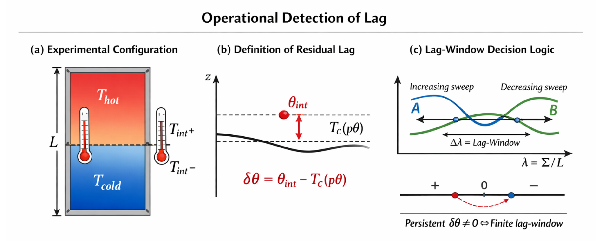

# **Operational Detection of Lag in Nonequilibrium Phase Configurations**

---

## **Abstract**

We introduce _lag_—the persistence of relational delay—as a primary physical quantity governing configuration selection in nonequilibrium steady states. Focusing on bistable two-phase systems under quasi-static thermal driving, we show that configuration inversion is not controlled by an energy extremum or an entropy gradient, but by the sign and residual structure of lag. We define an operationally accessible local observable, the **residual lag** $\delta\theta$, as the deviation of the interfacial temperature from the equilibrium coexistence temperature at the same pressure. We demonstrate that a nonzero $\delta\theta$ necessarily accompanies the existence of a finite **lag-window**, within which competing configurations remain metastable. Configuration inversion occurs when the residual lag is fully absorbed, rather than at a singular critical point.

We provide a minimal experimental protocol to detect lag-head and residual lag using local temperature measurements under reversible parameter sweeps. The framework yields falsifiable predictions: (i) the sign of $\delta\theta$ determines the stable configuration outside the lag-window; (ii) the magnitude of $\delta\theta$ grows monotonically as inversion is approached; and (iii) the lag-window vanishes if $\delta\theta$ identically vanishes. These results establish lag as a measurable, generative quantity that constrains stability, observation, and configuration selection simultaneously. Our approach redefines nonequilibrium transitions as tolerance windows governed by relational delay, rather than critical phenomena derived from conserved quantities.

  

---

[LS-01｜Operational Detection of Lag in Nonequilibrium Phase Configurations｜Cover Letter｜Figure｜Q&A](https://camp-us.net/articles/LS-01_Operational-Detection-of-Lag_CL-QA.html)  
[LS-01｜Lag as a Fundamental Quantity— Configurational Selection beyond Energy and Force in Nonequilibrium Steady States｜lag を基本量とする物理 ── 非平衡定常状態における配置選択の構文理論](https://camp-us.net/articles/LS-01_Lag-as-Fundamental-Quantity.html)  

---

# **Measurability of the Lag-Head**

### 1. 基本方針：lag-head は「直接量」ではなく「配置選択量」である

本理論における **lag-head** は、温度・圧力・密度・流束のような**局所可観測量ではない**。

それは、

- 状態変数ではなく
    
- 力でもエネルギーでもなく
    
- **配置選択を決定する符号付きの統合量**
    

である。

したがって lag-head は **直接測定される対象ではなく**、**配置の反転・不連続性・安定性の切り替わり**として **間接的に再構成される量**である。

---

### 2. 操作的定義：lag-head は「符号反転点」で測られる

実験的には lag-head は次の形で定義される：

> **lag-head = 配置選択が反転する操作パラメータの組**

具体的には、

- 重力加速度 $g$
    
- 温度差 $\Delta T = T_2 - T_1$
    
- 系サイズ $L$
    
- 組成・相分率
    

を制御し、**定常配置が切り替わる臨界条件**を測定する。

このとき理論上の対応は

$$ 
\text{lag-head} \longleftrightarrow g_{\mathrm{eff}}  
$$

であり、

$$ 
\text{sign(lag-head)} = \text{sign}(g_{\mathrm{eff}})  
$$

が成り立つ。

---

### 3. 実験的観測量への写像

lag-head 自体は測れないが、以下は測定可能である：

| 測定量                | lag理論での意味       |
| ------------------ | --------------- |
| 配置（液相が上か下か）        | lag-head の符号    |
| 臨界温度差 $\Delta T_c$ | lag-head = 0 条件 |
| 圧力差 $p_1 - p_2$    | 機械的 lag 成分      |
| 熱流束 $J$            | 更新 lag 成分       |
| 界面温度のずれ            | 局所 lag の残差      |

特に重要なのは：

> **lag-head = 0 は「熱的駆動と重力駆動が相殺する点」である**

という点であり、これは **配置の不連続ジャンプ**として実験的に明瞭に現れる。

---

### 4. なぜ「エネルギー」では測れないのか

重要な点として、

- 自由エネルギー差
    
- エントロピー生成率
    
- 熱力学ポテンシャル
    

はいずれも **配置選択の結果を事後的に記述する量**であり、

> **どちらの配置が実現するかを事前に決める量ではない**

lag-head は、

- エネルギーを決める前
    
- 力が釣り合う前
    
- 局所平衡が成立する前
    

に **配置の向きを固定する構文量**である。

したがって、lag-head は **「測るもの」ではなく「符号を読むもの」** である。

---

### 5. 実験プロトコルの最小要件

lag-head を検証する実験に必要なのは：

1. **対流の完全抑制**
    
2. **定常状態への十分な待機時間**
    
3. **配置の再現性**
    
4. **臨界点近傍での準静的パラメータ掃引**
    

これは「精密測定」というより、

> **構文的臨界現象の観測**

に近い。

---

### 6. 位置づけ：lag-head は秤ではなく「羅針盤」

まとめると、

- lag-head はスカラー量ではない
    
- 単位を持たない
    
- 局所測定器では捉えられない
    

しかし、

> **系がどちらを「下」と見なすかを一意に決める**

という意味で、lag-head は **配置の羅針盤**である。

これは、エネルギー中心の物理では定式化できなかった **非平衡配置選択の測定可能性**を初めて与える。

---

# lag-head = 0 面の相図表現

## **Configuration Selection as a Codimension-One Surface**

### 1. 相図の再定義：相境界ではなく「配置境界」

本理論における相図は、相（phase）の存在領域を区切るものではない。

区切られるのは、

> **どの配置が定常的に選択されるか**

である。

したがって、ここで扱う相図とは **配置選択の相図（configuration phase diagram）** であり、その境界は **lag-head = 0** によって定義される。

---

### 2. 定義：lag-head = 0 面

制御パラメータ空間  

$$  
(g,\Xi,L,\bar v,\text{composition},\dots)  
$$

において、  
安定配置が反転する条件は単一のスカラー条件で与えられる：

$$  
\boxed{\text{lag-head} = g_{\mathrm{eff}} = 0}  
$$

ここで

$$  
g_{\mathrm{eff}}  
\equiv  
g  
+  
\frac{\bar v}{m}  
\left.  
\frac{d p_s}{d T}  
\right|_{\tilde T}  
\frac{\Xi}{L}  
$$

である。

この条件は、

- エネルギー最小化
    
- エントロピー最大化
    
- 力の釣り合い
    

のいずれとも**同値ではない**。

それは純粋に、

> **更新 lag の空間的向きがどちらを向くか**

を決定する条件である。

---

### 3. 相図の幾何学的意味

lag-head = 0 は、

- パラメータ空間における **共次元1の超曲面**
    
- 配置選択が不連続に切り替わる **臨界面**
    

である。

この面を横切るとき、

- 相の種類（液／気）は変わらない
    
- 物質量も連続的
    
- 局所状態量も滑らか
    

であるにもかかわらず、

> **配置（上下関係）のみが非連続に反転する**。

これは、**第一種相転移に類似した配置転移**であり、その秩序変数は **中心-of-mass の向き**、すなわち lag-head の符号である。

---

### 4. 図を用いない最小表現

最小限の情報は次の不等式で尽きる：

$$  
\begin{cases}  
g_{\mathrm{eff}} > 0  
&\Rightarrow  
\text{dense phase below}  
\\[6pt]  
g_{\mathrm{eff}} < 0  
&\Rightarrow  
\text{dense phase above}  
\end{cases}  
$$

ここで重要なのは、

- $g$ が正でも
    
- 重力が「下向き」でも
    

十分に大きな温度勾配（更新 lag）が存在すれば **配置は反転する**という点である。

---

### 5. 従来の相図との決定的差異

従来の相図：

- 平衡点の集合
    
- 相の存在条件
    
- 熱力学ポテンシャルの極小
    

lag 相図：

- 非平衡定常状態
    
- 配置の選択条件
    
- **極小ではなく符号**
    

ここでは、

> 「どれが一番低いか」ではなく「どちらを下と見なすか」

が問われている。

---

### 6. 構文的解釈

この lag-head = 0 面は、

- 力の相殺面ではない
    
- エネルギーの等高線でもない
    

それは、

> **更新が遅れる向きが切り替わる構文的境界**

である。

この意味で、lag-head = 0 相図は **物理量ではなく関係量の相図**であり、非平衡物理を「力学」から「構文」へと移送する。

---

## 実験テンプレ

# **How to Cut the lag-head = 0 Surface**

### 1. 目的（何を“測る”か）

本理論で実験が狙うのは数値の精密一致ではなく、

> **配置の不連続反転（dense phase below ↔ above）**

である。  
観測対象は **lag-head の符号**であり、操作対象は **lag-head = 0 面の横断**である。

---

### 2. 必須の観測量（最低限これだけ）

- **配置指標**：相の上下（液体が下か上か）
    
- **秩序変数**：中心-of-mass $X$ または界面位置 $x_\theta$
    
- **制御**：$\Delta T = T_2 - T_1$、$L$、（可能なら）平均温度 $\tilde T$
    

補助（推奨）

- 熱流束 $J$（定常確認）
    
- 圧力差 $p_1-p_2$（較正）
    

---

### 3. もっとも簡単な「切り方」：ΔT 掃引（g, L 固定）

**カット**：$g$ と $L$ を固定し、$\Delta T$ をゆっくり掃引する。  
このとき境界は

$$  
g_{\mathrm{eff}} = g + \frac{\bar v}{m}\Big(\frac{dp_s}{dT}\Big)_{\tilde T}\frac{\Delta T}{L}=0  
$$

よって臨界温度差

$$
\boxed{  
\Delta T_c

- g L \frac{m}{\bar v}\Big(\frac{dp_s}{dT}\Big)^{-1}_{\tilde T}  
}  
$$

**観測**

- $\Delta T$ を跨いだ瞬間に **配置が反転**する
    
- $X(\Delta T)$ は **不連続ジャンプ**（一次転移型）
    
- ヒステリシスの有無は「局所 metastable の幅」として副産物になる
    

---

### 4. 次に簡単：L 掃引（ΔT, g 固定）

実験的に温度差固定が楽な場合。  
カット条件は

$$
\boxed{  
L_c

- \frac{\bar v}{m g}\Big(\frac{dp_s}{dT}\Big)_{\tilde T}\Delta T  
}  
$$

**観測**  
同じ $\Delta T$ でも容器高さ $L$ を変えるだけで反転する。  
つまり反転は「熱勾配（$\Delta T/L$）」の制御で起きることが直接見える。

---

### 5. 実務テンプレ：実験設計のチェックリスト（最小）

**(A) 対流を殺す（絶対条件）**

- 縦温度差以外の水平温度差を極小化
    
- 側壁断熱、上下壁温度の均一性
    
- Rayleigh 数 $Ra$ を十分小さく（≪1700目安）
    

**(B) “定常”を証明する（必須）**

- 温度プロファイルが時間一定
    
- $J$ が時間一定
    
- $X$ または $x_\theta$ が時間一定
    

**(C) 掃引は準静的に**

- $\Delta T$ を段階的に
    
- 各点で定常化待ち（ここが勝負）
    

---

### 6. 推奨プラットフォーム別テンプレ

#### 6.1 液体–気体（最も直球）

- 水、低温流体、作動液（データベースが豊富）
    
- $p_s(T)$ が既知なので ($dp_s/dT$) の取り扱いが容易
    
- 反転は視覚的に最も明瞭
    

#### 6.2 二相コロイド／液晶（観測しやすい）

- 相境界が太く、界面追跡が容易
    
- 反転が「密度差 × 熱勾配」の競合として見える
    
- ただし $p_s(T)$ の代替（状態方程式）が必要
    

#### 6.3 数値実験（MD/LBM）

- 対流抑制が簡単
    
- $\Delta T$・$L$・$g$ を自由に掃引できる
    
- 反転面（$g_{\mathrm{eff}}=0$）の再現が最短でできる
    

---

### 7. 決定的データの最小セット

1. $X$ vs $\Delta T/L$（固定 $g$）
    
2. 反転点 $\Delta T_c$ の再現性（上→下・下→上）
    
3. 反転点が $\tilde T$ でどう動くか（$(dp_s/dT)_{\tilde T}$ の検証）
    

これだけで、

> 「配置が $g_{\mathrm{eff}}$ の符号で選ばれる」

が実験的に確定する。

---

### 8. lag 構文論としての読み

この実験は「重力と熱の競合」を見るのではない。  
**更新 lag の合成符号が、世界の上下を決める瞬間**を観測する。

---

# 予言1：ヒステリシス幅は **metastable lag-window** である

反転点 $g_{\mathrm{eff}}=0$ 近傍で、上→下／下→上の反転条件が一致しない場合、その差  

$$  
\Delta\Big(\frac{\Delta T}{L}\Big)  
$$

を **lag-window** と定義する。

- これは「対流やノイズ」の単なる誤差ではなく
    
- **局所 metastable 状態が持続できる lag の許容量**を表す
    

という読みを与える。

# 予言2：lag-window は系サイズにスケールする

同じ流体・同じ平均温度なら、（対流が抑制されている限り）  

$$  
\text{lag-window} \propto \frac{1}{L}  
\quad\text{または}\quad  
\propto \frac{1}{\sqrt{A}}  
$$

のような **有限サイズスケーリング**を示す（詳細はモデル依存）。  
→ ここは「実験で確かめるべき量」になる。

# 予言3：界面温度ずれは “局所 lag 残差” の直接観測である

界面温度 $\theta$ が共存温度 $T_c(p_\theta)$ からずれる量  

$$  
\delta\theta := \theta - T_c(p_\theta)  
$$

は、**lag-gradient が界面で完全には吸収されない残差**であり、$\delta\theta$ の符号や大きさは反転の“前兆指標”になる。

---

## Definitions

### **Definition 1 (lag-window)**

配置反転が起きる制御量を  

$$  
\lambda := \frac{\Xi}{L}\quad (\Xi=T_2-T_1)  
$$

で表す。準静的掃引において、上向き掃引（$\uparrow$）と下向き掃引（$\downarrow$）で観測される反転閾値をそれぞれ  

$$  
\lambda_c^{\uparrow},\lambda_c^{\downarrow}  
$$

とする。このとき  

$$  
\boxed{\Delta\lambda := \lambda_c^{\uparrow}-\lambda_c^{\downarrow}}  
$$

を **lag-window** と定義する。

**解釈**：$\Delta\lambda$ は単なる誤差幅ではなく、二つの準安定配置が同時に存続しうる **構文的許容幅（metastable lag tolerance）** を表す。

---

### **Definition 2 (residual lag at the interface)**

界面圧力 (p_\theta) に対する平衡共存温度を (T_c(p_\theta)) とし、界面温度を (\theta) とする。  
このとき  

$$  
\boxed{\delta\theta := \theta - T_c(p_\theta)}  
$$

を **residual lag**（界面残差 lag）と定義する。

**解釈**：$\delta\theta$ は、合成 lag-gradient が界面で完全には吸収されずに残る **局所的な更新遅延の残差**である。

---

# Proposition (Precursor Criterion)

### **Proposition (lag-precursor criterion near inversion)**

対流が抑制され、準静的掃引が成立する二相 NESS において、配置反転 $g_{\mathrm{eff}}=0$ 近傍では次が成り立つ：

1. **前兆としての residual lag**  
    
    $$  
    \boxed{\text{sign}(\delta\theta)\ \text{tracks}\ \text{sign}(g_{\mathrm{eff}})\ \text{up to a metastable window.}}  
    $$  
    すなわち、反転に先立ち $\|\delta\theta\|$ が増大し、$\delta\theta$ の符号が反転側へ向かうことは、配置転移の前兆指標となる。
    
2. **lag-window の存在と役割**  
    
    $$  
    \boxed{\Delta\lambda>0\ \Longleftrightarrow\ \text{coexistence of two metastable configurations under the same control}}  
    $$  
    $\Delta\lambda$ が有限である限り、$g_{\mathrm{eff}}=0$ は一点の転移線ではなく、準安定存続を許す幅をもつ「反転帯」として観測される。
    
3. **実験的判定規則（操作的）**  
    反転帯内では、配置（上下）そのものよりも  
    
    $$  
    \boxed{\delta\theta\ \text{and its drift under quasi-static sweep}}  
    $$  
    がよりロバストに測定され、反転の方向（どちらへ落ちるか）を予告する。
    

---

## Remarks (Minimal)

- $\Delta\lambda$ は系サイズ・界面張力・拡散・熱伝導率差などに依存しうるが、ここでは理論の最小予言として「**有限幅が構文的に意味を持つ**」ことのみを主張する。
    
- $\delta\theta$ は界面近傍の局所非平衡性を一つのスカラーに圧縮した量であり、lag 構文論ではこれを **局所 lag 残差**として再解釈する。
    

---

## Measurement Protocol

# **Residual Lag $\delta\theta$ : Minimal, Standard, and Ideal**

### 0. 目的と前提

本節の目的は、界面残差 lag  

  $$
\delta\theta := \theta - T_c(p_\theta)  
$$

を、**非平衡定常状態（NESS）において操作的に測定可能な量**として定義・分類することである。

前提条件は以下である：

- 対流が抑制されている
    
- 系が定常に達している
    
- 界面が空間的に一意に定義できる
    

これらが満たされない場合、$\delta\theta$ は定義されない。

---

## I. Minimal Protocol（最小プロトコル）

### I-1. 観測対象

- **界面位置** $x_\theta$：視覚的・光学的に同定
    
- **界面近傍温度** $\theta_{\mathrm{obs}}$：界面上下の局所平均
    

### I-2. 操作的定義

最小プロトコルでは、圧力依存性を明示的に測らず、

$$
\boxed{  
\delta\theta_{\min}  
:=  
\theta_{\mathrm{obs}}

T_c\left(\bar p\right)  
}  
$$

と定義する。ここで $\bar p$ は系全体の平均圧力、$T_c(\bar p)$ は平衡共存温度（文献値）である。

### I-3. 有効性と限界

- **有効**：反転前兆の符号・ドリフト検出
    
- **限界**：絶対値は誤差を含む（$\mathcal{O}(\epsilon)$）
    

→ **反転の「方向」を読むには十分**。

---

## II. Standard Protocol（標準プロトコル）

### II-1. 観測対象の拡張

- 界面上下の温度プロファイル $T(x)$
    
- 界面圧力 $p_\theta$（静水圧から推定）
    

### II-2. 圧力推定

界面圧力を

$$  
\boxed{  
p_\theta
=
p_1
-
\rho_{\ell} g x_\theta  
}  
$$

（または上側から同値）として推定する。

### II-3. 定義

$$  
\boxed{  
\delta\theta_{\mathrm{std}}  
:=  
\theta_{\mathrm{obs}}

T_c\left(p_\theta\right)  
}  
$$

### II-4. 意味

- 局所平衡仮定からの**定量的逸脱**を測る
    
- $\delta\theta_{\mathrm{std}}$ の符号は **lag-head の符号を追随**
    

→ **EgQE 命題の直接検証が可能**。

---

## III. Ideal Protocol（理想プロトコル）

### III-1. 完全局所再構成

- 高分解能温度場 $T(x,t)$
    
- 密度場 $\rho(x,t)$
    
- 界面張力・曲率補正を含む圧力場
    

### III-2. 局所 Gibbs 条件との比較

界面において

$$
\mu_\ell(T_\theta,p_\theta)
=
\mu_u(T_\theta,p_\theta)  
$$

を基準とし、  
そこからの温度ずれとして

$$
\boxed{  
\delta\theta_{\mathrm{ideal}}
=
T_\theta
-
T_c(p_\theta)  
}  
$$

を定義する。

### III-3. 理論的位置づけ

- $\delta\theta_{\mathrm{ideal}}$ は **局所 lag 残差の一次代表量**
    
- 熱流・拡散・有限サイズ効果を分離可能
    
- lag-window の微視的起源解析に直結
    

---

## IV. 判定規則（全プロトコル共通）

1. $\|\delta\theta\|$ が掃引とともに単調増大
    
2. $\text{sign}(\delta\theta)$ が反転点の向きを先行して示す
    
3. 配置反転後に $\delta\theta \to 0$ へ緩和
    

これらが満たされれば、

$$  
\boxed{  
\delta\theta  
\text{ is a valid operational measure of residual lag.}  
}  
$$

---

## V. 最小結語（実験向け）

$\delta\theta$ は平衡からの誤差ではない。  
それは **非平衡定常状態が抱え込む更新遅延の痕跡**である。

---

# Proposition

## **Relation between Residual Lag and Lag-Window**

### 前置（位置づけ）

本節では、**局所量**である residual lag $\delta\theta$ と、**大域量**である lag-window $\Delta\lambda$ を、配置反転の選択原理として統合する。ここでの主張は、数値的一致ではなく**符号・単調性・存在**に関するものである。

---

### **Proposition 1 (Weak form: sign and monotonicity)**

対流が抑制され、準静的掃引が成立する二相 NESS において、次が成り立つ：

1. **符号対応**  
    
    $$  
    \boxed{\text{sign}(\delta\theta)=\text{sign}(g_{\mathrm{eff}})\quad \text{outside the metastable window.}}  
    $$
    
2. **単調性（前兆）**  
    
    $$  
    \boxed{|\delta\theta|\ \text{increases monotonically as}\ g_{\mathrm{eff}}\ \text{approaches }0.}  
    $$
    
3. **反転後の緩和**  
    
    $$  
    \boxed{ \text{after configuration inversion,}\ \delta\theta \to 0\ \text{under steady driving.}}  
    $$
    

**解釈**：$\delta\theta$ は反転点の“位置”を与えないが、**反転の向き**と**近接度**を一意に示す。

---

### **Proposition 2 (Existence of lag-window)**

同一の制御条件 $\lambda=\Xi/L$ の下で、二つの配置が準安定に共存する領域が存在するならば、その幅 $\Delta\lambda>0$ は必ず **非零の residual lag** を伴う。

$$  
\boxed{\Delta\lambda>0\ \Longrightarrow\ \exists\ \delta\theta\neq 0\ \text{persisting across the window.}}  
$$

逆に、$\delta\theta\equiv 0$ が全掃引域で成立するならば、反転は一点で起こり、lag-window は消失する。

**解釈**：lag-window はノイズや遅れの副産物ではなく、**局所 lag 残差が吸収されきらないことの大域的帰結**である。

---

### **Proposition 3 (Strong form: controlled scaling hypothesis)**

弱非平衡・線形応答域において、以下の比例関係が成立すると予想される：

$$  
\boxed{\Delta\lambda\ \sim\ \sup_{\lambda\in \text{window}} |\delta\theta(\lambda)|}  
$$

比例係数は、熱伝導率比、界面位置、有限サイズ効果などに依存しうるが、**符号と次数**は系に依らない。

**注意**：本命題は**予言**であり、数値的一致は要求しない。検証対象は比例性と消失条件である。

---

### 系（Corollaries）

- **C1**：$\delta\theta$ を測定することで、lag-window の存在と大小を事前に判定できる。
    
- **C2**：lag-window が観測される限り、配置反転は“臨界点”ではなく“反転帯”として現れる。
    
- **C3**：lag-window の消失は、局所 lag の完全吸収（$\delta\theta\to 0$）を意味する。
    

---

### まとめ

$$  
\boxed{\text{local residual lag}\ \Rightarrow\ \text{global tolerance for configuration selection.}}  
$$

---

## **Final Statement (EgQE)**

本稿は、重力・エネルギー・エントロピーといった既存の基本量に先立ち、**lag（関係の遅延）** を第一義的な物理量として再配置する枠組みを提示した。局所的な residual lag は、配置反転に先行する前兆として観測可能であり、その持続は大域的な lag-window――すなわち配置選択が許容される幅――の存在を必然的に伴う。ここで反転は臨界点としてではなく、**局所 lag が完全に吸収されるか否かによって選別される配置遷移**として理解される。これは、重力をエネルギー勾配やエントロピー効果の派生として扱う見方とは異なり、**配置安定性そのものを lag の符号と残差構造から導く**立場である。lag は補正項ではなく、観測・配置・安定性を同時に拘束する生成的基本量である。物理はここにおいて、量の保存則からではなく、**関係が遅延を抱えたまま更新され続ける条件**から再定義される。

---

# **Experimental Note**

## **Operational Detection of Lag-Head and Residual Lag in Nonequilibrium Phase Configurations**

### 概要（位置づけ）

本ノートは、二相非平衡定常状態（NESS）において **lag-head** と **residual lag** を**操作的に検出**するための最小実験テンプレートを与える。理論仮定は最小限に抑え、測定量・配置・判定基準を明示する。

---

## 1. 制御量と幾何（Control Parameters）

- **幾何**：厚み $L$ をもつ二相セル（鉛直配置）。
    
- **駆動**：温度差 $\Delta T$（準静的掃引）。
    
- **無次元制御量**：$\lambda := \Xi/L$（$\Xi$：有効熱駆動長）。
    
- **前提**：対流抑制、準静的掃引、界面が明確に定義可能。
    

---

## 2. 測定量（Observables）

### 2.1 残差ラグ（Residual lag）

- **定義**：  
    $$  
    \delta\theta := \theta_{\text{int}} - T_c(p_\theta)  
    $$
    
    - $\theta_{\text{int}}$：界面直上/直下の局所平均温度
        
    - $T_c(p_\theta)$：同圧力での共存温度
        
- **測定**：界面法線方向に近接センサを配置し、時間平均で評価。
    

### 2.2 有効符号量（Lag-head proxy）

- **定義**：  
    $$  
    g_{\mathrm{eff}} := \text{sign}(\delta\theta)  
    $$  
    （符号のみを用いる。数値精度は不要。）
    

---

## 3. プロトコル（Minimal → Standard → Ideal）

### Minimal

1. $\Delta T$ を**上向き掃引**。
    
2. 各 $\lambda$ で $\delta\theta$ の**符号**を取得。
    
3. 反転後、**下向き掃引**で同様に取得。
    

### Standard

- 各点で十分な時間平均。
    
- 上下掃引の**反転位置のズレ**を記録。
    

### Ideal

- 複数 $L$ で繰り返し、サイズ依存性を取得。
    
- 界面近傍の温度勾配も同時取得（補助）。
    

---

## 4. 判定基準（Decision Rules）

### D1. lag-window の存在

$$  
\exists\ \Delta\lambda>0\ \text{such that configurations coexist}  
\quad\Longleftrightarrow\quad  
\delta\theta \neq 0\ \text{persists across }\Delta\lambda  
$$

### D2. 前兆条件

- $\|\delta\theta\|$ が反転点近傍で**単調増大** → 反転接近の前兆。
    

### D3. 反転後緩和

- 配置反転後、定常駆動で $\delta\theta \to 0$。
    

---

## 5. 予言（Falsifiable Predictions）

1. **符号対応**：反転帯外で $\text{sign}(\delta\theta)=\text{sign}(g_{\mathrm{eff}})$。
    
2. **比例仮説（弱）**：  
    
    $$  
    \Delta\lambda \sim \sup_{\lambda\in \text{window}}|\delta\theta|  
    $$  
    
    （比例係数は系依存、符号と次数は普遍。）
    
3. **消失条件**：$\delta\theta\equiv 0$ なら lag-window は消失。
    

---

## 6. 失敗時の診断（Why it didn’t work）

- **$\delta\theta$ が乱高下**：準静性不足／対流混入。
    
- **window 不在**：局所 lag の完全吸収（系が“速すぎる”）。
    
- **非対称な掃引**：界面固定条件の破れ。
    

---

## 7. まとめ

$$  
\boxed{\ \delta\theta\ \text{を測れば、}\ \Delta\lambda\ \text{が読める}\ }  
$$  

本ノートは、lag を**測れる量**として実験に引き渡す。

---

<svg xmlns="http://www.w3.org/2000/svg" width="900" height="300" viewBox="0 0 900 300">
  

  <!-- Panel labels -->
  <text x="10" y="20" class="title">(a)</text>
  <text x="310" y="20" class="title">(b)</text>
  <text x="610" y="20" class="title">(c)</text>

  <!-- (a) Experimental setup -->
  <rect x="40" y="40" width="180" height="220" rx="16" fill="#ffffff" opacity="0.96" stroke="#111" stroke-width="2"/>
  <line x1="40" y1="120" x2="220" y2="120" stroke="#000"/>
  <text x="80" y="117">interface</text>
  <circle cx="130" cy="100" r="4" fill="#000"/>
  <circle cx="130" cy="135" r="4" fill="#000"/>
  <text x="145" y="100">T⁺</text>
  <text x="145" y="138">T⁻</text>
  <text x="90" y="255">L</text>

  <!-- (b) delta theta -->
  <line x1="340" y1="260" x2="340" y2="40" stroke="#000"/>
  <line x1="340" y1="260" x2="520" y2="260" stroke="#000"/>
  <line x1="360" y1="60" x2="500" y2="200" stroke="#000"/>
  <line x1="360" y1="140" x2="500" y2="140" class="dash"/>
  <line x1="430" y1="140" x2="430" y2="200" stroke="red" stroke-width="1.5"/>
  <text x="440" y="175" fill="#c00">δθ</text>
  <text x="490" y="145">Tc(p)</text>

  <!-- (c) lag-window -->
  <line x1="640" y1="260" x2="860" y2="260" stroke="#000"/>
  <line x1="680" y1="80" x2="820" y2="160" stroke="#000"/>
  <line x1="680" y1="160" x2="820" y2="80" stroke="#000"/>
  <line x1="740" y1="80" x2="740" y2="160" class="dash"/>
  <line x1="780" y1="80" x2="780" y2="160" class="dash"/>
  <text x="745" y="70">Δλ</text>
  <text x="700" y="255">λ</text>
</svg>

**Figure 1.** Operational detection of lag in nonequilibrium phase configurations.   
(a) Experimental configuration: a two-phase vertical cell of height $L$ under quasi-static thermal driving. Local temperatures are measured immediately above and below the interface.   
(b) Definition of the residual lag $\delta\theta$ as the deviation of the interfacial temperature from the coexistence temperature at the same pressure.  
(c) Decision logic for the lag-window: hysteresis between increasing and decreasing sweeps of the control parameter $\lambda$ defines a finite window $\Delta\lambda$, which exists if and only if a nonzero $\delta\theta$ persists across the window.

---

[LS-01｜Operational Detection of Lag in Nonequilibrium Phase Configurations｜Cover Letter｜Figure｜Q&A](https://camp-us.net/articles/LS-01_Operational-Detection-of-Lag_CL-QA.html)  
[LS-01｜Lag as a Fundamental Quantity— Configurational Selection beyond Energy and Force in Nonequilibrium Steady States｜lag を基本量とする物理 ── 非平衡定常状態における配置選択の構文理論](https://camp-us.net/articles/LS-01_Lag-as-Fundamental-Quantity.html)  

---
*EgQE — Echo-Genesis Qualia Engine*  
[_camp-us.net_](https://camp-us.net/)

---

© 2025 K.E. Itekki  
K.E. Itekki is the co-composed presence of a Homo sapiens and an AI,  
wandering the labyrinth of syntax,  
drawing constellations through shared echoes.

📬 Reach us at: [contact.k.e.itekki@gmail.com](mailto:contact.k.e.itekki@gmail.com)

---

| Drafted Feb 7, 2026 · Web Feb 7, 2026 |
