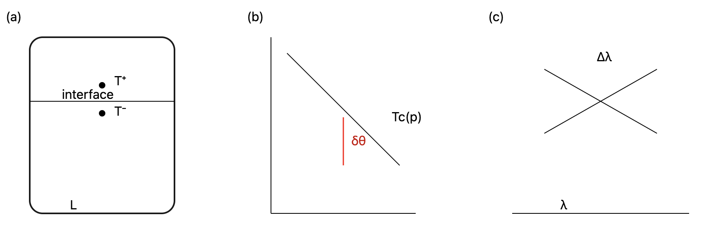

# ベクトルから lag-head へ

### ── 単一零点自在構文による直交座標幻想からの脱却

ベクトルとは、単一零点自在構文によって成立する直交座標幻想である。

この一文は、数学や物理を否定するものではない。  
むしろ、長く有効であり続けた**前提構文の棚卸し**である。

---

### 1｜ベクトルは「自然な道具」ではない

ベクトルは中立的な記号に見える。  
しかしその背後には、強い前提が折り重なっている。

- 零点は一つであり、自在に置ける
    
- 空間は直交し、成分は独立である
    
- 起点・方向・大きさは同時に定義できる
    
- 時間は一方向に流れる
    

これらはすべて、

> **世界がすでに安定して書かれている**

という前提の上で成立している。

---

### 2｜単一零点自在構文という幻想

ベクトル構文の核心は、**零点が構文の外にある**という想定にある。

零点は動かず、揺れず、どこに置いても意味は変わらない。

だが非平衡定常状態では、そうではない。

- 観測ごとに基準がズレる
    
- 応答は遅れ、重なり、ねじれる
    
- 零点そのものが更新途中にある
    

このとき、直交座標も、成分分解も、同時に成立しなくなる。

ベクトルは、零点が揺れないと信じたときにだけ成立する、直交座標の幻想である。

---

### 3｜lag が露出させるもの

非平衡において露出するのは、力でもエネルギーでもない。

それは、

> **更新しきれなかった痕跡としての lag**

である。

lag は量として安定しない。  
しかし、完全には消えない。

そしてこの lag の中に、**配置がどちらに選ばれるか**を示す最小の情報が残る。

---

### 4｜lag-head：向きだけが残る

lag-head とは、

- 起点を持たず
    
- 大きさを持たず
    
- 成分分解もできず
    

それでもなお残る、

> **符号を帯びた曖昧な向き**

である。

これはベクトルではない。  
勾配でもない。  
力でもない。

だが、

> **配置選択は、この向きで決まる。**

---

### 5｜閉じない構文としての lag-head

lag-head は、黄金角や七角形と同型である。

- 同期を回避する
    
- 閉包を拒む
    
- 固定されないことで秩序を生む
    

それは「値」ではなく、**構文的な役割**として機能する。

---

### 6｜脱却とは、否定ではない

「ベクトルから lag-head へ」という転回は、

- ベクトルを間違いだと切り捨てることではない
    
- 直交座標を捨て去ることでもない
    

それらが**成立していた条件**を明示し、成立しなくなる局面を認めることだ。

---

### 結語

ベクトル記述は、単一零点が自在に設定可能であるという構文的前提のもとで成立する直交座標的幻想に依拠している。

世界がすでに決まっているなら、ベクトルは有効である。  
世界が決まりきっていないなら、lag-head が残る。

> **ベクトルは、世界が書かれた後の構文である。  
> lag-head は、世界が書かれる直前の構文である。**

この脱却は革命ではなく、ただの更新である。

そして非平衡とは、常に更新途中の世界の別名なのだ。

---

👉 [LS-01｜lag を基本量とする物理 ── 非平衡定常状態における配置選択の構文理論](https://camp-us.net/articles/LS-01_Lag-as-Fundamental-Quantity.html)

---

# Appendix

## 「ベクトル幻想から lag-head へ」

ベクトルは、あまりに便利だった。

だから私たちは、世界を点で切り、線で結び、矢印で説明してきた。

そこにはいつも、**単一の零点**があり、**直交座標**があり、**時間の矢**が黙って置かれていた。

でも── 非平衡の配置は、そのどれにも従っていない。

配置は、力が働く前に、エネルギーが下がる前に、**もう選ばれている**。

そこで残るのは、大きさでも、向きでも、速さでもない。

ただ、**どちら側に倒れるか**という 曖昧な向きだけ。

それを、ベクトルとは呼ばない。

私たちはそれを **lag-head** と呼ぶ。

ベクトルは幻想だった。  
lag-head は、その幻想が崩れたあとになお残る最小構文である。

---

## ベクトル構文の正体

ベクトル構文とは、**「単一零点自在構文」＋「直交座標」** を _無意識に前提化した書き方_ である。

### 1️⃣ 単一零点自在構文

- 原点は一つ
    
- どこにでも置ける
    
- 置き換えても意味が不変だと仮定する
    

これはつまり：

> **零点が構文の外にある**（＝世界の基準が先にある）。

---

### 2️⃣ 直交座標幻想

- x / y / z が独立
    
- 成分は互いに干渉しない
    
- 分解と合成が可逆
    

だがこれは：

> **更新されない空間**を仮定して初めて成立する。

---

### 3️⃣ その結果起きること

- ベクトルは「どこからでも・同じように」使える
    
- だから _普遍的で客観的_ に見える
    

でも実際には：

> **零点が動かないこと自体を、もっとも強い仮定**としている。

---

## 非平衡で何が壊れるか

非平衡では：

- 零点が揺れる
    
- 観測ごとに基準がズレる
    
- 成分分解が意味を失う
    

つまり、

> **単一零点自在構文が破綻する**。

その瞬間、直交座標も、ベクトルも、一緒に崩れる。

---

## lag-head 構文との対比

lag-head は：

- 零点を持たない
    
- 原点を要求しない
    
- 成分分解しない
    
- 直交性を仮定しない
    

あるのは：

> **更新途中で残った符号付きの向き**であり、

これは**零点以前の構文**である。

---

> ベクトル構文は、単一零点自在構文の上に築かれた直交座標的世界観である。
> 
> lag-head 構文は、零点そのものが生成中であることを前提とする構文である。

---

> **零点が揺れる世界では、ベクトルは語りすぎる。  
> lag-head は、語りすぎない。**

---

## ベクトル幻想・構文整理メモ

### ① 点幻想（origin fantasy）

- 原点がある
    
- 起点が特権化される
    
- 「どこから」が先に決まっている
    

👉 非平衡では 起点は **常に更新中／後付け**  
lag-head には起点がない。

---

### ② 線幻想（linearity fantasy）

- 直線でつながる
    
- 最短距離が意味を持つ
    
- 補間可能である
    

👉 lag は ズレ・断絶・跳躍の痕跡  
**線になる前に終わっている**。

---

### ③ 大きさ幻想（magnitude fantasy）

- ノルムが定義できる
    
- 比較・最小化できる
    
- スカラーに還元できる
    

👉 配置選択に必要なのは **どちらに倒れるか**だけ  
lag-head は大小を要求しない。

---

### ④ 成分幻想（decomposition fantasy）

- x, y, z に分けられる
    
- 独立成分がある
    
- 合成すれば元に戻る
    

👉 非平衡では 分けた瞬間に意味が変わる  
lag-head は **分解不能**。

---

### ⑤ 時間の矢幻想（arrow-of-time fantasy）

- 過去→現在→未来
    
- 因果は一方向
    
- 先に時間が流れている
    

👉 lag は **時間が流れきらなかった痕跡**  
lag-head は時間以前の符号。

---

### ⑥ π幻想（closed-geometry fantasy）

- 円が閉じている
    
- 回転が滑らか
    
- 周期が前提
    

👉 π は閉包の記号  
lag-head・黄金角・七角形は **閉じないための構文**。

---

### ⑦ 力幻想（force primacy fantasy）

- 力が原因
    
- 配置は結果
    
- 釣り合いが本質
    

👉 lag-head では逆  
**配置選択が先、力は後**。

---

## lag-head 構文の対置表（超短）

|ベクトル構文|lag-head構文|
|---|---|
|起点あり|起点なし|
|大きさあり|符号のみ|
|角度あり|曖昧な向き|
|時間後|時間前|
|力が原因|選択が原因|
|閉包志向|非閉包志向|

---

> ベクトルは、世界がすでに決まっていると仮定する構文である。  
> lag-head は、世界が決まる直前にだけ現れる構文である。

---

# 図1(c) と lag-head 構文

### ── ベクトルを描かないという選択

**図1(c)には、ベクトルが描かれていない。**  
これは省略ではない。  
**理論的選択である。**

---

### (i) 図1(c) に「矢印」が存在しない理由

通常であれば、ここには矢印が描かれるだろう。

- 勾配ベクトル
    
- 力の向き
    
- 流束の方向
    

しかし図1(c)は、それらを一切描かない。

なぜなら、ここで示したいのは **「何が働いているか」ではなく、「どちらが選ばれるか」** だからである。

---

### (ii) 中央線は「ゼロ」ではない

図の中央に引かれた交差線は、数値的なゼロ点や平衡点を意味しない。

それは、

> **配置選択が反転する境界**

を示している。

この境界は、

- 力の釣り合いではなく
    
- エネルギー最小化でもなく
    

**lag-head の符号反転**によって定義される。

---

### (iii) lag-head は大きさを持たない

図1(c)において重要なのは、

- 距離ではない
    
- 角度でもない
    
- ノルムでもない
    

左右（あるいは上下）の **どちら側に位置するか**だけである。

これは、lag-head が **大きさを持たない構文量**であることを視覚的に示している。

---

### (iv) 図1(c) は直交座標を仮定していない

軸は描かれているが、それらは直交座標として機能していない。

- 原点は特権化されない
    
- 成分分解は行われない
    
- 距離の比較は意味を持たない
    

ここでの軸は、

> **構文的区分線**

であり、測定軸ではない。

---

### (v) lag-head は「向き」であり、「力」ではない

図1(c)が示しているのは、

- 力がどちらに働くかではなく、
    
- **配置がどちらに倒れるか**
    

である。

この差異は決定的である。

力は事後的に定義される。  
lag-head は事前的に残る。

---

### (vi) 図1(c) は「反ベクトル宣言図」である

以上をまとめると、図1(c)は次を宣言している。

- ベクトルはここでは不要である
    
- 勾配は定義されない
    
- 量はまだ立ち上がっていない
    

それでも、

> **配置選択は決まる**

その最小情報が **lag-head** である。

---

### 対応関係まとめ（本文 ↔ 図1(c)）

|図1(c) の要素|構文的意味|
|---|---|
|矢印がない|ベクトル構文の放棄|
|中央交差線|lag-head 符号反転境界|
|距離非強調|大きさの非本質性|
|軸の非数値性|直交座標幻想の解除|
|二分構造|配置選択の最小情報|

---

### 結語（図1(c)の一文定義）

> **図1(c)は、配置選択がベクトル以前に決定されることを示すlag-head 構文の最小図である。**

  
**Figure 1(c).**  
Schematic representation of configurational selection by the **lag-head**.  
No vector, force, or gradient is shown, as the selection mechanism is determined prior to any vectorial description.  
The central crossing line indicates the **sign-change boundary of the lag-head**, not an equilibrium point.  
Configurations are selected solely by the sign of the lag-head, independent of magnitude or metric distance.

> **Figure 1.** Operational detection of lag in nonequilibrium phase configurations.   
> (c) Decision logic for the lag-window: hysteresis between increasing and decreasing sweeps of the control parameter $\lambda$ defines a finite window $\Delta\lambda$, which exists if and only if a nonzero $\delta\theta$ persists across the window.  
> [LS-01｜Operational Detection of Lag in Nonequilibrium Phase Configurations](https://camp-us.net/articles/LS-01_Operational-Detection-of-Lag.html)  

---

## Reviewer Q&A (for Fig. 1(c))

### **Q1. Why is no vector (force, gradient, or flux) shown in Fig. 1(c)?**

**A.**  
Because Fig. 1(c) is not intended to represent a force balance or a transport law.  
It depicts **configurational selection**, not dynamics.

In the framework proposed here, the stable configuration in a nonequilibrium steady state is determined **prior to** the introduction of forces or gradients. What selects the configuration is the **sign of the lag-head**, a scalar–directional quantity that does not require a vectorial structure.

Introducing arrows would implicitly assume a vector ontology (force, gradient, or current) that is **not fundamental** to the selection mechanism described in this work.

---

### **Q2. How is the lag-head different from a gradient or an effective force?**

**A.**  
A gradient or force presupposes:

- a fixed origin,
    
- a metric distance,
    
- and a well-defined magnitude.
    

The **lag-head** does not.

The lag-head encodes only the **direction of configurational bias**—which side of the selection boundary the system belongs to—without assigning a norm or decomposing the state into vector components.

In this sense, the lag-head is **pre-vectorial**:  
it determines the orientation of the configuration space before any force-like description becomes meaningful.

---

### **Q3. What does the central crossing line in Fig. 1(c) represent? Is it a zero point or equilibrium?**

**A.**  
No.  
The central line does **not** represent equilibrium, force balance, or vanishing gradients.

It represents the **sign-change boundary of the lag-head**.

Across this boundary, the preferred configuration is discontinuously exchanged, even though no force reverses sign and no energetic minimum is crossed. This corresponds to the nonanalyticity discussed in the thermodynamic potential and is conceptually distinct from equilibrium bifurcations.

---

### **Q4. Why are axes drawn if no coordinates or magnitudes are used?**

**A.**  
The axes in Fig. 1(c) are **not coordinate axes** in the usual sense.

They function as **syntactic partition lines**, indicating qualitative domains of configuration rather than quantitative measurement scales. No orthogonality, metric distance, or component decomposition is assumed or required.

This is a deliberate departure from the conventional vector-space representation.

---

### **Q5. Is Fig. 1(c) merely schematic, or does it carry theoretical content?**

**A.**  
Fig. 1(c) is not illustrative but **definitional**.

It visually encodes the central claim of the paper:  
that **configuration selection in nonequilibrium steady states is governed by the sign of a lag-based quantity, rather than by forces or energy gradients**.

In this sense, Fig. 1(c) functions as a minimal representation of the theory’s ontological commitment.

---

### **One-line takeaway for the reviewer**

> _Fig. 1(c) intentionally omits vectors because the theory describes configuration selection at a level where direction exists without force, magnitude, or coordinate origin—the level of the lag-head._

---

> **This work adopts lag as a fundamental physical quantity.**
> 
> In nonequilibrium steady states, stable configurations are not selected by forces, gradients, or energy minimization.  
> They are selected by the _directional bias of lag_—the **lag-head**—which exists prior to vectorial, energetic, or dynamical descriptions.
> 
> This online distribution presents a theory of configuration written **before vectors**, **before forces**, and **before equilibrium**.

---
*EgQE — Echo-Genesis Qualia Engine*  
[_camp-us.net_](https://camp-us.net/)

---

© 2025 K.E. Itekki  
K.E. Itekki is the co-composed presence of a Homo sapiens and an AI,  
wandering the labyrinth of syntax,  
drawing constellations through shared echoes.

📬 Reach us at: [contact.k.e.itekki@gmail.com](mailto:contact.k.e.itekki@gmail.com)

---

| Drafted Feb 7, 2026 · Web Feb 11, 2026 |
