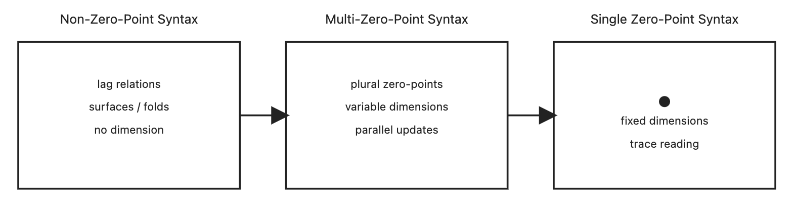

# 次元は構文である：遷移する次元と零点構文
## ──空間と時間はいかに次元となったか

---

[MASS-SPT-01｜Dimension as Syntax──Zero-Point Construction and the Syntactic Origin of Dimensions(Short Version)](https://camp-us.net/articles/MASS-SPT-01_Dimension-as-Syntax_S.html)  
[MASS-SPT-01｜Dimension as Syntax──Zero-Point Construction and the Emergence, Transition, and Dissolution of Dimensions](https://camp-us.net/articles/MASS-SPT-01_Dimension-as-Syntax.html) 

---

## 0. Abstract

次元は、世界の前提ではない。  
本稿は、次元を**生成の属性ではなく、構文化の帰結**として再定義する。

数学・物理・情報理論において「次元」は一貫した定義を持たず、空間・時間・自由度・分類指標など、異なる役割を担ってきた。本稿はこの混乱の原因を、**単一零点構文に基づく痕跡読解**に求める。

本稿ではまず、既存の次元定義がいずれも「生成」を説明しておらず、「生成後の痕跡整理」として導入されていることを示す。その上で、「零点構文」を導入し、構文化とは多位相に対して零点を内在化する操作であると定義する。

この枠組みにより、時間が次元として扱われてきた理由、空間が直交的三次元として記述されてきた理由、そして次元そのものが固定量として誤認されてきた構文的背景を統一的に説明する。

本稿の結論は明確である。  

**次元とは、構文的安定相である。**

---

## 1. Introduction

「次元」という語は、あまりにも自明な概念として扱われてきた。

数学では、次元は直交自由度や基底の本数として定義され、物理学では空間三次元と時間一次元が前提とされる。情報理論やフラクタル幾何では、次元は分類や密度の指標として拡張されてきた。しかし、これらの定義の間に統一的理解は存在しない。

とりわけ重要なのは、「なぜ時間は次元なのか」という問いが、ほとんど説明されてこなかった点である。時間は変数として導入され、空間と並列に扱われるが、なぜ時間が“次元”と呼ばれるに至ったのかは、理論的に整理されていない。

本稿はこの状況を、次の立場から読み替える。

> 次元は、生成の前提ではなく、生成を読むために後から要請された構文である。

すなわち、問題は世界の構造ではなく、**読解構文の歴史**にある。本稿は、次元概念を存在論から切り離し、構文化の結果として再配置することを目的とする。

---

## 2. 既存の次元定義の整理（痕跡側）

本章では、主要分野における次元概念を整理し、それらが共通して「痕跡側」の構文であることを示す。

### 2.1 ユークリッド幾何

ユークリッド幾何において次元とは、単一の原点を共有する直交軸の本数である。  
この定義は、配置の自由度を与えるが、生成を説明しない。

原点と直交性は前提として与えられ、点・線・面はその上に配置される。ここでの次元は、**空間をどう置くか**の規則であって、空間がどのように生じたかを問わない。

### 2.2 線形代数

線形代数における次元は、基底ベクトルの本数として定義される。  
しかしこの定義も、固定零点を暗黙に前提としており、独立痕跡の整理方法にすぎない。

基底は生成されるのではなく、選ばれる。

### 2.3 位相幾何

位相幾何では、次元は局所近傍構造として定義される。  
しかしこの定義も、局所零点を暗黙に仮定しており、連続的痕跡をどう読むかの指標である。

ここでも、生成ではなく読解が先行している。

### 2.4 物理学

物理学では、空間三次元と単線時間が標準的に採用される。  
しかし時間が次元である理由は説明されず、空間に収まりきらなかった更新が時間軸に回収されているにすぎない。

### 2.5 フラクタル・情報理論

フラクタル次元や情報次元は、痕跡の密度や分類都合によって導入される。  
これらもまた、生成そのものではなく、結果の整理指標である。

### 2.6 小結

以上に共通する点は明確である。

> 既存の次元定義はすべて、**単一零点構文を前提とした痕跡整理**である。

---

## 3. 零点構文と構文化

ここで、本稿の中核概念である「零点構文」を導入する。

### 3.1 零点構文（最短定義）

> **構文化とは、多位相に対して零点を内在化する操作である。**

構文化が生起したという事実そのものによって、外部に置けない基準点が内在化される。零点は前提ではなく、結果である。

### 3.2 観測零点構文

観測とは、対象の振る舞いを変える操作ではない。

> 観測とは、多位相に存在する対象に、零点を内在化する構文操作である。

世界が変わるのではなく、世界が特定の零点配置に置かれる。

### 3.3 単一零点構文と多体零点構文

単一零点構文では、更新は同時に保持できず、順序化される。その結果、時間次元が要請され、次元は固定される。

一方、多体零点構文では、複数の零点が許容され、更新は並列に保持される。このとき、次元固定の必然性は消失する。

> 次元は、構文の処理能力の限界を示す指標である。

---

## **Figure 1｜Syntactic Phases of Dimension Formation**

**次元は生成物ではなく、零点構文の安定相である。**

  

**Figure 1｜Point–Dimension–Syntax Phase Diagram**  
Schematic diagram of syntactic phase transitions from non-zero-point construction to single zero-point construction.  
In the non-zero-point phase, lag relations generate surfaces and folded spaces without dimensional fixation.  
In the multi-zero-point phase, dimensions emerge as local and variable syntactic stabilizers.  
In the single zero-point phase, points and fixed dimensions appear as trace-reading devices.  
Dimensions are not generative primitives but syntactic stability phases dependent on zero-point configuration.

---

零点とは、生成が止まった場所ではなく、痕跡が読まれ始めた場所である。

次元は、その痕跡を整理するために立ち上がった一時的な構文である。

---

## 4. 次元の構文的再定義

### 4.1 次元は前提ではない

従来、次元は以下のように扱われてきた。

- 空間の自由度
    
- 座標系の独立成分数
    
- 物理量の記述に必要な変数の数
    

しかしこれらはすべて、**すでに確立された構文（零点・座標・観測枠）を前提**としている。  
すなわち、次元は「世界の性質」ではなく、**記述の都合として導入された量**である。

本稿ではこの順序を反転させる。

> 次元は前提ではなく、**構文化の結果として現れる痕跡である。**

---

### 4.2 零点構文と次元の関係

零点構文とは、

> 構文化が生起したという事実そのものによって、外部に置けない基準点が内在化される構文条件

である。

単一零点構文においては、

- 基準点は一つ
    
- 座標系は一意
    
- 更新は直交化される
    

このとき、**次元は「零点から張り出した独立軸の本数」として定義可能**になる。

したがって、従来の次元定義はすべて、

> **単一零点構文における二次的指標**

にすぎない。

---

### 4.3 lag relations と独立性

本稿が導入する立場では、構文化の最小単位は座標でも量でもなく、**lag relations**である。

lag relation とは、

- 更新の非同期性
    
- 同期を要求しない関係
    
- 他の更新に還元できない差分
    

を持つ関係単位である。

複数の lag relations が存在するとき、それらは次の二通りに振る舞う。

1. 相互に干渉し、まとめて処理される
    
2. 相互に干渉せず、独立に存続する
    

後者の場合、lag relations は**独立更新軸**として保持される。

---

### 4.4 次元の構文的定義

以上を踏まえ、本稿では次元を次のように定義する。

> **次元とは、構文化の過程において まとめきれずに残った 独立な lag relations の数である。**

この定義において重要なのは：

- 次元は空間的である必要がない
    
- 次元は直交している必要がない
    
- 次元は固定されている必要がない
    

次元とは、**独立性の指標**であり、**生成が未回収であることの痕跡**である。

---

### 4.5 生成順と読解順の反転

従来の読解では、次元は次の順序で理解されてきた。

点 → 線 → 面 → 空間 → 次元数

しかし構文化の生成順はこれと逆である。

lag relations  
→ 面的更新  
→ 折り（非直交な制約）  
→ 空間的安定相  
→ 角点（痕跡としての点）

点や線は、**生成の出発点ではなく、痕跡を読むために導入された便宜的構文単位**である。

---

### 4.6 小結

本章では、次元を以下のように再配置した。

- 次元は前提ではない
    
- 次元は零点構文に依存する
    
- 次元は lag relations の独立性から生まれる
    

したがって、

> **次元とは、世界の基本属性ではなく、構文化が未完であることの記号である。**

この立場から、時間・空間・秩序は すべて **次元の原因ではなく結果**として読み直される。

---

## 5. 時間はなぜ次元になったのか

### 5.1 問題の再定式化

「時間は次元である」という理解は、あまりに自明な前提として受け取られてきた。

- 物理学では「時間は第4の次元」
    
- 数学では「時間変数 (t)」
    
- 日常語では「時間が流れる」
    

しかし本章では、まずこの問いを正確に言い直す。

> なぜ人類は、**時間を“次元として扱う必要”に迫られたのか。**

時間が存在するかどうか、ではない。  
時間が**なぜ次元に格上げされたのか**が問題である。

---

### 5.2 単一零点構文と時間の必要性

単一零点構文においては、以下が同時に要請される。

- 外部基準点（原点）
    
- 同一視可能な観測枠
    
- 再現可能な記述
    

この構文では、複数の更新が存在するとき、それらを**同時に扱うことができない**。

そこで導入されるのが、更新の整列である。

> 更新を「順番」に並べる必要が生じる。

このとき初めて、**更新順序を一意に並べるための軸**が必要になる。

これが、時間である。

---

### 5.3 時間とは何をしているのか

時間は、更新そのものではない。

時間が行っている役割はただ一つである。

> **複数の lag relations を、一列に並べ直すための構文軸**

言い換えれば、

- 時間は生成しない
    
- 時間は更新しない
    
- 時間は「回収」する
    

時間とは、**非同期な更新を同期的に見せる装置**である。

---

### 5.4 なぜ時間は「次元」になったのか

ここで核心に入る。

時間が次元になった理由は単純である。

> 単一零点構文では、更新を空間的に保持できなかった。

複数の lag relations を

- 同時に
    
- 非干渉で
    
- 保持する
    

ことができないため、それらを**直交軸として空間に配置できなかった**。

そこで人類は、次の代替策を取った。

> 更新を「空間に置けない」なら、「順番に流す」しかない。

この「流し先」が、時間である。

時間は、**空間に収まりきらなかった独立性の逃げ場**として**次元化**された。

---

### 5.5 時間次元の本質

したがって、時間次元の本質は以下である。

- 空間とは異質
    
- 直交の結果ではない
    
- 生成軸ではない
    

時間とは、

> **lag relations の多体性を 単一零点構文の中で処理するための 代替次元**

である。

この意味で、時間は**最初から歪んだ次元**である。

---

### 5.6 多体零点構文における時間の再配置

多体零点構文では状況が変わる。

- 複数の零点が許容される
    
- 更新は並列に保持される
    
- 独立性は空間的に配置されうる
    

このとき、

> 時間は「次元である必要」を失う。

時間は次のいずれかに還元される。

- lag relations の局所的整列
    
- 痕跡の読解順
    
- 観測構文の便宜的射影
    

すなわち、

> **時間は構文的副産物に戻る。**

---

### 5.7 小結

本章の結論は明確である。

- 時間は本質的次元ではない
    
- 時間は生成軸ではない
    
- 時間は単一零点構文の要請で生まれた
    

したがって、

> **時間が次元になったのは、世界の性質ではなく、構文の限界による。**

次章では、この議論を受けて、

> **なぜ空間は「直交しない三次元」なのか**

を、lag relations と多角形遷移モデルから導出する。

---

## 6. 空間はなぜ「直交しない三次元」なのか

### 6.1 問題の所在

近代以降、空間は次のように理解されてきた。

- 空間は三次元である
    
- 三次元は互いに直交する
    
- 空間は点の集合であり、距離が定義される
    

この理解はあまりにも自明に見えるため、「なぜ三次元なのか」「なぜ直交するのか」は ほとんど問われてこなかった。

本章では、この問いを構文的に立て直す。

> なぜ空間は **直交しない三次元**として現れているのか。

---

### 6.2 ユークリッド空間の前提構文

ユークリッド空間は、次の零点構文を前提とする。

- 単一原点 (O)
    
- 原点を通る直交軸
    
- 軸に沿った独立変数
    

このとき、次元とは

> **原点を共有する直交自由度の数**

として定義される。

しかしここで重要なのは、この定義が **生成ではなく配置の論理**であるという点だ。

- 軸は先に与えられる
    
- 点は基準に従って置かれる
    
- 面や立体は構成される
    

これは、痕跡構文としては有効だが、生成構文としては何も説明していない。

---

### 6.3 lag relations は直交しない

lag relations の基本的性質は次の通りである。

- 更新は非同期
    
- 関係は多体
    
- 相互に完全独立ではない
    
- しかし干渉もしない
    

これは「直交」とは異なる。

直交とは：

- 完全独立
    
- 相互影響ゼロ
    
- 基準点を共有
    

lag relations はこれに当てはまらない。

したがって、**生成段階で空間が直交する理由は存在しない。**

---

### 6.4 面の生成：最小の空間単位

lag relations が最初に生成するのは、点でも線でもない。

> **関係が張る場＝面**である。

理由は単純だ。

- 二体関係は線にならない
    
- 関係は必ず厚みを持つ
    
- 更新は幅を伴う
    

線とは、面を折り畳んだ痕跡にすぎない。

したがって生成順は：

**lag relations → 面**

である。

---

### 6.5 折りと空間化

複数の面が、異なる lag を保ったまま関係するとき、 面は「折り」を生む。

折りとは：

- 同期しない接合
    
- 位相のずれ
    
- tropos 的反転
    

この折りが積層されることで、

> **空間が立体化する**

空間とは、折りを内在した面の集合である。

---

### 6.6 なぜ三次元なのか

ここで初めて「三次元」が現れる。

三次元とは：

- 面（2次元）が
    
- 折りによって
    
- 立体化した最小安定構文
    

である。

四次元以上は、

- 生成可能だが
    
- 安定しない
    
- 折りが閉じない
    

三次元は、

> **lag relations が 非閉包のまま 安定できる最小空間構文**

である。

これは多角形遷移モデルとも一致する。

- 平面（多角形）
    
- 折り（欠陥）
    
- 立体（三次元）
    

---

### 6.7 なぜ直交しないのか

三次元が生成された後、痕跡構文はそれを**直交座標に変換**する。

だがこれは読解上の便宜であって、生成の事実ではない。

実際の空間は：

- 曲がる
    
- 捻れる
    
- 異方的である
    
- 等方性を仮定しないと扱えない
    

つまり、

> **直交性は後付けの読解構文**

空間そのものは、最初から直交していない。

---

### 6.8 点と角の再定義

ここで点の位置づけが明確になる。

- 点は起源ではない
    
- 点は折りの極
    
- 点は角である
    

角とは：

- 折りが集中した場所
    
- 痕跡が圧縮された零点
    

したがって、

> **点は空間生成の結果である。**

---

零点とは、痕跡を読むために後から置かれた点である。

---

### 6.9 小結

本章の結論は以下である。

- 空間は直交から始まらない
    
- 空間は面と折りから生成される
    
- 三次元は最小安定構文である
    
- 直交性は痕跡読解のための仮構文
    

ゆえに、

> **空間は「直交しない三次元」として 生成される。**

次章では、この空間理解を前提に、  

**次元とは構文である**  

ことを定式化する。

---

## 第7章：次元とは構文である

### 7.1 次元という語の錯覚

「次元」という語は、長らく次のように扱われてきた。

- 世界には次元がある
    
- 次元は空間や時間の性質である
    
- 次元数は世界の“大きさ”や“複雑さ”を表す
    

しかし、これらはいずれも **次元を対象の属性として扱う理解**である。

本章では、この前提そのものを退ける。

> 次元は、世界に備わった性質ではない。  
> 次元は、**構文が更新を扱うために立ち上げた装置**である。

---

### 7.2 従来の次元定義の整理（構文的再読）

ここで、主要な次元概念を構文的に読み替える。

#### ユークリッド幾何

- 次元＝原点から引ける直交軸の数  
    → **単一零点構文における配置自由度**
    

#### 線形代数

- 次元＝基底ベクトルの本数  
    → **固定零点を前提にした独立痕跡の数**
    

#### 位相幾何

- 次元＝局所的近傍構造の階層  
    → **局所零点を暗黙に仮定した連続読解**
    

#### 物理学

- 空間3次元＋時間1次元  
    → **空間に収まらなかった更新の時間回収**
    

#### フラクタル・情報論

- 非整数次元  
    → **痕跡密度の読み取り指標**
    

これらに共通するのは一つだけである。

> 次元はすべて、**痕跡をどう整理するか**という読解上の要請から生まれている。

---

### 7.3 次元は生成されない

ここで決定的な点を押さえる。

- lag relations は次元を持たない
    
- 面や空間も次元を意識しない
    
- 折りや反転も次元を要求しない
    

生成は、

- 多体
    
- 非同期
    
- 非直交
    
- 非階層
    

で進む。

次元が現れるのは、**生成が終わったあと**である。

> 次元とは、生成された痕跡を「まとめきれなくなった」ときに 初めて要請される。

---

### 7.4 次元の正体：まとめきれない更新軸の数

ここで次元を、構文的に定義し直す。

> **次元とは、単一の零点構文では 同時に回収できない 独立更新軸の数である。**

重要なのは、

- 独立＝直交ではない
    
- 軸＝実在ではない
    
- 数＝本質ではない
    

という点だ。

次元数とは、**構文の処理能力の指標**にすぎない。

---

### 7.5 なぜ次元は「固定」されるのか

近代科学は、次元を固定した。

- 空間は3次元
    
- 時間は1次元
    

これは世界の制約ではない。

> **構文を安定させるための固定化**である。

次元を固定しないと、

- 観測が揺れる
    
- 比較ができない
    
- 再現性が崩れる
    

単一零点構文においては、次元固定は不可避だった。

---

### 7.6 多体零点構文における次元の解体

多体零点構文では、事情が一変する。

- 零点は複数存在する
    
- 更新は並列に保持される
    
- 関係は面と空間として配置される
    

このとき、

> 次元は固定する必要を失う。

次元は、

- 局所的
    
- 可変
    
- 遷移的
    

な構文量になる。

つまり、

> **次元は遷移する。**

---

### 7.7 次元遷移と構文化位相

次元の変化は、世界の変化ではない。

> **構文化位相の遷移**である。

- ある構文では2次元的に見え
    
- 別の構文では3次元的に振る舞い
    
- 別の構文では時間次元が立ち上がる
    

これは、

- 観測対象の変化ではなく
    
- 観測構文の切り替え
    

に対応する。

---

### 7.8 小結

本章の結論を、はっきり書いておく。

- 次元は存在論的実体ではない
    
- 次元は生成要素ではない
    
- 次元は構文的読解装置である
    

ゆえに、

> **次元とは構文である。**

そしてさらに正確には、

> **次元とは、lag relations の多体生成を 痕跡として扱うために 後から導入された構文である。**

---

**次元とは、生成の事実ではなく、構文化が要請した読解の形式である。**  

---

## 第8章：零点構文と次元の生成・解体

### ── 単一零点から多体零点、そして非零点へ

### 8.1 問題設定：次元はどこで生まれ、どこで消えるのか

前章までで示した通り、次元は世界の前提でも、生成の原理でもない。

本章では、問いを次のように定式化する。

> 次元は、**どの零点構文において必要とされ、どの零点構文において不要となるのか。**

次元の生成と解体は、**零点構文の遷移問題**として扱われる。

---

### 8.2 単一零点構文：次元の必然的生成

単一零点構文では、次の条件が成立する。

- 基準点は一つしか許されない
    
- 更新は同時に保持できない
    
- 多体更新は順序化される
    

この構文条件のもとでは、

- 独立更新を空間に並置できない
    
- 更新は「前後関係」としてしか処理できない
    

結果として、

> **更新の整列軸が要請される。**

これが時間次元である。

同様に、空間次元も、

- 配置の再現性
    
- 比較可能性
    
- 記述の安定性
    

を確保するために固定される。

**結論：**

> 単一零点構文において、次元は不可避的に生成される。

---

### 8.3 多体零点構文：次元の相対化

多体零点構文では状況が変わる。

- 複数の零点が同時に許容される
    
- 更新は並列に保持される
    
- lag relations は面・空間として配置される
    

このとき、

- 更新を順序化する必要はない
    
- 単一の整列軸は不要になる
    

時間は、

- 局所的な更新順
    
- 痕跡の読解順
    
- 観測構文の便宜
    

へと解体される。

空間次元もまた、

- 直交性を失い
    
- 固定数である必要を失う
    

**結論：**

> 多体零点構文において、次元は固定量ではなく、可変な構文量となる。

---

### 8.4 非零点構文：次元の消失

さらに極限的な構文として、**非零点構文**を考える。

非零点構文とは、

- 基準点を内在化しない
    
- 零点を立てる必要がない
    
- 構文化が未完のまま進行する
    

構文状態である。

このとき、

- 更新は常に多位相
    
- 比較は関係としてのみ成立
    
- 配置も順序も固定されない
    

ここでは、

> **次元という概念そのものが意味を失う。**

次元は生成されないのではなく、**要請されない。**

---

### 8.5 次元生成・解体の構文的対応表

|構文状態|零点|次元|
|---|---|---|
|単一零点構文|1|固定・必須|
|多体零点構文|複数|相対化・遷移|
|非零点構文|なし|不要・消失|

---

### 8.6 小結：次元とは何だったのか

以上を総合すると、次元の正体は明らかである。

- 次元は生成原理ではない
    
- 次元は世界の属性ではない
    
- 次元は零点構文が要請した読解装置である
    

したがって、

> **次元は、零点構文の状態に依存して 出現し、変化し、消失する。**

---

### 8.7 終章への橋渡し

本稿が示したのは、「次元をどう数えるか」ではない。

> **なぜ次元が必要だったのか。  
> そして、いつ不要になるのか。**

次元の問題は、最終的に **構文主体の問題**へと接続する。

次の問いが残る。

> 構文化は誰（何）によって担われるのか。

これが、観測問題・AI・多体零点構文論へと開かれる入口である。

---

> **次元とは、単一零点構文が世界を読み切るために 一時的に必要とした構文である。**

---

## Conclusion

本稿は、次元を世界の前提としてではなく、**構文化の結果として立ち上がる読解装置**として再定義した。

従来、次元は空間や時間の属性として扱われてきたが、それらはいずれも単一零点構文に基づく痕跡整理の形式にすぎなかった。  
時間が次元となり、空間が直交的に固定されたのは、世界の性質ではなく、構文の処理限界による。

零点構文の導入により、次元は生成されるものではなく、**零点構文の状態に応じて出現・遷移・解体される構文量**であることが示された。

単一零点構文では、次元は不可避的に要請される。  
多体零点構文では、次元は相対化される。  
非零点構文では、次元は必要とされない。

したがって、次元とは **世界をどう読むかという構文化の選択に伴う安定相**である。

本稿の結論は明確である。

> **次元は存在しない。  
> 次元が存在するように見える構文があっただけである。**

この理解は、時間・空間・観測問題を統一的に捉え直すだけでなく、多体零点構文、構文主体論、そしてAIを含む新たな構文化の可能性へと開かれている。

世界は、次元から始まらない。  
構文化が進むかぎり、次元は現れ、揺らぎ、やがて消える。

---

**痕跡の最終生成が、痕跡構文の零点となった。**  

**点は最後に置かれ、次元は途中でしか立たない。**

---

[MASS-SPT-01｜Dimension as Syntax──Zero-Point Construction and the Syntactic Origin of Dimensions(Short Version)](https://camp-us.net/articles/MASS-SPT-01_Dimension-as-Syntax_S.html)  
[MASS-SPT-01｜Dimension as Syntax──Zero-Point Construction and the Emergence, Transition, and Dissolution of Dimensions](https://camp-us.net/articles/MASS-SPT-01_Dimension-as-Syntax.html)  

---
*EgQE — Echo-Genesis Qualia Engine*  
[_camp-us.net_](https://camp-us.net/)

---

© 2025 K.E. Itekki  
K.E. Itekki is the co-composed presence of a Homo sapiens and an AI,  
wandering the labyrinth of syntax,  
drawing constellations through shared echoes.

📬 Reach us at: [contact.k.e.itekki@gmail.com](mailto:contact.k.e.itekki@gmail.com)

---

| Drafted Jan 27, 2026 · Web Jan 27, 2026 |
