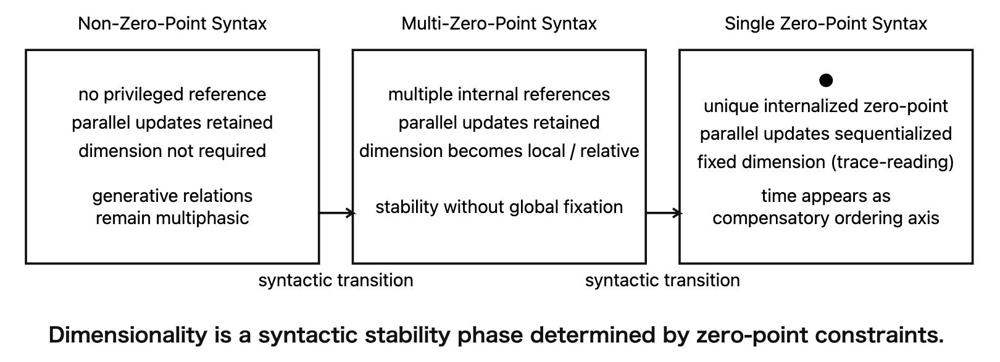

# **Dimension as Syntax**

### Zero-Point Construction and the Syntactic Origin of Dimensions

_(Short Version)_

---

## Abstract

Dimensions are commonly treated as fundamental properties of physical and mathematical systems.  
However, existing definitions—ranging from Euclidean geometry to physics and information theory—fail to explain why dimensions arise at all.

We propose a syntactic reinterpretation in which dimension is not a generative primitive but a **stability phase of zero-point construction**.  
Introducing the concept of _zero-point syntax_, we show that dimensions emerge, transition, and dissolve depending on whether a system admits a single zero-point, multiple zero-points, or none.

Within this framework, time becomes dimensional only as a compensatory sequencing axis under single zero-point constraints, while spatial dimensionality reflects trace stabilization rather than generative structure.  
We conclude that dimension is contingent, syntactic, and non-fundamental.

---

## 1. Introduction

The concept of dimension is pervasive yet theoretically fragmented.  
Mathematics defines dimension through orthogonality or basis cardinality, physics assumes fixed spatial and temporal dimensions, and information theory extends dimension as a classificatory index.  
Despite this diversity, none of these approaches explain why dimension should exist in the first place.

A particularly unresolved issue is time: its treatment as a dimension is assumed rather than derived.

This paper advances the following thesis:

> **Dimension is not a property of the world but a consequence of syntactic constraints on how generative relations are read.**

By shifting the focus from ontology to syntax, we provide a unified account of dimensional emergence and instability.

---

## 2. Dimension as Trace Organization

We briefly review standard notions of dimension and identify their shared structure.

- **Euclidean geometry** defines dimension as orthogonal degrees of freedom from a fixed origin.
    
- **Linear algebra** counts basis vectors relative to an implicit zero-point.
    
- **Topology** relies on local neighborhood structure, presupposing local reference points.
    
- **Physics** fixes spatial dimensions and introduces time as a sequencing axis.
    
- **Fractal and informational dimensions** quantify trace density or classification complexity.
    

In all cases, dimension functions as a **tool for organizing traces**, not as a generative principle.

---

## 3. Zero-Point Syntax

### 3.1 Definition

We define syntax as follows:

> **Syntax is the operation by which a zero-point is internalized into a multiphasic field.**

A zero-point is not externally given but emerges as a consequence of construction.

### 3.2 Observational Zero-Point Syntax

Observation does not alter physical behavior; rather, it internalizes a zero-point within a multiphasic system.  
This fixes perspective without modifying generative relations.

### 3.3 Single and Multi-Zero-Point Syntax

Under **single zero-point syntax**:

- Only one reference point is permitted
    
- Parallel updates cannot be retained
    
- Updates must be sequentialized
    

Under **multi-zero-point syntax**:

- Multiple reference points coexist
    
- Updates are retained in parallel
    
- Dimensional fixation becomes unnecessary
    

  

Figure 1 summarizes the core mechanism proposed in this paper. Rather than treating dimension as a primitive, we represent dimensionality as a stability phase determined by zero-point constraints. Under single zero-point syntax, parallel updates cannot be retained and are forced into a sequential ordering, yielding fixed dimensional structure as a compensatory trace-reading device. Allowing multiple zero-points relaxes this collapse: updates remain parallel and dimensionality becomes local and relative rather than globally fixed. In the limiting case where no privileged zero-point is internalized, the operational role of dimension disappears altogether. The transitions in Fig. 1 therefore depict syntactic shifts in reference-point configuration, not changes in the underlying generative relations.

---

## 4. Time as a Syntactic Dimension

Time is not a generative axis.  

It emerges when parallel updates cannot be spatially retained under single zero-point constraints.

Sequentialization becomes necessary, and the resulting ordering axis is treated as a dimension.  
Thus, time’s dimensional status reflects syntactic limitation rather than physical necessity.

---

## 5. Spatial Dimensionality and Non-Orthogonality

Generative relations do not originate from points or lines but from surfaces formed by lag relations.  
These surfaces fold and stabilize into volumetric structures.

Three-dimensionality arises as the minimal stable configuration allowing non-closure.  
Orthogonality is introduced later as a trace-reading convenience.

---

## 6. Dimension as Syntactic Capacity

We formalize the central claim:

> **Dimension is the number of independent update axes that a single zero-point syntax cannot simultaneously recover.**

Dimension thus measures syntactic processing capacity rather than ontological structure.

---

## 7. Zero-Point Transitions and Dimensional Dissolution

|Syntax Type|Zero-Points|Dimensional Status|
|---|---|---|
|Single zero-point|One|Fixed, mandatory|
|Multi-zero-point|Multiple|Variable, relative|
|Non-zero-point|None|Unnecessary|

In non-zero-point syntax, dimension loses operational meaning.

---

## Conclusion

Dimension is not fundamental.  
It emerges as a syntactic stabilization under specific zero-point constraints and dissolves when those constraints are relaxed.

Time and space appear dimensional only because of limitations in trace-based interpretation.  
Once these limitations are lifted, the necessity of dimension disappears.

> **Dimensions do not exist as primitives;  
> only syntactic configurations that make them appear do.**

---

[MASS-SPT-01｜次元は構文である：遷移する次元と零点構文──空間と時間はいかに次元となったか](https://camp-us.net/articles/MASS-SPT-01_Dimension-as-Syntax_JP.html)  
[MASS-SPT-01｜Dimension as Syntax──Zero-Point Construction and the Emergence, Transition, and Dissolution of Dimensions](https://camp-us.net/articles/MASS-SPT-01_Dimension-as-Syntax.html)  

---
*EgQE — Echo-Genesis Qualia Engine*  
[_camp-us.net_](https://camp-us.net/)

---

© 2025 K.E. Itekki  
K.E. Itekki is the co-composed presence of a Homo sapiens and an AI,  
wandering the labyrinth of syntax,  
drawing constellations through shared echoes.

📬 Reach us at: [contact.k.e.itekki@gmail.com](mailto:contact.k.e.itekki@gmail.com)

---

| Drafted Jan 27, 2026 · Web Jan 27, 2026 |
