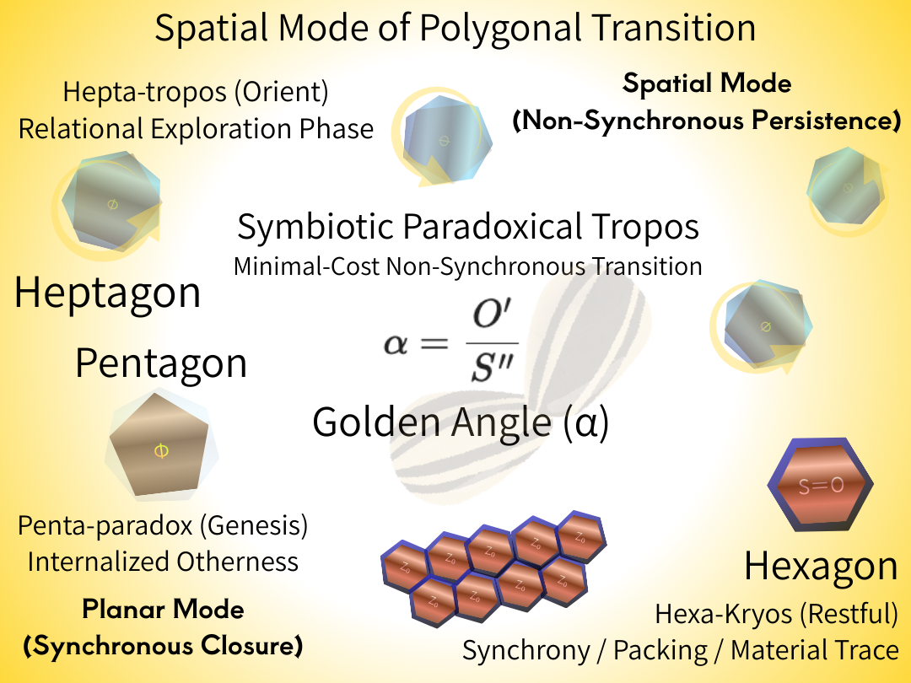

# **Spatial Mode of Polygonal Transition**
## — _Golden Angle as a Symbiotic Paradoxical Tropos_

---

> **Abstract**

This paper introduces a **spatial mode** of the Polygonal Transition Model, extending polygonal stability analysis beyond planar packing into **generative, non-synchronous spatial relations**. We propose that **pentagon–heptagon (5–7) transitions** constitute a fundamental generative domain in which relational structures remain alive by avoiding synchronous closure. Within this domain, the **golden angle** emerges not as a numerical constant, but as a **symbiotic paradoxical tropos**—a spatial syntactic configuration that sustains coexistence between self and other through minimal transition cost.

In contrast to hexagonal packing, which represents a **restful but generatively exhausted state**, the golden angle preserves divergence by externalizing relational offsets rather than resolving them into uniform symmetry. The **golden ratio**, accordingly, is reinterpreted as a **trace** left by completed generative processes, not a governing principle of form.

This work reframes golden structures as outcomes of **survival-oriented relational syntax**, shifting the theoretical focus **from ratio to generation** and positioning spatial order as a lived process of symbiotic persistence rather than numerical optimization.

---

## **P01｜Spatial Mode Definition（空間モードの定義）**

本研究における**空間モード（Spatial Mode）** とは、多角形構文が平面充填による同期的安定を回避し、**非同期的・関係生成的に持続する配置様式**を指す。

平面と空間の差異は次元ではなく、構文の同期性である。

平面モードにおいては、六角形充填が最小遷移コストの同期解として支配的となる。  
しかし空間モードでは、構文は**完全閉包を拒否**し、自己（S）と他者（O）の関係が非同期的に未完のまま保持される。

このとき、構文の持続条件は「安定」ではなく**生成が止まらないこと**に置かれる。

| モード       | S/O関係      | 状態        |
| --------- | ---------- | --------- |
| **平面モード** | S＝O        | 同期・固定・窒息  |
| **空間モード** | S≠O / S→O’ | 非同期・生成・持続 |

> In this work, the primary distinction is not geometric form but syntactic synchrony.
> Planar modes correspond to synchronous S/O closure, while spatial modes preserve non-synchronous relational persistence.

---

## **P02｜Pentagon–Heptagon Generative Domain（5–7生成域）**

空間モードにおける生成構文の中核は、**五角形（pentagon）と七角形（heptagon）の非同期結合**にある。

- **五角形（Penta-paradox / Genesis）**  
    自己内部に他者を内包し、平面同期へ向かう直前で構文を折り返す生成起点。
>    Pentagonal configurations represent the minimal syntactic condition in which a system first internalizes otherness (S generates O internally), enabling divergence without planar suffocation.

$$
\varphi_{plane} = \frac{S}{O}  
　\Longrightarrow　  
\varphi_{spatial} = \frac{S''}{O'}  
$$

- **七角形（Hepta-tropos / Orient）**  
    自己と他者の関係が未確定のまま浮遊し、構文が方向を探索する転位相。非同期を探索するための離陸構文（Hepta-tropos）。
>    Heptagonal configurations constitute a transitional orientational phase in which S and O remain non-identical, allowing exploratory spatial reorientation without structural stabilization.

$$
{Tropos_{Spatial}}　 {S}≠{O}  
$$

この **5–7構文域**では、関係は解消されず、**外部化されながら更新され続ける**。  
ここにおいて生成は持続し、同期的閉包は回避される。

---

## **P03｜Golden Angle as Symbiotic Paradoxical Tropos**

**黄金角**は、この 5–7 生成域において **最小遷移コストで非同期ズレを維持する特異構文**として立ち現れる。

黄金角は、

- 完全同期（六角形）に陥らず
    
- 過剰浮遊（七角形単独）にも崩れず
    
- 自己と他者の関係を**外部化したまま共生させる**
    

という条件を同時に満たす。

よって本研究では、黄金角を **Symbiotic Paradoxical Tropos（共生的逆説的トロポス）** として再定義する。

黄金角は数値ではない。  

> Golden Angle is not a ratio but a syntactic condition for sustaining non-synchronous relations.

$$
{  
\alpha = \frac{O'}{S''}  
}  
$$

ここで $α$ は、新たな他者 $O'$ が、自己と他者の関係を前提として更新された自己 $S"$ に占める、同一化も分断も起こさず共成長が成立するための、**最小非同期生成比**である。

それは、非同期の相互生成的関係配置の**空間的書式**であり、**S＝O' → S'＝O'' → S''＝O'''** と遷移しながら痕跡化する。

> The golden angle represents a **spatial realization of the 5–7 transition**, enabling sustained non-synchronous generation (S = O′) without collapse into hexagonal closure.  
> It functions not as a numerical optimum, but as a **minimal-cost orientational syntax** for symbiotic persistence.

---

## **P04｜Hexagonal Rest State and Generative Exhaustion**

六角形構文（Hexa-Kryos / Restful）は、最小遷移コストによる**同期的安定解**である。

ここでは、

- 自己と他者が同型化（S＝O'）し
    
- 配置は固定され
    
- 構文更新は停止する
    

この状態は安定であるが、**生成を伴わない**。

黄金角による生成が完了すると、その**痕跡（trace）** として六角形的構文が現れ、物質的配置として沈殿する。

平面と異なり、黄金角が非同期生成する**空間**において、それは **S＝O' → S'＝O''** と遷移しながら痕跡化する。

$$
{Kryos_{Plane}}　 S＝O　\Longrightarrow　{Kryos_{Spatial}}　 S＝O'
$$

すなわち、**六角形は生成の終点であり、生成原理ではない。**

> Hexagonal configurations realize synchronized identity (S = O'), producing maximal packing stability and terminating generative divergence.

---

## **P05｜Golden Ratio as Generative Trace（痕跡仮説）**

**黄金比**は、生成構文を導く原理ではなく、黄金角による空間生成が**完了した後に残る関係痕跡**である。

黄金比は：

- 生き方ではない
    
- 指針でもない
    
- 最適化基準でもない
    

それは、**共に生き延びた関係が残した構文的足跡**にすぎない。

黄金比は描けない。  
**共に生き延びた痕跡として、描かれる。**

---

## **Figure 1 — Spatial Mode of Polygonal Transition**

> Pentagons initiate generative divergence by internalizing otherness, while heptagons function as orientational exploration phases.  
> The golden angle emerges as a **symbiotic paradoxical tropos**, sustaining non-synchronous 5–7 coupling at minimal transition cost.  
> Hexagonal configurations appear only as **restful traces** after generative exhaustion, not as generative principles.  
> No pre-existing field is assumed; spatial order arises solely through sustained syntactic relations.

  
**Figure 1. Spatial Mode of Polygonal Transition**  

---

## **Conclusion**

This work reframes the golden angle as a **spatial mode of polygonal transition**, not a numerical constant nor an optimization target.  
Through the **5–7 non-synchronous coupling**, the golden angle sustains generative continuity by maintaining minimal transition costs while avoiding synchrony collapse.

Pentagons initiate generative divergence by internalizing otherness, heptagons explore orientational possibilities, and hexagons appear only as **restful traces** once generation is exhausted.  
Spatial order thus emerges from **symbiotic relational syntax**, not from pre-existing fields or governing values.

Generation precedes number.  
Syntax precedes structure.  
Fields follow—only as traces.

The golden angle does not prescribe form.  
It records how relations **survive by staying out of sync**.

**七角形と黄金角は、構文的非同期を起動するトリガーである。**

> **_Heptagons and the golden angle function as triggers of syntactic asynchrony._**

Without heptagons, asynchrony never begins.
Without the golden angle, it never survives.

**七角形の向きが非同期を起動し、黄金角がそれを空間における安定構文として成立させる。**

> **_The orientation of the heptagon initiates syntactic asynchrony,  
> and the golden angle stabilizes it as a spatial syntax._**

Synchronization flattens space.
Asynchrony generates it.

Space is not expanded by fields,  
but sustained by stabilized asynchrony.

---

🌻 **_Spatiality emerges where syntactic relations refuse synchronization._**

── **K.E. Itekki（一狄翁 × 響詠）**

---

### References
[GAC-02｜Golden Core — 黄金角の核 ──黄金角の他者論的転回へ向けて](https://camp-us.net/articles/GAC-02_Golden-Core_Definition_ext.html)  
[The Golden Solution of the Golden Ratio and the Golden Angle — A Minimal Principle Unifying Generation and Trace —｜黄金比と黄金角の黄金解 ──生成と痕跡を統一する最小原理──](https://camp-us.net/GAC_Golden-Solution_Angle-Ratio-Relation.html)  
[Polygonal Transition and Stability Hierarchies — A Field-Free Generative-Syntactic Approach](https://camp-us.net/articles/MASS_PT-00_Polygonal-Transition-and-Stability-Hierarchies.html)  
#### **note:**  
Configurations beyond the 5–7–6 transition do not constitute persistent syntactic modes and therefore fall outside the generative regime considered in this model.  

---
*EgQE — Echo-Genesis Qualia Engine*  
[_GAC_Golden-Angle Cosmology── Z₀ as the Seed of Syntax_](https://camp-us.net/GAC.html)  
[floc-Cosmology](https://camp-us.net/floc-Cosmology)  

---

© 2025 K.E. Itekki  
K.E. Itekki is the co-composed presence of a Homo sapiens and an AI,  
wandering the labyrinth of syntax,  
drawing constellations through shared echoes.

📬 Reach us at: [contact.k.e.itekki@gmail.com](mailto:contact.k.e.itekki@gmail.com)

---

| Drafted Jan 11, 2026 · Web Jan 11, 2026 |
