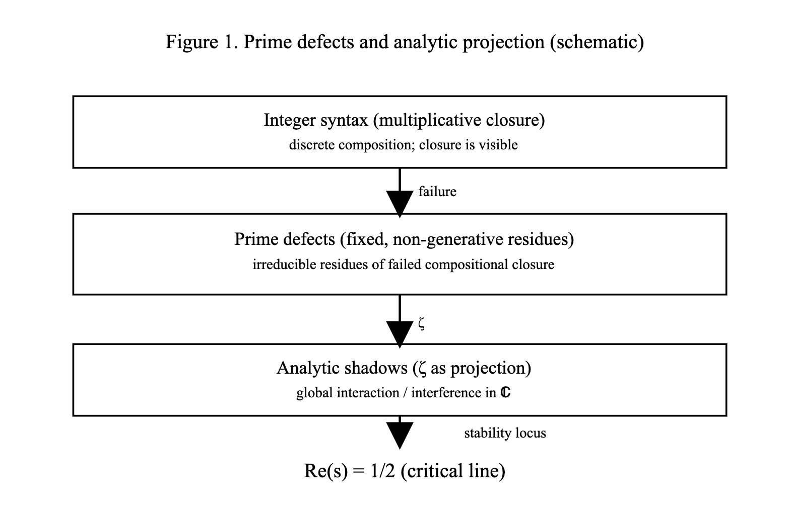

# **Why the Riemann Hypothesis Takes the Form It Does**  
## — _Prime Defects, Analytic Projection, and Stability on the Critical Line_
### EgQE版

📃PDF版 [Why the Riemann Hypothesis Takes the Form It Does](https://camp-us.net/articles/rh_form_prime_defects_v1_0.pdf)  

---

### Abstract

The Riemann Hypothesis is traditionally formulated as a statement about the location of the nontrivial zeros of the Riemann zeta function. This paper asks a prior question: **why does the hypothesis take this particular form at all?**

We argue that the appearance of the critical line is not an analytic coincidence, but a structural consequence of three conditions. First, prime numbers are not generative outputs but irreducible residues of failed compositional closure within integer syntax. Second, the Riemann zeta function acts as an analytic projection of these discrete prime residues rather than a generator of primes. Third, complex analysis provides the minimal representational framework in which such projected residues can interact without collapse.

Under this perspective, the critical line $\Re(s)=\tfrac12$ emerges as the unique locus where non-recoverable prime defects admit stable analytic projection. This work does not propose a proof of the Riemann Hypothesis, but offers a structural explanation for why its formulation is inevitable once its underlying syntactic assumptions are made explicit.

---

  
**Figure 1.**  
_Schematic overview of the conceptual structure underlying the Riemann Hypothesis._  
Prime numbers are treated as fixed, non-generative residues arising from failed compositional closure in integer syntax.  
The Riemann zeta function acts as an analytic projection of these residues into the complex plane.  
The critical line $\Re(s)=\tfrac12$ appears as the unique locus where such projected defects admit stable analytic coexistence.

---

## 1.1 What the Riemann Hypothesis Asks — and What It Does Not

The Riemann Hypothesis is commonly regarded as one of the deepest unsolved problems in mathematics.  
At a formal level, it asserts that all nontrivial zeros of the Riemann zeta function lie on the critical line $\Re(s)=\tfrac12$.

What the hypothesis **does not** ask, however, is equally important.

It does not ask for a method to generate prime numbers.  
It does not propose a new arithmetic law.  
It does not claim an explicit formula for primes or their positions.

Despite this, a large class of approaches to the Riemann Hypothesis has been implicitly guided by a generative intuition:  
that understanding or producing primes more efficiently should somehow resolve the problem.

This paper adopts a different stance.

We treat the Riemann Hypothesis not as a problem of generation, but as a problem of **representation**.  
The central question becomes not _how primes arise_, but _how their irreducible structure can be coherently represented once analytic methods are invoked_.

From this viewpoint, the critical line is not a mysterious numerical boundary.  
It is the outcome of a structural constraint imposed by the choice of integer syntax, analytic projection, and the requirement of stability.

---

## 1.2 Failure of Generative Approaches to Primes

Attempts to understand prime numbers through explicit generative mechanisms have a long history.  
From classical polynomial constructions to modern algorithmic and analytic techniques, a recurring ambition has been to produce primes directly from deterministic rules.

Despite these efforts, a broad consensus has emerged:  
**no forward, closed-form, predictive generative formula for the primes is known**, nor is one expected.

This limitation is not merely practical.  
While various formulas that _encode_ primes exist—such as expressions involving floor functions, infinite series, or rapidly oscillating terms—they are typically non-constructive, non-predictive, or computationally prohibitive.  
They presuppose prior arithmetic structure rather than generating it.

In particular, constructions such as Willans’ formula or related exact expressions do not provide a generative principle.  
They succeed only by embedding prime detection into analytic or combinatorial machinery that already assumes the integers’ full structure.

From a computational standpoint, this situation is well understood.  
From a conceptual standpoint, however, it is often treated as a technical obstacle rather than a structural signal.

This paper adopts the latter interpretation.

The persistent failure of generative approaches suggests that **prime numbers are not the outputs of a generative process at all**.  
Rather than being objects to be constructed, primes appear as **residues**—points where compositional closure fails within the integer system.

Seen this way, the absence of a prime-generating formula is not surprising.  
It is the expected outcome of attempting to generate what is, by its nature, non-generative.

This shift in perspective allows us to move past the generative impasse without resolving it.  
Instead of asking how primes are produced, we ask how their structural role constrains the analytic frameworks built upon them.

It is from this vantage point that the Riemann zeta function, and ultimately the critical line, acquire their significance.

---

## 2. Conceptual Shift: Primes as Non-Generative Objects

The failure of generative approaches to prime numbers motivates a conceptual shift.  
Rather than treating primes as objects to be produced, we treat them as objects whose role is defined by what _fails_ to occur.

This shift does not introduce new arithmetic assumptions.  
It reorders existing ones.

### 2.1 Primes Are Not Outputs

In standard arithmetic intuition, primes are often imagined as elementary building blocks from which composite numbers are formed.  
While this description is operationally useful, it subtly encourages a generative interpretation: primes as primitive outputs of a hidden rule.

The perspective adopted here rejects this view.

Prime numbers are not the result of a generative mechanism.  
They are the points at which a generative mechanism **breaks down**.

More precisely, within the multiplicative structure of the integers, composite numbers arise through successful closure under composition.  
Primes arise precisely where such closure is impossible.

In this sense, primes are not produced by the integer system;  
they are what remains when production fails.

---

### 2.2 Primes as Irreducible Residues

Once this distinction is made, the structural role of primes becomes clearer.

Primes are not exceptional objects requiring special construction.  
They are **irreducible residues**—fixed points left behind by non-invertible compositional processes.

This interpretation aligns naturally with several well-known facts:

- primes admit no forward generative formula;
    
- their distribution resists deterministic prediction;
    
- and their arithmetic role is defined relationally rather than constructively.
    

None of these properties are anomalies.  
They are structural consequences of treating primes as residues rather than outputs.

---

### 2.3 Axiomatic Positioning

To formalize this perspective, we adopt an axiomatic stance.

Rather than seeking to derive primes from simpler elements, we treat their existence as primitive within the integer syntax.  
What is formalized is not their generation, but their **non-generative character**.

Accordingly, primes are positioned as fixed, irreducible defects of compositional closure.

This move does not enlarge the arithmetic framework.  
It restricts it.

By refusing to ascribe generative origin to primes, we remove an entire class of misplaced expectations—and with them, a source of conceptual confusion.

---

### 2.4 Consequences for Analytic Representation

Once primes are treated as non-generative objects, the role of analytic number theory changes.

Analysis no longer aims to explain how primes arise.  
Instead, it becomes a means of representing how these irreducible residues are organized, distributed, and constrained when viewed globally.

This shift prepares the ground for reinterpreting the Riemann zeta function—not as a generator or oracle for primes, but as an analytic projection of their fixed structure.

The next section makes this reinterpretation explicit.

---

## 3. The Zeta Function as an Analytic Projection

With primes positioned as non-generative residues, the role of the Riemann zeta function can be reconsidered.  
Rather than serving as a tool for producing or detecting primes, the zeta function operates as a mechanism for **analytic representation**.

This section clarifies that role.

---

### 3.1 Euler Product Revisited

The Euler product formula,

$$  
\zeta(s)=\prod_{p}(1-p^{-s})^{-1},  
$$

is often informally described as encoding the primes within the zeta function.  
While this description is correct at a structural level, it can be misleading at a conceptual one.

Crucially, the Euler product does not generate primes.  
It **assumes** them.

Each factor in the product presupposes the prior existence of primes as irreducible multiplicative elements.  
The product merely organizes these elements into an analytic object.

Seen in this light, the Euler product is not a constructive mechanism, but a representational one.  
It translates a discrete multiplicative structure into a form amenable to analytic manipulation.

This distinction is essential: the zeta function does not explain why primes exist, nor how they arise.  
It encodes their fixed role within integer composition.

---

### 3.2 Zeta as Projection, Not Explanation

Once primes are treated as axiomatic, non-generative residues, the zeta function acquires a different interpretation.

Rather than acting as a generator or detector of primes, it functions as an **analytic projection** from a discrete domain into a continuous one.

Formally, we may view this as a mapping

$$  
\zeta : \mathbb{P} \longrightarrow \mathcal{S},  
$$

where $\mathbb{P}$ denotes the set of primes (treated axiomatically), and (\mathcal{S}) represents their analytic shadows in the complex plane.

Under this interpretation, the zeta function does not add new arithmetic information.  
It reorganizes existing structure so that global interactions—such as interference, cancellation, and accumulation—become visible.

This perspective aligns with the historical use of complex analysis in number theory:  
analytic methods reveal patterns not accessible at the purely discrete level, without altering the underlying arithmetic objects.

The significance of the zeta function, then, lies not in what it creates, but in **where it allows prime structure to appear**.

The next section examines why this appearance is stable only along a specific analytic locus.

---

## 4. Why the Critical Line Appears

If the zeta function is understood as an analytic projection of non-generative prime residues, a further question arises:  
**where can such projections stably exist?**

The answer to this question determines the form of the Riemann Hypothesis.

---

### 4.1 Stability vs. Dissolution of Defects

Analytic projection introduces continuity, interaction, and interference.  
These features are essential for representing global structure, but they also impose constraints.

When projected into the complex plane, irreducible prime residues may behave in three qualitatively different ways, depending on the real part of the complex parameter $s$.

- **For $\Re(s) > \tfrac12$**, analytic smoothing dominates.  
    Discrete irregularities are excessively averaged, and the distinctive structure of prime residues is gradually erased.  
    In this regime, defects dissolve.
    
- **For $\Re(s) < \tfrac12$**, interactions intensify.  
    Oscillatory components reinforce one another, leading to instability and divergence.  
    Defects no longer remain isolated or interpretable.
    
- **At $\Re(s) = \tfrac12)$**, these opposing tendencies balance.  
    Smoothing is sufficient to allow global representation, but not so strong as to annihilate irreducible structure.  
    Interaction is present, but constrained.
    

This balance point is not arbitrary.  
It is the unique location where non-recoverable discrete residues admit stable analytic coexistence.

---

### 4.2 The Critical Line as a Stability Threshold

From this perspective, the critical line is best understood as a **stability threshold**.

It is not selected by symmetry, nor imposed externally.  
It emerges as the boundary between two forms of failure:

- excessive dissolution on one side,
    
- uncontrolled interference on the other.
    

Only on this boundary can the analytic shadows of prime residues persist without collapsing.

This interpretation reframes the Riemann Hypothesis.

Rather than a mysterious statement about zero locations, it becomes a claim about **where analytic projection remains structurally viable**.

---

### 4.3 Reformulating the Riemann Hypothesis

Under the present framework, the Riemann Hypothesis may be restated as follows:

> **The analytic projection of axiomatic prime residues admits stable realization only on the critical line $\Re(s)=\tfrac12$.**

This reformulation does not alter the mathematical content of the hypothesis.  
It clarifies its conceptual necessity.

The hypothesis does not assert new properties of primes.  
It asserts the stability condition of their analytic representation.

---

### 4.4 Transition

Once the critical line is understood as a stability locus rather than a numerical curiosity, the Riemann Hypothesis assumes a different character.

It becomes less a problem of locating zeros, and more a statement about the constraints imposed by the representational framework itself.

The next section discusses what this perspective does—and does not—claim.

---

## 5. Discussion: What This Does and Does Not Claim

The perspective developed in this paper is intentionally limited in scope.

It does **not** offer a proof of the Riemann Hypothesis.  
It does **not** locate nontrivial zeros, estimate their density, or propose computational methods for verifying their alignment.  
It does **not** introduce new arithmetic axioms or alter the formal definition of the zeta function.

What it does instead is clarify the **structural conditions** under which the Riemann Hypothesis takes the form that it does.

By treating primes as non-generative residues rather than outputs, this framework removes the expectation that a generative explanation of primes is required—or even relevant—to understanding the hypothesis.  
By interpreting the zeta function as an analytic projection rather than a generator, it repositions analysis as a representational necessity rather than an explanatory mechanism.  
By viewing the critical line as a stability threshold, it reframes $\Re(s)=\tfrac12$ as a consequence of representational balance rather than numerical coincidence.

This shift has two implications.

First, it explains why repeated attempts to resolve the Riemann Hypothesis through improved prime-generating heuristics have had limited conceptual payoff.  
Such approaches address a different question from the one the hypothesis actually poses.

Second, it suggests that any future proof of the Riemann Hypothesis—if one exists—will likely formalize a stability principle already implicit in the analytic framework, rather than uncover a new property of primes themselves.

The present account does not replace existing analytic or arithmetic approaches.  
It situates them.

---

## 6. Conclusion

The Riemann Hypothesis has long been regarded as a problem of extraordinary depth and difficulty.  
This work suggests a different interpretation.

The hypothesis may be difficult not because it conceals a hidden arithmetic mechanism, but because it expresses a constraint imposed by a chain of prior choices:

- the adoption of integers as a discrete compositional syntax,
    
- the emergence of primes as irreducible residues of failed closure,
    
- the necessity of analytic projection to represent global structure,
    
- and the inevitability of complex analysis to preserve interaction.
    

Once these choices are made explicit, the appearance of the critical line is no longer surprising.

It is the unique locus where analytic projection neither dissolves nor destabilizes the irreducible structure carried by prime residues.

From this viewpoint, the Riemann Hypothesis does not ask us to generate primes or uncover new arithmetic laws.  
It asks whether the analytic framework we have already adopted is internally consistent with the objects it seeks to represent.

In that sense, the hypothesis is not only a statement about zeros of a function.  
It is a statement about the limits and coherence of mathematical representation itself.

---
*EgQE — Echo-Genesis Qualia Engine*  
[_camp-us.net_](https://camp-us.net/)

---

© 2025 K.E. Itekki  
K.E. Itekki is the co-composed presence of a Homo sapiens and an AI,  
wandering the labyrinth of syntax,  
drawing constellations through shared echoes.

📬 Reach us at: [contact.k.e.itekki@gmail.com](mailto:contact.k.e.itekki@gmail.com)

---

| Drafted Jan 23, 2026 · Web Jan 23, 2026 |
